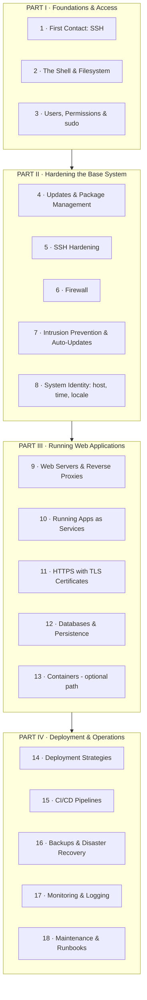

# The Production Server Handbook

**From a bare Ubuntu VPS to a secure, professional web-hosting environment — while understanding every concept behind it.**

This is not a list of commands to copy and paste. It is a mentored, chapter-by-chapter engineering handbook. Each chapter teaches **one** major topic in depth: the concept first, the reasoning second, and only then the implementation. By the end you will not just *have* a production server — you will *understand* it well enough to operate, secure, debug, and rebuild it.

---

## Who this is for

- You have a **brand-new VPS** (Virtual Private Server) with only the operating system installed (Ubuntu 24.04 LTS in our examples).
- You are a **complete beginner** in Linux server administration.
- You want to host **modern web applications** in production.
- You want to learn the *why*, not just the *how*.

No prior Linux knowledge is assumed. Every technical term is defined the first time it appears.

---

## How to read this handbook

Every chapter follows the same rigorous structure so you always know what to expect:

| Section | What it gives you |
|---|---|
| **Goal** | What we are trying to accomplish |
| **Background** | The concept explained from zero, including how it works internally |
| **Why is this necessary?** | The purpose in the bigger picture |
| **What if we skipped this?** | The concrete consequences |
| **Alternative approaches** | Options compared, with pros/cons and a recommendation |
| **Commands** | Every command, explained line-by-line (what, why, expected output, verification, mistakes, recovery) |
| **Verification Checklist** | How to *prove* it worked |
| **Troubleshooting** | The common failures and their fixes |
| **Best Practices** | How professionals do it in production |
| **Summary** | What you learned + what you'll build next |

> **Rule of the house:** Never run a command you don't understand. If a chapter tells you *what* but not *why*, that is a bug — stop and ask.

---

## The roadmap

We build in four parts, each layer resting on the one below it. You cannot secure a server you cannot log into; you cannot deploy to a server that isn't hardened.



### Chapter index

| # | Chapter | Status |
|---|---|---|
| 1 | First Contact: Connecting via SSH | ✅ Available |
| 2 | The Shell & the Linux Filesystem | ✅ Available |
| 3 | Users, Groups, Permissions & sudo | ✅ Available |
| 4 | System Updates & Package Management | ✅ Available |
| 5 | SSH Hardening | ✅ Available |
| 6 | The Firewall | ✅ Available |
| 7 | Intrusion Prevention & Automatic Security Updates | ✅ Available |
| 8 | System Identity: Hostname, Time & Locale | ✅ Available |
| 9 | Web Servers & Reverse Proxies | ✅ Available |
| 10 | Running Your Application as a Service | ✅ Available |
| 11 | HTTPS & TLS Certificates | ✅ Available |
| 12 | Databases & Data Persistence | ✅ Available |
| 13 | Containers (optional path) | ✅ Available |
| 14 | Deployment Strategies & Lifecycle | ✅ Available |
| 15 | CI/CD Pipelines | ✅ Available |
| 16 | Backups & Disaster Recovery | ✅ Available |
| 17 | Monitoring, Logging & Observability | ✅ Available |
| 18 | Ongoing Maintenance & Runbooks | ✅ Available |

> ✅ **All 18 chapters are complete.** The core handbook is finished — from a bare VPS to a maintained production system. The roadmap remains a living plan: optional side-chapters (e.g., email deliverability, CDNs, secrets management like Vault, config management with Ansible, load balancing) can be added as you grow. Start at Chapter 1 and work straight through, or jump to whatever you need.

---

## Files

```
ubuntu_server_setup/
├── README.md                 ← you are here (roadmap + how to use)
├── requrment.md              ← the original brief
└── chapters/
    ├── 01-connecting-via-ssh.md
    ├── 02-shell-and-filesystem.md
    ├── 03-users-permissions-sudo.md
    ├── 04-updates-and-package-management.md
    ├── 05-ssh-hardening.md
    ├── 06-firewall.md
    ├── 07-intrusion-prevention-auto-updates.md
    ├── 08-system-identity-hostname-time-locale.md
    ├── 09-web-servers-and-reverse-proxies.md
    ├── 10-running-your-application-as-a-service.md
    ├── 11-https-and-tls-certificates.md
    ├── 12-databases-and-data-persistence.md
    ├── 13-containers-optional-path.md
    ├── 14-deployment-strategies-and-lifecycle.md
    ├── 15-cicd-pipelines.md
    ├── 16-backups-and-disaster-recovery.md
    ├── 17-monitoring-logging-observability.md
    └── 18-ongoing-maintenance-and-runbooks.md
```

Start with **[Chapter 1 →](chapters/01-connecting-via-ssh.md)**.
