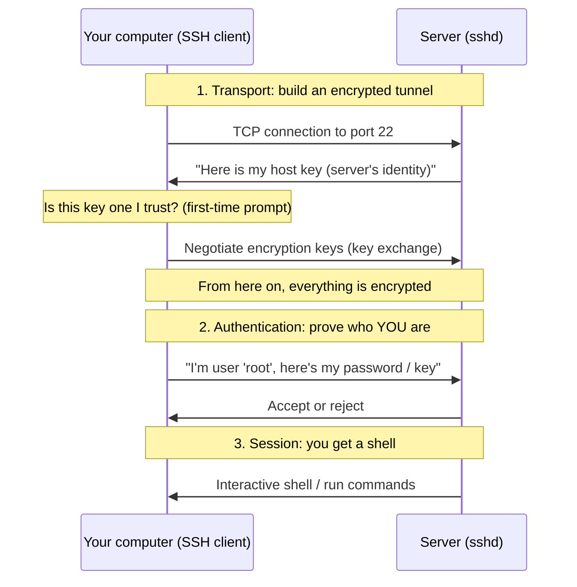

# Chapter 1 — First Contact: Connecting to Your Server via SSH

> *Part I · Foundations & Access — Chapter 1 of 18*

Before we can secure, configure, or deploy anything, we must be able to **talk to the server**. Your VPS is a computer running somewhere in a data center that you will never physically touch. There is no monitor, no keyboard, no mouse. The only way in is over the network. This chapter is about opening that door — correctly, safely, and with a full understanding of what happens when you do.

---

## Goal

By the end of this chapter you will:

1. Understand what your server actually *is* and how you reach it.
2. Understand what a **terminal**, a **shell**, and **SSH** are — from zero.
3. Successfully open a remote command-line session on your server.
4. Understand the security handshake that happens the very first time you connect (and why the scary-looking warning is actually a good thing).
5. Know how to end a session and reconnect reliably.

This is the single most important skill in the entire handbook. Everything else builds on it.

---

## Background

We need to define several terms before touching anything. Read this section slowly — it is the foundation for all 18 chapters.

### What is a server?

A **server** is just a computer whose job is to *serve* — to wait for requests from other computers and respond to them. Your laptop is a **client**: it *makes* requests ("give me this web page"). A server *answers* them ("here is the web page").

Physically, your VPS is a slice of a much larger physical machine in a data center, carved out by **virtualization** software so that it behaves like an independent computer with its own operating system, memory, disk, and network address. "VPS" = **V**irtual **P**rivate **S**erver.

It has:

- An **operating system** (OS) — in our case **Ubuntu 24.04 LTS**, a distribution of Linux. The OS manages the hardware and runs programs. ("LTS" = **L**ong-**T**erm **S**upport, a version that receives security fixes for years — the correct choice for production.)
- An **IP address** — a unique numeric address on the internet, e.g. `203.0.113.10`. This is how the network finds your server, like a street address for a house. (**IP** = **I**nternet **P**rotocol.)
- No graphical desktop. Production Linux servers are almost always **headless** (no screen) and are operated entirely through text commands. This is a feature, not a limitation: text commands are precise, scriptable, repeatable, and use almost no resources.

### What is a terminal, a shell, and a command line?

These three words are often used interchangeably, but they are different things:

| Term | What it is | Analogy |
|---|---|---|
| **Terminal** (or *terminal emulator*) | The window/app that displays text and captures your keystrokes. | The telephone handset — it carries your voice, but doesn't understand words. |
| **Shell** | The program that *reads* the text commands you type, interprets them, runs them, and shows the result. On Ubuntu this is usually **Bash**. | The person on the other end of the line who understands and acts on what you say. |
| **Command line** / **CLI** | The general concept of controlling a computer by typing commands instead of clicking. | The language you speak on the call. |

So when you "type a command," the flow is: **your keyboard → terminal → (over the network) → shell on the server → the shell runs it → output travels back → terminal displays it.**

### What is SSH?

**SSH** stands for **S**ecure **Sh**ell. It is the protocol (an agreed-upon set of rules for two computers to communicate) that lets you run a shell on a *remote* machine as if you were sitting in front of it — and does so over an **encrypted** connection so that no one between you and the server can read or tamper with what's sent.

Two pieces of software make it work:

- The **SSH client** — runs on *your* computer. The command is literally `ssh`. It is pre-installed on macOS, Linux, and modern Windows (Windows 10/11).
- The **SSH server** (also called the **SSH daemon**, program name `sshd`) — runs on the *server*, listening patiently for incoming connections. A **daemon** (pronounced "demon") is simply a background program that runs continuously without a user directly attached to it; the trailing `d` in `sshd` means "daemon." Ubuntu VPS images come with `sshd` already installed and running — that is the one door that is open on your fresh server.

### How SSH works internally (the important part)

Understanding this makes the first-connection warning make sense, and it is the basis of the security hardening we do in Chapter 5.



Three phases:

1. **Transport & host verification.** Your client connects to the server on **port 22** (the default "door number" SSH listens on — a **port** is a numbered channel that lets one machine run many network services at once). The server immediately presents its **host key** — a cryptographic fingerprint that is the server's *identity*. Your client uses this to confirm it is talking to the right machine and to set up encryption. Everything after this point is scrambled so eavesdroppers see only gibberish.

2. **Authentication.** Now that the tunnel is private, *you* must prove who you are. On a fresh server this is done with a **password**. In Chapter 5 we replace this with far stronger **SSH keys**. (We do *not* fix that now — first learn to walk, then run.)

3. **Session.** Once authenticated, the server hands you a shell. Whatever you type runs on the server.

### Why the first connection shows a scary warning

The very first time you connect to a given server, your client has never seen its host key before, so it cannot know whether the machine is genuinely yours or an impostor. It asks you to confirm and then **remembers** the key in a file called `known_hosts`. On every future connection it silently checks that the key still matches. If it ever *changes* unexpectedly, SSH loudly refuses to connect — because that could mean someone is intercepting your traffic (a "man-in-the-middle" attack). The warning is SSH protecting you, not a malfunction.

---

## Why is this necessary?

- **It is the only way in.** A headless VPS has no other interface. Without SSH you cannot administer the machine at all.
- **It is the secure way in.** SSH encrypts everything. Its predecessors (Telnet, rlogin, FTP) sent passwords and data in plain text, readable by anyone on the network path. Those are effectively banned from production.
- **It is the foundation of automation.** Every later chapter — deployments, CI/CD, backups, monitoring — ultimately runs commands on the server over SSH. Master it now.

---

## What would happen if we skipped this step?

There is nothing to skip *to*. You would have a server you cannot reach, configure, or use. Every other chapter depends on having a working session. The only alternative to SSH on most VPS providers is a clumsy **web console** (a browser-based emergency terminal your provider offers), which is slow, offers no copy-paste comfort, has no encryption benefits for automation, and is meant only for *rescue* situations — for example, if you accidentally lock yourself out (we will keep it in our back pocket for exactly that in the Troubleshooting section).

---

## Alternative approaches

There are several ways to obtain a command line on your server. Here is the honest comparison.

| Approach | What it is | Pros | Cons | Verdict |
|---|---|---|---|---|
| **SSH (OpenSSH client)** | The standard encrypted remote-shell protocol, run from your terminal. | Secure, universal, scriptable, works with keys, foundation for all automation, free, pre-installed. | Command line only (no hand-holding UI). | ✅ **Recommended.** The professional standard. |
| **Provider web console** | Browser terminal in your VPS dashboard (e.g., "Launch Console"). | Works even when SSH/network is broken; no setup. | No copy-paste comfort, laggy, manual only, per-provider, not automatable. | 🛟 **Rescue only.** Keep as a backup. |
| **GUI SSH clients (PuTTY, Termius, MobaXterm)** | Graphical wrappers around SSH. | Friendlier for absolute beginners on older Windows; saved-session lists. | An extra tool to learn; hides what's happening; you *should* understand the raw `ssh` command anyway. | ➖ Optional convenience. We teach the raw command so your knowledge is portable. |
| **Telnet / rlogin / FTP** | Legacy unencrypted remote access. | — | Sends credentials in clear text; trivially intercepted. | ❌ **Never.** Forbidden in production. |
| **VNC / RDP (remote desktop)** | Graphical remote desktop. | Full GUI. | Heavy, unnecessary on a headless server, larger attack surface. | ❌ Not for web servers. |

**Why we choose raw SSH:** it is secure by design, present on every platform, identical across all cloud providers (so your skills transfer everywhere), and it is the exact mechanism your future deployment scripts and CI/CD pipelines will use. Learning the underlying `ssh` command — rather than a GUI that hides it — means you understand what those tools are doing later.

---

## Commands

> **Before you start, gather three facts from your VPS provider's dashboard:**
> 1. The server's **public IP address** (e.g. `203.0.113.10`). We'll write it as `SERVER_IP`.
> 2. The initial **username**. On a fresh VPS this is very often `root` (the all-powerful administrator account). Some providers (e.g., certain cloud images) instead give you a user like `ubuntu`. We'll write it as `USER`.
> 3. The initial **password** (if the provider set one) — or confirmation that they installed *your* SSH key already. Many providers email you a temporary root password or let you set one at creation.
>
> Replace `USER` and `SERVER_IP` with your real values in every command below.

### Step 1 — Open a terminal on *your own* computer

You run the `ssh` client from your **local** machine, not the server (you're not on the server yet!).

- **macOS:** open the **Terminal** app (Applications → Utilities → Terminal).
- **Linux:** open your terminal emulator (GNOME Terminal, Konsole, etc.).
- **Windows 10/11:** open **PowerShell** or **Windows Terminal** (OpenSSH is included by default).

**Verify the client exists** before connecting:

```bash
ssh -V
```

- **What it does:** prints the version of your SSH client. `-V` means "version."
- **Why we run it:** to confirm the SSH client is installed before we depend on it.
- **Expected output:** something like `OpenSSH_9.6p1, ...`. The exact numbers don't matter.
- **How to verify it worked:** you see a version string, not "command not found."
- **Common mistake:** on very old Windows, OpenSSH may be missing. Install it via *Settings → System → Optional features → Add a feature → OpenSSH Client*, or use Windows Terminal.
- **Recovery:** if truly unavailable, use the provider web console temporarily, or install a client — but modern systems all have it.

### Step 2 — Connect to the server

```bash
ssh USER@SERVER_IP
```

Concrete example (using the placeholder values):

```bash
ssh root@203.0.113.10
```

- **What it does:** starts the SSH client and asks it to log in as `USER` on the machine at `SERVER_IP`. The `@` separates *who* from *where*.
- **Why we run it:** this is the actual act of connecting — opening the encrypted tunnel and beginning authentication.
- **What about the port?** SSH defaults to **port 22**, so we don't need to specify it. If your provider uses a non-standard port, add `-p PORTNUMBER`, e.g. `ssh -p 2222 root@203.0.113.10`. (The `-p` flag = "port.")
- **Expected output — the first-time host-key prompt:**

  ```
  The authenticity of host '203.0.113.10 (203.0.113.10)' can't be established.
  ED25519 key fingerprint is SHA256:abc123.....................
  Are you sure you want to continue connecting (yes/no/[fingerprint])?
  ```

  This is the host-verification step from the Background. It is **expected and correct** on a first connection.

- **How to verify it worked:** you reach the fingerprint prompt (Step 3) and then a password prompt.
- **Common mistakes:**
  - Typing this *on the server* instead of your laptop (you can't SSH in from a session you don't have yet).
  - Forgetting to replace `USER`/`SERVER_IP` with real values.
  - Wrong username (`root` vs `ubuntu`) — the connection will refuse your password.
- **Recovery:** if it hangs with no prompt for ~30+ seconds, press `Ctrl+C` to abort and see Troubleshooting (`Connection timed out` usually means wrong IP or a network/firewall block).

### Step 3 — Verify and accept the host key

At the `Are you sure you want to continue connecting?` prompt, type the full word:

```
yes
```

- **What it does:** tells your client to trust this server's host key and save its fingerprint into `~/.ssh/known_hosts` on your local machine. (`~` means your home directory; `.ssh` is a hidden folder holding your SSH settings.)
- **Why we run it:** so that all *future* connections are silently verified against this saved key — your protection against impersonation.
- **Best practice (optional but professional):** a careful admin compares the displayed `SHA256:...` fingerprint against the one shown in the provider's dashboard or the server's boot/console log *before* typing `yes`. If they match, you have cryptographic proof you're talking to the right machine. On a brand-new server most beginners accept it directly; just know that verifying is the gold standard.
- **Expected output:**

  ```
  Warning: Permanently added '203.0.113.10' (ED25519) to the list of known hosts.
  USER@203.0.113.10's password:
  ```

- **Common mistake:** typing `y` instead of `yes`. SSH requires the whole word `yes`.
- **Recovery:** if you typed `no`, the connection closes with no harm done — just run the `ssh` command again.

### Step 4 — Enter your password

At the `password:` prompt, type your server password and press **Enter**.

- **What it does:** sends your credential (through the already-encrypted tunnel) to prove your identity.
- **Why we run it:** this is the authentication phase.
- **Expected output:** the terminal shows *nothing* as you type — **no dots, no asterisks, no moving cursor.** This is normal and deliberate: it hides even the *length* of your password from anyone looking over your shoulder. Type it carefully and press Enter.
- **On success** you'll see a welcome banner and a new prompt, for example:

  ```
  Welcome to Ubuntu 24.04.4 LTS (GNU/Linux ...)
  ...
  root@your-server:~#
  ```

  🎉 **You are now on the server.** That prompt is the server's shell waiting for your commands.
- **Common mistakes:**
  - Trying to *paste* and thinking it failed because nothing appeared — it usually pasted fine; just press Enter.
  - Caps Lock on; wrong keyboard layout.
  - `Permission denied, please try again.` = wrong password or wrong username (see Troubleshooting).
- **Recovery:** you get a few attempts. If all fail, double-check the username and re-copy the password from your provider; reset it in the dashboard if needed.

### Step 5 — Confirm where you are

Once you have the server prompt, run these three harmless commands to *prove* you're on the right machine. (We'll explore commands properly in Chapter 2 — for now, just confirm.)

```bash
whoami
```
- **What it does:** prints the username you're logged in as. **Expected:** `root` (or `ubuntu`, matching your `USER`).

```bash
hostname
```
- **What it does:** prints the server's name. **Expected:** whatever your VPS is called (e.g. `ubuntu-2gb-fsn1-1`). We'll set a proper hostname in Chapter 8.

```bash
cat /etc/os-release
```
- **What it does:** displays the OS identity file. `cat` prints a file's contents; `/etc/os-release` is a standard file describing the distribution.
- **Expected:** lines including `PRETTY_NAME="Ubuntu 24.04.4 LTS"`. This confirms you're on the OS you expect.

If those three look right, your connection is genuinely working end to end.

### Step 6 — Disconnect cleanly

```bash
exit
```

- **What it does:** ends your shell session on the server and closes the SSH connection, returning you to your *local* terminal prompt.
- **Why we run it:** always close sessions cleanly rather than just slamming the terminal window shut; it releases the session properly on the server side. (`logout` and pressing `Ctrl+D` do the same thing.)
- **Expected output:** `logout` followed by `Connection to 203.0.113.10 closed.` and your local prompt returns.
- **How to verify:** your prompt no longer shows the server's name — you're back on your own machine.

### Step 7 — Reconnect (confirm the host key is remembered)

Run the connect command again:

```bash
ssh USER@SERVER_IP
```

- **Expected difference:** this time there is **no** "authenticity of host" prompt — it jumps straight to `password:`. That absence *proves* the host key was saved in Step 3 and is being verified silently. This is exactly the behavior you want.

---

## Verification Checklist

You have completed this chapter successfully when **all** of the following are true:

- [ ] `ssh -V` on your local machine prints a version (client is installed).
- [ ] `ssh USER@SERVER_IP` reaches a prompt (host-key or password), proving the network path and `sshd` are working.
- [ ] The first connection showed the host-key fingerprint prompt, and you accepted it with `yes`.
- [ ] You authenticated and landed on a prompt like `USER@hostname:~#`.
- [ ] `whoami` shows your expected user.
- [ ] `cat /etc/os-release` shows `Ubuntu 24.04`.
- [ ] `exit` returns you to your local terminal with `Connection ... closed.`
- [ ] Reconnecting does **not** show the host-key prompt again (key is remembered).

---

## Troubleshooting

| Symptom | Why it happens | How to fix |
|---|---|---|
| `ssh: connect to host ... port 22: Connection timed out` | Wrong IP, the server is still booting, or a network/cloud-firewall blocks port 22. | Recheck the IP. Wait 1–2 min after server creation. Check your provider's dashboard for a **cloud firewall / security group** blocking port 22 and allow your IP. |
| `Connection refused` | You reached the machine, but nothing is listening on that port — `sshd` is off or on a different port. | Confirm the correct port with your provider (try `-p 2222` etc.). Use the provider **web console** to check that SSH is running. |
| `Permission denied, please try again.` | Wrong password, or wrong username (`root` vs `ubuntu`), or the provider disabled password login in favor of keys. | Re-copy the password; try the other likely username; check whether the provider set up a key instead (then you'd connect with `-i /path/to/key`). |
| Password prompt shows nothing as I type | **Not a bug** — SSH hides password input by design. | Type carefully and press Enter. |
| `WARNING: REMOTE HOST IDENTIFICATION HAS CHANGED!` | The server's host key differs from the one you saved earlier. Happens legitimately after a rebuild/reinstall — or maliciously in an attack. | If you *know* you rebuilt the server, remove the stale entry: `ssh-keygen -R SERVER_IP`, then reconnect and accept the new key. If you did **not** expect a change, **stop** and investigate — do not type your password. |
| `Host key verification failed.` | Same cause as above; SSH refuses to proceed until resolved. | Same fix: `ssh-keygen -R SERVER_IP` after confirming the change is legitimate. |
| Locked out entirely (can't SSH at all) | Bad firewall rule, wrong port, etc. (more likely later, after we start changing config). | Use the provider's **web console** ("Launch Console" / "VNC") from the dashboard — it bypasses SSH entirely — to fix the problem, then reconnect via SSH. This is your safety net. |

> **Golden safety rule for the whole handbook:** whenever you are about to change something that could affect your ability to log in (SSH config, firewall, users), **keep your current SSH session open** and test the change in a *second, new* session. If the new session works, you're safe; if it doesn't, you still have the first session to undo the mistake. We will use this rule constantly starting in Chapter 5.

---

## Best Practices

- **Learn the raw `ssh` command**, not just a GUI. Your knowledge then works on every OS and every cloud, and it's exactly what automation uses.
- **Never use Telnet/FTP/rlogin** for shell or file access — they are unencrypted. SSH (and its file-transfer cousins `scp`/`sftp`) only.
- **Treat the host-key prompt seriously.** In high-security settings, verify the fingerprint against an out-of-band source before accepting. Never ignore a "HOST IDENTIFICATION HAS CHANGED" warning.
- **Keep the provider's web console bookmarked.** It is your emergency door when SSH breaks.
- **Don't rush past passwords — but know they're temporary.** We use the initial password *only* to get in; Chapter 5 replaces it with SSH keys and disables password login entirely, which is dramatically more secure.
- **One concept at a time.** We deliberately did *not* harden anything yet. You cannot secure what you can't reliably access.

---

## Summary

### What you learned

- A **server** is a headless computer reached over the network by its **IP address**; your VPS runs **Ubuntu 24.04 LTS**.
- The difference between a **terminal** (the window), a **shell** (the command interpreter, usually Bash), and the **command line**.
- **SSH** (Secure Shell) gives you an *encrypted* remote shell. The **client** (`ssh`) runs on your machine; the **daemon** (`sshd`) runs on the server, listening on **port 22**.
- SSH's three internal phases: **transport & host verification → authentication → session**, and why the first-time **host-key** prompt exists (impersonation protection via `known_hosts`).
- How to **connect** (`ssh USER@SERVER_IP`), **accept the host key** (`yes`), **authenticate** (silent password entry), **confirm your location** (`whoami`, `hostname`, `cat /etc/os-release`), **disconnect** (`exit`), and **reconnect**.
- The core **safety rule**: never sever your only way in — keep a session open when making risky changes, and keep the web console as a backup.
- Why raw SSH beats the alternatives, and why legacy protocols are forbidden.

### What you'll build next

**Chapter 2 — The Shell & the Linux Filesystem.** Now that you're *inside* the server, you'll learn to move around and read it confidently: how Linux organizes everything into a single directory tree (`/`, `/etc`, `/var`, `/home`, …), the essential navigation and inspection commands (`pwd`, `ls`, `cd`, `cat`, `less`, `man`), how to read file paths, and how to edit files with a terminal editor. These are the "survival skills" every later chapter assumes — and they'll make hardening the server in Part II feel natural instead of scary.

> ✅ **Ready to continue?** Confirm and we'll proceed to Chapter 2. If anything in this chapter didn't work or wasn't clear, tell me what happened and we'll fix it before moving on.
