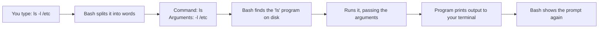
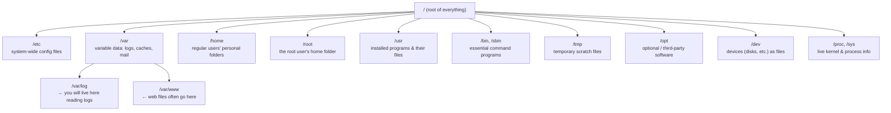

# Chapter 2 — The Shell & the Linux Filesystem

> *Part I · Foundations & Access — Chapter 2 of 18*

In Chapter 1 you opened a door and stepped inside the server. You are now standing in a dark room holding a flashlight, and everything is text. This chapter turns the lights on. You will learn how Linux organizes *everything* it owns into a single tree of folders, how to walk that tree, how to read what's in it, and how to edit files by hand. These are the **survival skills**. Every remaining chapter — installing software, editing configuration, reading logs, deploying code — assumes you can do what's in this one without thinking about it.

---

## Goal

By the end of this chapter you will:

1. Understand what the **shell** (Bash) really does with each line you type.
2. Understand the **Linux filesystem** as one unified tree, and know what the important top-level directories (`/etc`, `/var`, `/home`, …) are *for*.
3. Confidently **navigate**: know where you are, list what's around you, and move.
4. **Read** files and folders (`cat`, `less`, `head`, `tail`, `ls -l`) and understand file listings.
5. Understand **absolute vs relative paths** and the shortcuts `.`, `..`, `~`, `/`.
6. **Edit** a file by hand with the `nano` terminal editor and save it safely.
7. **Help yourself** using `man` and `--help` so you're never stuck.

---

## Background

### What the shell actually does

The **shell** is the program that reads your typed line, figures out what you mean, runs the right program, and shows you the result. On Ubuntu the default shell is **Bash** (**B**ourne **A**gain **Sh**ell). When you see a prompt like:

```
root@server:~#
```

that is Bash telling you it's ready. Let's decode that prompt, because it constantly tells you *who* and *where* you are:

| Piece | Meaning |
|---|---|
| `root` | the **user** you are logged in as |
| `@server` | the **hostname** of the machine you're on |
| `~` | your **current directory** (`~` is shorthand for your home directory — more on this soon) |
| `#` | you are the **root/administrator** user. A regular user shows `$` instead. This symbol is a constant reminder of how much power you currently hold. |

When you type a line and press Enter, Bash does roughly this:



Two vocabulary words you'll use forever:

- A **command** is the first word — the program to run (`ls`).
- **Arguments** (or **flags/options**) are the words after it that modify its behavior. Options usually start with `-` (a short form, e.g. `-l`) or `--` (a long form, e.g. `--all`). So in `ls -l /etc`, `-l` is an option and `/etc` is an argument telling `ls` *what* to list.

That's the whole model. Everything you do on a Linux server is "type a command with some arguments, read the output, repeat."

### The Linux filesystem: one tree, no drive letters

This is the single biggest mental shift coming from Windows. Windows has separate drives: `C:\`, `D:\`. **Linux has exactly one tree.** It starts at a single point called the **root directory**, written as a single forward slash: `/`. Everything — every file, every folder, every attached disk, even devices like your network card — hangs somewhere off that one tree.

> ⚠️ **Two different things are both called "root" — don't confuse them:**
> - The **root directory** `/` — the top of the filesystem tree.
> - The **root user** — the all-powerful administrator account.
> They are unrelated concepts that unfortunately share a name.

A **directory** is what Windows calls a "folder." A **path** is the address of a file or directory in the tree, with `/` separating each level — e.g. `/etc/ssh/sshd_config` means: start at root `/`, go into `etc`, then into `ssh`, and there's a file `sshd_config`.

Here is the tree, with the directories that matter to you as a server admin:



You do **not** need to memorize all of these. But four of them will come up constantly, so learn these now:

| Directory | What lives there | Why you'll care |
|---|---|---|
| **`/etc`** | System-wide **configuration** files (plain text). The name is historically "et cetera"; think of it as "**e**dit **t**o **c**onfigure." | Almost every service we install is configured by editing a file here (e.g. `/etc/ssh/sshd_config` in Chapter 5, Nginx config in Chapter 9). |
| **`/var`** | **Variable** data that changes as the system runs — especially **`/var/log`** (logs) and often **`/var/www`** (web content). | When something breaks, the answer is almost always in `/var/log`. Reading logs is a superpower. |
| **`/home`** | Each regular (non-root) user gets a personal folder here, e.g. `/home/deploy`. | In Chapter 3 we create a proper user; their files and app code often live under `/home`. |
| **`/root`** | The **root** user's personal home directory. (Note: it's *not* under `/home`.) | If you're logged in as root, `~` means `/root`. |

Other directories (`/usr`, `/bin`, `/sbin`, `/dev`, `/proc`, `/opt`, `/tmp`) exist and are important to the OS, but you'll rarely edit them by hand as a beginner. Recognize them; don't fear them.

### Your "current directory" and the idea of paths

At any moment your shell has a **current working directory** — the folder you are "standing in." Commands that take a filename look in the current directory *unless* you tell them otherwise. This is why "where am I?" is the most important question on a server.

There are two ways to write any path:

- **Absolute path** — starts from the root `/` and gives the complete address. Example: `/var/log/auth.log`. It means the same thing no matter where you're standing. **Unambiguous — prefer these in config files and scripts.**
- **Relative path** — starts from wherever you currently are. Example: if you're in `/var`, then `log/auth.log` refers to the same file. Shorter to type, but only meaningful relative to your current location.

Four shortcuts appear everywhere:

| Symbol | Means | Example |
|---|---|---|
| `/` | the root directory (when at the start of a path) | `/etc` |
| `~` | **your** home directory | `~` = `/root` for root; `/home/deploy` for user `deploy` |
| `.` | **this** (current) directory | `./script.sh` = "the script.sh right here" |
| `..` | the **parent** directory (one level up) | `cd ..` = go up one level |

---

## Why is this necessary?

- **You cannot configure what you cannot find.** Every hardening and deployment step edits a specific file at a specific path. If paths and navigation are a mystery, every later chapter is guesswork.
- **Logs live in the filesystem.** 90% of real-world troubleshooting is "read the right file in `/var/log`." That's a filesystem skill.
- **Confidence prevents disasters.** Knowing exactly where you are and what a command will touch is what stops you from deleting the wrong thing. Fluency here is a *safety* feature.

---

## What would happen if we skipped this step?

You'd be able to log in (Chapter 1) but not *do* anything meaningfully. You would copy-paste commands from tutorials without knowing which directory they act on, edit the wrong files, be unable to find logs when something breaks, and eventually run a destructive command in the wrong place because you didn't know where "here" was. This chapter is the difference between *operating* a server and *poking at* one.

---

## Alternative approaches

There are a few genuine choices in this chapter. Here's the honest comparison.

### Shell choice

| Option | Pros | Cons | Verdict |
|---|---|---|---|
| **Bash** (Ubuntu default) | Pre-installed everywhere; the language nearly all tutorials, scripts, and CI systems assume; rock-solid. | Slightly dated interactive features. | ✅ **Recommended.** Learn the default first; it's what production scripts use. |
| **Zsh / Fish** | Nicer autocompletion and prompts. | Extra install; scripts written for them aren't portable; distracting for a beginner. | ➖ Fine later as a *personal* preference; not for learning or for scripts. |

### Terminal text editor (for editing config files)

| Option | Pros | Cons | Verdict |
|---|---|---|---|
| **nano** | Dead simple; on-screen shortcut hints; almost no learning curve; pre-installed on Ubuntu. | Fewer power features. | ✅ **Recommended for now.** You'll be productive in 2 minutes. |
| **vim / vi** | Extremely powerful; available on virtually every server ever; industry mainstay. | Steep, notoriously confusing learning curve (even *quitting* trips up beginners). | ➕ Worth learning eventually; we'll note the survival basics so you're never trapped. |
| **Editing on your laptop + upload** | Full graphical editor. | Round-trip friction; not how you make quick server-side fixes. | ➖ Useful later for app code, not for quick config edits. |

**Why nano now:** the goal of this chapter is *fluency*, not mastery of a hard tool. `nano` lets you edit a config file correctly on your first try, which is exactly what Chapters 5–9 need. We'll cover the *bare minimum* vim survival move so an unexpected vim screen can never strand you.

---

## Commands

> Reconnect to your server (`ssh USER@SERVER_IP` from Chapter 1) so you have a prompt. Everything below is run **on the server**. All these commands are **read-only and safe** except the editing section, which creates a throwaway practice file in `/tmp` that we delete at the end.

### 1 — "Where am I?" → `pwd`

```bash
pwd
```

- **What it does:** **p**rint **w**orking **d**irectory — shows the absolute path of the folder you're currently standing in.
- **Why we run it:** it is the answer to the most important question on a server. Run it any time you're unsure.
- **Expected output:** if you're logged in as root, `/root`. (You start in your home directory when you log in.)
- **Verify:** it prints a path starting with `/`.
- **Common mistake:** none — it's harmless. Use it liberally.

### 2 — "What's around me?" → `ls`

```bash
ls
```
- **What it does:** **l**i**s**ts the contents (files and directories) of the current directory.
- **Expected output:** on a fresh root home, possibly nothing (empty), or a file like `snap`. An empty result is normal, not an error.

Now the version you'll actually use most:

```bash
ls -la /etc
```
- **What it does:** lists `/etc` in **l**ong format (`-l`) including **a**ll hidden files (`-a`). Combining flags as `-la` is the same as `-l -a`.
- **Why we run it:** the long format shows *permissions, owner, size, and modification date* — information you need constantly. `-a` reveals **hidden files**, which in Linux are simply any file whose name starts with a dot (`.`), like `.bashrc`. They're hidden only by convention, not security.
- **Expected output (one line per item):**

  ```
  drwxr-xr-x  2 root root  4096 Jul  3 10:00 ssh
  -rw-r--r--  1 root root  1240 Jun 20 09:11 hostname
  ```

  Read a line left to right:

  | Field | Example | Meaning |
  |---|---|---|
  | Type + permissions | `drwxr-xr-x` | first char: `d`=directory, `-`=file, `l`=link. The rest is *who can do what* — we cover this fully in **Chapter 3**. |
  | Link count | `2` | internal bookkeeping; ignore for now. |
  | Owner | `root` | the user who owns it. |
  | Group | `root` | the group that owns it. |
  | Size | `4096` | size in bytes. |
  | Date | `Jul 3 10:00` | last modified. |
  | Name | `ssh` | the file/directory name. |

- **Verify:** you see a detailed listing of `/etc`.
- **Common mistake:** expecting colors/details from plain `ls`; use `-l` for details and `-a` to reveal dotfiles.

Handy variant for humans:

```bash
ls -lh /var/log
```
- `-h` = **h**uman-readable sizes (`4.0K`, `1.2M`) instead of raw bytes. Peek at `/var/log` now — those are the files you'll read when debugging.

### 3 — "Move me" → `cd`

```bash
cd /var/log
```
- **What it does:** **c**hange **d**irectory to the given path (here, an absolute path).
- **Verify:** run `pwd` — it now prints `/var/log`.

```bash
cd ..
```
- **What it does:** move **up** one level to the parent directory (`..`). From `/var/log` you're now in `/var`. Verify with `pwd`.

```bash
cd
```
- **What it does:** `cd` with **no argument** returns you to your **home** directory (`~`). A fast "take me home." Equivalent to `cd ~`.
- **Common mistakes:**
  - `cd /var log` (space, no slash) — that's two arguments; you meant `/var/log`.
  - Case matters: `/etc/SSH` ≠ `/etc/ssh`. Linux paths are **case-sensitive**.
- **Recovery:** lost? `cd` (home) then `pwd` to reset your bearings.

> 💡 **Tab completion — learn this reflex now.** Start typing a path and press **Tab**; Bash completes it for you. Type `cd /var/lo` then **Tab** → it fills in `/var/log/`. Press Tab twice to list options when ambiguous. This prevents typos and is how professionals move fast. Use Tab constantly.

### 4 — "Show me a file" → `cat`, `less`, `head`, `tail`

For **short** files, `cat` (con**cat**enate/print) dumps the whole thing:

```bash
cat /etc/hostname
```
- **What it does:** prints the entire file to the screen. `/etc/hostname` holds your server's name — it's tiny, so `cat` is perfect.
- **Expected:** one short line (your hostname).

For **long** files, don't flood the screen — use `less`, a scrollable viewer:

```bash
less /etc/ssh/sshd_config
```
- **What it does:** opens the file in a pager you can scroll. This is the SSH config we'll edit in Chapter 5 — just *look* for now.
- **How to use it inside `less`:**
  - `↑`/`↓` or `PageUp`/`PageDown` to scroll
  - `/word` then Enter to **search** for "word"; `n` for next match
  - **`q` to quit** ← the way out
- **Common mistake:** panic when it "won't let me type commands" — you're *in* the pager. Press `q`.

Peek at just the start or end of a file:

```bash
head -n 20 /var/log/syslog
```
- `head` shows the **first** lines; `-n 20` = 20 of them. `/var/log/syslog` is a general system log.

```bash
tail -n 20 /var/log/syslog
```
- `tail` shows the **last** (most recent) lines — usually what you want in a log.

The single most useful log command you'll learn:

```bash
tail -f /var/log/syslog
```
- **What it does:** `-f` = **f**ollow. It shows the end of the file and then keeps printing new lines **live** as they're written. This is how you watch a service misbehave in real time.
- **How to stop it:** press **`Ctrl+C`** to return to the prompt. (`Ctrl+C` is the universal "interrupt/stop the current command" — remember it.)

### 5 — Reading a directory tree at a glance → `tree` (optional) and `ls -R`

```bash
ls -R /etc/ssh
```
- **What it does:** `-R` = **r**ecursive; lists a directory and everything inside its subdirectories. Useful to see structure. (Don't run `ls -R /` — it would try to list the *entire* system.)

### 6 — Editing a file by hand → `nano`

Let's practice on a **safe throwaway file** in `/tmp` (temporary space that's cleared on reboot), so there's zero risk.

```bash
nano /tmp/practice.txt
```
- **What it does:** opens the `nano` editor. If the file doesn't exist, nano creates it when you save.
- **What you'll see:** the file content area, and at the **bottom**, a menu of shortcuts. The `^` symbol means the **Ctrl** key. So `^O` means **Ctrl+O**, and `^X` means **Ctrl+X**.
- **Type some text**, e.g. `hello from my server`.
- **Save (nano calls it "Write Out"):** press **`Ctrl+O`**, then confirm the filename by pressing **Enter**.
- **Exit:** press **`Ctrl+X`**. (If you have unsaved changes it will ask Y/N first.)
- **Verify it saved:**

  ```bash
  cat /tmp/practice.txt
  ```
  Should print `hello from my server`.
- **Other useful nano keys** (shown in its bottom bar): `Ctrl+K` cut a line, `Ctrl+U` paste it, `Ctrl+W` search, `Ctrl+G` help.
- **Common mistakes:**
  - Forgetting to save (`Ctrl+O`) before exiting — nano will warn you; answer `Y` and confirm the name.
  - Editing a real config file without a backup. **Best practice before editing any real config:** copy it first — `cp /etc/ssh/sshd_config /etc/ssh/sshd_config.bak` (we'll do this in Chapter 5). `cp` = copy.

> 🆘 **Trapped in vim?** Sometimes a tool drops you into `vi`/`vim` instead of nano and typing seems to do bizarre things. To escape without saving: press **`Esc`**, then type **`:q!`** and press **Enter**. That's "quit, discard changes." Memorize it — it turns a panic moment into a shrug.

### 7 — Clean up the practice file

```bash
rm /tmp/practice.txt
```
- **What it does:** `rm` = **r**e**m**ove (delete) a file. Here we delete our throwaway file.
- **Verify:** `ls /tmp/practice.txt` → `No such file or directory` (that error now means success).
- ⚠️ **Danger note:** `rm` has **no recycle bin**. Deletion is permanent and immediate. Never run `rm` on a path you haven't confirmed with `ls` first. We'll discuss the infamous `rm -rf` and how to avoid catastrophe in later chapters — for now, delete single files you're sure about.

### 8 — Help yourself → `man` and `--help`

You should never be stuck wondering what a command does. Two built-in help systems:

```bash
man ls
```
- **What it does:** opens the **man**ual page for `ls` — the official, exhaustive documentation. It opens in `less`, so **`q` quits**, `/` searches.
- **Why it matters:** every command has a man page. When a chapter uses a flag you want to understand, `man <command>` is the authoritative answer.

```bash
ls --help
```
- **What it does:** most commands accept `--help` for a shorter, quicker summary of options printed right to the screen.
- **When to use which:** `--help` for a fast reminder; `man` for the full story.

---

## Verification Checklist

You've got the survival skills when you can, without looking anything up:

- [ ] Say where you are with `pwd` and interpret the result.
- [ ] List a directory in detail with `ls -la` and read owner/size/date from a line.
- [ ] Move to an absolute path (`cd /var/log`), up a level (`cd ..`), and home (`cd`).
- [ ] Use **Tab completion** to fill in a path.
- [ ] Read a short file with `cat` and scroll a long one with `less`, then quit with `q`.
- [ ] Watch a log live with `tail -f` and stop it with `Ctrl+C`.
- [ ] Create, edit, save (`Ctrl+O`), and exit (`Ctrl+X`) a file in `nano`, then verify with `cat`.
- [ ] Escape vim with `Esc` `:q!` if you ever land there.
- [ ] Explain the purpose of `/etc`, `/var/log`, `/home`, and `/root`.
- [ ] Delete a file with `rm` and understand there is no undo.

---

## Troubleshooting

| Symptom | Why it happens | How to fix |
|---|---|---|
| `bash: cd: /var/lgo: No such file or directory` | Typo or wrong case in the path (Linux is case-sensitive). | Use **Tab completion**; check spelling and case. `ls` the parent to see real names. |
| `Permission denied` when reading a file | The file is restricted to another user (permissions — Chapter 3). Some files under `/etc`, `/var/log` need root. | You're likely fine as root; as a normal user, prefix with `sudo` (introduced in Chapter 3). |
| The screen is "stuck" and won't take commands | You're inside `less`, `man`, or `tail -f`. | `less`/`man`: press `q`. `tail -f` or a running command: press `Ctrl+C`. |
| I opened a file, typed, and it's chaos | You're in **vim**, not nano. | `Esc` then `:q!` then Enter to bail out. Reopen with `nano <file>`. |
| `nano: command not found` (rare minimal images) | nano isn't installed. | Use `vi <file>` (survival keys above) or install nano — package installation is Chapter 4. |
| I edited a config and the service broke | Edited a real file without a backup or made a typo. | This is why we **copy first** (`cp file file.bak`). Restore with `cp file.bak file`. Detailed in Chapter 5. |
| `rm` deleted the wrong file | No undo exists in the shell. | Prevention only: `ls` before `rm`; never glob (`*`) carelessly. Backups (Chapter 16) are the real safety net. |

---

## Best Practices

- **Ask "where am I?" reflexively.** Run `pwd` before any command that acts on files. Location awareness prevents most accidents.
- **Prefer absolute paths in configs and scripts.** They mean the same thing regardless of where a script runs; relative paths are for quick interactive use.
- **Use Tab completion always.** It's faster *and* it prevents typos in dangerous commands.
- **`less`, not `cat`, for big files.** Dumping a huge file freezes your terminal and scrolls the useful part off-screen.
- **Back up before you edit.** `cp file file.bak` before touching any real config. It costs one second and saves outages.
- **Treat `rm` with respect.** No trash can. Confirm with `ls` first; never run `rm -rf` on a path you haven't triple-checked.
- **Learn the two escape hatches:** `q` (leave a pager/man page) and `Ctrl+C` (stop a running command). And `Esc :q!` to flee vim.
- **Read the manual.** `man <cmd>` / `<cmd> --help` make you self-sufficient. Every future chapter's commands are documented there.

---

## Summary

### What you learned

- The **shell (Bash)** reads each line as a **command + arguments/options**, finds and runs the program, and shows output. You can read the **prompt** (`user@host:dir#`) to know who and where you are, and that `#` means root.
- Linux is **one filesystem tree** rooted at `/` — no drive letters. **Paths** address files with `/` separators; you learned the vital directories **`/etc`** (config), **`/var/log`** (logs), **`/home`** (users), **`/root`** (root's home).
- **Absolute vs relative paths**, and the shortcuts `/`, `~`, `.`, `..`.
- Core navigation and inspection: **`pwd`**, **`ls -la`/`-lh`**, **`cd`** (incl. `..` and bare `cd`), and **Tab completion**.
- Reading files: **`cat`**, **`less`** (`q` to quit, `/` to search), **`head`**, **`tail`**, and the live-log workhorse **`tail -f`** (`Ctrl+C` to stop).
- Editing by hand with **`nano`** (`Ctrl+O` save, `Ctrl+X` exit), the habit of **backing up before editing**, and the **vim escape hatch** `Esc :q!`.
- Deleting with **`rm`** and its permanence, plus getting unstuck with **`man`** and **`--help`**.

### What you'll build next

**Chapter 3 — Users, Groups, Permissions & sudo.** Right now you're logged in as **root**, which is like doing surgery with a chainsaw: one wrong move affects the whole system, and it's the account attackers most want. In Chapter 3 you'll learn the **principle of least privilege**: what users and groups are, how the `rwx` permission bits in that `ls -l` output actually work, why running as root all day is dangerous, and how to create a proper **administrative user** who borrows root's power only when needed via **`sudo`**. This is the first true *hardening* step — and the last thing we do before locking the front door in Chapter 5.

> ✅ **Ready to continue?** Confirm and we'll proceed to Chapter 3. If any command behaved unexpectedly, tell me exactly what you typed and what you saw, and we'll sort it out before moving on.
