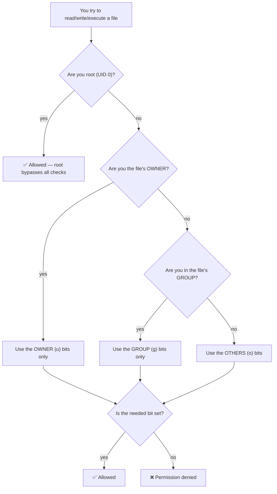

# Chapter 3 — Users, Groups, Permissions & sudo

> *Part I · Foundations & Access — Chapter 3 of 18*

Right now you are logged in as **root**. Root can do *anything*: read every file, delete the entire system, install or destroy software, lock everyone out. That is convenient — and it is exactly the problem. A single typo, a malicious script, or a stolen password while you're root affects the *whole machine* with no safety rails. This chapter fixes that. You will learn who Linux thinks you are, how it decides what you're allowed to touch, and how professionals arrange things so that catastrophic power is available only in the brief moments it's actually needed. This is your first true **hardening** step.

---

## Goal

By the end of this chapter you will:

1. Understand what a **user** and a **group** really are to Linux — just numbers behind friendly names.
2. Understand the **root** account and the **principle of least privilege**: why living as root is dangerous.
3. Read and *fully* understand the `rwx` permission string from `ls -l` (the thing we deferred in Chapter 2).
4. Understand **ownership** (user + group) and how Linux checks permissions.
5. Create a proper **administrative user** for yourself.
6. Grant that user controlled, audited superpowers with **`sudo`** — and understand exactly how `sudo` works.
7. Verify you can do everything you need as the new user, so that Chapter 5 can safely disable root login.

---

## Background

Read this section slowly. Permissions confuse nearly every beginner, and almost every "Permission denied" you will ever see comes back to the handful of ideas here.

### What is a user, really?

A **user** is an *account* — an identity the system uses to decide what you may and may not do. But here is the key insight: **Linux doesn't actually care about your username.** Internally, every user is just a number called a **UID** (**U**ser **ID**entifier). The name `root` or `deploy` is a human-friendly label mapped to a number.

- **Root always has UID `0`.** That number *is* what makes root all-powerful — the kernel grants unlimited privilege to UID 0 specifically. The name "root" is just a label for UID 0.
- Regular human users typically start at **UID 1000** and count up (`1000`, `1001`, …).
- There are also many **system users** (UIDs roughly 1–999) that are *not* people — they're identities that services run as, like `www-data` (the web server) or `sshd`. Giving each service its own limited user means a compromised service can't touch the rest of the system. You'll meet these in Part III.

The mapping between names and numbers lives in a plain text file, **`/etc/passwd`** (despite the name, it holds *no* passwords today). Each line describes one account. We'll look at it in the Commands section.

### What is a group?

A **group** is a named collection of users, also identified internally by a number (**GID**, **G**roup **ID**). Groups let you grant a permission to *many users at once* instead of one by one. Example: members of the `sudo` group are allowed to use the `sudo` command; members of the `www-data` group can read the web server's files.

Every user has:

- **One primary group** (usually created with the same name as the user — user `deploy` gets a primary group `deploy`).
- **Zero or more supplementary groups** they've been added to (this is how we'll grant admin rights — by adding you to the `sudo` group).

Group definitions live in **`/etc/group`**.

### The principle of least privilege

This single idea drives the entire chapter, and much of the handbook:

> **Give every user and every process the *minimum* power needed to do its job — and no more.**

Why? Because power you *hold* is power that can be *abused* — by your own mistakes, by a buggy script, or by an attacker who steals your session. If you spend your day as an ordinary user with no special powers, then:

- A mistyped command (`rm -rf` in the wrong place) fails harmlessly with "Permission denied" instead of erasing the system.
- Malware you accidentally run can only damage *your* files, not the whole OS.
- A stolen password buys the attacker a limited foothold, not instant total control.

The professional model is therefore: **be a normal user by default, and temporarily borrow root's power only for the specific command that needs it.** That "temporarily borrow" mechanism is `sudo`.

### How Linux permissions work: owner, group, others

Every file and directory carries three pieces of security information:

1. An **owning user** (who owns it).
2. An **owning group**.
3. A set of **permission bits** describing what three *classes* of people may do:
   - **u** — the **owner** (the "user" who owns it)
   - **g** — members of the owning **group**
   - **o** — **others** (everyone else)

For each class there are three possible permissions, the famous **`rwx`**:

| Letter | On a **file** | On a **directory** |
|---|---|---|
| **`r`** (read) | read the file's contents | list the names inside the directory |
| **`w`** (write) | modify/overwrite the file | create, rename, or delete entries inside |
| **`x`** (execute) | run the file as a program/script | *enter* the directory (`cd` into it) and access items inside |

> 🔑 **The directory rules surprise everyone.** On a directory, `x` doesn't mean "run" — it means "pass through." You need `x` on a directory to `cd` into it or reach anything inside, and you need `w` on the *directory* (not the file) to **delete** a file — because deleting is really editing the directory's list of contents. This is why you can sometimes delete a file you can't even write to.

### Reading the `ls -l` permission string (the Chapter 2 cliffhanger)

Recall a line from `ls -l`:

```
-rw-r--r--  1 root root  1240 Jun 20 09:11 hostname
drwxr-xr-x  2 root root  4096 Jul  3 10:00 ssh
```

Focus on the first 10 characters. They decode like this:

```
 -        rw-        r--        r--
 │         │          │          │
type     owner      group      others
        (u: rwx)    (g: rwx)   (o: rwx)
```

- **Character 1 = type:** `-` a regular file, `d` a directory, `l` a symbolic link.
- **Characters 2–4 = owner (u):** what the owning user may do.
- **Characters 5–7 = group (g):** what members of the owning group may do.
- **Characters 8–10 = others (o):** what everyone else may do.

A letter present means the permission is granted; a `-` means it's denied. So `-rw-r--r--` reads as:

- `-` → it's a regular file
- `rw-` → the **owner** can **r**ead and **w**rite, but not execute
- `r--` → the **group** can only **r**ead
- `r--` → **others** can only **r**ead

And `drwxr-xr-x` reads as: a **directory**; owner can read/write/enter; group and others can read and enter but not modify. That combination — `755` in numbers, which we'll explain — is the normal setting for a directory everyone may look into but only the owner may change.

### Permissions as numbers (octal): 644, 755, and friends

You'll constantly see permissions written as three digits, like `chmod 644 file`. Here's the entire trick. Each of `r`, `w`, `x` has a value:

| Permission | Value |
|---|---|
| `r` (read) | **4** |
| `w` (write) | **2** |
| `x` (execute) | **1** |
| `-` (none) | 0 |

Add them up **per class** to get one digit for owner, one for group, one for others:

| Symbolic | Math | Digit | Meaning |
|---|---|---|---|
| `rwx` | 4+2+1 | **7** | read, write, execute |
| `rw-` | 4+2 | **6** | read, write |
| `r-x` | 4+1 | **5** | read, execute |
| `r--` | 4 | **4** | read only |
| `---` | 0 | **0** | nothing |

So the common values you'll actually use:

- **`644`** (`rw-r--r--`) — owner edits, everyone else reads. Normal for **config files and documents**.
- **`755`** (`rwxr-xr-x`) — owner has full control; others can enter/execute. Normal for **directories** and **executable programs/scripts**.
- **`600`** (`rw-------`) — owner only, everyone else locked out. Correct for **secrets** like private SSH keys (Chapter 5) and password files.
- **`700`** (`rwx------`) — owner only, for a **private directory**.

### How Linux decides: the permission check

When you try to touch a file, the kernel runs a simple check, **in this order**:



Two things beginners get wrong here:

1. **The classes are checked in order and only one applies.** If you are the *owner*, Linux uses the owner bits **and stops** — it does *not* also fall back to group or others. So it's actually possible to lock *yourself* (the owner) out of a file while others can read it, if you set permissions oddly.
2. **Root skips the whole thing.** UID 0 is not subject to permission bits at all. This is precisely why root is dangerous and why we minimize time spent as root.

### What is `sudo`?

**`sudo`** stands for "**s**uper**u**ser **do**." It lets an *authorized* normal user run a *single* command with root's power, like this:

```
sudo apt update
```

That runs `apt update` as root, then drops you straight back to being your normal, unprivileged self. Crucially, `sudo`:

- **Asks for *your own* password** the first time (then caches it for a few minutes), not root's password. So you never need to know or share the root password.
- **Is granular** — you elevate one command at a time, staying unprivileged the rest of the time.
- **Is audited** — every `sudo` command is logged (to `/var/log/auth.log`). You get an accountability trail of who did what as root.
- **Is controlled by group membership** — on Ubuntu, being in the **`sudo` group** is what authorizes you. The rules themselves live in `/etc/sudoers` and `/etc/sudoers.d/`.

This is the heart of the "be normal, borrow power briefly" model.

---

## Why is this necessary?

- **Living as root is the #1 beginner risk.** Every command you run as root is one typo away from an outage, and root is the exact account every attacker on the internet is trying to break into. Reducing root exposure is the biggest single security win you can make.
- **Chapter 5 depends on it.** In the next hardening chapter we will *disable direct root SSH login* entirely — a huge security improvement. That is only safe once you have a working, sudo-capable personal account to log in with instead. This chapter builds exactly that account.
- **Permissions are the language of Linux security.** Files, services, sockets, logs — access to all of it is governed by users, groups, and `rwx`. You cannot debug "Permission denied," secure a web app's files, or understand *why* a service can't write its log without this foundation.

---

## What would happen if we skipped this step?

You'd keep operating as root forever. Concretely, that means:

- **One mistake = total damage.** There is no "Permission denied" to save you. A wrong `rm`, a bad `chmod -R`, a copy-pasted malicious command — all execute with full power.
- **A single stolen credential = full compromise.** If your root password or session leaks, the attacker owns the entire machine instantly, with nothing between them and everything.
- **No accountability.** With everyone using one root account, logs can't tell you *who* did what. In a team this is untenable.
- **You couldn't safely harden SSH.** You'd be stuck allowing root login (a huge target) because you'd have no other way in.

Skipping this doesn't just leave a gap — it leaves the single widest-open door on the whole server.

---

## Alternative approaches

There are real choices in how you grant and use administrative power. Here's the honest comparison.

### How to run privileged commands

| Approach | What it is | Pros | Cons | Verdict |
|---|---|---|---|---|
| **Normal user + `sudo`** | Log in as an unprivileged user; prefix privileged commands with `sudo`. | Least privilege by default; per-command elevation; full audit log; no shared root password; the universal industry standard. | Must type `sudo` (a feature — it makes power deliberate). | ✅ **Recommended.** What virtually all production Linux uses. |
| **Log in directly as root** | Use the root account for everything. | "Convenient" — no `sudo` typing. | No safety net, no audit trail, biggest attack target, one typo is catastrophic. | ❌ Only for initial bootstrap, then retire. |
| **`su -` to become root** | From a normal user, switch into a *full* root shell. | Available everywhere; useful for long series of root tasks. | Requires the root password; you then sit as root indefinitely (loses least-privilege); poor per-command auditing. | ➖ Occasionally handy; `sudo -i` is the better modern equivalent. |
| **Fine-grained sudoers rules** | Allow a user to run only *specific* commands as root (e.g. only `systemctl restart nginx`). | Tightest possible privilege; great for service accounts & CI. | More config to maintain; overkill for your personal admin account. | ➕ Excellent later for automation/CI users (Chapter 15). For your own admin account, full sudo is standard. |

### How to grant admin rights to your new user

| Approach | Pros | Cons | Verdict |
|---|---|---|---|
| **Add user to the `sudo` group** | The Ubuntu-native, idiomatic way; one command; automatically covered by the default sudoers rule; easy to audit ("who's in `sudo`?"). | — | ✅ **Recommended.** |
| **Hand-edit `/etc/sudoers`** | Full control. | Easy to make a syntax error that breaks sudo for *everyone*; must use the special `visudo` tool to be safe. | ➖ Only when you need custom rules — and always via `visudo`. |
| **Drop a file in `/etc/sudoers.d/`** | Clean, modular, survives upgrades. | Slight extra concept. | ➕ Best practice for *custom* rules (used in later chapters); for basic admin, group membership is simpler. |

**Why normal-user-plus-sudo, granted via the `sudo` group:** it delivers least privilege, per-command auditing, and no shared secrets, using the exact mechanism Ubuntu is built around. It's what every professional environment expects, and it's the prerequisite for locking down SSH next chapter.

---

## Commands

> Reconnect to your server as root (`ssh root@SERVER_IP`) so you have a prompt. We'll first *look* at users and permissions (read-only, safe), then *create* your admin user, then *verify* it. As always, replace placeholders like `deploy` with your chosen values.

### 1 — See who you are and what groups you're in

```bash
id
```
- **What it does:** prints your **UID**, your primary **GID**, and all the **groups** you belong to — the complete picture of your identity.
- **Why we run it:** to see identity in terms of the *numbers* Linux actually uses.
- **Expected output (as root):**
  ```
  uid=0(root) gid=0(root) groups=0(root)
  ```
  Notice `uid=0` — that's what makes you all-powerful right now.
- **Verify:** you see `uid=`, `gid=`, and `groups=`.

```bash
whoami
```
- **What it does:** prints just your current username (a friendlier subset of `id`). Expected: `root`.

### 2 — Look at the account and group files (read-only)

```bash
cat /etc/passwd
```
- **What it does:** prints the account database. Despite the name, **no passwords are here.** Each line is one account with fields separated by `:`.
- **How to read one line**, e.g. `root:x:0:0:root:/root:/bin/bash`:

  | Field | Value | Meaning |
  |---|---|---|
  | username | `root` | login name |
  | password | `x` | placeholder — the real (hashed) password lives in `/etc/shadow` |
  | UID | `0` | the user's number |
  | GID | `0` | primary group's number |
  | comment | `root` | full name / description (optional) |
  | home | `/root` | home directory |
  | shell | `/bin/bash` | program run on login |

- **Why we run it:** to make "users are just lines in a text file" concrete. Scroll and you'll see the *system* users (`www-data`, `sshd`, …) — the non-human service accounts from the Background.

```bash
cat /etc/group
```
- **What it does:** prints group definitions, one per line, e.g. `sudo:x:27:`. The last field lists members. Right now the `sudo` group is probably empty — we're about to change that.

> ℹ️ The real hashed passwords live in **`/etc/shadow`**, readable only by root (permissions `640`, owned by root). Try `ls -l /etc/shadow` to see a locked-down file in the wild. This separation — public account list vs. secret hashes — is itself a least-privilege design.

### 3 — Practice reading permissions in the wild

```bash
ls -l /etc/ssh/sshd_config /etc/hostname /etc/shadow
```
- **What it does:** shows the permission string, owner, and group for three telling files.
- **What to notice:**
  - `/etc/hostname` → `-rw-r--r--` (`644`): root edits, everyone reads. A normal public config.
  - `/etc/shadow` → `-rw-r-----` (`640`) owned by `root:shadow`: no "others" access at all — it holds password hashes. **Secrets get tight permissions.**
- **Verify:** you can now say, for each file, who can read and who can write — *without guessing*.

### 4 — Create your administrative user

Now we build your real account. On Ubuntu, use **`adduser`** (the friendly, interactive tool) rather than the lower-level `useradd`.

```bash
adduser deploy
```
- **What it does:** creates a new user named `deploy`, creates their home directory `/home/deploy`, creates their primary group `deploy`, and interactively prompts you to set a password and (optional) profile info.
- **Why we run it:** this is the unprivileged, day-to-day account you'll actually use. (`deploy` is a common convention for a server admin/deploy account — you may pick another name; just use it consistently.)
- **Expected interaction:**
  ```
  Adding user `deploy' ...
  Adding new group `deploy' (1000) ...
  Adding new user `deploy' (1000) with group `deploy' ...
  Creating home directory `/home/deploy' ...
  ...
  New password:
  Retype new password:
  ...
  Full Name []:            ← press Enter to skip
  Room Number []:          ← press Enter to skip
  ...
  Is the information correct? [Y/n]  ← type Y
  ```
- **Choose a strong password.** This password now protects an account that (after the next step) can become root. Use a long, unique passphrase. As with all password entry, **nothing appears as you type** — that's normal.
- **Why `adduser` over `useradd`:** plain `useradd` does *not* create the home directory or prompt for a password by default, leaving a half-configured account that trips up beginners. `adduser` does the right thing and explains itself.
- **Verify:**
  ```bash
  id deploy
  ```
  Expected: `uid=1000(deploy) gid=1000(deploy) groups=1000(deploy)` — a normal user with **no special powers yet**.
- **Common mistakes:** typos in the two password entries (it'll make you retry); running `useradd deploy` and later wondering why there's no home directory or you can't log in.
- **Recovery:** made a mistake and want to start over? `deluser --remove-home deploy` deletes the user and their home directory (we'll only do this if needed).

### 5 — Grant admin power: add the user to the `sudo` group

```bash
usermod -aG sudo deploy
```
- **What it does:** modifies the user (`usermod`) to **a**ppend (`-a`) them to the supplementary **g**roup (`-G`) named `sudo`.
- **Why the `-a` matters — critical:** `-G` *replaces* a user's supplementary groups. Used **without** `-a`, `usermod -G sudo deploy` would remove `deploy` from every *other* group and leave them in only `sudo`. **Always** pair `-G` with `-a` to *add* rather than *overwrite*. This is one of the most common footguns in Linux administration.
- **Why the `sudo` group:** Ubuntu ships with a default rule (in `/etc/sudoers`) that grants full sudo privileges to every member of the `sudo` group. So group membership *is* the grant — no file editing needed.
- **Expected output:** none. Silence means success (a Unix tradition — many commands say nothing when they succeed).
- **Verify:**
  ```bash
  id deploy
  ```
  Now expected: `... groups=1000(deploy),27(sudo)`. The presence of `sudo` in the group list is the proof. (You can also run `getent group sudo` to list the group's members.)
- **Common mistake:** forgetting `-a` (see the warning above); misspelling `sudo`.
- **Recovery:** accidentally dropped someone from groups? Re-add them with the correct `-aG` and the full list. To *remove* from sudo: `deluser deploy sudo`.

### 6 — Test the new user in a SECOND session (do NOT close root yet)

> 🛟 **Apply the Golden Safety Rule from Chapter 1.** Keep your current **root** session open. Open a brand-new terminal for the test below. If the new account is broken, your root session is still there to fix it. Never burn your only way in.

In a **new local terminal**, connect as the new user:

```bash
ssh deploy@SERVER_IP
```
- **What it does:** logs in as `deploy` using the password you just set.
- **Expected:** a prompt ending in **`$`** (not `#`) — e.g. `deploy@your-server:~$`. That `$` is your visual proof you are now an **ordinary, unprivileged user**. (Recall from Chapter 2: `#` = root, `$` = normal user.)
- **Verify identity:**
  ```bash
  id
  ```
  Expected: `uid=1000(deploy) ... groups=...,27(sudo)`.

### 7 — Prove that you're unprivileged, then prove that `sudo` works

First, confirm you are genuinely restricted. Try to read the secrets file **without** sudo:

```bash
cat /etc/shadow
```
- **Expected output:** `cat: /etc/shadow: Permission denied`.
- **Why this is good news:** it *proves* least privilege is working. As a normal user you cannot read password hashes. This "denied" is the safety net you were missing as root.

Now borrow root's power for exactly that one command:

```bash
sudo cat /etc/shadow
```
- **What it does:** runs `cat /etc/shadow` as root, then returns you to being `deploy`.
- **Expected:** the **first** time you use `sudo` in a session it prints a one-time lecture and asks for **your own** password (`deploy`'s), not root's:
  ```
  [sudo] password for deploy:
  ```
  After you enter it correctly, the file's contents print. For the next few minutes `sudo` won't re-ask (it caches your authorization).
- **Verify `sudo` fully works:**
  ```bash
  sudo whoami
  ```
  Expected: `root`. That single word is the confirmation that `deploy` can become root on demand. 🎉
- **Common mistakes:**
  - Typing the *root* password at the `[sudo] password for deploy:` prompt — it wants **deploy's** password.
  - `deploy is not in the sudoers file. This incident will be reported.` → you skipped or mistyped Step 5, **or** you were already logged in as `deploy` *before* being added to the group. Fix: log out and back in (group membership is read at login), and confirm `id` shows `sudo`.

### 8 — Understand the two ways to "stay" root when you truly need to

Occasionally you have a *long* series of privileged commands and prefixing every one with `sudo` is tedious. Two options:

```bash
sudo -i
```
- **What it does:** opens an **interactive root login shell** (note the prompt changes to `#`). Everything you type is now root until you `exit`. It's the modern, sudo-audited replacement for `su -` (and doesn't need the root password).
- **When to use:** deliberately, for a focused batch of admin work — then **`exit` immediately** back to your `$` prompt. Don't camp in a root shell.

```bash
exit
```
- **What it does:** leaves the root shell (or logs out of the session), returning you to `deploy`. Watch the prompt flip from `#` back to `$` — always know which one you're at.

> 🧠 **Rule of thumb:** default to `sudo <command>` for one-offs (better audit trail, least time as root). Reach for `sudo -i` only for a genuine batch of root work, and leave it the moment you're done.

### 9 — (Reference) Changing ownership and permissions

You won't restructure permissions today, but you'll use these constantly from Chapter 5 onward, so meet them now. **Run these only on a throwaway practice file**, exactly as in Chapter 2:

```bash
touch /tmp/perm-demo.txt
ls -l /tmp/perm-demo.txt
```
- `touch` creates an empty file. Note its default permissions.

```bash
chmod 600 /tmp/perm-demo.txt
ls -l /tmp/perm-demo.txt
```
- **`chmod`** = **ch**ange **mod**e (permissions). `600` = `rw-------` → owner read/write, no one else anything. **Expected:** the string becomes `-rw-------`. This is exactly the setting a private key file needs (Chapter 5).

```bash
sudo chown root:root /tmp/perm-demo.txt
ls -l /tmp/perm-demo.txt
```
- **`chown`** = **ch**ange **own**er. `root:root` sets both owning **user** and **group** to root (the format is `user:group`). It needs `sudo` because giving a file to another user is a privileged act. **Expected:** the owner/group columns now read `root root`.

```bash
sudo rm /tmp/perm-demo.txt
```
- Clean up. (It's now owned by root, so removing it needs `sudo` — a live demonstration of ownership in action.)

> These three — `chmod`, `chown`, and reading `ls -l` — are the everyday tools of Linux permissions. You'll apply them for real when we set up SSH keys, web roots, and service files.

---

## Verification Checklist

You've completed this chapter when **all** of the following are true:

- [ ] `id` (as root) shows `uid=0` and you understand *that's* what makes root all-powerful.
- [ ] You can read a `ls -l` permission string (`-rw-r--r--`) and state who can read/write/execute.
- [ ] You can convert between symbolic and numeric permissions for the common cases (`644`, `755`, `600`).
- [ ] `adduser deploy` created the user, home directory, and primary group; `id deploy` confirms it.
- [ ] `usermod -aG sudo deploy` added the user to `sudo`; `id deploy` now lists the `sudo` group.
- [ ] You can SSH in as `deploy` in a **separate** session and see a **`$`** prompt.
- [ ] `cat /etc/shadow` as `deploy` is **denied** (least privilege proven).
- [ ] `sudo whoami` as `deploy` prints `root` (elevation works, using *deploy's* password).
- [ ] Your original **root** session is still open as a safety net.
- [ ] You understand `sudo <cmd>` vs `sudo -i`, and always know whether your prompt is `#` or `$`.

---

## Troubleshooting

| Symptom | Why it happens | How to fix |
|---|---|---|
| `deploy is not in the sudoers file. This incident will be reported.` | The user isn't in the `sudo` group, or you logged in *before* being added (group membership is read at login time). | From your **root** session run `usermod -aG sudo deploy`, then **log the deploy session out and back in**. Confirm with `id`. |
| `[sudo] password for deploy:` keeps rejecting my password | You're entering the **root** password; sudo wants **your own** (deploy's). Or Caps Lock / wrong password. | Enter the password you set for `deploy` in `adduser`. Reset it from root with `passwd deploy` if unsure. |
| `usermod -G sudo deploy` seemed to remove other group memberships | You omitted `-a`; `-G` alone **replaces** supplementary groups. | Re-run with the full intended list, or just re-add: `usermod -aG sudo deploy`. Always use `-aG`. |
| `adduser: command not found` (rare minimal image) | Some stripped images only ship `useradd`. | Use `useradd -m -s /bin/bash deploy` (`-m` makes the home dir, `-s` sets the shell), then `passwd deploy` to set a password. |
| Created the user with `useradd` and can't log in / no home dir | `useradd` (unlike `adduser`) doesn't create a home dir or set a password by default. | `mkdir /home/deploy && chown deploy:deploy /home/deploy`, set a shell with `usermod -s /bin/bash deploy`, and set a password with `passwd deploy`. Or delete and recreate with `adduser`. |
| `Permission denied` doing something as `deploy` that should work | You genuinely lack permission — often correct. | If it's truly an admin task, prefix `sudo`. If not, you may be in the wrong directory or the file is owned by someone else (`ls -l` to check). |
| Locked yourself out of sudo / broke `/etc/sudoers` by hand-editing | A syntax error in the sudoers file disables `sudo` for everyone. | This is why you **never** edit it directly — always use `sudo visudo`, which checks syntax before saving. If already broken, use your still-open root session (or the provider **web console** from Chapter 1) to fix it. |

> **Reinforcing the Golden Rule:** you tested the new account in a *second* session while keeping root open. That habit is what makes all of this safe. Carry it into Chapter 5, where the stakes get higher.

---

## Best Practices

- **Stop using root for daily work — starting now.** From here on, log in as `deploy` and elevate with `sudo` only when needed. This chapter existed to make that possible.
- **`sudo <command>` for one-offs; `sudo -i` sparingly.** Per-command elevation gives the cleanest audit trail and the least time at UID 0. Never *camp* in a root shell.
- **Always `usermod -aG` — never bare `-G`.** The missing `-a` silently strips group memberships. Burn this into memory.
- **Never edit `/etc/sudoers` directly — use `visudo`.** It validates syntax before saving, preventing a self-inflicted lockout.
- **Give secrets tight permissions.** Private keys and password files should be `600` (owner only). Public configs are typically `644`. Directories are usually `755`.
- **One human, one account.** In a team, give each person their own sudo-capable user. Shared accounts destroy accountability; individual accounts + `sudo` logging tell you *who* did *what*.
- **Prefer least privilege for services too.** Later, run each app/service under its own limited system user (like `www-data`), never as root — so a compromised service can't own the box.
- **Keep the strong password on your admin account.** Until Chapter 5 swaps in SSH keys, that password is the lock on an account that can become root. Make it long and unique.

---

## Summary

### What you learned

- A **user** is really a number (**UID**; root is UID **0**), and a **group** is a named set of users (**GID**). The mappings live in **`/etc/passwd`** and **`/etc/group`**; password hashes live separately in the locked-down **`/etc/shadow`**.
- The **principle of least privilege**: be unprivileged by default and borrow power only when needed — the core idea behind server security.
- How to **read `rwx`**: the 10-character `ls -l` string decodes into *type* + *owner (u)* + *group (g)* + *others (o)*, and the **octal** shorthand (`r`=4, `w`=2, `x`=1) giving the everyday values **`644`**, **`755`**, **`600`**, **`700`**.
- The surprising **directory** meanings of `x` (enter) and `w` (delete/create inside), and the kernel's ordered permission check — where **root bypasses everything**.
- How to **create an admin user** with **`adduser`**, grant power by adding them to the **`sudo` group** with **`usermod -aG sudo`** (never forgetting `-a`), and how **`sudo`** elevates one command using *your own* password with full auditing.
- How to safely **test the new account in a second session**, prove you're restricted (`cat /etc/shadow` denied) and that elevation works (`sudo whoami` → `root`), plus the `sudo -i` root-shell and the `#` vs `$` prompt tell.
- The reference trio **`chmod`**, **`chown`**, and reading `ls -l` that you'll use throughout the rest of the handbook.

### What you'll build next

**Chapter 4 — System Updates & Package Management.** Before we lock the front door, we make sure the house is in good repair. You'll learn what a **package** and a **package manager** (`apt`) are, how Ubuntu's software repositories work, the difference between `update` and `upgrade`, how to install and remove software cleanly, and why applying security updates is one of the highest-value habits in all of server administration. You'll do it all as `deploy` with `sudo` — putting this chapter's skills straight to work — and it sets the stage for the SSH hardening in Chapter 5.

> ✅ **Ready to continue?** Confirm and we'll proceed to Chapter 4. If `adduser`, group membership, or `sudo` didn't behave as described, tell me exactly what you ran and what you saw — and keep that root session open — and we'll fix it before moving on.
