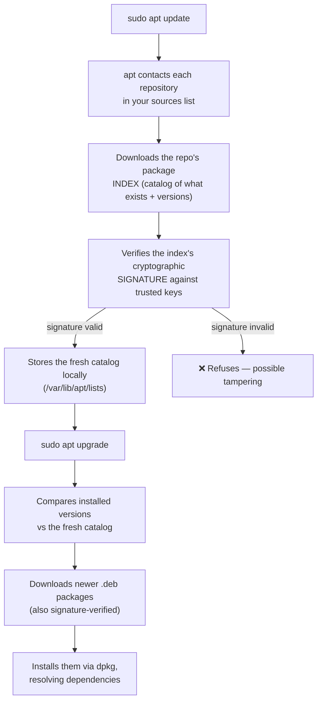

# Chapter 4 — System Updates & Package Management

> *Part II · Hardening the Base System — Chapter 4 of 18*

You now log in as an unprivileged user and borrow root's power with `sudo`. Welcome to Part II, where we begin **hardening** — making the server resistant to attack and failure. We start here, with updates, for a blunt reason: **the software already on your server has known security holes, and fixes exist right now, waiting to be applied.** Every day you don't apply them, you're running a machine with publicly documented ways in. This chapter teaches you what the software on your system actually *is*, how the tool that manages it (`apt`) works internally, and how to keep everything patched — the single highest-value habit in server administration.

---

## Goal

By the end of this chapter you will:

1. Understand what a **package**, a **repository**, and a **package manager** are — from zero.
2. Understand how `apt` finds, verifies, downloads, and installs software, and *why* it's safe.
3. Know the crucial difference between **`update`** (refresh the catalog) and **`upgrade`** (actually install newer versions).
4. Confidently **install**, **search for**, **inspect**, and **remove** software cleanly.
5. Understand **security updates** specifically, and why they matter more than feature updates.
6. Know when a **reboot** is required after updates, and how to tell.
7. Do all of it as `deploy` with `sudo`, cementing Chapter 3's habits.

---

## Background

### What is "software" on Linux, and what is a package?

On Windows or macOS you install software by downloading an installer (`.exe`, `.dmg`) from a website and double-clicking it. That model has two problems on a server: you have no easy way to *know* the download is genuine and untampered, and you have no unified way to *update* everything later.

Linux solves both with **packages**. A **package** is a single archive file that bundles:

- the program's files (the actual binaries, libraries, config templates),
- **metadata** — its name, version, description, and crucially its **dependencies** (other packages it needs to work),
- and scripts that run at install/removal time to wire it into the system.

On Ubuntu (and Debian), packages are **`.deb`** files. You rarely handle them directly, though — you let a **package manager** do it.

### What is a package manager? What is `apt`?

A **package manager** is the program that installs, upgrades, removes, and tracks *all* software on the system in one consistent way. On Ubuntu the everyday tool is **`apt`** (**A**dvanced **P**ackage **T**ool).

`apt` keeps a **database** of every package installed on your machine and exactly which version. Because it tracks everything centrally, it can do what manual installers can't:

- Install a program **and automatically pull in every dependency** it needs.
- **Upgrade everything** on the system with one command.
- **Remove** a program *and* clean up dependencies nothing else needs.
- Tell you what's installed, what's out of date, and what a package contains.

> 🧩 **`apt` vs `apt-get` vs `dpkg` — which is which?**
> - **`dpkg`** is the low-level tool that installs a single `.deb` file. It does *not* understand dependencies or repositories. You'll rarely call it directly.
> - **`apt-get`** (and `apt-cache`) are the older, script-stable front-ends over `dpkg` that *do* handle dependencies and repositories. Still perfect for automation.
> - **`apt`** is the newer, friendlier front-end (progress bars, colour, simpler syntax) meant for humans typing at a terminal. **We use `apt`.**

### What is a repository (repo)?

Your server doesn't download software from random websites. It downloads from **repositories** — trusted servers, run by Ubuntu (and optionally third parties), that host thousands of packages that have been built, tested, and **cryptographically signed**.

The list of repositories your server trusts lives in configuration files:

- **`/etc/apt/sources.list`** — the classic single file, and
- **`/etc/apt/sources.list.d/`** — a directory of additional `.list`/`.sources` files (where extra repos get added modularly).

Ubuntu organizes its own repositories into four **components**, and it's worth knowing what they mean:

| Component | What's in it | Supported by Ubuntu? |
|---|---|---|
| **main** | Core, officially supported open-source software. | ✅ Yes — security updates guaranteed. |
| **restricted** | Officially supported but proprietary (e.g. some drivers). | ✅ Yes. |
| **universe** | Community-maintained open-source software (huge catalog). | ➖ Community/best-effort. |
| **multiverse** | Software with legal/licensing restrictions. | ❌ Not supported; use with care. |

Each repo is also tied to your Ubuntu release and its update "pockets" — e.g. `noble` (24.04's codename), `noble-updates` (bug fixes), and **`noble-security`** (security fixes). That last one is the star of this chapter.

### How `apt` stays trustworthy: signatures and the local catalog

Here's the part that makes the whole system safe, and explains *why* the two-step `update`/`upgrade` dance exists.



Two ideas to take away:

1. **Everything is cryptographically signed.** `apt` will only trust a repository index and packages whose signatures verify against keys the system already holds. If an attacker tampered with a package in transit or on a mirror, the signature check fails and `apt` refuses. This is why installing from repos is far safer than downloading random binaries.
2. **`apt` works from a *local cached catalog*, not live.** Your server keeps a local copy of "what packages exist and at what versions." That copy only refreshes when *you* run `apt update`. Everything else (`upgrade`, `install`, `search`) reads that local cache. This is the key to the next section.

### `update` vs `upgrade`: the distinction everyone must learn

These two words sound interchangeable but do completely different things, and mixing them up is the #1 beginner confusion:

| Command | What it *actually* does | Analogy |
|---|---|---|
| **`sudo apt update`** | Refreshes the **local catalog** — asks every repo "what's the latest version of everything now?" and updates apt's local list. **Installs nothing.** | Downloading the latest **menu** from the restaurant. |
| **`sudo apt upgrade`** | **Installs** newer versions of packages you already have, based on the catalog from the last `update`. **This is what actually changes your software.** | Actually **ordering the new dishes** from that menu. |

Because `upgrade` can only see as far as the last `update`, you almost always run them **together, in order**: `sudo apt update && sudo apt upgrade`. The `&&` means "run the second command only if the first succeeded."

### Why security updates matter more than anything

Software has bugs; some bugs are **vulnerabilities** — flaws an attacker can exploit to break in, crash the service, or steal data. When one is discovered, it gets a public identifier (a **CVE** — **C**ommon **V**ulnerabilities and **E**xposures number) and, usually, a fix published to `noble-security`.

Here's the uncomfortable truth: **publishing a fix also publishes the existence of the hole.** The moment a security update is released, attackers know exactly what to target on unpatched machines — and automated bots scan the entire internet for them within *hours*. Applying security updates promptly is not optional maintenance; it is the front line of keeping the server yours.

---

## Why is this necessary?

- **Your fresh server is already behind.** VPS images are built at some point in the past. Between then and now, security fixes have almost certainly been published. Your very first `upgrade` closes real, known holes.
- **It's the highest return-on-effort in security.** Firewalls and SSH hardening matter (next chapters), but a huge share of real-world server compromises exploit *known, already-patched* vulnerabilities in unpatched software. Patching defeats that entire class of attack for the cost of a few commands.
- **Everything later builds on `apt`.** Installing a web server (Chapter 9), a database (Chapter 12), monitoring tools (Chapter 17) — all of it is `apt install`. You need to understand the tool before you lean on it.

---

## What would happen if we skipped this step?

- **You'd run knowingly-vulnerable software.** The gap between "fix exists" and "fix applied" is the window attackers live in. Skip updates and that window never closes.
- **You'd become a target for automated attacks.** Bots don't hand-pick victims; they scan for *any* machine with a known unpatched flaw. An outdated server is found and probed continuously.
- **Small problems compound.** Deferring updates for months turns a routine patch into a risky, giant, all-at-once upgrade that's far more likely to break something.
- **You'd install software without understanding it.** Blindly copy-pasting `apt install` lines from tutorials — without knowing what repos, signatures, or dependencies are — is how people install the wrong or malicious things.

---

## Alternative approaches

### Applying updates

| Approach | What it is | Pros | Cons | Verdict |
|---|---|---|---|---|
| **Manual `apt update && apt upgrade`** | You run the commands and watch the result. | Full control; you *see* what changes; you learn. | Requires discipline to do regularly. | ✅ **Recommended for learning now.** Every admin must know this by hand. |
| **`unattended-upgrades` (automatic)** | A background service that installs **security** updates automatically. | Patches apply even if you forget; ideal for security fixes. | Can (rarely) apply a change you didn't watch; needs configuring. | ✅ **Recommended for production — we set this up in Chapter 7.** Complements manual upgrades, doesn't replace understanding them. |
| **`apt full-upgrade` / `dist-upgrade`** | Like `upgrade` but *also* allowed to remove/install packages to resolve bigger dependency changes. | Handles kernel and structural upgrades `upgrade` won't. | Can remove packages — read the plan before confirming. | ➕ Use deliberately when plain `upgrade` reports "held back" packages. |
| **Release upgrade (`do-release-upgrade`)** | Moves you to a *new Ubuntu version* (e.g. 24.04 → 26.04). | Necessary eventually (LTS support ends). | Major, higher-risk operation; plan and back up first. | ➖ A rare, deliberate event — not routine patching. |
| **Never updating** | — | — | Guaranteed eventual compromise or failure. | ❌ Never. |

### Where to get software

| Source | Pros | Cons | Verdict |
|---|---|---|---|
| **Official Ubuntu repos (`apt`)** | Signed, tested, integrated, auto-updated. | Sometimes older versions than upstream. | ✅ **Default choice.** |
| **Official third-party apt repos** (e.g. vendor's own signed repo for newer versions) | Newer versions, still signed & auto-updating *if added correctly*. | Must add their signing key & source; trust the vendor. | ➕ Fine when done properly (we'll do this carefully when needed). |
| **Snap packages** | Self-contained, auto-updating; some software ships this way on Ubuntu. | Larger, slower to start; not ideal for all server software. | ➕ Situational. |
| **Downloading random `.deb`/binaries from websites** | Newest, anything. | No signature chain, no auto-updates, easy to install malware. | ❌ Avoid unless you fully trust and verify the source. |

**Why manual `apt` now:** you must understand the mechanism — repos, signatures, `update` vs `upgrade`, dependencies — *before* you automate it. In Chapter 7 we'll layer automatic *security* updates on top, but automation without understanding is how servers break mysteriously.

---

## Commands

> Log in as **`deploy`** (`ssh deploy@SERVER_IP`) — you should see the `$` prompt. We'll use `sudo` for anything that changes the system, exactly as Chapter 3 taught. Read-only commands (`search`, `show`, `list`) need no `sudo`.

### 1 — Refresh the package catalog → `apt update`

```bash
sudo apt update
```
- **What it does:** contacts every configured repository, downloads its latest package **index** (the catalog), verifies signatures, and refreshes apt's local cache. **It installs and changes no software.**
- **Why we run it:** so the next command has an accurate, current picture of what versions exist. Always the *first* step.
- **Expected output:** lines like `Hit:`, `Get:`, and `Reading package lists... Done`, ending with a summary such as:
  ```
  ...
  Fetched 3,456 kB in 2s (1,700 kB/s)
  Reading package lists... Done
  Building dependency tree... Done
  42 packages can be upgraded. Run 'apt list --upgradable' to see them.
  ```
  - **`Hit`** = the repo hasn't changed since last time. **`Get`** = downloaded a newer index. Both are normal.
- **How to verify it worked:** it ends with `Done` and no red error lines; it tells you how many packages can be upgraded.
- **Common mistakes:** forgetting `sudo` (you'll get permission errors writing the cache); expecting it to actually upgrade things (it doesn't — that's the next step).
- **Recovery:** see Troubleshooting for `Could not get lock`, expired-key, and "Release file not found" errors.

### 2 — See exactly what will change → `apt list --upgradable`

```bash
apt list --upgradable
```
- **What it does:** lists every installed package that has a newer version available, with the old and new version numbers. Read-only — no `sudo` needed.
- **Why we run it:** to *look before you leap*. On a server you want to know what's about to change, especially watching for anything security-related.
- **Expected output:** one line per upgradable package, e.g.:
  ```
  openssl/noble-security 3.0.13-0ubuntu3.2 amd64 [upgradable from: 3.0.13-0ubuntu3.1]
  ```
  Notice **`noble-security`** in that line — that's a *security* update (from the security pocket). Those are the ones you most want.
- **Verify:** the count matches what `apt update` reported.

### 3 — Install the available updates → `apt upgrade`

```bash
sudo apt upgrade
```
- **What it does:** downloads and installs newer versions of the packages you already have, based on the catalog from Step 1, resolving dependencies automatically.
- **Why we run it:** this is the step that actually **patches your system** — the whole point of the chapter.
- **Expected output:** apt prints a **plan** — packages to be upgraded, any new ones pulled in as dependencies, the total download size — then asks:
  ```
  ...
  42 upgraded, 0 newly installed, 0 to remove and 0 not upgraded.
  Need to get 55.2 MB of archives.
  After this operation, 3,072 kB of additional disk space will be used.
  Do you want to continue? [Y/n]
  ```
- **What to do:** **read the plan.** For a routine security upgrade, everything listed should be upgrades (not removals). Type **`Y`** and Enter to proceed. If you ever see it planning to **remove** something important, stop and investigate before confirming.
- **On the very first run** you may see a lot of packages — that's your image catching up to today. This is expected and good.
- **How to verify it worked:** it ends without errors; re-running `apt list --upgradable` now shows few or no packages left.
- **Common mistakes:** blindly hitting Enter without reading the plan; running `upgrade` without a preceding `update` (you'd install stale versions).
- **Recovery:** interrupted mid-upgrade (network drop, closed laptop)? Reconnect and run `sudo apt upgrade` again, or `sudo dpkg --configure -a` to finish configuring any half-done packages (see Troubleshooting).

> 💡 **`upgrade` vs `full-upgrade`.** Plain `upgrade` never *removes* a package to satisfy an update — if doing so is required (common for **kernel** updates), that package is reported as **"kept back."** When you see "The following packages have been kept back," run `sudo apt full-upgrade` to allow those changes. On a routine basis, `sudo apt update && sudo apt full-upgrade` is a perfectly good habit.

### 4 — Search for software → `apt search`

```bash
apt search htop
```
- **What it does:** searches package names *and* descriptions in your local catalog for a term. (`htop` is a friendly interactive process viewer — a nice, harmless example.) Read-only.
- **Expected output:** matching packages with one-line descriptions:
  ```
  htop/noble 3.3.0-4 amd64
    interactive processes viewer
  ```
- **Verify:** you find the package you're looking for and note its exact name.

### 5 — Inspect a package before installing → `apt show`

```bash
apt show htop
```
- **What it does:** prints detailed metadata about a package: version, size, dependencies, and a full description — *without* installing it.
- **Why we run it:** to know *what* you're about to install and what it will drag in as dependencies. A professional habit: understand before you install.
- **Expected output:** a block with `Package:`, `Version:`, `Depends:`, `Description:`, etc.

### 6 — Install a package → `apt install`

```bash
sudo apt install htop
```
- **What it does:** installs `htop` and any dependencies it needs, from the trusted repos, with signature verification.
- **Why we run it (here):** to practice the install flow on something small and useful.
- **Expected output:** a plan (packages + download size) and a `[Y/n]` prompt, just like `upgrade`. Confirm with `Y`.
- **How to verify it worked:**
  ```bash
  htop
  ```
  launches the interactive viewer — press **`q`** to quit. Or check non-interactively:
  ```bash
  apt list --installed | grep htop
  ```
  which should show `htop` in the installed list.
- **Tip — install several at once:** `sudo apt install htop curl git` installs multiple packages in one transaction.
- **Common mistakes:** wrong package name (search first); forgetting `sudo`; running `install` without a recent `update` (may fail with "Unable to locate package" if your catalog is stale).
- **Recovery:** "Unable to locate package X" → run `sudo apt update` and check the name with `apt search`.

### 7 — Remove software cleanly → `remove`, `purge`, `autoremove`

```bash
sudo apt remove htop
```
- **What it does:** uninstalls the `htop` program but **keeps its system-wide config files** (so a later reinstall remembers your settings).
- **Expected output:** a plan of what will be removed and a `[Y/n]` prompt.

```bash
sudo apt purge htop
```
- **What it does:** removes the package **and** its config files — a complete wipe. Use when you want no trace left.

```bash
sudo apt autoremove
```
- **What it does:** removes packages that were installed *only* as dependencies of something you've since removed, and which nothing else now needs. Keeps the system tidy and lean.
- **Why it matters:** over time, orphaned dependencies accumulate. `autoremove` is the safe cleanup. **Read its plan** before confirming — very occasionally it lists something you actually want; if so, don't confirm.
- **Verify:** `apt list --installed | grep htop` returns nothing after removal.
- **Common mistake:** confusing `remove` (keeps config) with `purge` (deletes config). For a clean removal of something you're truly done with, `purge` + `autoremove`.

### 8 — Reclaim disk from downloaded packages → `apt clean` (optional)

```bash
sudo apt autoclean
```
- **What it does:** deletes downloaded `.deb` files from the local cache (`/var/cache/apt/archives`) that can no longer be downloaded (obsolete). `sudo apt clean` empties the cache entirely. Harmless — apt re-downloads if ever needed. Handy on small VPS disks.

### 9 — Check whether a reboot is required

Some updates — most importantly the **kernel** (the core of the OS) and certain core libraries — only fully take effect after a **reboot**, because the running copy in memory is still the old version. Ubuntu tells you when this is the case:

```bash
ls /var/run/reboot-required
```
- **What it does:** checks for a flag file that Ubuntu creates when a reboot is needed.
- **Expected output:** if the file **exists**, its path prints (reboot needed). If it says `No such file or directory`, **no reboot is required** — that "error" is the good outcome.
- **If a reboot is required**, and you're ready for a moment of downtime:
  ```bash
  sudo reboot
  ```
  - **What it does:** cleanly restarts the server. Your SSH session will drop — that's expected. Wait ~30–60 seconds, then reconnect with `ssh deploy@SERVER_IP`.
  - **Verify after reconnecting:** `uptime` shows a small uptime (freshly booted), and `ls /var/run/reboot-required` now reports no such file.
- **Best practice:** reboot at a **planned, low-traffic time**, and keep the provider **web console** (Chapter 1) handy in case the server doesn't come back on its own.

---

## Verification Checklist

You've completed this chapter when **all** of the following are true:

- [ ] You can explain the difference between `apt update` (refresh catalog) and `apt upgrade` (install updates).
- [ ] `sudo apt update` completes with `Done` and reports how many packages are upgradable.
- [ ] `apt list --upgradable` shows the pending updates, and you can spot `-security` ones.
- [ ] `sudo apt upgrade` (or `full-upgrade`) applied the updates; re-running `apt list --upgradable` now shows few/none.
- [ ] You installed a package (`sudo apt install htop`) and confirmed it runs, then removed it cleanly (`purge` + `autoremove`).
- [ ] You know how to search (`apt search`) and inspect (`apt show`) a package before installing.
- [ ] You checked `/var/run/reboot-required` and rebooted if needed, reconnecting successfully.
- [ ] You did all of this as `deploy` using `sudo`, not as root.

---

## Troubleshooting

| Symptom | Why it happens | How to fix |
|---|---|---|
| `Could not get lock /var/lib/dpkg/lock-frontend ... resource temporarily unavailable` | Another apt process is running — often Ubuntu's *automatic* background update, or a second terminal. | Wait a minute and retry; only one apt can run at a time. If truly stuck (no other apt running), find it with `ps aux \| grep -i apt`; as a last resort `sudo rm` the lock files **only** after confirming no apt is running. |
| `E: Unable to locate package X` | Stale catalog, typo in the name, or the package lives in a repo you haven't enabled (e.g. `universe`). | Run `sudo apt update`, verify the name with `apt search X`. Enable universe if needed: `sudo add-apt-repository universe` then `sudo apt update`. |
| `The following packages have been kept back` | A routine `upgrade` won't install updates that require *removing/adding* packages (common for kernels). | Run `sudo apt full-upgrade` to allow those changes (read the plan first). |
| `The following signatures couldn't be verified ... NO_PUBKEY` / `is not signed` | A repo's signing key is missing or expired — often after adding a third-party repo incorrectly. | Re-add the vendor's key per their official instructions. For Ubuntu's own repos, ensure `ubuntu-keyring` is installed and system time is correct (Chapter 8). |
| `Failed to fetch ... Temporary failure resolving` / connection errors | No internet, DNS not working, or a network/cloud-firewall blocking outbound. | Test connectivity: `ping -c3 archive.ubuntu.com`. Check DNS (`/etc/resolv.conf`), and your provider's outbound firewall rules. |
| Upgrade interrupted; apt now complains about a partial install | A package was left half-configured (network drop, power loss, `Ctrl+C`). | `sudo dpkg --configure -a` to finish pending configuration, then `sudo apt install -f` to fix broken dependencies, then re-run the upgrade. |
| A purple/blue full-screen dialog appears mid-upgrade (e.g. asking about a changed config file, or restarting services) | Some upgrades prompt interactively (`debconf`). The `[keep local / install package] config` prompt means a config file you edited differs from the package's new default. | Use arrow keys/Tab to choose. When unsure, **keep your current version** (usually the default) and review differences later. For service-restart prompts, allowing restarts is normal. |
| `/var/run/reboot-required` keeps reappearing after every upgrade | Normal — kernel/library updates set it each time until you reboot. | Reboot at a planned time with `sudo reboot`. |

> **Safety note:** always **read the plan** apt shows before typing `Y`. The dangerous phrase to watch for is a long list under "The following packages will be **REMOVED**." Routine upgrades remove nothing; if you see removals you didn't expect, cancel (`n`) and investigate.

---

## Best Practices

- **Always `update` before `upgrade` (or `install`).** The catalog must be fresh or you're working from stale information. `sudo apt update && sudo apt upgrade` is the canonical pair.
- **Patch regularly, not rarely.** Frequent small upgrades are safe and quick; hoarding months of updates turns patching into a risky event. Security updates especially should be prompt — we'll automate them in Chapter 7.
- **Read the plan before confirming.** Watch for unexpected **REMOVE** lines. Two seconds of reading prevents self-inflicted outages.
- **Install only from trusted, signed sources.** Prefer official repos; add third-party repos only with their proper signing key. Never `dpkg -i` a random downloaded `.deb` you can't verify.
- **Keep the system lean.** `sudo apt autoremove` after removals; `purge` when you want config gone too. Less installed software = smaller attack surface.
- **Reboot when the kernel updates.** A patched-but-not-rebooted kernel is still running the vulnerable code. Check `/var/run/reboot-required` and reboot at a planned, low-traffic time — web console at the ready.
- **Do it as `deploy` with `sudo`, never as root.** This chapter is your first sustained practice of Chapter 3's model. Build the muscle memory now.
- **Note the LTS clock.** 24.04 LTS gets standard security support for years, but not forever. Know your release's end-of-support date so you can plan a release upgrade well before it lapses.

---

## Summary

### What you learned

- Software on Ubuntu comes as **packages** (`.deb`), managed centrally by a **package manager**. **`apt`** is the human-friendly front-end over `dpkg`; it tracks everything installed and resolves **dependencies** automatically.
- Packages come from **repositories** — trusted, **cryptographically signed** servers listed in `/etc/apt/sources.list*`. Ubuntu splits its own into **main/restricted/universe/multiverse**, with a dedicated **`-security`** pocket for vulnerability fixes.
- The essential distinction: **`apt update`** refreshes the *local catalog* (installs nothing), while **`apt upgrade`** *installs* newer versions from that catalog. You almost always run them together: `sudo apt update && sudo apt upgrade`.
- Why **signatures** make repo installs safe, and why `apt` works from a **local cached catalog** that only *you* refresh.
- The core workflow commands: **`update`**, **`list --upgradable`**, **`upgrade`**/**`full-upgrade`**, **`search`**, **`show`**, **`install`**, **`remove`** vs **`purge`**, **`autoremove`**, and cache cleanup.
- Why **security updates** are the highest-value habit in server administration — patches also publicize the holes, and bots hunt unpatched machines within hours.
- When a **reboot** is required (kernel/core-library updates), how to detect it via **`/var/run/reboot-required`**, and how to reboot safely.

### What you'll build next

**Chapter 5 — SSH Hardening.** Your system is now patched and you have a proper sudo user — the two prerequisites we needed. Now we lock the front door for real. You'll learn how **SSH key-based authentication** works and why it's dramatically stronger than passwords, generate a key pair, install your public key on the server, and then carefully **disable password login and direct root login** in `/etc/ssh/sshd_config` — testing every change in a second session per the Golden Safety Rule so you can never lock yourself out. This is the chapter that turns your server from "reachable by anyone who guesses a password" into "reachable only by you."

> ✅ **Ready to continue?** Confirm and we'll proceed to Chapter 5. If any apt command behaved unexpectedly — a lock error, a keep-back, a signature warning — tell me exactly what you ran and the full output, and we'll resolve it before we start hardening SSH.
