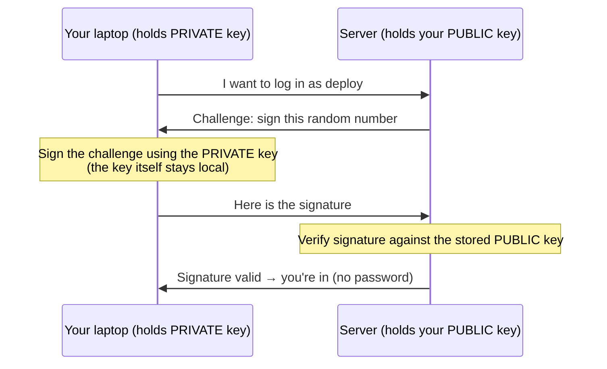

# Chapter 5 — SSH Hardening

> *Part II · Hardening the Base System — Chapter 5 of 18*

This is the chapter that turns your server from "reachable by anyone on Earth who guesses a password" into "reachable only by someone holding a specific cryptographic key that lives on *your* laptop." Right now, `sshd` is listening on port 22 and will let anyone in who can produce a valid username and password. That is exactly what automated bots spend all day trying — thousands of guesses against `root`, `admin`, `ubuntu`, and common passwords, around the clock. In this chapter you'll replace passwords with **SSH keys**, then **disable password login and direct root login entirely**. We will do it slowly and with a safety net, because this is also the chapter where a careless mistake can lock you out of your own server.

---

## Goal

By the end of this chapter you will:

1. Understand **public-key cryptography** well enough to know *why* SSH keys are dramatically stronger than passwords.
2. Understand the two halves of a key pair — **private** vs **public** — and the golden rule about each.
3. **Generate** a modern SSH key pair on your *local* machine.
4. **Install** your public key on the server (via `ssh-copy-id` or by hand) and log in with **no password**.
5. Understand every important directive in **`/etc/ssh/sshd_config`** that we touch.
6. Safely **disable password authentication** and **disable direct root login**, verifying at each step in a *second* session so you can never lock yourself out.
7. Know how to **recover** if something goes wrong, and how to inspect SSH logs.

---

## Background

### The problem with passwords

A password is a **shared secret**: the same string is known to both you and the server. That creates several weaknesses:

- It can be **guessed or brute-forced.** Bots try millions of common passwords. A short or reused password falls quickly.
- It can be **phished, keylogged, or shoulder-surfed** — captured wherever you type it.
- It is **replayable**: whoever learns the string can log in from anywhere, forever, until it's changed.
- On a fresh server, password login means the front door will accept *anyone* who guesses right — and your logs will fill with relentless guessing attempts.

We want an authentication method where **no reusable secret ever travels to the server**, where guessing is mathematically infeasible, and where the credential can't be brute-forced. That's public-key cryptography.

### Public-key cryptography, from zero

Instead of one shared secret, key-based authentication uses a **key pair** — two mathematically linked files:

| Half | Where it lives | Shareable? | Role |
|---|---|---|---|
| **Private key** | *Only* on your local machine (e.g. `~/.ssh/id_ed25519`) | ❌ **Never leaves your machine. Never share it.** | Proves it's you. Guard it like a house key. |
| **Public key** | Copied *onto every server* you want to access (`~/.ssh/authorized_keys`) | ✅ Safe to share freely | The lock that only your private key can open. |

The magic property: **anything the lock (public key) can verify could only have been produced by the matching private key** — and you cannot derive the private key from the public one. So you can hand your public key to the whole world; it grants nothing without the private key.

Here's what actually happens at login — note that **your private key never travels across the network**:



The server sends a random **challenge**; your client **signs** it with the private key; the server **verifies** the signature with the public key it already has. Only the signature crosses the wire, and it's useless to an eavesdropper (it was for a one-time random challenge). This is why keys defeat brute-forcing, eavesdropping, and replay all at once.

### What kind of key? (ed25519 vs RSA)

Modern SSH supports several key algorithms. Two matter:

| Algorithm | Pros | Cons | Verdict |
|---|---|---|---|
| **ed25519** | Modern elliptic-curve crypto; very strong; short keys; fast; well supported on any current system. | Not supported by *ancient* SSH (pre-2014) — irrelevant today. | ✅ **Recommended.** The current best practice. |
| **RSA (≥ 4096-bit)** | Universally supported, including very old systems. | Larger, slower; only strong at 4096 bits. | ➕ Use only if you must talk to something ancient. |

We'll generate **ed25519**.

### The passphrase on your private key

When you generate a key you're asked for an optional **passphrase**. This encrypts the *private key file on disk*. Its purpose: if someone steals your laptop or the key file, they still can't use the key without the passphrase. It is **not** sent to the server and is unrelated to any server password.

> 🔐 **Use a passphrase.** To avoid typing it on every connection, an **ssh-agent** (built into macOS, Linux, and Windows) holds the decrypted key in memory for your session after you enter the passphrase once. Best of both worlds: an encrypted key file *and* convenience.

### The server side: `authorized_keys` and its permissions

On the server, each user has a file **`~/.ssh/authorized_keys`** — a list of public keys allowed to log in as that user. Add your public key there and you're in.

SSH is **deliberately paranoid about permissions** on these files. If `~/.ssh` or `authorized_keys` are readable/writable by other users, `sshd` will silently **refuse** to use them (a world-writable key file could be tampered with). The required permissions:

| Path | Permissions | Meaning |
|---|---|---|
| `~/.ssh` (directory) | **`700`** (`drwx------`) | only the owner may enter |
| `~/.ssh/authorized_keys` | **`600`** (`-rw-------`) | only the owner may read/write |

This is exactly the `chmod`/`chown` and `rwx` knowledge from Chapter 3, now doing real security work.

### The config file: `/etc/ssh/sshd_config`

The SSH **daemon** (`sshd`, from Chapter 1) reads its settings from **`/etc/ssh/sshd_config`**. Editing this file is how we change SSH's behavior. The three directives at the heart of this chapter:

| Directive | What it controls | Our target |
|---|---|---|
| `PubkeyAuthentication` | Allow key-based login | `yes` |
| `PasswordAuthentication` | Allow password login | `no` (after keys work) |
| `PermitRootLogin` | Whether `root` may SSH in directly | `no` (or `prohibit-password`) |

> ⚠️ Modern Ubuntu also uses a **drop-in directory**, `/etc/ssh/sshd_config.d/`, whose files are included by (and can *override*) the main config. We'll account for this so a setting doesn't mysteriously "not take effect."

---

## Why is this necessary?

- **Passwords are the weak link that's under constant attack.** The internet-wide background noise of SSH brute-forcing is real and relentless. Key auth removes the thing they're attacking entirely — there's no password to guess.
- **Root is the #1 target.** Bots overwhelmingly try to log in as `root`. Disabling direct root SSH login removes that target completely; an attacker would need to compromise *your* key *and* your sudo password — two independent secrets.
- **It closes the loop from Chapters 3–4.** You made a sudo user and patched the system precisely so this step is safe. Key-only, no-root SSH is the payoff that makes the server genuinely defensible.
- **It's the professional default.** Production servers essentially never allow password SSH. Learning this now means everything you build later assumes the secure baseline.

---

## What would happen if we skipped this step?

- **You'd remain brute-forceable.** As long as `PasswordAuthentication yes` stands, your security rests entirely on password strength against tireless automated guessing. Weak or reused passwords fall; even strong ones face endless attempts.
- **Root stays exposed.** Direct root login keeps the highest-value account reachable from the whole internet.
- **Your logs drown in attacks.** `/var/log/auth.log` fills with thousands of failed attempts, making real events hard to spot (Chapter 7's Fail2ban helps, but removing password auth is the root fix).
- **Every later layer sits on sand.** Firewalls and intrusion prevention are worth much less if the front door still accepts guessed passwords.

---

## Alternative approaches

### Authentication method

| Approach | Pros | Cons | Verdict |
|---|---|---|---|
| **SSH key pair (ed25519)** | No reusable secret on the wire; brute-force-proof; phishing/replay resistant; industry standard. | Must manage the private key (back it up, protect it). | ✅ **Recommended.** |
| **Password only** | Nothing to set up. | Brute-forceable, phishable, replayable; the thing attackers target. | ❌ Disable after keys work. |
| **Key + password (both required = MFA-ish)** | Two factors. | More friction; overkill for most single-admin servers. | ➕ Nice for high-security setups (`AuthenticationMethods publickey,password`). |
| **Hardware key / FIDO2 (`ed25519-sk`)** | Private key bound to physical hardware; phishing-proof. | Needs a hardware token; slightly more setup. | ➕ Excellent for high-value access; optional here. |

### Should you also change the SSH port (e.g. 22 → 2222)?

| View | Reasoning |
|---|---|
| **Change it** | Moving off port 22 dramatically cuts the *volume* of automated noise in your logs (most bots only scan 22). |
| **Don't rely on it** | It is **security by obscurity** — it stops noise, not a determined attacker who scans all ports. It is **not** a substitute for keys/firewall, and it can complicate tooling. |

**Verdict:** optional and low-priority. Key auth + firewall (Chapter 6) + Fail2ban (Chapter 7) are the real defenses. We'll mention how to change the port but won't treat it as security. **Do not** change the port in the same session as the other changes — one variable at a time.

### How to disable root login: `no` vs `prohibit-password`

| Value | Meaning | When |
|---|---|---|
| **`PermitRootLogin no`** | Root cannot SSH in at all. | ✅ **Recommended** once your sudo user works — cleanest. |
| **`prohibit-password`** | Root may log in **only with a key**, never a password. | ➕ If some automation genuinely needs root-over-key. |
| `yes` | Root may log in with password. | ❌ Avoid. |

We'll use **`no`**, because you have `deploy` + `sudo`.

---

## Commands

> **Read this whole section before running anything.** The Golden Safety Rule is now critical: **keep your current working SSH session open at all times**, and test every change by opening a **second, new** session. If the new session fails, the first one is still there to fix it — and the provider **web console** (Chapter 1) is your ultimate backup. Nothing here is irreversible *as long as you follow that rule.*

### Part A — On your LOCAL machine: create and install a key

#### A1 — Check whether you already have a key

```bash
ls -al ~/.ssh
```
- **What it does:** lists your local `~/.ssh` folder. Look for a pair like `id_ed25519` (private) and `id_ed25519.pub` (public).
- **If they already exist:** you may reuse them — skip to **A3**. Generating a new key over an old one (same filename) would overwrite it and could lock you out of *other* servers that trust the old key.
- **Expected if none:** `No such file or directory`, or a folder without `id_ed25519*` — then continue to A2.

#### A2 — Generate an ed25519 key pair

```bash
ssh-keygen -t ed25519 -C "deploy@my-server"
```
- **What it does:** creates a new key pair. `-t ed25519` picks the modern algorithm; `-C` adds a **comment/label** (any text — commonly your email or a note identifying the key; it's just a human tag stored in the public key).
- **Why we run it (on your laptop, not the server):** the private key must be *born* on the machine that will keep it and never leave. Generating on your local machine is correct.
- **Expected interaction:**
  ```
  Enter file in which to save the key (/home/you/.ssh/id_ed25519): ← press Enter for default
  Enter passphrase (empty for no passphrase):                     ← type a strong passphrase
  Enter same passphrase again:
  Your identification has been saved in /home/you/.ssh/id_ed25519
  Your public key has been saved in /home/you/.ssh/id_ed25519.pub
  The key fingerprint is: SHA256:....
  ```
- **Choose a passphrase** (see Background). It encrypts the private key on disk.
- **How to verify:** `ls ~/.ssh` now shows `id_ed25519` and `id_ed25519.pub`.
- **Common mistakes:** generating this *on the server* (defeats the purpose — the private key would live on the machine you're protecting); accepting a filename that overwrites an existing key.
- **Recovery:** if you accidentally overwrite a key you still needed elsewhere, you'll have to re-install the new public key on those other servers.

> 🔑 **Golden rule, restated:** the file **without** `.pub` (`id_ed25519`) is your **private** key — it never leaves this machine and you never paste it anywhere. The file **with** `.pub` (`id_ed25519.pub`) is your **public** key — that's the one that goes on servers. Confusing these is the classic beginner error.

#### A3 — Copy your PUBLIC key to the server

The easy, correct way (still using **password** auth this one last time, since keys aren't set up yet):

```bash
ssh-copy-id deploy@SERVER_IP
```
- **What it does:** logs in with your password *once*, then appends your **public** key to `~/.ssh/authorized_keys` on the server, creating `~/.ssh` with the correct `700`/`600` permissions automatically.
- **Why we run it:** it's the least error-prone way to install a public key — it handles the file, the directory, and the permissions for you.
- **Expected output:** it reports how many keys were added, e.g. `Number of key(s) added: 1`, and suggests you test with `ssh deploy@SERVER_IP`.
- **How to verify:** proceed to A4.
- **If `ssh-copy-id` isn't available** (some Windows setups), do it by hand — this shows exactly what the tool does:
  ```bash
  # On your LOCAL machine, print your public key:
  cat ~/.ssh/id_ed25519.pub
  ```
  Copy the whole single line (starts with `ssh-ed25519 ...`). Then, in your existing **server** session:
  ```bash
  mkdir -p ~/.ssh && chmod 700 ~/.ssh
  nano ~/.ssh/authorized_keys      # paste the public key line on its own line, save (Ctrl+O, Enter), exit (Ctrl+X)
  chmod 600 ~/.ssh/authorized_keys
  ```
  - Those `chmod` commands set the exact permissions SSH demands (Background). Getting these wrong is the #1 reason key login silently fails.
- **Common mistakes:** pasting the *private* key by accident (never do this); pasting the public key split across multiple lines (it must be one line); wrong permissions on `~/.ssh`.

#### A4 — Test key login in a NEW session (keep the old one open!)

Open a **new** local terminal and connect — **do not close your existing session**:

```bash
ssh deploy@SERVER_IP
```
- **Expected:** you're asked for your **key passphrase** (the one from A2, prompted *locally* by ssh/ssh-agent) — **not** the server password — and then you're in. If you set no passphrase, you land straight at the prompt with no prompt at all.
- **How to tell keys are working, not the password:** it asked for the *passphrase* (or nothing), not "deploy@SERVER_IP's password:". To be certain, add `-v`:
  ```bash
  ssh -v deploy@SERVER_IP
  ```
  Look for a line like `Authentications that can continue: publickey,password` followed by `Offering public key: ...` and `Server accepts key`. That confirms **publickey** succeeded.
- **⛔ Do not proceed to Part B until key login works.** Disabling passwords before keys work is exactly how people lock themselves out.
- **Recovery if key login fails:** you still have password login enabled, so you can get in and fix it. See Troubleshooting (permissions are the usual culprit).

### Part B — On the SERVER: harden `sshd_config`

Now that keys work, we tighten the daemon. **Keep your working session open**; we'll test in yet another new session.

#### B1 — Back up the config first

```bash
sudo cp /etc/ssh/sshd_config /etc/ssh/sshd_config.bak
```
- **What it does:** copies the config to a `.bak` file (the "back up before editing" habit from Chapter 2). If anything goes wrong you can restore it.
- **Verify:** `ls -l /etc/ssh/sshd_config*` shows both the original and `.bak`.
- **Recovery later:** `sudo cp /etc/ssh/sshd_config.bak /etc/ssh/sshd_config && sudo systemctl restart ssh`.

#### B2 — Check for drop-in overrides (so your edits actually take effect)

```bash
ls /etc/ssh/sshd_config.d/
```
- **What it does:** lists drop-in config fragments that are **included** by the main file and can **override** it. On Ubuntu cloud images there's often a file here (e.g. `50-cloud-init.conf`) that sets `PasswordAuthentication yes`.
- **Why this matters:** if a drop-in sets a value, editing the main file may appear to "do nothing" because the drop-in wins. Check these files:
  ```bash
  sudo grep -R -E "PasswordAuthentication|PermitRootLogin|PubkeyAuthentication" /etc/ssh/sshd_config /etc/ssh/sshd_config.d/
  ```
  - This searches the main file **and** all drop-ins for our three directives, showing which file sets what. Note any that conflict with our targets — you'll edit whichever file actually holds the setting (often simplest to correct the drop-in *and* set the main file).

#### B3 — Edit the configuration

```bash
sudo nano /etc/ssh/sshd_config
```
Find each directive (use `Ctrl+W` in nano to search). Lines starting with `#` are **comments/disabled** — remove the `#` to activate a line, or add a new line. Set:

```
PubkeyAuthentication yes
PasswordAuthentication no
PermitRootLogin no
```

- **`PubkeyAuthentication yes`** — explicitly allow key login. (Usually already on, but be explicit.)
- **`PasswordAuthentication no`** — turn **off** password login. *This is the big one.* After this, only keys work.
- **`PermitRootLogin no`** — root can no longer SSH in at all; you log in as `deploy` and use `sudo`.
- **Which lines are critical vs customizable:** these three are the security-critical ones. You may *also* optionally set `Port 2222` (see Alternatives) — but **not in this same change**; do one thing at a time.
- **If a drop-in file (B2) sets `PasswordAuthentication yes`,** also edit that file (e.g. `sudo nano /etc/ssh/sshd_config.d/50-cloud-init.conf`) and set it to `no`, or the drop-in will override you.
- Save with **`Ctrl+O`**, Enter; exit with **`Ctrl+X`**.

#### B4 — Validate the config BEFORE restarting

```bash
sudo sshd -t
```
- **What it does:** **t**ests the config file for syntax errors *without* applying it. This is a critical safety check — a broken config can stop `sshd` from starting and lock you out.
- **Expected output:** **nothing** (silence = valid). Any output means an error with a line number — fix it before proceeding.
- **Common mistake:** skipping this step. Never restart sshd on an unvalidated config.
- **Recovery:** if it reports an error, reopen the file, fix the indicated line (or restore the `.bak`), and re-test until silent.

#### B5 — Apply the change by reloading sshd

```bash
sudo systemctl reload ssh
```
- **What it does:** tells the running SSH daemon to re-read its config. **`systemctl`** is how you control system services on Ubuntu (we cover it fully in Chapter 10); `reload` applies config without dropping existing connections — so **your current session stays alive.**
- **Note on service name:** on Ubuntu 24.04 the service is `ssh` (an alias `sshd` also works). If `reload` isn't supported for a change, use `sudo systemctl restart ssh` — but `reload` is gentler and won't kill your session.
- **Expected output:** none (success is silent). Verify the service is healthy:
  ```bash
  systemctl status ssh
  ```
  Look for **`active (running)`**. Press `q` to exit the status view.
- **Recovery:** if `status` shows `failed`, the config is bad — restore the backup (`sudo cp /etc/ssh/sshd_config.bak /etc/ssh/sshd_config`), `sudo sshd -t`, then reload again. Your open session is still your lifeline.

#### B6 — THE CRITICAL TEST: open a brand-new session

**Without closing your current session(s)**, open a fresh local terminal and connect:

```bash
ssh deploy@SERVER_IP
```
- **Expected:** logs in via your **key** (passphrase prompt or straight in). ✅
- **Now prove passwords are off.** Try to force a password login:
  ```bash
  ssh -o PreferredAuthentications=password -o PubkeyAuthentication=no deploy@SERVER_IP
  ```
  - **Expected:** it should be **rejected** — e.g. `Permission denied (publickey).` That refusal is the *proof* password auth is disabled. 🎉
- **Prove root login is off:**
  ```bash
  ssh root@SERVER_IP
  ```
  - **Expected:** `Permission denied` — root can no longer log in. ✅
- **Only once all three behave as expected** is it safe to close your original session. If anything is wrong, you still have the working session to revert in.

---

## Verification Checklist

You've completed this chapter when **all** of the following are true:

- [ ] You can explain why key auth beats passwords (no reusable secret on the wire; brute-force/replay resistant) and which key half is secret.
- [ ] `ls ~/.ssh` on your laptop shows `id_ed25519` (private) and `id_ed25519.pub` (public).
- [ ] Your public key is in the server's `~/.ssh/authorized_keys`, with `~/.ssh` at `700` and the file at `600`.
- [ ] A **new** session logs in with the **key** (passphrase/agent), not the server password.
- [ ] `sudo sshd -t` reports no errors; `systemctl status ssh` shows `active (running)`.
- [ ] `PasswordAuthentication no`, `PermitRootLogin no`, `PubkeyAuthentication yes` are the effective settings (including any drop-in overrides).
- [ ] Forcing password auth is **rejected** (`Permission denied (publickey)`).
- [ ] `ssh root@SERVER_IP` is **rejected**.
- [ ] Your original session stayed open throughout, and you have the web console as a backup.

---

## Troubleshooting

| Symptom | Why it happens | How to fix |
|---|---|---|
| Key login still asks for the **server password** (not the passphrase) | The server isn't accepting your key — usually wrong **permissions** on `~/.ssh` (must be `700`) or `authorized_keys` (must be `600`), or the key wasn't installed. | On the server: `chmod 700 ~/.ssh && chmod 600 ~/.ssh/authorized_keys`, and confirm the file owner is `deploy` (`ls -la ~/.ssh`). Re-run `ssh-copy-id`. Diagnose with `ssh -v`. |
| `Permission denied (publickey)` when you *expect* to get in | Wrong key offered, key not installed for this user, or you disabled passwords before the key worked. | `ssh -v deploy@SERVER_IP` to see which keys are offered; specify the key explicitly with `-i ~/.ssh/id_ed25519`; verify `authorized_keys` contains the matching `.pub`. If truly locked out, use the **web console**. |
| I edited the config but the setting "doesn't take effect" | A file in `/etc/ssh/sshd_config.d/` is **overriding** the main config (common: cloud-init re-enables passwords). | Grep the drop-ins (B2) and edit the file that actually sets it, or ensure the main file's setting isn't being overridden. Re-`reload`. |
| `systemctl status ssh` shows **failed** after reload | Syntax error in the config — a bad directive or typo. | You skipped `sshd -t`. Restore the backup: `sudo cp /etc/ssh/sshd_config.bak /etc/ssh/sshd_config`, run `sudo sshd -t` until silent, then `sudo systemctl reload ssh`. Your open session saves you. |
| Locked out entirely — no session works | Passwords disabled + key broken, or a bad config that stopped `sshd`. | Use the provider **web console** (Chapter 1) to log in on the console, fix `authorized_keys`/permissions or restore `sshd_config.bak`, restart `ssh`. This is why we never close the last working door. |
| `ssh-copy-id: command not found` (some Windows) | Tool not present. | Install the public key by hand (A3 manual method), or use `type $env:USERPROFILE\.ssh\id_ed25519.pub | ssh deploy@SERVER_IP "mkdir -p ~/.ssh && cat >> ~/.ssh/authorized_keys && chmod 700 ~/.ssh && chmod 600 ~/.ssh/authorized_keys"` in PowerShell. |
| I want to see who's trying to log in / why mine failed | SSH logs every attempt. | `sudo tail -f /var/log/auth.log` (Chapter 2's `tail -f`) and try connecting in another window — you'll see the exact reason (`Accepted publickey`, `Failed password`, permissions warnings). `q`/`Ctrl+C` to stop. |
| Forgot the key passphrase | The passphrase can't be recovered. | You must generate a new key pair (A2) and re-install the new public key on the server (A3) using your still-open session. |

> **Back up your private key.** If your laptop dies and the private key is gone, you lose access to every server trusting it. Keep a secure, encrypted backup of `~/.ssh/id_ed25519` (e.g. in a password manager or encrypted vault). Losing it is an operational risk, not just an inconvenience.

---

## Best Practices

- **Never share or move the private key.** It stays on your machine. Only the `.pub` goes on servers. If a private key is ever exposed, treat it as compromised: remove its public key from all `authorized_keys` and rotate to a new pair.
- **Always use a passphrase + ssh-agent.** Encrypt the key at rest; let the agent give you convenience without weakening it.
- **Disable password auth *and* root login** once keys work. Key-only + no-root is the production baseline; it removes the two things attackers hammer.
- **Validate before you reload:** `sudo sshd -t` every single time before applying config. It's the difference between a safe change and a lockout.
- **Test in a second session; never close your last working door.** This rule, plus the web console, makes SSH hardening safe. Internalize it — it protects you in Chapters 6 and 7 too.
- **Mind the drop-in directory.** `/etc/ssh/sshd_config.d/*` can override your edits. Always grep both locations for the setting you're changing.
- **One change at a time.** Don't combine port changes, password disabling, and root disabling in one edit — if something breaks you won't know which change did it.
- **Back up the private key securely; back up `sshd_config`.** Both backups are cheap insurance against very expensive lockouts.

---

## Summary

### What you learned

- Why **passwords** are the weak link (guessable, phishable, replayable) and how **public-key cryptography** fixes all three: a **private key** that never leaves your machine and a **public key** that acts as a lock, with only a one-time signature crossing the network.
- The **golden rule** of the two key halves, why **ed25519** is the modern choice, and why a **passphrase + ssh-agent** gives you both security and convenience.
- How the server side works: **`~/.ssh/authorized_keys`** and SSH's strict **`700`/`600` permission** requirements (Chapter 3's `rwx` doing real security work).
- How to **generate** a key (`ssh-keygen -t ed25519`), **install** the public key (`ssh-copy-id` or by hand), and **verify** key login with `ssh -v`.
- The key directives in **`/etc/ssh/sshd_config`** — `PubkeyAuthentication`, `PasswordAuthentication`, `PermitRootLogin` — the **drop-in override** trap in `/etc/ssh/sshd_config.d/`, and the safe change ritual: **back up → edit → `sshd -t` → `reload` → test in a new session**.
- How to **prove** the lockdown (forced-password and root logins are rejected) and how to **recover** via the still-open session, the `.bak`, `auth.log`, and ultimately the provider web console.

### What you'll build next

**Chapter 6 — The Firewall.** SSH is now locked to keys only, but every *other* port on your server is still governed only by whatever happens to be listening. A **firewall** flips the model to "deny by default": nothing is reachable unless you explicitly allow it. You'll learn what ports and firewalls really are, meet Ubuntu's friendly **`ufw`** (Uncomplicated Firewall), and carefully allow only what you need (starting with SSH — *before* enabling the firewall, so you don't lock yourself out) so your server presents the smallest possible attack surface to the internet.

> ✅ **Ready to continue?** Confirm and we'll proceed to Chapter 6. If key login, the config edit, or the lockdown test didn't behave as described — **keep your working session open** — tell me exactly what you ran and the output (especially `ssh -v` and `sudo tail /var/log/auth.log`), and we'll fix it before touching the firewall.
