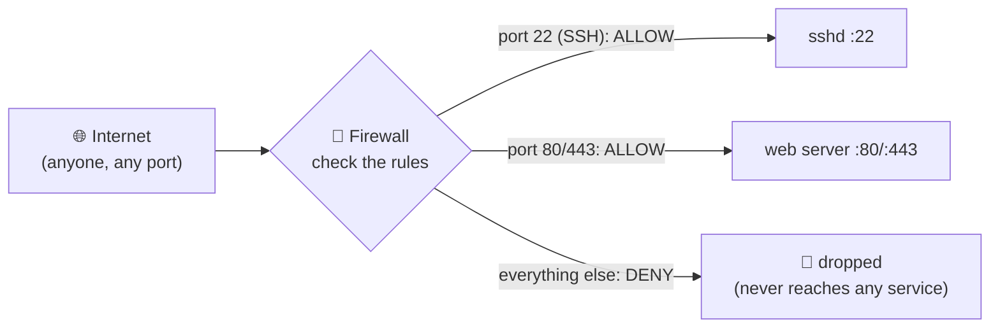

# Chapter 6 — The Firewall

> *Part II · Hardening the Base System — Chapter 6 of 18*

In Chapter 5 you locked the *front door* — SSH now accepts only your key. But a server is a building with many doors and windows: every network **port** is a potential entrance, and by default the only thing deciding whether a door is open is whether some program happens to be listening behind it. Install a database tomorrow that binds to all interfaces, and you've silently opened a new door to the whole internet without meaning to. A **firewall** flips this dangerous default on its head: **everything is closed unless you explicitly open it.** This chapter teaches you what ports and firewalls really are, and how to put a clean, minimal, *deny-by-default* wall around your server — without locking yourself out.

---

## Goal

By the end of this chapter you will:

1. Understand what a **network port** is, and how one machine runs many services on one IP.
2. Understand what a **firewall** does, the idea of **default-deny**, and where the firewall sits relative to your services.
3. Understand the difference between a **host firewall** (on the server) and a **cloud/provider firewall** (in the dashboard) — and why you often want both.
4. Meet **`ufw`** (Uncomplicated Firewall) and understand what it's doing to the lower-level machinery underneath.
5. Safely configure `ufw`: **allow SSH first**, set default-deny, then **enable** — in the correct order so you never lock yourself out.
6. Add, inspect, and remove rules; understand rule order and numbering.
7. Verify the wall works and know how to recover if it doesn't.

---

## Background

### What is a port? (the idea that makes firewalls make sense)

Your server has one **IP address** (Chapter 1) — one street address. But it runs many network services at once: SSH, maybe a web server, maybe a database. How does incoming traffic know which service it's for? **Ports.**

A **port** is a numbered channel on an IP address — think of the IP as the building's street address and the port as a specific *apartment number* inside it. A network connection is really addressed to `IP:port`, e.g. `203.0.113.10:22`. The operating system uses the port number to hand the connection to the right program.

- Ports range from **0 to 65535**.
- **Well-known ports (0–1023)** are reserved for standard services and require privilege to bind. You'll meet these constantly:

  | Port | Service | Meaning |
  |---|---|---|
  | **22** | SSH | remote shell (Chapter 1/5) |
  | **80** | HTTP | unencrypted web traffic |
  | **443** | HTTPS | encrypted web traffic (Chapter 11) |
  | 53 | DNS | domain name lookups |
  | 25 / 587 | SMTP | email sending |

- A service **listens** on a port ("I'm the SSH daemon, wake me for anything on port 22"). A program that isn't listening on a port means that port is effectively closed — *but you can't rely on that*, because installing new software can open new listeners at any time.

You can see what's listening right now:

```
sudo ss -tulpn
```
(We'll run this in Commands.) The point for now: **an open port with a listener is a door someone could knock on from the internet.**

### What is a firewall?

A **firewall** is a gatekeeper that inspects network traffic and decides — based on rules *you* set — whether to **allow** or **block** it, *before* it ever reaches the service behind the port. It sits at the edge of the machine:



The crucial design choice is the **default policy**:

- **Default-allow** ("blocklist"): everything is open except what you specifically block. *Fragile* — you must anticipate every bad thing, and any new listener is exposed automatically.
- **Default-deny** ("allowlist"): everything is closed except what you specifically allow. *Robust* — the safe default; new services stay private until you choose to expose them.

**We use default-deny for incoming traffic.** This is the single most important concept in the chapter: your server should present the *smallest possible* surface — ideally just SSH now, plus web ports later.

> 🧠 **Why default-deny is so powerful:** it makes exposure a *deliberate decision*. Without it, every database, cache, admin panel, or debug server you ever install could quietly become internet-reachable. With it, nothing is reachable until you say so — mistakes fail *closed* (safe), not *open* (dangerous).

### Inbound vs outbound

Firewalls distinguish direction:

- **Inbound (ingress):** traffic *coming to* your server (someone connecting to your SSH or website). **This is what we restrict tightly** — it's the attack surface.
- **Outbound (egress):** traffic your server *initiates* (downloading updates with `apt`, calling an API). We generally **allow outbound** freely, because the server needs to reach the internet to function, and locking it down is an advanced topic with real footguns (break outbound and `apt` stops working).

So our policy will be: **deny incoming by default, allow outgoing by default, and explicitly allow the few incoming services we want.**

### What is `ufw`, and what's underneath it?

Linux's actual firewall lives in the **kernel**, configured through a framework called **netfilter**, driven historically by a complex tool called **`iptables`** and its modern successor **`nftables`**. These are powerful but notoriously fiddly — easy to misconfigure, easy to lock yourself out with.

**`ufw`** — **U**ncomplicated **F**ire**w**all — is Ubuntu's friendly front-end that translates simple commands like `ufw allow 22` into the correct low-level rules for you. It is:

- **Simple:** human-readable commands, sensible defaults.
- **Safe-by-design:** clear default policies, a confirmation prompt before enabling.
- **Standard on Ubuntu:** installed (or one `apt install ufw` away) and integrated.

You get the safety of default-deny without hand-writing `nftables` rules. (Under the hood `ufw` *is* configuring nftables/iptables — it's a translator, not a different firewall.)

### Host firewall vs cloud firewall — you may have two

Many VPS providers offer a **cloud firewall** (also "security group" / "network firewall") configured in their **web dashboard**. It filters traffic *before* it even reaches your server. That's different from `ufw`, which runs *on* the server. Both are worth having:

| Layer | Where it runs | Pros | Cons |
|---|---|---|---|
| **Cloud / provider firewall** | Provider's network, before your VPS | Blocks traffic before it touches your machine; survives even if the OS is misconfigured; central management. | Per-provider UI; not visible from inside the server; can be forgotten. |
| **Host firewall (`ufw`)** | On the server itself | Travels with the server (works on any provider); versionable; fine-grained; what you control directly. | Only helps if the OS is up and correctly configured. |

**Defense in depth:** use both when available. If your provider has a cloud firewall, ensure it *also* allows your SSH port, or you'll be blocked before `ufw` even gets a say. In this chapter we configure the **host firewall (`ufw`)**; we'll note the cloud firewall so a locked-out reader knows to check it too.

---

## Why is this necessary?

- **It shrinks your attack surface to almost nothing.** Every closed port is one an attacker can't even probe. With default-deny, the internet sees essentially one open door (SSH) instead of a building full of them.
- **It protects you from your *own future self*.** The real danger isn't just today's services — it's the database, cache, or debug server you'll install next month that binds to `0.0.0.0` (all interfaces). Without a firewall that becomes instantly internet-exposed; with default-deny it stays private until you deliberately open it.
- **It's a safety net for misconfiguration.** Software sometimes listens more broadly than you intend. The firewall is a second line that contains those mistakes.
- **It's expected in production.** A server with no host firewall and no default-deny policy is considered unhardened. This is a baseline, not an extra.

---

## What would happen if we skipped this step?

- **Every listening service is exposed.** Today that might be just SSH, but the moment you install a database (Chapter 12) or an app that binds to all interfaces, it's reachable by the entire internet — and databases with default or weak credentials are a top compromise vector.
- **Accidental exposure becomes silent and permanent.** A debug server started "just for a minute," an admin panel, a metrics endpoint — all reachable, none announced. You wouldn't know until someone found it.
- **No containment for mistakes.** A service misconfigured to listen publicly has nothing stopping the traffic. Default-deny would have quietly blocked it.
- **More attack noise and risk.** Open ports invite scanning and exploitation attempts across the board, not just on SSH.

---

## Alternative approaches

### Which firewall tool

| Tool | Pros | Cons | Verdict |
|---|---|---|---|
| **`ufw`** | Simple, safe defaults, Ubuntu-native, confirmation prompt, easy rule syntax; configures nftables correctly for you. | Less expressive than raw nftables for exotic setups. | ✅ **Recommended.** Ideal for a single web server. |
| **`nftables`** (or legacy `iptables`) directly | Maximum control and expressiveness. | Steep, error-prone, easy to lock yourself out; overkill here. | ➖ For advanced/complex networking only. |
| **`firewalld`** | Zones, dynamic rules; common on RHEL/Fedora. | Not the Ubuntu default; extra concepts. | ➖ Fine on RHEL-family; not our platform. |
| **Cloud firewall only** | No on-host config; blocks before the VPS. | Per-provider; no protection if you move hosts; not versionable; easy to forget. | ➕ Use *alongside* `ufw`, not instead of it. |
| **No firewall** | — | Full attack surface; future services auto-exposed. | ❌ Never in production. |

### Default inbound policy

| Policy | Meaning | Verdict |
|---|---|---|
| **Deny incoming** (allowlist) | Nothing reachable unless explicitly allowed. | ✅ **Recommended.** The whole point. |
| Allow incoming (blocklist) | Everything reachable unless explicitly blocked. | ❌ Fragile; defeats the purpose. |

### Rate-limiting SSH

`ufw` can **rate-limit** a port — automatically throttling an IP that makes too many connections in a short window (default: 6+ connections in 30 seconds → blocked). Using `ufw limit ssh` instead of `ufw allow ssh` adds cheap brute-force resistance. We'll use it. (Chapter 7's Fail2ban adds smarter, log-based banning on top.)

---

## Commands

> Log in as **`deploy`** (`ssh deploy@SERVER_IP`, key-based from Chapter 5). We use `sudo` for all firewall changes. **Golden Safety Rule, again and critically:** we will **allow SSH *before* enabling the firewall**, and keep your current session open while testing in a new one. Enabling a default-deny firewall *without* an SSH allow rule will disconnect you instantly. Do the steps in order.

### 1 — See what's currently listening (know your doors)

```bash
sudo ss -tulpn
```
- **What it does:** lists listening network sockets. Flags: `-t` TCP, `-u` UDP, `-l` listening only, `-p` show the owning program, `-n` numeric ports (don't resolve names).
- **Why we run it:** to *see* which ports are open before we wall things off — you want to know what you're protecting.
- **Expected output:** rows including something like:
  ```
  Netid  State   Local Address:Port   Process
  tcp    LISTEN  0.0.0.0:22           users:(("sshd",...))
  ```
  - **`0.0.0.0:22`** means SSH is listening on **all** interfaces (the public internet included). Note anything listening on `0.0.0.0` or `*` — those are internet-facing. A service on `127.0.0.1` (localhost) is *not* internet-facing.
- **Verify:** you can identify the SSH listener on port 22. **Common mistake:** none — read-only.

### 2 — Confirm ufw is installed and check its status

```bash
sudo ufw status verbose
```
- **What it does:** shows whether the firewall is active and its rules/defaults.
- **Expected output on a fresh server:** `Status: inactive`. That means **no firewall protection yet** — exactly why we're here.
- **If `ufw: command not found`** (rare minimal image): install it — `sudo apt update && sudo apt install ufw` (your Chapter 4 skills).

### 3 — ⭐ Allow SSH *first* (the step that prevents lockout)

```bash
sudo ufw limit OpenSSH
```
- **What it does:** adds a rule allowing (and **rate-limiting**) incoming SSH. `OpenSSH` is a named **application profile** ufw ships — it expands to "TCP port 22." `limit` allows normal connections but throttles an IP making too many too fast (brute-force resistance).
- **Why we run it FIRST — critical:** we're about to set the default to *deny all incoming*. If SSH isn't explicitly allowed *before* we enable the firewall, enabling it would cut your connection and lock you out. **Allow SSH, then enable.** Always this order.
- **Expected output:** `Rules updated` / `Rules updated (v6)`.
- **If you changed the SSH port** (Chapter 5 Alternatives): use the number instead, e.g. `sudo ufw limit 2222/tcp`. The profile name `OpenSSH` only covers port 22.
- **Prefer `allow` if you dislike rate-limiting:** `sudo ufw allow OpenSSH` opens SSH without throttling. `limit` is the better default.
- **Verify:** `sudo ufw show added` lists the pending rule even before enabling.
- **Common mistakes:** skipping this and enabling the firewall anyway (instant lockout); allowing the wrong port after changing SSH's port.

> 💡 **See ufw's known app profiles:** `sudo ufw app list`. On a fresh box you'll typically see `OpenSSH`; after installing a web server (Chapter 9) you'll see profiles like `Nginx Full` (ports 80+443). Profiles are just friendly names for port sets.

### 4 — Set the default policies (deny in, allow out)

```bash
sudo ufw default deny incoming
```
- **What it does:** sets the baseline for **inbound** traffic to **deny** — anything not explicitly allowed is blocked. This is the default-deny heart of the chapter.
- **Expected output:** `Default incoming policy changed to 'deny'` (with a note that existing rules may need updating).

```bash
sudo ufw default allow outgoing
```
- **What it does:** lets the server *initiate* outbound connections freely (so `apt`, DNS, API calls keep working). This is usually already the default; we set it explicitly to be sure.
- **Expected output:** `Default outgoing policy changed to 'allow'`.
- **Why not deny outbound too?** Locking egress is advanced and easy to get wrong (break outbound and updates/DNS fail). For a standard web server, deny-in + allow-out is the correct, safe posture.

### 5 — Enable the firewall

```bash
sudo ufw enable
```
- **What it does:** activates the firewall now *and* on every boot (it persists — no extra step needed).
- **Why the prompt:** ufw warns because enabling can disrupt connections:
  ```
  Command may disrupt existing ssh connections. Proceed with operation (y|n)?
  ```
  Because you **allowed SSH in Step 3**, your session is safe. Type **`y`**.
- **Expected output:** `Firewall is active and enabled on system startup`.
- **How to verify it worked (do NOT close your session):** your *current* session stays connected (SSH was allowed). Now do the real test in Step 7.
- **Recovery if you *did* get disconnected:** you skipped Step 3. Use the provider **web console** (Chapter 1) to log in on the console and run `sudo ufw allow OpenSSH` (or `sudo ufw disable` to turn it off entirely), then reconnect.

### 6 — Inspect the active rules

```bash
sudo ufw status verbose
```
- **What it does:** shows the live firewall state now that it's active.
- **Expected output:**
  ```
  Status: active
  Default: deny (incoming), allow (outgoing), disabled (routed)
  To                         Action      From
  --                         ------      ----
  22/tcp (OpenSSH)           LIMIT       Anywhere
  22/tcp (OpenSSH (v6))      LIMIT       Anywhere (v6)
  ```
- **Read it:** default incoming is `deny`; the only thing allowed in is SSH (with `LIMIT` = rate-limited). That's the minimal surface we wanted.

```bash
sudo ufw status numbered
```
- **What it does:** shows rules with **index numbers** — needed for deleting a specific rule by number (Step 8).

### 7 — THE TEST: open a new session (keep the old one open!)

In a **new** local terminal, without closing your working session:

```bash
ssh deploy@SERVER_IP
```
- **Expected:** connects normally via your key. ✅ This proves the SSH allow rule works with the firewall active.
- **Optional external proof the wall is up:** from your *laptop*, probe a port that should now be closed, e.g. port 80 (nothing is serving it and it's not allowed):
  ```bash
  nc -zv -w 3 SERVER_IP 80
  ```
  - **What it does:** `nc` (netcat) tries to connect; `-z` scan mode, `-v` verbose, `-w 3` timeout. **Expected:** it times out / is refused — the firewall dropped it. Port 22 would succeed. (This is a benign self-test against *your own* server.)
- **Only once the new SSH session works** is the firewall confirmed safe. Keep the old session as backup until then.

### 8 — Adding and removing rules (reference for later chapters)

You'll open web ports in Chapter 9; here's the vocabulary now.

**Allow by service name or port:**
```bash
sudo ufw allow 80/tcp        # allow HTTP (by port + protocol)
sudo ufw allow 'Nginx Full'  # allow a named app profile (ports 80+443) — after installing Nginx
```
- `80/tcp` opens a specific port/protocol. The quoted profile name is the friendly equivalent for a known app.

**Allow only from a specific source (tighter):**
```bash
sudo ufw allow from 203.0.113.5 to any port 22 proto tcp
```
- **What it does:** allows SSH **only** from the IP `203.0.113.5`. Restricting management ports to *your* IP is a strong hardening move if your IP is stable. (Careful: if your home IP changes, you'd lock yourself out — the web console remains your backup.)

**Delete a rule** — the safe way is by number:
```bash
sudo ufw status numbered      # find the rule's [number]
sudo ufw delete 3             # delete rule #3
```
- **What it does:** removes the rule at that index. ufw asks you to confirm the exact rule before deleting — read it. You can also delete by spec: `sudo ufw delete allow 80/tcp`.
- **Common mistake:** deleting the SSH rule while the firewall is active and default-deny — that would lock you out on next connect. Never delete your SSH allow rule unless you have another way in.

**Reload / disable / reset:**
```bash
sudo ufw reload     # re-apply rules (e.g. after manual config edits)
sudo ufw disable    # turn the firewall OFF entirely (emergency use)
sudo ufw reset      # wipe ALL rules back to defaults (asks for confirmation)
```
- `disable` is your quick "get out of jail" if a rule change goes wrong *and you still have a session* — it removes all filtering. `reset` starts over (you'd then re-add SSH and re-enable).

---

## Verification Checklist

You've completed this chapter when **all** of the following are true:

- [ ] You can explain what a **port** is and why **default-deny inbound** is the safe policy.
- [ ] `sudo ss -tulpn` shows you which services are listening and on which interface (`0.0.0.0` = public).
- [ ] You allowed SSH (`sudo ufw limit OpenSSH`) **before** enabling the firewall.
- [ ] Defaults are set: **deny incoming, allow outgoing**.
- [ ] `sudo ufw status verbose` shows `Status: active`, default `deny (incoming)`, and an SSH `LIMIT`/`ALLOW` rule.
- [ ] A **new** SSH session connects successfully with the firewall active (tested while the old session stayed open).
- [ ] A probe of a non-allowed port (e.g. `nc -zv SERVER_IP 80`) is blocked/times out.
- [ ] You know how to add (`ufw allow`), list (`ufw status numbered`), and delete (`ufw delete N`) rules, and the emergency `ufw disable`.
- [ ] If you have a **cloud/provider firewall**, it also allows your SSH port.

---

## Troubleshooting

| Symptom | Why it happens | How to fix |
|---|---|---|
| I enabled ufw and got **disconnected / can't reconnect** | You enabled the firewall **without** an SSH allow rule (skipped Step 3), so default-deny blocked SSH. | Use the provider **web console** (Chapter 1) to log in on the console, then `sudo ufw allow OpenSSH` (or `sudo ufw disable`), and reconnect via SSH. Then re-do the steps in order. |
| SSH works but a service I opened is still unreachable | The firewall rule is fine, but the **cloud/provider firewall** is blocking that port, or the service isn't actually listening (or only on `127.0.0.1`). | Check the provider dashboard firewall; check `sudo ss -tulpn` that the service listens on `0.0.0.0`, not just localhost; confirm the ufw rule with `sudo ufw status`. |
| `sudo ufw allow 'Nginx Full'` → `Could not find a profile matching...` | The app profile only exists after that app is installed (it registers the profile). | Install the app first (Chapter 9), or allow the raw ports: `sudo ufw allow 80/tcp && sudo ufw allow 443/tcp`. |
| Rules seem to have **no effect** | The firewall is `inactive`, or the cloud firewall overrides, or you edited config without `ufw reload`. | `sudo ufw status verbose` to confirm it's `active`; `sudo ufw reload`; check the provider firewall. |
| Changed my SSH port but ufw still only allows 22 | `OpenSSH` profile = port 22 only; a new port needs its own rule. | `sudo ufw limit <newport>/tcp`, verify, test in a new session, *then* remove the old `OpenSSH` rule if desired. |
| I locked myself out by restricting SSH `from <my-ip>` and my IP changed | Source-restricted rules block you when your address changes (dynamic home IP). | Web console → widen or remove the restriction: `sudo ufw delete` the narrow rule and re-add `sudo ufw limit OpenSSH`. |
| Outbound things (apt, DNS) broke | You (or a guide) set `default deny outgoing` without allow rules. | `sudo ufw default allow outgoing` (our recommended posture), or add specific egress allows. Then `sudo ufw reload`. |
| Want to see what's being blocked | ufw can log dropped packets. | `sudo ufw logging on` (writes to `/var/log/ufw.log`); watch with `sudo tail -f /var/log/ufw.log`. `sudo ufw logging off` to stop. |

> **The firewall lockout rule:** the *only* two ways to be locked out here are (1) enabling before allowing SSH, or (2) deleting/narrowing the SSH rule badly. Both are fully recoverable via the **web console** — which is exactly why we never treat it as optional. Keep it bookmarked.

---

## Best Practices

- **Allow SSH, then enable — never the reverse.** This ordering is the whole safety of the chapter. Burn it in: `ufw limit OpenSSH` → `ufw default deny incoming` → `ufw enable`.
- **Default-deny inbound, always.** Expose services by deliberate choice, one rule at a time. New software stays private until you open it.
- **Open the minimum.** Only the ports you actually serve (SSH now; 80/443 in Chapter 9). Fewer open ports = smaller attack surface.
- **Prefer `limit` for SSH.** Free brute-force throttling; pairs well with Fail2ban next chapter.
- **Restrict management ports by source IP when you can.** `allow from <your-ip> to any port 22` is a big win *if* your IP is stable — with the web console as your safety net.
- **Use both firewalls (defense in depth).** Host `ufw` *and* the provider's cloud firewall. Make sure both allow SSH.
- **Bind services to localhost when they don't need the internet.** A database only your app uses should listen on `127.0.0.1`, not `0.0.0.0` — then even an open port isn't public. The firewall is a backstop, not a substitute for correct binding.
- **Test every firewall change in a second session,** and know the emergency exits (`ufw disable`, web console) before you need them.

---

## Summary

### What you learned

- A **port** is a numbered channel on your IP; each service **listens** on one, and an open port with a listener is a door to the internet. You can see them with `sudo ss -tulpn` (watch for `0.0.0.0` = public vs `127.0.0.1` = local).
- A **firewall** allows or blocks traffic *before* it reaches a service. The key design choice is **default-deny inbound** (allowlist) — the robust posture where nothing is reachable unless explicitly allowed, so mistakes fail *closed*.
- The split between **inbound** (restrict tightly) and **outbound** (allow freely so `apt`/DNS work), and between a **host firewall (`ufw`)** and a **cloud firewall** — use both for defense in depth.
- **`ufw`** is Ubuntu's friendly front-end over the kernel's netfilter/nftables. The safe ritual: **`ufw limit OpenSSH` → `ufw default deny incoming` → `ufw default allow outgoing` → `ufw enable`**, always allowing SSH *before* enabling.
- How to **inspect** (`status verbose`, `status numbered`), **add** (`allow`/`limit`, by port, profile, or source IP), and **delete** (`delete N`) rules, plus **rate-limiting** SSH and the emergency `ufw disable`.
- How to **verify** the wall (new session + `nc` probe) and **recover** from a lockout via the web console — reinforcing that we never remove our last way in.

### What you'll build next

**Chapter 7 — Intrusion Prevention & Automatic Security Updates.** Your firewall now blocks the doors you didn't open, but the one door you *must* keep open — SSH — still faces a stream of connection attempts, and the software behind your open ports still needs patching promptly. In Chapter 7 you'll install **Fail2ban**, which watches your logs and automatically bans IPs that misbehave (turning failed-login floods into short-lived, throttled nuisances), and you'll configure **`unattended-upgrades`** so that critical **security** patches (Chapter 4) apply themselves automatically. Together they make the server actively defend and maintain itself between your visits.

> ✅ **Ready to continue?** Confirm and we'll proceed to Chapter 7. If enabling ufw, the SSH rule, or the port test didn't behave as described — and if you ever get disconnected, remember the **web console** — tell me exactly what you ran and the output of `sudo ufw status verbose`, and we'll sort it before adding intrusion prevention.
