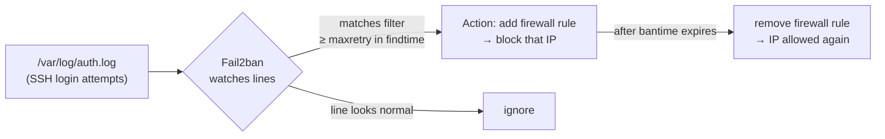

# Chapter 7 — Intrusion Prevention & Automatic Security Updates

> *Part II · Hardening the Base System — Chapter 7 of 18*

Your server can now only be entered with your key (Chapter 5), and only the doors you chose are open (Chapter 6). But two gaps remain, and both are about what happens *when you're not looking*. First: the one door you must keep open — SSH — still faces an endless stream of automated login attempts, and while keys make them futile, that noise is worth actively shutting down. Second: new vulnerabilities are discovered constantly, and Chapter 4 taught you to patch *manually* — but a server that only gets patched when you remember is a server that eventually goes months behind. This chapter makes the server **defend and maintain itself between your visits**: **Fail2ban** to automatically ban misbehaving IPs, and **`unattended-upgrades`** to apply security patches on its own.

---

## Goal

By the end of this chapter you will:

1. Understand what **intrusion prevention** is and how log-watching bans work.
2. Understand **Fail2ban**'s model — jails, filters, and actions — and how it uses the firewall from Chapter 6.
3. Install and configure Fail2ban safely (via `jail.local`, never editing the shipped defaults).
4. Verify Fail2ban is banning correctly and know how to **unban** an address — including yourself.
5. Understand the risk/benefit trade-off of **automatic security updates**.
6. Install and configure **`unattended-upgrades`** to apply security patches automatically, and control *whether/when* it reboots.
7. Verify both systems are working and know how to inspect their logs.

---

## Background

### What is intrusion prevention?

A **firewall** (Chapter 6) decides *whether a port is reachable at all* — it's static: port 22 is either open or closed. But your open SSH port is reachable *by design*, and attackers exploit exactly that: they hammer it with login attempts. A firewall can't tell "my legitimate login" from "the 5,000th brute-force guess" — both are just connections to an allowed port.

**Intrusion prevention** fills that gap. It *watches behaviour over time* and reacts dynamically: "this IP just failed to log in 6 times in 30 seconds — block it for a while." It's the difference between a locked door (firewall) and a bouncer who notices someone rattling the handle repeatedly and turns them away (intrusion prevention).

> **Do keys make this unnecessary?** Not quite. With password auth disabled (Chapter 5), brute-force *can't succeed* — that's your real protection. But Fail2ban still adds value: it **stops the noise** (banned IPs quit filling your logs and consuming resources), **shrinks the window** for any future misconfiguration or new vulnerability, and **extends to other services** you'll run later (web logins, mail, etc.). It's a strong second layer, not a replacement for key auth.

### What is Fail2ban?

**Fail2ban** is a service that **reads log files, matches patterns of bad behaviour, and tells the firewall to ban the offending IP** for a set time. Three concepts define how it works:

| Concept | What it is | Example |
|---|---|---|
| **Filter** | A pattern (regex) describing a "bad" log line. | "authentication failure for user X from IP Y" |
| **Jail** | A rule tying a filter to a log file + thresholds + an action. | *sshd jail*: watch `auth.log`, ban after 5 failures in 10 min for 1 hour. |
| **Action** | What to do when the threshold is hit. | Insert a firewall rule dropping that IP. |

Here's the loop:



Key knobs (you'll set these):

- **`maxretry`** — how many failures before a ban (e.g. 5).
- **`findtime`** — the window those failures must occur within (e.g. 10 minutes).
- **`bantime`** — how long the ban lasts (e.g. 1 hour; `-1` = permanent).
- **`ignoreip`** — addresses that are *never* banned (put **your own IP** here so you can't ban yourself).

Fail2ban integrates with the firewall backend automatically — on modern Ubuntu it uses `nftables`/`iptables` directly (it works alongside `ufw`; you don't have to wire them together manually for the default `sshd` jail).

### The critical Fail2ban configuration rule: `jail.local`, not `jail.conf`

Fail2ban ships defaults in **`/etc/fail2ban/jail.conf`**. **Do not edit that file.** Package upgrades overwrite it, wiping your changes. Instead, you create **`/etc/fail2ban/jail.local`** (and files under `/etc/fail2ban/jail.d/`), which Fail2ban reads *after* and *overrides* the `.conf` with. This `.conf` = defaults, `.local` = your overrides pattern is common in Linux (you saw a cousin of it with SSH drop-ins in Chapter 5). It means upgrades never clobber your settings.

### The other half: why automatic *security* updates?

Chapter 4 taught manual `apt update && apt upgrade`. That's essential to understand — but relying on memory has a flaw: **the gap between a patch being released and you applying it is the window attackers live in**, and humans forget, travel, and get busy. For **security** updates specifically, that window should be as close to zero as possible.

**`unattended-upgrades`** is a service that automatically installs updates — configured, sensibly, to install **only the security ones by default**. It runs on a timer, checks the security pocket (`noble-security` from Chapter 4), and applies matching updates without you lifting a finger.

> **Why *only* security updates automatically?** Feature/version upgrades can occasionally change behaviour and break things; you want to apply *those* deliberately while watching. **Security** updates are narrow, high-value, and low-risk — exactly the kind you want applied the moment they exist, even at 3 a.m. while you sleep. So: automate security patches; keep applying feature upgrades by hand.

### The reboot question

Some patches (kernel, core libraries) only take full effect after a reboot (Chapter 4's `/var/run/reboot-required`). `unattended-upgrades` can optionally **reboot the server automatically** at a time you choose. This is a genuine trade-off:

- **Auto-reboot ON** → patches fully applied without you; but a brief, possibly unexpected outage.
- **Auto-reboot OFF** (default) → no surprise downtime; but you must reboot manually to finish kernel patches.

We'll show both and recommend a deliberate choice (a scheduled low-traffic reboot window is the professional middle ground).

---

## Why is this necessary?

- **Your logs and resources are under constant assault.** Even with keys, bots hammer SSH endlessly. Fail2ban turns that firehose into a trickle by banning repeat offenders, keeping logs readable and freeing resources.
- **Defense in depth.** Keys stop brute-force; the firewall shrinks surface; Fail2ban adds *behavioural* blocking that also protects future services (web/mail logins). Layers cover each other's gaps.
- **Patching-by-memory fails eventually.** The single biggest real-world compromise vector is *known, already-patched* vulnerabilities left unpatched. Automating security updates closes that window mechanically instead of relying on discipline.
- **It makes the server autonomous.** Between your visits, it bans attackers and patches itself. That resilience is what "production-ready" means — the server doesn't degrade the moment you look away.

---

## What would happen if we skipped this step?

- **Relentless log noise and wasted resources.** Thousands of failed attempts per day bury real events and consume CPU/IO. Spotting an actual incident becomes hard.
- **No behavioural protection for future services.** When you add a web app with a login page (later chapters), nothing throttles credential-stuffing against it.
- **Patch drift.** Miss a few weeks and the server accumulates known vulnerabilities. The longer the drift, the bigger and riskier the eventual catch-up upgrade.
- **A false sense of "done."** Chapters 5–6 feel like the server is secure, but security is *ongoing*. Without automation, its security silently decays with every unpatched CVE.

---

## Alternative approaches

### Intrusion prevention

| Approach | Pros | Cons | Verdict |
|---|---|---|---|
| **Fail2ban** | Mature, log-based, flexible (many services), integrates with the firewall, easy `jail.local` config. | Reactive (bans *after* failures); regex/log-format dependent. | ✅ **Recommended.** The standard. |
| **CrowdSec** | Modern; shares threat intel across a community; behavioural. | Newer; more moving parts; cloud component. | ➕ Excellent, worth exploring later; heavier for a first server. |
| **sshguard** | Lightweight Fail2ban alternative for SSH. | Narrower scope, smaller ecosystem. | ➖ Fine but less general than Fail2ban. |
| **Firewall rate-limiting only** (`ufw limit`, Chapter 6) | No extra software; already in place. | Blunt (per-connection count, not per-failure); no per-service logic; short-lived. | ➕ Good *baseline* — Fail2ban complements it. |
| **Nothing** | — | Log noise, no behavioural blocking. | ❌ Leaves an easy win unclaimed. |

### Automatic updates

| Approach | Pros | Cons | Verdict |
|---|---|---|---|
| **`unattended-upgrades` (security only)** | Applies critical patches automatically & promptly; low risk; official Ubuntu tool. | Rare chance a security update changes behaviour; needs reboot for kernels. | ✅ **Recommended.** |
| **`unattended-upgrades` (all updates)** | Everything always current. | Feature upgrades can break things unattended. | ➖ Riskier; prefer manual for non-security. |
| **Fully manual (Chapter 4 only)** | Total control; you watch every change. | Depends on human memory; patch drift is inevitable. | ➕ Keep doing manual for *feature* upgrades; automate *security* ones. |
| **No updates** | — | Guaranteed eventual compromise. | ❌ Never. |

**Our combined recommendation:** Fail2ban for behavioural banning **plus** `unattended-upgrades` for automatic *security* patches, while you continue to run manual `apt upgrade`/`full-upgrade` for feature updates and to catch anything auto-updates hold back. Layered, low-risk, autonomous.

---

## Commands

> Log in as **`deploy`** (key-based, Chapter 5). Use `sudo`. **Before we start banning IPs, we take one precaution: find your own public IP so we can add it to `ignoreip` and never ban ourselves.** On your **laptop**, you can get your public IP from any "what is my IP" site or, on macOS/Linux: `curl -s ifconfig.me`. Note it as `YOUR_IP`.

### Part A — Fail2ban

#### A1 — Install Fail2ban

```bash
sudo apt update && sudo apt install fail2ban
```
- **What it does:** refreshes the catalog (Chapter 4) and installs Fail2ban. On Ubuntu it typically **starts and enables itself** on install with a default SSH jail.
- **Expected output:** apt's install plan, then package setup lines. It may print that the `fail2ban` service is started/enabled.
- **How to verify it's running:**
  ```bash
  systemctl status fail2ban
  ```
  Look for **`active (running)`**. Press `q` to exit.
- **Common mistakes:** none unusual; if `status` shows `failed`, see A5/Troubleshooting (usually a config typo, but you haven't edited anything yet).

#### A2 — Create your override file `jail.local`

We configure Fail2ban in a *new* file so upgrades never overwrite us (Background).

```bash
sudo nano /etc/fail2ban/jail.local
```
Enter this content (explanation below):

```ini
[DEFAULT]
# Never ban these addresses (space/comma separated). ALWAYS include your own IP.
ignoreip = 127.0.0.1/8 ::1 YOUR_IP

# How long a ban lasts (e.g. 1h). Use -1 for permanent.
bantime = 1h

# The window in which failures are counted.
findtime = 10m

# Number of failures within findtime before a ban.
maxretry = 5

[sshd]
enabled = true
```

- **Where it lives & why:** `/etc/fail2ban/jail.local` — the *overrides* file Fail2ban reads after `jail.conf`. Your settings survive package upgrades.
- **What each line means:**
  - **`[DEFAULT]`** — settings applied to all jails unless overridden.
  - **`ignoreip`** — the allowlist. `127.0.0.1/8` and `::1` are localhost; **`YOUR_IP`** is *you* — this is what prevents self-banning. **Replace `YOUR_IP`** with the address from the intro (if your IP is dynamic, know it may change — the console is your backup).
  - **`bantime = 1h`** — banned IPs are blocked for one hour. (Some admins escalate repeat offenders — see best practices.)
  - **`findtime = 10m`** / **`maxretry = 5`** — 5 failures within 10 minutes triggers a ban.
  - **`[sshd]` / `enabled = true`** — explicitly turn on the SSH jail (watching `auth.log`). On modern Ubuntu the sshd jail is on by default, but being explicit is clear and safe.
- **Critical lines:** `ignoreip` (self-lockout protection) and `[sshd] enabled = true` (the jail we rely on).
- **Customizable lines:** `bantime`, `findtime`, `maxretry` — tune to taste. Save with `Ctrl+O`, Enter; exit `Ctrl+X`.

#### A3 — Restart Fail2ban to load your config

```bash
sudo systemctl restart fail2ban
```
- **What it does:** reloads the service with your new `jail.local`.
- **Expected output:** none (silent success).
- **Verify it's healthy:**
  ```bash
  systemctl status fail2ban
  ```
  `active (running)`. If it's `failed`, your config has a typo — see A5.

#### A4 — Confirm the jail is active and watching

```bash
sudo fail2ban-client status
```
- **What it does:** lists active jails. **Expected:** a `Jail list:` line including `sshd`.

```bash
sudo fail2ban-client status sshd
```
- **What it does:** shows the SSH jail's details — how many failures it's seen, currently banned IPs, and the log file it watches.
- **Expected output:**
  ```
  Status for the jail: sshd
  |- Filter
  |  |- Currently failed: 0
  |  |- Total failed:     12
  |  `- File list:        /var/log/auth.log
  `- Actions
     |- Currently banned: 0
     |- Total banned:     0
     `- Banned IP list:
  ```
  On a server that's been online a while, **`Total failed`** is often already in the dozens or hundreds — that's the real background attack traffic you're now defending against.
- **Verify:** the jail exists, watches `/var/log/auth.log`, and shows counts.

#### A5 — Know how to unban (including yourself)

If a legitimate IP (maybe yours, if you fat-fingered a login before adding it to `ignoreip`) gets banned:

```bash
sudo fail2ban-client set sshd unbanip YOUR_IP
```
- **What it does:** immediately removes the ban on that IP for the `sshd` jail.
- **When you'd use it:** you got locked out by Fail2ban (you'll see `Connection refused`/timeout from your IP but the server is otherwise fine). Fix from another IP, the `ignoreip` list, or the **web console**.
- **Recovery if you can't get in at all:** use the provider **web console** (Chapter 1) — it connects on the console, bypassing SSH and Fail2ban entirely — then unban your IP and/or add it to `ignoreip`.
- **Config typo broke Fail2ban?** `sudo fail2ban-client -t` **tests** the config (like `sshd -t` in Chapter 5). Fix the reported line in `jail.local`, then restart. Note: if Fail2ban is *stopped*, it isn't banning anyone — annoying but not a lockout by itself.

> 🧪 **Optional: watch a ban happen.** From a *throwaway* IP you don't mind blocking (e.g. a phone on mobile data, **not** your `ignoreip` address), intentionally fail SSH a few times. Then on the server `sudo fail2ban-client status sshd` shows it under **Banned IP list**. Unban it with the command above. Don't do this from your only means of access.

### Part B — Automatic security updates

#### B1 — Install unattended-upgrades

```bash
sudo apt install unattended-upgrades
```
- **What it does:** installs the automatic-update service. It's often already present on Ubuntu, but this ensures it.
- **Expected output:** install plan / "already the newest version."

#### B2 — Enable it interactively

```bash
sudo dpkg-reconfigure --priority=low unattended-upgrades
```
- **What it does:** opens a simple dialog asking *"Automatically download and install stable updates?"* Choose **Yes**. This writes the basic enabling config (`/etc/apt/apt.conf.d/20auto-upgrades`) turning on the periodic update+upgrade timers.
- **Expected output:** a text dialog; after choosing Yes, it returns to the prompt.
- **Verify the enabling file:**
  ```bash
  cat /etc/apt/apt.conf.d/20auto-upgrades
  ```
  Expected — both set to `"1"`:
  ```
  APT::Periodic::Update-Package-Lists "1";
  APT::Periodic::Unattended-Upgrade "1";
  ```
  - The first refreshes the catalog daily (`apt update`); the second runs `unattended-upgrade` daily. `"1"` = every day.

#### B3 — Review what it's allowed to upgrade (the important config)

```bash
sudo nano /etc/apt/apt.conf.d/50unattended-upgrades
```
- **Where it lives & why:** this is the *policy* file — it defines **which** updates auto-install. It's separate from the enabling file (B2) so you can tune behaviour without turning the feature off.
- **Find the `Allowed-Origins` (or `Origins-Pattern`) block near the top.** By default only **security** origins are enabled and non-security lines are commented out — which is exactly what we want:
  ```
  Unattended-Upgrade::Allowed-Origins {
          "${distro_id}:${distro_codename}";
          "${distro_id}:${distro_codename}-security";
          "${distro_id}ESMApps:${distro_codename}-apps-security";
          "${distro_id}ESM:${distro_codename}-infra-security";
  //      "${distro_id}:${distro_codename}-updates";   ← note: commented out (non-security)
  };
  ```
  - The lines ending in **`-security`** are what apply automatically. The commented **`-updates`** line (feature/bugfix pocket) is intentionally left off — leave it that way so only *security* patches auto-install (Background).
- **Optional useful settings** to find and consider enabling (uncomment and set):
  - `Unattended-Upgrade::Remove-Unused-Dependencies "true";` — auto-`autoremove` orphaned deps (Chapter 4). Handy on small disks.
  - `Unattended-Upgrade::Mail "you@example.com";` — email a report (needs mail set up; optional).
- **Do NOT enable auto-reboot yet unless you've decided to** — that's B4. Save and exit.

#### B4 — Decide on automatic reboots (a deliberate choice)

Still in `/etc/apt/apt.conf.d/50unattended-upgrades`, find the reboot settings:

```
Unattended-Upgrade::Automatic-Reboot "false";
Unattended-Upgrade::Automatic-Reboot-Time "02:00";
```

- **`Automatic-Reboot "false"`** (default) — the server will **not** reboot itself. Kernel patches wait until *you* reboot (check `/var/run/reboot-required`, Chapter 4). **Safest for beginners; no surprise downtime.**
- **Set it to `"true"`** if you want kernel patches fully applied automatically — then **`Automatic-Reboot-Time "02:00"`** picks a low-traffic hour for the reboot.
- **Recommendation:** for a single learning/production server where a brief nightly reboot is acceptable, `"true"` at an off-peak time keeps you fully patched with no effort. If any downtime is sensitive, leave it `"false"` and reboot manually on a schedule. **Choose consciously** — don't leave it undecided.
- Save (`Ctrl+O`, Enter) and exit (`Ctrl+X`).

#### B5 — Test the upgrade run without changing anything (dry run)

```bash
sudo unattended-upgrade --dry-run --debug
```
- **What it does:** simulates an unattended run — shows which origins it checks and which packages it *would* upgrade — **without installing anything** (`--dry-run`). `--debug` makes it verbose.
- **Why we run it:** to *prove* the configuration is valid and see it correctly targeting security packages, safely.
- **Expected output:** lines like `Checking: ...`, `Allowed origins are: ...` (listing the `-security` origins), and either a list of packages it would upgrade or `No packages found that can be upgraded unattended`.
- **Verify:** it runs without config errors and reports the security origins. Errors here point to a typo in `50unattended-upgrades`.

#### B6 — Confirm the systemd timers are active

Modern Ubuntu drives these via **systemd timers** (scheduled jobs — the successor to cron for system tasks; more in Chapter 10).

```bash
systemctl list-timers | grep -i -E "apt|unattended"
```
- **What it does:** shows the scheduled timers responsible for downloading and applying updates (e.g. `apt-daily.timer`, `apt-daily-upgrade.timer`) and when they next fire.
- **Expected:** at least the apt-daily timers listed with a `NEXT` run time — proof the automation is scheduled and live.
- **Verify:** you see upcoming run times; the mechanism is armed.

---

## Verification Checklist

You've completed this chapter when **all** of the following are true:

- [ ] `systemctl status fail2ban` shows **`active (running)`**.
- [ ] `sudo fail2ban-client status` lists the **`sshd`** jail.
- [ ] `sudo fail2ban-client status sshd` shows it watching `/var/log/auth.log` with failure/ban counts.
- [ ] Your `jail.local` includes **`YOUR_IP` in `ignoreip`** (you can't ban yourself).
- [ ] You know the **unban** command (`fail2ban-client set sshd unbanip <ip>`) and that the **web console** is the ultimate recovery.
- [ ] `/etc/apt/apt.conf.d/20auto-upgrades` shows both periodic settings = `"1"`.
- [ ] `50unattended-upgrades` has the **`-security` origins enabled** and the non-security `-updates` line **commented out**.
- [ ] You made a conscious **auto-reboot** decision (`true` at an off-peak time, or `false` + manual reboots).
- [ ] `sudo unattended-upgrade --dry-run --debug` runs cleanly and lists the security origins.
- [ ] `systemctl list-timers` shows the apt-daily timers scheduled.

---

## Troubleshooting

| Symptom | Why it happens | How to fix |
|---|---|---|
| `fail2ban.service failed` after editing config | Syntax error in `jail.local` (bad option, wrong section). | `sudo fail2ban-client -t` to test; fix the reported line; `sudo systemctl restart fail2ban`. Check `sudo journalctl -u fail2ban -e` for details. |
| **I got banned by Fail2ban** (my own IP) | You failed login several times before adding your IP to `ignoreip`, or your IP changed. | From another IP or the **web console**: `sudo fail2ban-client set sshd unbanip YOUR_IP`, then add your IP to `ignoreip` in `jail.local` and restart. |
| `sshd` jail not listed / not banning | Jail not enabled, or (rarely) log path/backend mismatch. | Ensure `[sshd] enabled = true` in `jail.local`; on systemd-journal systems Fail2ban usually auto-detects; check `sudo fail2ban-client status`. Restart after edits. |
| Fail2ban bans exist but attackers still connect | Bans apply going forward; also a cloud firewall may see traffic differently. | Confirm with `status sshd` that IPs are listed as banned; remember keys already block *success*—Fail2ban reduces noise, not a magic shield. |
| Auto-updates don't seem to run | `20auto-upgrades` not set to `"1"`, or the timers are disabled. | Verify `20auto-upgrades` (B2); `systemctl list-timers`; enable timers with `sudo systemctl enable --now apt-daily.timer apt-daily-upgrade.timer` if needed. |
| Worried auto-updates will break my app | A rare security update could change behaviour, or an unexpected reboot. | Keep only `-security` origins (default); leave `Automatic-Reboot "false"` if downtime is sensitive; review `/var/log/unattended-upgrades/` regularly. |
| `/var/run/reboot-required` keeps appearing | Kernel/library patches applied but not yet rebooted (expected if auto-reboot is off). | Reboot manually at a planned time (`sudo reboot`), or enable `Automatic-Reboot` at an off-peak hour. |
| How do I see what auto-updates did? | Everything is logged. | `cat /var/log/unattended-upgrades/unattended-upgrades.log` and `.../unattended-upgrades-dpkg.log`. Also `less /var/log/dpkg.log`. |

> **Self-lockout, one more time:** the realistic risk in this chapter is Fail2ban banning *you*. The `ignoreip` line is your seatbelt; the unban command is your fix; the **web console** is your airbag. Set `ignoreip` before you rely on the jail.

---

## Best Practices

- **Always put your own IP in `ignoreip`.** The one way this chapter can bite you is self-banning. If your IP is dynamic, prefer restricting SSH to a VPN/bastion later, and always keep the web console handy.
- **Configure Fail2ban only in `jail.local` / `jail.d/`.** Never edit `jail.conf` — upgrades overwrite it. (Same `.conf` vs `.local` pattern as SSH drop-ins.)
- **Automate *security* updates, apply feature updates by hand.** Auto-install the narrow, high-value `-security` patches; deliberately review and apply everything else with the manual `apt` skills from Chapter 4.
- **Make a conscious reboot decision.** Either auto-reboot at an off-peak time (fully patched, small planned downtime) or reboot manually on a schedule — but don't let kernel patches sit un-applied indefinitely.
- **Read the logs periodically.** `/var/log/unattended-upgrades/` and `fail2ban-client status sshd` tell you the automation is actually working. "Set and forget" still needs occasional verification.
- **Escalate bans for repeat offenders (optional).** Fail2ban's `recidive` jail or `bantime.increment = true` lengthens bans for IPs that keep coming back. A nice upgrade once you're comfortable.
- **Layer, don't replace.** Fail2ban complements key auth (Ch. 5) and the firewall (Ch. 6); auto-updates complement manual patching (Ch. 4). None replaces the others — together they're defense in depth.
- **Extend Fail2ban to future services.** When you add a web login, mail, etc., add jails for them. The SSH jail is just the first.

---

## Summary

### What you learned

- The difference between a **firewall** (static: is the port open?) and **intrusion prevention** (dynamic: is this IP *behaving* badly?), and why Fail2ban still adds value even with key-only SSH — it kills log noise, shrinks risk windows, and protects future services.
- **Fail2ban's model** — **filters** (bad-line patterns), **jails** (filter + log + thresholds + action), and **actions** (firewall bans) — plus the key knobs **`maxretry`**, **`findtime`**, **`bantime`**, and the self-protecting **`ignoreip`**.
- The **`jail.conf` vs `jail.local`** rule: never edit the shipped defaults; put your settings in `jail.local` so upgrades can't clobber them.
- How to install Fail2ban, configure the **sshd jail**, verify it with **`fail2ban-client status sshd`**, and **unban** an address — with the web console as ultimate recovery.
- Why to **automate security updates** (close the patch-window that human memory can't), how **`unattended-upgrades`** targets only the **`-security`** origins by default, how the **`20auto-upgrades`** enabling file and **`50unattended-upgrades`** policy file work, and the deliberate **auto-reboot** trade-off.
- How to **dry-run** the auto-upgrader (`unattended-upgrade --dry-run --debug`), confirm the **systemd timers**, and where the logs live.

### What you'll build next

**Chapter 8 — System Identity: Hostname, Time & Locale.** With the base system now hardened *and* self-maintaining, we finish Part II by giving the server a proper identity and a correct sense of time. You'll set a meaningful **hostname**, understand why **accurate time (NTP)** is silently critical — TLS certificates, logs, scheduled jobs, and even the package signatures from Chapter 4 all depend on the clock being right — and configure **timezone and locale** so logs and timestamps make sense. It's a shorter, calmer chapter that closes out hardening and sets a clean foundation before we start installing web-facing software in Part III.

> ✅ **Ready to continue?** Confirm and we'll proceed to Chapter 8. If Fail2ban won't start, a jail isn't listed, or the dry-run reports errors — and if you ever ban yourself, reach for the **web console** — tell me exactly what you ran and the output of `sudo fail2ban-client status sshd` and `sudo fail2ban-client -t`, and we'll fix it before finishing Part II.
