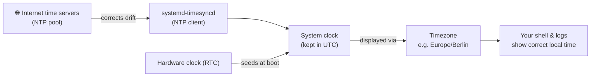

# Chapter 8 — System Identity: Hostname, Time & Locale

> *Part II · Hardening the Base System — Chapter 8 of 18*

This is the quiet chapter that closes out Part II. After the intensity of SSH keys, firewalls, and intrusion prevention, we do something calmer but genuinely important: we give the server a proper **identity** and a correct sense of **time**. These feel cosmetic — a name, a clock, a language setting — but they are load-bearing. A wrong clock silently breaks TLS certificates, scrambles the order of your logs, misfires scheduled jobs, and can even make package signatures (Chapter 4) fail. A meaningless hostname makes every log line and every future multi-server setup harder to reason about. Getting these right now gives every chapter in Part III a clean, trustworthy foundation.

---

## Goal

By the end of this chapter you will:

1. Understand what a **hostname** is, where it lives, and how to set one that helps you (and your logs) stay oriented.
2. Understand why **accurate time** is quietly critical to security, TLS, logging, and automation — and how Linux keeps time via **NTP**.
3. Understand the difference between the **hardware clock**, the **system clock**, **UTC**, and your **timezone**.
4. Configure the hostname, timezone, and time synchronization correctly with the modern `systemd` tools.
5. Understand **locale** (language/encoding) and why a correct **UTF-8** locale prevents a class of annoying bugs.
6. Verify each setting and know how to recover from the common mistakes.

---

## Background

### What is a hostname?

A **hostname** is the human-friendly *name* of the machine — like `web-prod-01` — as opposed to its numeric IP address. It's how the server refers to itself, and it shows up constantly:

- In your **shell prompt** (`deploy@web-prod-01:~$` — the part after `@`, first seen in Chapter 2).
- At the start of nearly every line in **logs** (so when you aggregate logs from many servers, you can tell which machine each line came from).
- In monitoring dashboards, email headers, and anywhere the machine identifies itself.

On a fresh VPS the hostname is usually something auto-generated and meaningless like `ubuntu-2gb-fra1-01`. Giving it a deliberate name is partly cosmetic *now*, but becomes real infrastructure hygiene the moment you run more than one server.

There are actually a few kinds of hostname that `systemd` tracks:

| Kind | What it is | Example |
|---|---|---|
| **Static** | The persistent name, stored in `/etc/hostname`; survives reboots. | `web-prod-01` |
| **Pretty** | An optional free-form label (can have spaces/capitals) for display. | `Web Production 01` |
| **Transient** | A temporary name the kernel/DHCP may set at runtime; overridden by the static one if set. | — |

We care almost entirely about the **static** hostname.

> **FQDN vs short name.** A **hostname** can be short (`web-prod-01`) or a **fully qualified domain name** (FQDN) like `web-prod-01.example.com`, which ties it to a DNS domain. For a single server you don't own a domain for yet, a short name is fine. When you attach a real domain (Chapter 11, for HTTPS), you'll understand how the FQDN fits. Setting the hostname here is *not* the same as pointing a domain at your server — that's DNS, covered later.

### Where the hostname lives, and the `/etc/hosts` companion

Two files matter:

- **`/etc/hostname`** — contains just the static hostname on a single line. This is the source of truth.
- **`/etc/hosts`** — a small local lookup table mapping names to IPs, consulted *before* DNS. It should contain a line resolving your hostname to a loopback (or the server's) address, e.g. `127.0.1.1 web-prod-01`. If your hostname isn't in `/etc/hosts`, some programs pause or warn (`sudo: unable to resolve host ...`) — a common, harmless-but-annoying symptom. We'll keep the two consistent.

### Why accurate time is *critical* (not cosmetic)

This is the heart of the chapter. Many beginners ignore the clock; professionals never do, because a wrong clock breaks things in confusing, hard-to-diagnose ways:

- **TLS/HTTPS certificates (Chapter 11) are time-bound.** A certificate is valid only *between* a start and end date. If your server's clock is wrong — say, set to last year or next year — it may reject valid certificates or consider expired ones fine. Certificate issuance (Let's Encrypt) can fail outright with a skewed clock.
- **Logs become untrustworthy.** Log lines are timestamped. If the clock jumps around, events appear out of order, and correlating "what happened when" during an incident becomes impossible. Across multiple servers, unsynchronized clocks make combined logs meaningless.
- **Scheduled jobs misfire.** Cron jobs and systemd timers (Chapters 7, 10) fire based on the clock. A wrong clock runs backups, renewals, and maintenance at the wrong time — or not at all.
- **Security protocols reject skew.** Many authentication and security mechanisms (Kerberos, TOTP 2FA, some API signatures, even apt's signed metadata validity) refuse to work if the clock differs from reality by too much — this is a deliberate defense against replay attacks.
- **Debugging lies to you.** "This happened at 14:03" is worthless if the clock says 14:03 but reality is 11:47.

### How Linux keeps time: hardware clock, system clock, UTC, timezone, NTP

A few distinct ideas, often conflated:

| Concept | What it is |
|---|---|
| **Hardware clock (RTC)** | A battery-backed clock on the machine's board that keeps time while powered off. On a VPS this is virtualized by the host. |
| **System clock** | The clock the OS actually uses while running, initialized from the RTC at boot and then kept accurate by NTP. |
| **UTC** | **C**oordinated **U**niversal **T**ime — the global reference time, with no timezone/DST offset. **Servers keep their system clock in UTC internally** and merely *display* it in your chosen timezone. This is best practice: UTC never has daylight-saving jumps or regional ambiguity. |
| **Timezone** | An offset + DST rules (e.g. `Europe/Berlin`) used to *present* the UTC time as local time in your shell and logs. |
| **NTP** | **N**etwork **T**ime **P**rotocol — how the machine keeps its clock accurate by syncing with time servers over the internet, correcting the inevitable drift of any clock. |

On modern Ubuntu, NTP synchronization is handled by a built-in service, **`systemd-timesyncd`** (a lightweight NTP client). You usually just need to confirm it's enabled and pointed at time servers — no heavy configuration.



> 💡 **Keep the system clock in UTC; set only the *timezone* for display.** Ubuntu does this by default. You choose a timezone so *you* read friendly local times, while the machine reasons in UTC underneath. Many seasoned admins even leave servers on UTC entirely to make multi-server log correlation trivial — a legitimate choice we'll mention.

### What is a locale?

A **locale** defines the machine's language and cultural conventions: the language of system messages, and crucially the **character encoding** — how text bytes map to characters. The modern universal encoding is **UTF-8**, which can represent essentially every character (accents, emoji, non-Latin scripts).

Why you should care on a server:

- A missing or non-UTF-8 locale causes a recurring class of bugs: `perl: warning: Setting locale failed`, garbled non-ASCII characters in filenames or database output, sorting oddities, and tools that misbehave on international text.
- Databases, programming runtimes, and web apps frequently *assume* a UTF-8 environment. Setting `en_US.UTF-8` (or your language's `.UTF-8` variant) once prevents a lot of downstream confusion.

We'll ensure a sane UTF-8 locale is set.

---

## Why is this necessary?

- **Time correctness underpins security and TLS.** Chapter 11's HTTPS certificates simply won't work reliably with a wrong clock; neither will scheduled renewals, backups, or trustworthy logs. This chapter is a prerequisite for Part III behaving correctly.
- **Identity makes operations legible.** A meaningful hostname turns anonymous log lines into attributable ones and is essential the moment you run more than one machine. It's cheap now and painful to retrofit later.
- **A correct locale prevents silent data bugs.** Encoding mismatches corrupt text and confuse databases. Setting UTF-8 up front avoids a whole category of "why is this character broken?" incidents.
- **It's the clean-foundation step.** Part II hardened the server; this final chapter makes sure its clock, name, and language are trustworthy before we start putting real applications and data on it.

---

## What would happen if we skipped this step?

- **TLS and renewals could fail mysteriously.** A skewed clock breaks certificate validation and Let's Encrypt issuance — with error messages that rarely point at "your clock is wrong."
- **Incident forensics become guesswork.** Out-of-order or wrongly-stamped logs make it impossible to reconstruct what happened when — the worst time to discover a clock problem.
- **Automation drifts.** Backups and renewals fire at unexpected times or get skipped.
- **Persistent low-grade annoyances.** `sudo: unable to resolve host` warnings, `Setting locale failed` spam, garbled characters, and an uninformative prompt/logs — small frictions that compound and signal an unpolished system.

---

## Alternative approaches

### Setting the hostname

| Approach | Pros | Cons | Verdict |
|---|---|---|---|
| **`hostnamectl set-hostname`** | The modern, systemd-native way; updates the running system *and* `/etc/hostname` in one step; no reboot needed. | — | ✅ **Recommended.** |
| **Edit `/etc/hostname` by hand** | Explicit, simple. | Doesn't change the *running* hostname until reboot; must also fix `/etc/hosts` yourself. | ➕ Fine, but `hostnamectl` is cleaner; still keep `/etc/hosts` consistent. |
| **`hostname <name>` command** | Instant. | **Not persistent** — lost on reboot. | ➖ Temporary only. |

### Keeping time in sync

| Approach | Pros | Cons | Verdict |
|---|---|---|---|
| **`systemd-timesyncd`** (built in) | Already present, lightweight, zero-config for a single client, enabled by default on Ubuntu. | Simple SNTP client — not a full NTP server (fine for one machine). | ✅ **Recommended** for a typical server. |
| **`chrony`** | More accurate, handles intermittent networks and larger fleets well; can serve time. | Extra install; more than a single VPS needs. | ➕ Great for fleets/precision; overkill here. |
| **Classic `ntpd`** | Traditional full NTP daemon. | Heavier, largely superseded by chrony/timesyncd. | ➖ Legacy. |
| **No sync** | — | Clock drifts; breaks TLS/logs/jobs. | ❌ Never. |

### Timezone policy

| Choice | Pros | Cons | Verdict |
|---|---|---|---|
| **Set to your local timezone** | Logs/prompts read in familiar local time. | Multi-server log correlation across zones needs mental math; DST transitions. | ✅ Fine for a single server; convenient. |
| **Leave everything in UTC** | Trivial multi-server correlation; no DST surprises; the "pro" default for fleets. | You mentally convert to local time. | ✅ Also excellent — many teams standardize on UTC. |

Either is defensible. We'll show setting a timezone (most beginners want local time) while noting UTC-everywhere as the fleet-scale choice. **The system clock stays UTC internally regardless.**

---

## Commands

> Log in as **`deploy`** (key-based, Chapter 5). Use `sudo` for changes. Everything here is low-risk — none of it can lock you out — but we still verify each step.

### 1 — Inspect the current identity and clock

```bash
hostnamectl
```
- **What it does:** prints the machine's identity at a glance — static hostname, "pretty" name, machine/boot IDs, OS, kernel, and virtualization type.
- **Why we run it:** to see the *before* state (probably an auto-generated hostname) and confirm what we're changing.
- **Expected output:** a block like:
  ```
   Static hostname: ubuntu-2gb-fra1-01
         Icon name: computer-vm
        Machine ID: ...
           Boot ID: ...
    Virtualization: kvm
  Operating System: Ubuntu 24.04.4 LTS
            Kernel: Linux 6.8.0-...
  ```

```bash
timedatectl
```
- **What it does:** shows the time status — current local time, UTC time, the configured **timezone**, and crucially whether **NTP synchronized** is `yes`.
- **Why we run it:** to confirm the clock and check that time sync is active.
- **Expected output:**
  ```
                 Local time: Sat 2026-07-04 15:20:11 UTC
             Universal time: Sat 2026-07-04 15:20:11 UTC
                   RTC time: Sat 2026-07-04 15:20:11
                  Time zone: Etc/UTC (UTC, +0000)
  System clock synchronized: yes
                NTP service: active
  ```
- **Verify:** note the current `Time zone` and that `System clock synchronized: yes` and `NTP service: active`. If sync is `no`, Step 4 fixes it.

### 2 — Set a meaningful hostname

```bash
sudo hostnamectl set-hostname web-prod-01
```
- **What it does:** sets the **static** hostname to `web-prod-01` (choose your own name), updating both the running system and `/etc/hostname` in one step — no reboot required.
- **Why we run it:** a deliberate name makes prompts, logs, and future multi-server work legible.
- **Naming guidance:** use lowercase letters, digits, and hyphens; keep it short and descriptive (e.g. `web-prod-01`, `db-staging-02`). Avoid spaces, underscores, and uppercase in the *static* name (those belong in the optional "pretty" name via `--pretty`).
- **Expected output:** none (silent success).
- **How to verify:**
  ```bash
  hostnamectl              # Static hostname now shows web-prod-01
  ```
  Your prompt updates to the new name after you **open a new shell** (the current session's prompt may still show the old name until you reconnect — harmless).
- **Common mistakes:** spaces/underscores in the name; expecting the current prompt to change instantly (reconnect to see it).
- **Recovery:** just run `set-hostname` again with a corrected name.

### 3 — Keep `/etc/hosts` consistent (prevents "unable to resolve host")

```bash
sudo nano /etc/hosts
```
- **Where it lives & why:** `/etc/hosts` is the local name→IP table consulted before DNS. It must know your new hostname or some tools will complain/pause.
- **Ensure a line maps `127.0.1.1` to your hostname.** A typical file should look like:
  ```
  127.0.0.1   localhost
  127.0.1.1   web-prod-01
  ::1         localhost ip6-localhost ip6-loopback
  ```
  - The `127.0.0.1 localhost` line is standard — leave it. Add or update the **`127.0.1.1 web-prod-01`** line to match your new hostname. (Ubuntu conventionally uses `127.0.1.1` for the machine's own hostname.)
  - **Critical line:** the one with your hostname. **Customizable:** the hostname itself (keep it identical to `/etc/hostname`).
- Save (`Ctrl+O`, Enter), exit (`Ctrl+X`).
- **How to verify:**
  ```bash
  hostname -f
  ```
  Should print your hostname without an "unable to resolve" error. And `sudo whoami` should no longer emit `unable to resolve host` warnings.
- **Common mistake:** forgetting this after changing the hostname → harmless but noisy `sudo: unable to resolve host` warnings on every `sudo`.

### 4 — Ensure time synchronization is on (`systemd-timesyncd`)

If Step 1 already showed `System clock synchronized: yes` and `NTP service: active`, time sync is working — you can skip to Step 5. Otherwise:

```bash
sudo timedatectl set-ntp true
```
- **What it does:** enables automatic network time synchronization via `systemd-timesyncd`.
- **Why we run it:** to guarantee the clock is continuously corrected against internet time servers (the crux of the chapter).
- **Expected output:** none (silent). Give it a few seconds to sync.
- **How to verify:**
  ```bash
  timedatectl
  ```
  should now show `System clock synchronized: yes` and `NTP service: active`. For detail on the actual time source:
  ```bash
  timedatectl timesync-status
  ```
  shows the NTP server it's using, offset, and poll interval.
- **Common mistakes:** the firewall — recall from Chapter 6 we set **outbound allow**, so NTP (UDP 123) can reach out; if you had restricted egress, NTP would fail. A blocked network is the usual reason sync stays `no`.
- **Recovery:** ensure `systemd-timesyncd` is running: `systemctl status systemd-timesyncd`; restart with `sudo systemctl restart systemd-timesyncd`. If you need higher accuracy/fleet features, install `chrony` instead (Alternatives).

### 5 — Set your timezone

First, find the exact timezone name:

```bash
timedatectl list-timezones | grep -i berlin
```
- **What it does:** lists all valid timezone identifiers and filters for a city (replace `berlin` with yours, e.g. `dhaka`, `new_york`, `kolkata`). Timezones use `Region/City` form. Press `q` if a full list opens in a pager.

Then set it:

```bash
sudo timedatectl set-timezone Europe/Berlin
```
- **What it does:** sets the system's *display* timezone (the underlying clock stays UTC). Use the exact identifier you found (e.g. `Asia/Dhaka`).
- **Why we run it:** so your shell and logs show times in a zone you reason about easily.
- **Expected output:** none (silent).
- **How to verify:**
  ```bash
  timedatectl        # 'Time zone' now shows your choice; Local time reflects the offset
  date               # prints current date/time in the new local zone
  ```
- **Prefer UTC everywhere?** Set `sudo timedatectl set-timezone Etc/UTC` (fleet-friendly). Either is fine.
- **Common mistake:** guessing the identifier — always confirm with `list-timezones` (it's case-sensitive and uses underscores, e.g. `America/New_York`).

### 6 — Ensure a correct UTF-8 locale

Check what's set:

```bash
locale
```
- **What it does:** prints the current locale variables (`LANG`, `LC_*`). **Expected (good):** values like `en_US.UTF-8`. **Warning sign:** empty values, `C`, `POSIX`, or messages like `Cannot set LC_ALL to default locale`.

If a UTF-8 locale isn't set, generate and set one (using `en_US.UTF-8` as the common default — substitute your language if preferred):

```bash
sudo locale-gen en_US.UTF-8
```
- **What it does:** generates the `en_US.UTF-8` locale data if it isn't already present.
- **Expected output:** `Generating locales...` / `done`.

```bash
sudo update-locale LANG=en_US.UTF-8
```
- **What it does:** sets the system-wide default `LANG` to `en_US.UTF-8`, writing it to `/etc/default/locale` so it persists.
- **Why we run it:** guarantees programs run in a UTF-8 environment, preventing the encoding bugs from the Background.
- **Expected output:** none (silent).
- **How to verify:** **log out and back in** (locale is read at login), then run `locale` again — `LANG` should be `en_US.UTF-8` with no warnings.
- **Common mistakes:** expecting the change in the *current* session (it applies to new logins); forgetting `locale-gen` before `update-locale` (setting a locale that was never generated reproduces the warnings).
- **Recovery:** re-run `locale-gen` for the locale, then `update-locale`, then re-login.

### 7 — Final confirmation

```bash
hostnamectl && echo "---" && timedatectl && echo "---" && locale | head -1
```
- **What it does:** prints identity, time status, and the primary locale together for a clean final check.
- **Verify:** correct hostname, `synchronized: yes`, your chosen timezone, and a `.UTF-8` `LANG`.

---

## Verification Checklist

You've completed this chapter — and Part II — when **all** of the following are true:

- [ ] `hostnamectl` shows your chosen **static hostname**, and a new SSH session's prompt reflects it.
- [ ] `/etc/hosts` contains a `127.0.1.1 <hostname>` line matching `/etc/hostname`; `sudo` no longer warns "unable to resolve host".
- [ ] `timedatectl` shows **`System clock synchronized: yes`** and **`NTP service: active`**.
- [ ] The **timezone** is set to your intended value (local zone or `Etc/UTC`), and `date` prints the expected local time.
- [ ] `locale` shows a **`.UTF-8`** `LANG` with no locale warnings (after re-login).
- [ ] You can explain *why* a correct clock matters for TLS, logs, and scheduled jobs.

---

## Troubleshooting

| Symptom | Why it happens | How to fix |
|---|---|---|
| `sudo: unable to resolve host <name>` on every `sudo` | Hostname changed but `/etc/hosts` still has the old name (or lacks the `127.0.1.1` line). | Edit `/etc/hosts` so `127.0.1.1 <newhostname>` matches `/etc/hostname` (Step 3). |
| Prompt still shows the old hostname | The current shell captured the old name at login. | Open a **new** SSH session; the prompt updates. No reboot needed. |
| `timedatectl` shows `System clock synchronized: no` | `systemd-timesyncd` isn't running, or outbound NTP (UDP 123) is blocked. | `sudo timedatectl set-ntp true`; `systemctl status systemd-timesyncd`; ensure the firewall allows outbound (Chapter 6 default) and the provider isn't blocking NTP. |
| Clock is wildly wrong even with sync "yes" | Rare RTC/host virtualization issue, or sync just started. | Wait a minute; `timedatectl timesync-status` to see the offset closing; restart `systemd-timesyncd`. As a manual nudge (not a substitute for NTP): `sudo timedatectl set-time "2026-07-04 15:00:00"`. |
| `set-timezone` → `Failed to set time zone: Invalid or unknown` | Wrong/mis-cased identifier. | Find the exact string with `timedatectl list-timezones \| grep -i <city>`; identifiers are case-sensitive and use `_` (e.g. `America/New_York`). |
| `perl: warning: Setting locale failed` / garbled characters | No UTF-8 locale generated/set, or `LC_*` variables forwarded from your laptop that the server lacks. | `sudo locale-gen en_US.UTF-8 && sudo update-locale LANG=en_US.UTF-8`, then re-login. If your SSH client forwards `LC_*`, either generate those locales too or stop forwarding them (`SendEnv` in your local SSH config). |
| Changed locale but `locale` still shows old values | Locale is applied at **login**, not to the running shell. | Log out and back in, then re-check. |
| TLS/cert or apt-signature errors later | Often a downstream symptom of a wrong clock. | Confirm `timedatectl` sync is `yes` **before** troubleshooting certs (Chapter 11) or apt (Chapter 4). |

---

## Best Practices

- **Name servers deliberately and consistently.** Adopt a scheme (`role-env-nn`, e.g. `web-prod-01`) from your very first machine. Future-you managing ten servers will thank present-you.
- **Keep `/etc/hostname` and `/etc/hosts` in sync.** Whenever the hostname changes, update both — it eliminates the `unable to resolve host` noise.
- **Always run NTP.** A synchronized clock is non-negotiable for TLS, logging, and automation. Verify `synchronized: yes`; don't assume.
- **Keep the system clock in UTC; set only the display timezone.** For fleets, consider standardizing every server on UTC to make cross-server log correlation trivial. Ubuntu already stores UTC internally.
- **Set a UTF-8 locale up front.** `en_US.UTF-8` (or your language's UTF-8 variant) prevents a whole class of encoding bugs in databases and apps before they ever appear.
- **Prefer the systemd tools** (`hostnamectl`, `timedatectl`) over hand-editing where possible — they update running state and files together and are less error-prone.
- **Verify, don't assume.** Each setting has a one-line check (`hostnamectl`, `timedatectl`, `locale`). Run them; a five-second confirmation prevents hours of confused debugging later.

---

## Summary

### What you learned

- What a **hostname** is, the **static/pretty/transient** distinction, where it lives (**`/etc/hostname`**), the role of **`/etc/hosts`** in avoiding "unable to resolve host," and how to set it cleanly with **`hostnamectl set-hostname`** (short name vs FQDN).
- Why **accurate time is critical, not cosmetic** — it underpins **TLS certificates (Ch. 11)**, trustworthy **logs**, **scheduled jobs (Ch. 7/10)**, security protocols, and even apt signatures — and the concepts of **hardware clock, system clock, UTC, timezone, and NTP**.
- How Ubuntu keeps time with **`systemd-timesyncd`**, how to confirm and enable sync with **`timedatectl` / `set-ntp true`**, and how to set the **timezone** (while the clock stays UTC underneath) — with UTC-everywhere as the fleet-scale option.
- What a **locale** is, why a **UTF-8** locale matters, and how to generate and set one with **`locale-gen`** + **`update-locale`**.
- The one-line **verification** commands for each setting and the common **recovery** paths (hosts mismatch, blocked NTP, wrong timezone string, locale-at-login).

### What you'll build next

**Part III begins — Chapter 9: Web Servers & Reverse Proxies.** Your server is now hardened, self-maintaining, correctly named, and keeping accurate time — a genuinely production-grade *base*. Now we make it actually *serve the web*. You'll learn what a **web server** and a **reverse proxy** are, why nearly every modern deployment puts one (like **Nginx**) in front of your application, how requests flow from a browser through the proxy to your app, and you'll install and configure that front door — then open ports 80/443 in the firewall you built in Chapter 6. This is where the server starts doing its real job.

> ✅ **Ready to continue?** Confirm and we'll begin Part III with Chapter 9. If the hostname, NTP sync, timezone, or locale didn't take as described, tell me exactly what you ran and the output of `hostnamectl`, `timedatectl`, and `locale`, and we'll square it away before we start serving traffic.
