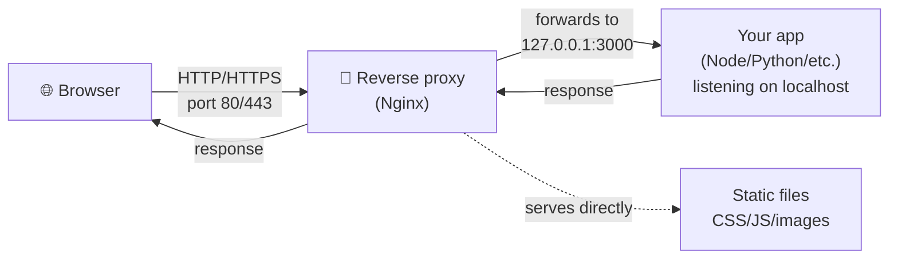

# Chapter 9 — Web Servers & Reverse Proxies

> *Part III · Running Web Applications — Chapter 9 of 18*

Welcome to Part III. Everything so far has been about making the server *safe and sound* — you can reach it, operate it, and it defends and maintains itself. Now we make it do its actual job: **serve web traffic**. This chapter introduces the piece of software that sits at the very front of almost every production web deployment — the **web server / reverse proxy**. You'll learn what those terms mean, why you almost never expose your application directly to the internet, how a request travels from a browser all the way to your code and back, and you'll install and configure that front door (Nginx) — then finally open ports 80 and 443 in the firewall you built in Chapter 6. By the end, typing your server's IP into a browser will return a page *you* control.

---

## Goal

By the end of this chapter you will:

1. Understand what **HTTP** is and how a web request/response actually works.
2. Understand what a **web server** is, and the distinction between serving **static** files and running **dynamic** applications.
3. Understand what a **reverse proxy** is, and *why* production almost always puts one in front of the app.
4. Compare the real options (Nginx, Apache, Caddy, app-embedded servers) and know why we choose **Nginx**.
5. Install, manage, and inspect Nginx as a system service.
6. Understand Nginx's configuration layout (`sites-available`/`sites-enabled`, `server` blocks) and create your first site.
7. Configure Nginx as a **reverse proxy** to a backend application, and open the web ports in the firewall — safely.

---

## Background

### What is HTTP? What is a request and a response?

The web runs on **HTTP** (**H**yper**T**ext **T**ransfer **P**rotocol) — the agreed-upon rules by which a browser (client) asks a server for something and the server answers. When you visit a site, your browser sends an **HTTP request**; the server sends back an **HTTP response**.

A request is just structured text: a **method** (what you want to do), a **path** (what resource), some **headers** (metadata), and optionally a **body**:

```
GET /about.html HTTP/1.1        ← method + path + protocol version
Host: example.com               ← which site (one server can host many)
User-Agent: Mozilla/5.0 ...     ← who's asking
Accept: text/html               ← what formats are acceptable
```

Common methods: **GET** (fetch something), **POST** (submit data), **PUT**/**PATCH** (update), **DELETE** (remove). The response carries a **status code** telling you what happened:

| Code range | Meaning | Examples |
|---|---|---|
| **2xx** | Success | `200 OK` |
| **3xx** | Redirect | `301 Moved Permanently`, `302 Found` |
| **4xx** | *Client* error (your request was wrong) | `404 Not Found`, `403 Forbidden` |
| **5xx** | *Server* error (the server broke) | `500 Internal Server Error`, `502 Bad Gateway` |

You'll be reading these codes constantly when debugging. `HTTP` uses **port 80**; its encrypted form **HTTPS** uses **port 443** (Chapter 11).

### What is a web server?

A **web server** is a program that speaks HTTP: it listens on a port (80/443), receives requests, and returns responses. Web servers do two broad kinds of work:

- **Serving static content** — files that don't change per request: HTML, CSS, JavaScript, images. The server just reads the file off disk and sends it. Web servers are *extremely* good and fast at this.
- **Handling dynamic content** — responses generated *per request* by running application code (a Node.js/Python/PHP/Ruby app that queries a database, renders a page, etc.). The web server itself usually doesn't run your app logic; instead it **hands the request to your application** and relays the app's answer back. That hand-off is where the *reverse proxy* idea comes in.

### What is a reverse proxy, and why is it everywhere?

A **proxy** is a middleman for network traffic. Two flavors, often confused:

- A **forward proxy** sits in front of *clients*, making requests on their behalf (e.g. a corporate web filter). It represents the *client*.
- A **reverse proxy** sits in front of *servers*, receiving requests from the internet and forwarding them to one or more backend applications. It represents the *server*. **This is the one we care about.**



Your application runs privately (bound to `127.0.0.1`, *not* exposed to the internet — recall Chapter 6). The reverse proxy is the only thing facing the world. Why arrange it this way? A reverse proxy gives you, in one place:

| Benefit | What it means |
|---|---|
| **TLS termination** | The proxy handles HTTPS/certificates (Chapter 11) so your app doesn't have to. One place to manage encryption. |
| **A stable public front door** | The proxy is always on ports 80/443; your app can restart, move ports, or be replaced behind it without the public noticing. |
| **Security isolation** | Your app never faces the raw internet. The proxy filters, limits, and shields it — a battle-tested C program absorbs hostile traffic instead of your app process. |
| **Serving static files fast** | The proxy serves CSS/JS/images directly and efficiently, freeing your app to do only dynamic work. |
| **Routing & multiple apps** | One server can host many sites/apps; the proxy routes each request to the right backend by domain or path. |
| **Load balancing** | Later, spread traffic across several app instances for scale and redundancy. |
| **Buffering & resilience** | Absorbs slow clients, compresses responses, adds caching, returns friendly errors when the app is down. |

> 🧠 **The core mental model:** *the internet talks to the proxy; the proxy talks to your app.* Your application stays private and simple; the proxy handles everything hostile and public. This single pattern underlies the vast majority of modern web deployments.

### Why not just expose the application directly?

Many app frameworks *can* listen on a public port themselves (`node server.js` on `:3000`). For local development that's fine. In production it's a bad idea: app-embedded servers are usually not hardened against hostile internet traffic, don't handle TLS well, tie your public entry point to one process/port, and force each app to reinvent proxy features. The proxy-in-front pattern fixes all of this and is the professional default.

### Where Nginx fits, and what we'll build in stages

We'll install **Nginx** (pronounced "engine-x"), a fast, lightweight, hugely popular web server and reverse proxy. We'll build up in two stages so each concept is concrete:

1. **Stage 1 — static site:** get Nginx serving a simple HTML page you control (proves the front door works and teaches the config layout).
2. **Stage 2 — reverse proxy:** point Nginx at a backend app (we'll simulate one) so you see the proxy pattern working end to end.

Running an *actual* application as a managed background service is the very next chapter (Chapter 10) — here we focus on the front door itself.

---

## Why is this necessary?

- **It's how the server becomes useful.** Hardening protected an empty box. The web server is what turns it into something that answers browsers — the entire point of hosting web apps.
- **The reverse proxy is the production-standard architecture.** Nearly every real deployment has one. Learning it now means every later chapter — TLS, running apps as services, deployments, multiple sites — slots into a pattern you understand.
- **It's the right place for cross-cutting concerns.** TLS (Ch. 11), routing, compression, rate limiting, and static-file serving all belong at the proxy. Building it first gives those chapters a home.
- **It enforces the privacy boundary from Chapter 6.** The proxy is *the* deliberately-exposed service; your apps and databases stay bound to localhost behind it. This is defense in depth applied to your application tier.

---

## What would happen if we skipped this step?

- **Nothing would answer the web.** Your IP in a browser would just time out — the server listens for SSH and nothing else.
- **You'd be tempted to expose apps directly**, inheriting all the problems above: fragile public entry points, awkward TLS, an unhardened app process facing the internet, and no clean way to host more than one thing.
- **TLS would have no home.** HTTPS (Chapter 11) is dramatically simpler when a proxy terminates it. Without a proxy you'd bolt certificates onto every app individually.
- **Static assets would burden your app.** Every CSS/image request would hit your application code instead of being served instantly by an optimized web server.

---

## Alternative approaches

### Which web server / reverse proxy

| Option | Pros | Cons | Verdict |
|---|---|---|---|
| **Nginx** | Fast, low memory, superb reverse proxy & static serving, enormous community & docs, the de-facto standard; config is explicit and teachable. | Config syntax must be learned; TLS is manual (Certbot automates it — Ch. 11). | ✅ **Recommended.** The industry default for this role. |
| **Apache (httpd)** | Venerable, `.htaccess` per-directory config, huge module ecosystem. | Heavier default (process/thread model); reverse-proxy story less central than Nginx's. | ➕ Fine, especially for legacy/PHP shops; Nginx is the more common modern proxy. |
| **Caddy** | Automatic HTTPS out of the box; very simple config. | Smaller ecosystem; less ubiquitous in existing infra/tutorials; you learn less of the underlying mechanics. | ➕ Great for simplicity; we choose Nginx to teach the general pattern that transfers everywhere. |
| **Traefik** | Container/dynamic-service native; auto-discovers backends. | Shines mainly with orchestrators (Docker/K8s); overkill for a single VPS now. | ➕ Excellent later (Chapter 13 territory). |
| **Expose the app directly (no proxy)** | Simplest to start. | Fragile, insecure, poor TLS, no routing/static/scaling. | ❌ Not for production. |

**Why Nginx:** it's the most widely deployed reverse proxy, its explicit configuration *teaches* you how proxying works (knowledge that transfers to any tool), it's light enough for a small VPS, and every later chapter's ecosystem (Certbot, tutorials, examples) assumes it. Learn the standard; adopt conveniences later if you wish.

### How to install Nginx

| Method | Pros | Cons | Verdict |
|---|---|---|---|
| **Ubuntu repo (`apt install nginx`)** | Signed, integrated, auto-updated (Ch. 4/7), sets up the service & config layout for you. | Slightly older version than nginx.org. | ✅ **Recommended.** |
| **Official nginx.org repo** | Newest version. | Extra repo/key setup; rarely needed for a standard site. | ➕ Only if you need a bleeding-edge feature. |
| **Build from source / container** | Full control. | Manual updates; more moving parts. | ➖ Unnecessary here (containers covered in Ch. 13). |

---

## Commands

> Log in as **`deploy`** (key-based, Chapter 5). Use `sudo` for installs and config. Recall from Chapter 6 that the firewall currently allows **only SSH** — so until we open ports 80/443 near the end, Nginx will be running but not reachable from your laptop. That's intentional and safe; we open the ports deliberately, last.

### 1 — Install Nginx

```bash
sudo apt update && sudo apt install nginx
```
- **What it does:** refreshes the catalog (Chapter 4) and installs Nginx, which **starts and enables itself** on install (it'll run now and on every boot).
- **Expected output:** apt's install plan, then setup lines.
- **How to verify it's running:**
  ```bash
  systemctl status nginx
  ```
  Look for **`active (running)`**. Press `q` to exit.
- **Prove it's serving locally** (even though the firewall blocks external access):
  ```bash
  curl -I http://localhost
  ```
  - `curl` is a command-line HTTP client; `-I` fetches just the **headers**. **Expected:** `HTTP/1.1 200 OK` and a `Server: nginx` header. This proves Nginx answers on port 80 *on the server itself*. (External access comes after we open the firewall.)
- **Common mistakes:** port 80 already in use by something else (`apache2`?) → `systemctl status nginx` shows a bind error; stop/remove the conflicting service.

### 2 — Learn how to manage the Nginx service

These are the service-management verbs you'll use for Nginx (and every service in Chapter 10). `systemctl` is the control tool for **systemd**, Ubuntu's service manager.

```bash
systemctl status nginx      # is it running? recent logs
sudo systemctl restart nginx  # stop then start (full restart)
sudo systemctl reload nginx   # re-read config WITHOUT dropping connections (preferred for config changes)
sudo systemctl stop nginx     # stop it
sudo systemctl start nginx    # start it
sudo systemctl enable nginx   # start automatically at boot (already set by install)
sudo systemctl disable nginx  # don't start at boot
```
- **Key distinction — `reload` vs `restart`:** after editing config, prefer **`reload`** — Nginx re-reads config gracefully without dropping live requests. Use `restart` only when `reload` isn't enough. (Same gentleness principle as `reload ssh` in Chapter 5.)
- **Inspect logs:**
  ```bash
  sudo tail -f /var/log/nginx/access.log     # every request (Ctrl+C to stop)
  sudo tail -f /var/log/nginx/error.log      # problems — check here first when something breaks
  ```
  - **`error.log` is your first stop** for any Nginx problem (Chapter 2's `tail -f`). The access log records each request with its status code.

### 3 — Understand the configuration layout

Nginx's config lives under **`/etc/nginx/`** (recall `/etc` = config, Chapter 2). The important pieces:

| Path | Role |
|---|---|
| `/etc/nginx/nginx.conf` | The **main** config; sets global settings and *includes* the others. Rarely edited directly. |
| `/etc/nginx/sites-available/` | Config files for **each site** you *could* serve (a library of definitions). |
| `/etc/nginx/sites-enabled/` | **Symlinks** to the site files in `sites-available` that are *actually active*. Nginx only serves what's linked here. |
| `/etc/nginx/sites-available/default` | The default site created on install (the "Welcome to nginx" page). |
| `/var/www/html/` | The default **web root** — where the files being served live. |

> 🔗 **The `sites-available` / `sites-enabled` pattern.** You write a site's config in `sites-available/`, then "turn it on" by creating a **symlink** (a pointer, like a shortcut) to it in `sites-enabled/`. This lets you keep many site definitions on hand and enable/disable each without deleting its config. It mirrors the "definition vs activation" idea and is a widely used convention.

The unit that defines a site is a **`server` block** (Nginx's term for a virtual host). Its key directives:

| Directive | Meaning |
|---|---|
| `listen` | Which port to listen on (e.g. `80`). |
| `server_name` | Which domain(s)/hostnames this block answers for (e.g. `example.com`; `_` = any). |
| `root` | The directory on disk to serve files from. |
| `location` | Rules for handling requests matching a path (e.g. `/`, `/api`). |

### 4 — Stage 1: create your own static site

Let's serve a page *you* control, so you understand the whole flow before adding a proxy.

Create a web root and a page:

```bash
sudo mkdir -p /var/www/myserver/html
```
- **What it does:** creates a directory for your site's files (`-p` makes parent dirs as needed). Keeping each site under its own `/var/www/<site>` folder is tidy convention.

```bash
sudo nano /var/www/myserver/html/index.html
```
Enter simple content:
```html
<!doctype html>
<html>
  <head><title>My Server</title></head>
  <body>
    <h1>Hello from web-prod-01 🎉</h1>
    <p>This page is served by Nginx, configured by me.</p>
  </body>
</html>
```
Save (`Ctrl+O`, Enter), exit (`Ctrl+X`).

Now create a site config:

```bash
sudo nano /etc/nginx/sites-available/myserver
```
Enter:
```nginx
server {
    listen 80;
    listen [::]:80;                 # also listen on IPv6
    server_name _;                  # match any hostname (we have no domain yet)

    root /var/www/myserver/html;    # serve files from here
    index index.html;               # default file for a directory request

    location / {
        try_files $uri $uri/ =404;  # serve the file if it exists, else 404
    }
}
```
- **Line-by-line:**
  - `listen 80;` / `listen [::]:80;` — accept HTTP on port 80 over IPv4 and IPv6.
  - `server_name _;` — the underscore is Nginx's "catch-all"; since you don't have a domain yet, this block answers requests to the server's IP. (You'll set a real `server_name` in Chapter 11.)
  - `root ...;` — the **critical** line: the folder whose files are served.
  - `index index.html;` — which file to serve when a directory (like `/`) is requested.
  - `try_files $uri $uri/ =404;` — try the requested file, then it as a directory, else return `404`. A safe, standard default.
- **Critical lines:** `root` and `listen`. **Customizable:** `server_name` (later a real domain), `root` path.

Enable the site by symlinking it into `sites-enabled`:

```bash
sudo ln -s /etc/nginx/sites-available/myserver /etc/nginx/sites-enabled/
```
- **What it does:** `ln -s` creates a **s**ymbolic link — the activation step. Nginx now sees your site.

Disable the default site so it doesn't conflict (both listen on port 80 as catch-all):

```bash
sudo rm /etc/nginx/sites-enabled/default
```
- **What it does:** removes the *symlink* (not the underlying file in `sites-available`, so you can re-enable it later). This prevents the "which catch-all wins?" ambiguity.

**Always test the config before applying:**

```bash
sudo nginx -t
```
- **What it does:** validates all Nginx config syntax — the direct analog of `sshd -t` (Chapter 5). **Expected:** `syntax is ok` and `test is successful`. **Never reload on an untested config.**
- **Recovery:** if it reports an error with a file and line number, fix that line and re-test until it passes.

Apply:

```bash
sudo systemctl reload nginx
```
- **What it does:** gracefully re-reads config. Verify locally:
  ```bash
  curl -s http://localhost | head
  ```
  should now show **your** HTML (the "Hello from web-prod-01" heading), not the default nginx page.

### 5 — Open the firewall for web traffic (ports 80 & 443)

Now, deliberately, we let the world reach Nginx. Recall Chapter 6: default-deny inbound, and Nginx registered a `ufw` app profile on install.

```bash
sudo ufw allow 'Nginx Full'
```
- **What it does:** opens **both** port 80 (HTTP) and 443 (HTTPS) using Nginx's app profile. (`'Nginx HTTP'` = 80 only; `'Nginx Full'` = 80+443. We open both now so Chapter 11's HTTPS just works.)
- **Why now, and last:** we hardened first, exposed deliberately second — the Chapter 6 principle. Opening 443 too avoids a second firewall change next chapter.
- **Expected output:** `Rule added` / `Rule added (v6)`.
- **How to verify the rule:**
  ```bash
  sudo ufw status
  ```
  should list `Nginx Full  ALLOW  Anywhere` alongside your SSH rule.

**Now the real test — from your laptop's browser or terminal:**
```
http://SERVER_IP
```
- **Expected:** your "Hello from web-prod-01" page loads. 🎉 The front door is open to the world.
- **From your laptop terminal** you can also run `curl -I http://SERVER_IP` and expect `200 OK`.
- **If it doesn't load:** check the **cloud/provider firewall** (Chapter 6) also allows 80/443; confirm `ufw status` shows the rule; confirm `systemctl status nginx` is running; check `sudo tail /var/log/nginx/error.log`.

### 6 — Stage 2: configure Nginx as a reverse proxy

Now the main event: make Nginx forward requests to a backend **application**. We don't have a real app yet (Chapter 10), so we'll stand up a tiny throwaway backend just to *prove the proxy path*, then point Nginx at it.

Start a trivial backend listening on **localhost:3000** (Python is preinstalled on Ubuntu):

```bash
python3 -m http.server 3000 --bind 127.0.0.1
```
- **What it does:** runs a minimal HTTP server on port 3000, bound to `127.0.0.1` — **localhost only**, *not* reachable from the internet (exactly how real apps should bind — Chapter 6). It serves the current directory's file listing. Leave this running; open a **second SSH session** for the next steps (or background it — but a second session is clearer).
- **This stands in for your real application**, which in Chapter 10 will be a Node/Python/etc. process on a localhost port.

In your other session, create a proxy site config:

```bash
sudo nano /etc/nginx/sites-available/myapp
```
Enter:
```nginx
server {
    listen 80;
    listen [::]:80;
    server_name _;

    location / {
        proxy_pass http://127.0.0.1:3000;          # forward to the backend app
        proxy_set_header Host $host;               # pass the original Host header
        proxy_set_header X-Real-IP $remote_addr;   # tell the app the real client IP
        proxy_set_header X-Forwarded-For $proxy_add_x_forwarded_for;
        proxy_set_header X-Forwarded-Proto $scheme;# http or https
    }
}
```
- **The key directive — `proxy_pass`:** this is what makes Nginx a reverse proxy. Instead of serving a file, it **forwards** the request to `http://127.0.0.1:3000` (your app) and relays the app's response back to the browser.
- **The `proxy_set_header` lines — why they matter:** when Nginx forwards a request, the backend would otherwise only see Nginx (`127.0.0.1`) as the client. These headers pass along the *original* client's info: `Host` (which domain they asked for), `X-Real-IP`/`X-Forwarded-For` (the visitor's real IP), and `X-Forwarded-Proto` (whether the original request was HTTP or HTTPS). Well-behaved apps read these to log real IPs and build correct URLs. **This header block is standard boilerplate for any Nginx reverse proxy** — you'll reuse it constantly.

Swap the enabled site from the static one to the proxy one (only one catch-all `:80` block can win):

```bash
sudo rm /etc/nginx/sites-enabled/myserver
sudo ln -s /etc/nginx/sites-available/myapp /etc/nginx/sites-enabled/
sudo nginx -t && sudo systemctl reload nginx
```
- **What it does:** disables the static site, enables the proxy site, tests, and reloads — chained with `&&` so reload only happens if the test passes.
- **How to verify the proxy works:**
  ```bash
  curl -s http://localhost | head
  ```
  You should now see the **Python server's directory listing** (coming *through* Nginx from port 3000) instead of your static HTML — proving the request went browser → Nginx :80 → app :3000 → back. From your laptop, `http://SERVER_IP` shows the same. 🎉
- **When done experimenting:** stop the Python backend with **`Ctrl+C`** in its session. (After stopping it, requests will return **`502 Bad Gateway`** — which is itself the *correct, informative* proxy behavior meaning "the backend isn't answering." You'll see 502s for real whenever an app is down; now you know exactly what they mean.)

> 🧭 **What you just proved:** the reverse-proxy pattern end to end. In Chapter 10 you'll replace the throwaway `python3 -m http.server` with a *real* application managed as a proper background service, and this exact Nginx config will front it. The proxy config barely changes — that's the power of the pattern.

---

## Verification Checklist

You've completed this chapter when **all** of the following are true:

- [ ] `systemctl status nginx` shows **`active (running)`**, and `curl -I http://localhost` returns `200 OK` with a `Server: nginx` header.
- [ ] You can explain HTTP requests/responses and read status codes (200, 404, 502, etc.).
- [ ] You can articulate what a **reverse proxy** is and at least three reasons production uses one.
- [ ] You created a static site under `/var/www/`, enabled it via a `sites-enabled` **symlink**, disabled `default`, passed **`nginx -t`**, and saw your own page via `curl`.
- [ ] You opened the firewall with `sudo ufw allow 'Nginx Full'` and loaded your page from your **laptop's browser** at `http://SERVER_IP`.
- [ ] You configured a **`proxy_pass`** site with the standard `proxy_set_header` block and saw a backend on `127.0.0.1:3000` served *through* Nginx.
- [ ] You understand that a **`502 Bad Gateway`** means the backend isn't reachable.
- [ ] You know `reload` (graceful) vs `restart`, and where the access/error logs live.

---

## Troubleshooting

| Symptom | Why it happens | How to fix |
|---|---|---|
| `nginx -t` → `[emerg] ... duplicate default server` or config error | Two enabled server blocks both claim the catch-all on port 80, or a syntax typo. | Ensure only one catch-all `:80` site is enabled (disable `default` or the other); fix the reported line; re-test. |
| Page doesn't load from my laptop, but `curl localhost` works on the server | Firewall(s) blocking 80/443. | `sudo ufw allow 'Nginx Full'`; also check the **provider/cloud firewall** (Chapter 6) allows 80/443. |
| `systemctl status nginx` shows `failed` with "Address already in use" | Something else (often `apache2`) already holds port 80. | `sudo ss -tulpn | grep :80` to find it; stop/remove the conflicting service (`sudo systemctl stop apache2 && sudo apt purge apache2`). |
| `502 Bad Gateway` | Nginx is up but the **backend app isn't reachable** at the `proxy_pass` address (not running, wrong port, or bound to the wrong interface). | Confirm the app is running and listening on the exact `127.0.0.1:PORT` in `proxy_pass` (`sudo ss -tulpn`); check `error.log`. In our demo, restart `python3 -m http.server 3000 --bind 127.0.0.1`. |
| `403 Forbidden` on a static site | Nginx can't read the files (permissions) or no `index` file exists. | Ensure the web root and files are readable (e.g. `sudo chown -R www-data:www-data /var/www/myserver` or world-readable dirs `755`/files `644` — Chapter 3); confirm `index.html` exists. |
| `404 Not Found` for a file I created | Wrong `root` path, or file in the wrong directory. | Check `root` in the server block matches where the file actually is; `ls` the path. |
| Edited config but nothing changed | Forgot to reload, or edited a file in `sites-available` that isn't symlinked into `sites-enabled`. | `ls -l /etc/nginx/sites-enabled/` to confirm the symlink; `sudo nginx -t && sudo systemctl reload nginx`. |
| Changes to `nginx.conf`/site don't survive as expected | Edited the enabled symlink target correctly but didn't reload, or two blocks conflict. | Always `nginx -t` then `reload`; keep one authoritative catch-all. |

> **First stop for any Nginx problem:** `sudo tail -n 50 /var/log/nginx/error.log`. It almost always names the exact issue (bad path, permission denied, upstream refused). Reading it turns guessing into knowing.

---

## Best Practices

- **Never expose your app directly; always put a reverse proxy in front.** Apps bind to `127.0.0.1`; Nginx is the single internet-facing service. This is the production standard and enforces Chapter 6's privacy boundary.
- **Always `nginx -t` before `reload`.** Validate config every time; a broken config can take your site down. `reload` (graceful) over `restart` for config changes.
- **Use the `sites-available` + `sites-enabled` symlink pattern.** Keep definitions in `available`, activate with a symlink in `enabled`. Disable by removing the *symlink*, not the file.
- **One catch-all per port.** Until you use real domains (Chapter 11), only enable one `server_name _` block per port to avoid ambiguity.
- **Keep the standard `proxy_set_header` block.** Passing `Host`, `X-Real-IP`, `X-Forwarded-For`, and `X-Forwarded-Proto` is what lets your app see real client info and build correct URLs. Reuse it for every proxied site.
- **Read the error log first.** `/var/log/nginx/error.log` answers most "why is it broken?" questions immediately.
- **Open only 80 and 443 for web.** Nothing else needs to be public. Keep the firewall minimal (Chapter 6).
- **Know your status codes.** `2xx` good, `4xx` your request/client, `5xx` the server — and `502` specifically means "proxy couldn't reach the backend." This vocabulary makes debugging fast.

---

## Summary

### What you learned

- **HTTP** basics: requests (method + path + headers), responses, and **status codes** (2xx/3xx/4xx/5xx), plus HTTP on **port 80** and HTTPS on **443**.
- What a **web server** does — serving **static** files vs handing off **dynamic** requests to an application — and the crucial concept of the **reverse proxy**: the internet talks to the proxy; the proxy talks to your private app, giving you TLS termination, a stable front door, security isolation, fast static serving, routing, load balancing, and resilience.
- **Why you never expose the app directly**, and why **Nginx** is the standard choice (with an honest comparison to Apache, Caddy, and Traefik).
- How to **install and manage Nginx** as a systemd service (`status`/`reload`/`restart`/`enable`), and where its **logs** live (`access.log`, and `error.log` as your first debugging stop).
- Nginx's **config layout** — `nginx.conf`, the **`sites-available`/`sites-enabled` symlink pattern**, the web root under `/var/www`, and the anatomy of a **`server` block** (`listen`, `server_name`, `root`, `location`, `try_files`).
- Building a **static site** end to end, validating with **`nginx -t`**, then **opening ports 80/443** in the firewall (deliberately, last) and loading the page from your browser.
- Configuring Nginx as a **reverse proxy** with **`proxy_pass`** and the standard **`proxy_set_header`** block, proving the browser → proxy → app → back path — and learning that **`502 Bad Gateway`** means the backend is down.

### What you'll build next

**Chapter 10 — Running Your Application as a Service.** Right now, if you closed that terminal, your throwaway backend would die — and nothing would restart it. Real applications need to run **continuously**, survive reboots, restart on crash, and be manageable and log-able like any other system service. In Chapter 10 you'll learn **systemd** properly (the service manager you've been using via `systemctl`), write a **service unit file** for a real application, and manage its lifecycle — so the app behind your Nginx proxy is a first-class, always-on, self-healing citizen of the system. Then the front door (this chapter) and the always-running app (next) finally connect into a complete, resilient web service.

> ✅ **Ready to continue?** Confirm and we'll proceed to Chapter 10. If Nginx didn't serve your page, the firewall didn't open, or the proxy returned an unexpected code, tell me exactly what you ran and the output of `sudo nginx -t`, `sudo ufw status`, and `sudo tail /var/log/nginx/error.log`, and we'll fix it before we turn your app into a real service.
