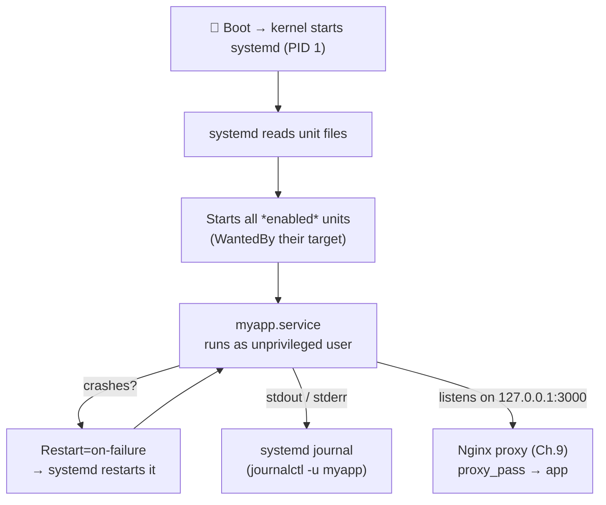

# Chapter 10 — Running Your Application as a Service

> *Part III · Running Web Applications — Chapter 10 of 18*

In Chapter 9 you built the front door — Nginx — and proved the reverse-proxy pattern with a throwaway backend started by hand. But that backend had a fatal flaw: the moment you pressed `Ctrl+C` or closed the terminal, it died. A production application cannot depend on you keeping a terminal open. It must run **continuously**, **survive reboots**, **restart itself if it crashes**, run as an **unprivileged user**, and be **manageable and log-able** like any other part of the system. This chapter teaches you the tool that makes all of that happen — **systemd** — and how to write a **service unit** that turns your application into a first-class, always-on, self-healing citizen of the server. Then the always-open front door (Chapter 9) and the always-running app (this chapter) finally connect into a complete, resilient web service.

---

## Goal

By the end of this chapter you will:

1. Understand what an **init system** and a **service (daemon)** are, and why apps must run as managed services.
2. Understand **systemd** — the init system you've been using via `systemctl` — and its core concepts (units, targets, the journal).
3. Understand the anatomy of a **service unit file** and what every important directive does.
4. Create a dedicated, unprivileged **service user** to run your app (least privilege, Chapter 3).
5. Write a **systemd unit** for a real application, enable it, and manage its full lifecycle.
6. Configure **automatic restart on crash** and **start on boot**.
7. Read your app's logs through the **journal**, and connect the running service to your Nginx proxy from Chapter 9.

---

## Background

### What is an init system? What is a service?

When Linux boots, the kernel starts exactly **one** program, which becomes process **PID 1** — the ancestor of every other process. That program is the **init system**, and its job is to start, stop, supervise, and order all the *other* programs the system needs: networking, logging, SSH, your web server, your app. On modern Ubuntu that init system is **systemd**.

A **service** (or **daemon** — the background-program term from Chapter 1) is a long-running program managed by the init system rather than by a human at a terminal. `sshd`, `nginx`, `fail2ban`, and `systemd-timesyncd` — everything you've `systemctl status`'d — are services. **Your application should be one too.**

The difference matters enormously:

| A program you run by hand (`node app.js`) | A managed service |
|---|---|
| Dies when the terminal closes or you log out | Runs independently of any login session |
| Gone after a reboot | Starts automatically on boot |
| Stays dead if it crashes | Restarted automatically |
| Runs as *you* (often with your privileges) | Runs as a dedicated, unprivileged user |
| Logs scattered to the terminal | Logs captured centrally in the journal |
| No standard way to start/stop/inspect | `systemctl start/stop/status`, like everything else |

### What is systemd, and what is a "unit"?

**systemd** is the init system and service manager for Ubuntu. You already control it with **`systemctl`** (Chapters 5–9). Its central abstraction is the **unit** — a description of *something systemd manages*. Units come in types, distinguished by their file extension:

| Unit type | Manages | Example |
|---|---|---|
| **`.service`** | A process/daemon (this chapter's focus) | `nginx.service`, `myapp.service` |
| **`.socket`** | A network/IPC socket that can start a service on demand | `ssh.socket` |
| **`.timer`** | A scheduled trigger (cron replacement — you saw these in Chapter 7) | `apt-daily.timer` |
| **`.target`** | A grouping/synchronization point (like old "runlevels") | `multi-user.target` |
| **`.mount`** | A filesystem mount point | — |

We write a **`.service`** unit for our app. A **target** worth knowing: **`multi-user.target`** is the normal "system is up, multi-user, networking on, no graphical desktop" state — the point at which server services should be running. We'll tell our service to start as part of it.

### Where unit files live (and the critical distinction)

| Location | Purpose | Edit these? |
|---|---|---|
| `/lib/systemd/system/` (a.k.a. `/usr/lib/systemd/system/`) | Units shipped by **packages** (e.g. `nginx.service`). | ❌ No — package upgrades overwrite them. |
| **`/etc/systemd/system/`** | Units created/customized by **you, the admin**. Takes precedence. | ✅ **Yes — put your app's unit here.** |

This is the same "packages own one place, you own another" pattern as `jail.conf`/`jail.local` (Chapter 7) and SSH drop-ins (Chapter 5). **Your unit goes in `/etc/systemd/system/`.**

### Anatomy of a service unit file

A unit file is a plain-text INI-style file with sections in `[Brackets]`. Here's the skeleton, with the meaning of every directive we'll use:

```ini
[Unit]
Description=...        # human-readable name shown in status
After=network.target   # start this only AFTER networking is up

[Service]
User=...               # run as this unprivileged user (least privilege)
Group=...
WorkingDirectory=...   # the app's directory
ExecStart=...          # THE command that starts the app (absolute paths!)
Restart=on-failure     # restart automatically if it crashes
RestartSec=5           # wait 5s between restart attempts
Environment=...        # environment variables for the app

[Install]
WantedBy=multi-user.target   # what "enable" hooks it into (start at boot)
```

The three sections:

- **`[Unit]`** — metadata and *ordering/dependencies*. `Description` labels it; `After=` controls start order (start after networking exists so a web app can bind its port).
- **`[Service]`** — the *how*: which user, which directory, the exact `ExecStart` command, and the restart policy. This is the heart of the file.
- **`[Install]`** — what happens when you `systemctl enable` it. `WantedBy=multi-user.target` means "start this when the system reaches normal multi-user operation" — i.e., **on every boot**.

> ⚠️ **`ExecStart` needs absolute paths.** systemd runs with a minimal environment and does **not** use your shell's `PATH`. `ExecStart=node app.js` will fail with "No such file or directory"; you must write the full path, e.g. `ExecStart=/usr/bin/node /home/appuser/myapp/app.js`. Find a program's absolute path with `which node`.

### The restart policy — self-healing

The `Restart=` directive is what makes a service *resilient*:

| Value | Meaning |
|---|---|
| `no` (default) | Never restart. |
| **`on-failure`** | Restart if it exits with an error (non-zero code) or is killed. ✅ Good default for apps. |
| `always` | Restart whenever it stops, even on clean exit. |

With `Restart=on-failure` and `RestartSec=5`, a crashed app comes back a few seconds later automatically — no human needed. (systemd also has rate-limiting so a hopelessly broken app that crashes instantly in a loop is eventually given up on, rather than thrashing forever; you can tune this with `StartLimitBurst`/`StartLimitIntervalSec`.)

### The journal — where service logs go

systemd captures everything a service writes to its standard output/error into a central log called the **journal**, read with **`journalctl`**. This is a big deal: you don't have to configure log files for your app — just write to stdout/stderr (which almost every app does by default) and systemd records it, timestamped and attributable to the unit. `journalctl -u myapp` shows exactly your app's logs.



---

## Why is this necessary?

- **Production apps must never depend on a human's terminal.** A service runs detached from any login, survives disconnects and reboots, and is exactly how every other critical program on the server already runs. Your app deserves the same footing.
- **Self-healing is non-negotiable.** Apps crash — bugs, memory spikes, transient faults. `Restart=on-failure` means a crash at 3 a.m. self-recovers in seconds instead of causing an outage until you notice.
- **Least privilege for the app tier.** Running the app as a dedicated unprivileged user (not root, not *you*) means a compromised app can't touch the rest of the system — the Chapter 3 principle applied to your code.
- **Uniform management and logging.** `systemctl` and `journalctl` give you one consistent way to start, stop, inspect, and read logs for your app, just like `nginx` or `sshd`. No bespoke scripts, no `nohup`/`screen` hacks.
- **It completes Chapter 9.** The proxy needs a reliable backend. A managed service *is* that reliable backend.

---

## What would happen if we skipped this step?

- **Your app would die constantly.** Close the SSH session → app stops → site returns `502 Bad Gateway` (Chapter 9). A reboot (including the auto-reboots from Chapter 7!) → app never comes back.
- **You'd resort to fragile hacks.** `nohup node app.js &`, `screen`, or `tmux` keep a process alive after logout but don't restart on crash, don't start on boot, don't drop privileges, and scatter logs. They're a trap that looks like it works until the first reboot or crash.
- **A crash would mean an outage until you noticed.** No auto-restart = downtime measured in however long until a human intervenes.
- **The app might run with too much power.** Running it as root or as your admin user violates least privilege and turns an app bug into a whole-system risk.
- **Logs would be a mess.** No central, timestamped, per-service log — debugging becomes archaeology.

---

## Alternative approaches

### How to keep an app running

| Approach | Pros | Cons | Verdict |
|---|---|---|---|
| **systemd service unit** | Built in (nothing to install); starts on boot; restarts on crash; runs as any user; logs to the journal; the same tool that runs everything else; language-agnostic. | Must learn unit-file syntax (this chapter). | ✅ **Recommended.** The native, universal Linux answer. |
| **PM2** (Node.js process manager) | Popular in Node land; clustering, reload, monitoring. | Node-specific; itself must be kept alive (usually *by* systemd anyway!); extra dependency; another thing to learn/patch. | ➕ Fine for Node teams, but it typically sits *on top of* systemd — learn systemd first. |
| **Supervisor** | Language-agnostic process control; simple config. | Extra install; another supervisor competing with systemd; largely redundant now. | ➖ Legacy choice; systemd covers its use cases. |
| **`nohup` / `screen` / `tmux`** | Trivial to start. | No boot start, no crash restart, no privilege drop, no real logging. | ❌ Not for production. A stopgap at best. |
| **Docker/container runtime** | Isolation, reproducible env, easy multi-service. | New concepts (images, registries, networking); covered separately. | ➕ A whole valid path — **Chapter 13**. Even then, the container engine is managed by systemd. |

**Why systemd:** it's already running your entire server, it needs no extra software, it's language-agnostic (works identically for Node, Python, Go, Java, a compiled binary…), and it provides boot-start, crash-restart, privilege-dropping, and journaling in one well-understood tool. Everything else (PM2, Docker) ultimately runs *under* systemd anyway — so this is the foundational skill.

---

## Commands

> Log in as **`deploy`** (Chapter 5). Use `sudo` for creating users and unit files. For a concrete, language-neutral example, we'll run a tiny app. If you have a real app, substitute its command in `ExecStart`. Our example uses a minimal Node or Python app; pick whichever is installed. We'll keep it bound to **`127.0.0.1:3000`** so it sits privately behind the Nginx proxy from Chapter 9.

### 1 — Create a dedicated, unprivileged service user

```bash
sudo adduser --system --group --home /opt/myapp --shell /usr/sbin/nologin appuser
```
- **What it does:** creates a locked-down **system** user named `appuser` to run the app under. Flags:
  - `--system` → a system account (low UID, not a human login; Chapter 3's system-user idea).
  - `--group` → also create a matching `appuser` group.
  - `--home /opt/myapp` → its home/app directory (`/opt` is the conventional home for optional/self-installed software, Chapter 2).
  - `--shell /usr/sbin/nologin` → **no interactive login** — if someone somehow authenticates as `appuser`, they get no shell. This is a hardening best practice for service accounts.
- **Why we run it (least privilege):** the app runs as this restricted user, *not* as root or as `deploy`. A bug or compromise in the app is then contained to what `appuser` can touch — nearly nothing.
- **Expected output:** lines about adding the system user and group; no password prompt (system users have no password).
- **Verify:** `id appuser` shows a low UID and its group; `getent passwd appuser` shows the `nologin` shell.
- **Common mistake:** running the app as `root` "to make it work" — that throws away the whole security benefit. Fix permissions instead (Step 2).

### 2 — Put the app in place and set ownership

Create/deploy your app under its home directory and hand ownership to the service user. For a minimal example app:

```bash
sudo mkdir -p /opt/myapp
```

Create a tiny example server (choose the runtime you have). **Node.js version:**
```bash
sudo nano /opt/myapp/app.js
```
```javascript
const http = require('http');
const server = http.createServer((req, res) => {
  res.writeHead(200, { 'Content-Type': 'text/plain' });
  res.end('Hello from myapp, managed by systemd!\n');
});
server.listen(3000, '127.0.0.1', () => console.log('myapp listening on 127.0.0.1:3000'));
```
*(Or a **Python** equivalent in `/opt/myapp/app.py` using `http.server`, if Python is your runtime.)*

Then give the service user ownership of its files:
```bash
sudo chown -R appuser:appuser /opt/myapp
```
- **What it does:** `chown -R` (Chapter 3) recursively makes `appuser` the owner of the app directory, so the service (running as `appuser`) can read — and if needed write — its own files.
- **Verify:** `ls -l /opt/myapp` shows `appuser appuser` ownership.

Find the **absolute path** of your runtime (needed for `ExecStart`):
```bash
which node     # e.g. /usr/bin/node   (or: which python3)
```
- **Why:** systemd needs the full path (Background). Note the result for the unit file. *(If Node isn't installed, install it with `sudo apt install nodejs`, Chapter 4 — or use `python3`, which is preinstalled.)*

### 3 — Write the service unit file

```bash
sudo nano /etc/systemd/system/myapp.service
```
- **Where it lives & why:** `/etc/systemd/system/` — the directory for **admin-defined** units, which takes precedence and won't be overwritten by package upgrades (Background).

Enter (adjust `ExecStart` to your runtime/path):
```ini
[Unit]
Description=My Web Application
After=network.target

[Service]
User=appuser
Group=appuser
WorkingDirectory=/opt/myapp
ExecStart=/usr/bin/node /opt/myapp/app.js
Restart=on-failure
RestartSec=5
Environment=NODE_ENV=production
# Environment=PORT=3000     # example of passing config to the app

[Install]
WantedBy=multi-user.target
```
- **Line-by-line (the critical ones):**
  - `Description` — shown in `systemctl status`.
  - `After=network.target` — don't start until networking exists (so the app can bind its port).
  - `User`/`Group=appuser` — **run unprivileged** (Step 1). The security keystone.
  - `WorkingDirectory` — the app's folder; relative paths in the app resolve from here.
  - `ExecStart` — **the** command to launch the app, with **absolute paths**. Substitute `/usr/bin/python3 /opt/myapp/app.py` etc. as appropriate.
  - `Restart=on-failure` + `RestartSec=5` — **self-healing**: crash → restart after 5s.
  - `Environment=` — pass config/secrets-ish env vars. (For real secrets, prefer `EnvironmentFile=/etc/myapp.env` with tight `600` permissions — see Best Practices.)
  - `WantedBy=multi-user.target` — **start on boot** when `enable`d.
- **Customizable:** `Description`, `ExecStart`, env vars, `RestartSec`. **Critical:** `User`, `ExecStart` (absolute path), `WantedBy`.
- Save (`Ctrl+O`, Enter), exit (`Ctrl+X`).

### 4 — Tell systemd to read the new unit

```bash
sudo systemctl daemon-reload
```
- **What it does:** makes systemd **re-scan** unit files so it learns about (or picks up edits to) `myapp.service`. **You must run this after creating or editing any unit file.**
- **Expected output:** none (silent).
- **Common mistake:** editing a unit and forgetting `daemon-reload` → systemd keeps using the old version and your changes seem ignored.

### 5 — Start the service and check it

```bash
sudo systemctl start myapp
```
- **What it does:** starts the service now (runs your `ExecStart` as `appuser`).
- **Expected output:** none if it started cleanly.

```bash
systemctl status myapp
```
- **What it does:** shows whether it's running, its main PID, recent log lines, and the user it runs as.
- **Expected output:** **`active (running)`**, `Main PID: ...`, and a log line like `myapp listening on 127.0.0.1:3000`. Press `q` to exit.
- **Prove it's actually serving (locally):**
  ```bash
  curl -s http://127.0.0.1:3000
  ```
  should print `Hello from myapp, managed by systemd!`.
- **Common mistakes & recovery:**
  - `status` shows **`failed`** → almost always a bad `ExecStart` (wrong/relative path), a permission problem, or the app erroring on startup. **Read the logs** (Step 7) — they name the cause. Fix, `daemon-reload` if you edited the unit, `restart`.
  - `code=exited, status=203/EXEC` → systemd couldn't execute `ExecStart` (wrong path / not executable). Verify with `which` and absolute paths.
  - `status=200/CHDIR` → `WorkingDirectory` doesn't exist or isn't accessible by `appuser`.

### 6 — Enable start-on-boot, and test self-healing

```bash
sudo systemctl enable myapp
```
- **What it does:** hooks the service into `multi-user.target` so it **starts automatically on every boot**. (`enable` creates the symlink the `[Install]` section describes.)
- **Expected output:** `Created symlink /etc/systemd/system/multi-user.target.wants/myapp.service → /etc/systemd/system/myapp.service`.
- **Tip:** `sudo systemctl enable --now myapp` enables *and* starts in one step.
- **Verify enabled:** `systemctl is-enabled myapp` → `enabled`.

**Test auto-restart (self-healing) — kill the app and watch it come back:**
```bash
sudo systemctl kill myapp        # simulate a crash by sending it a kill signal
sleep 6
systemctl status myapp           # should be 'active (running)' again with a NEW Main PID
```
- **What it proves:** `Restart=on-failure` brought the app back within `RestartSec`. Note the **new** Main PID — a fresh process. This is your self-healing working. 🎉
- **(Optional) test boot survival:** `sudo reboot`, wait, reconnect, and `systemctl status myapp` shows it already running — no manual start.

### 7 — Read the app's logs via the journal

```bash
sudo journalctl -u myapp
```
- **What it does:** shows all log output from the `myapp` unit (its stdout/stderr), timestamped. Opens in a pager (`q` to quit; `G` jumps to the end/newest).
- **The most useful variants:**
  ```bash
  sudo journalctl -u myapp -e          # jump to the end (most recent)
  sudo journalctl -u myapp -f          # FOLLOW live (like tail -f; Ctrl+C to stop)
  sudo journalctl -u myapp --since "10 min ago"
  sudo journalctl -u myapp -n 50       # last 50 lines
  sudo journalctl -u myapp -p err      # only error-priority messages
  ```
- **Why this matters:** because your app logs to stdout/stderr, systemd captures everything automatically — no logfile setup. This is your primary debugging tool for the app, exactly as `error.log` is for Nginx (Chapter 9).
- **Housekeeping:** journals are size-capped by default, but you can check/limit disk use with `journalctl --disk-usage` and `sudo journalctl --vacuum-time=14d` (keep 14 days).

### 8 — Connect it to the Nginx proxy (completing Chapter 9)

Your app now runs reliably on `127.0.0.1:3000`. The Nginx **proxy** site from Chapter 9 already points `proxy_pass` at exactly that address — so it just works. If you removed that config, re-create the proxy site:

```bash
sudo nano /etc/nginx/sites-available/myapp
```
```nginx
server {
    listen 80;
    listen [::]:80;
    server_name _;

    location / {
        proxy_pass http://127.0.0.1:3000;
        proxy_set_header Host $host;
        proxy_set_header X-Real-IP $remote_addr;
        proxy_set_header X-Forwarded-For $proxy_add_x_forwarded_for;
        proxy_set_header X-Forwarded-Proto $scheme;
    }
}
```
Enable, test, reload (Chapter 9 pattern):
```bash
sudo ln -s /etc/nginx/sites-available/myapp /etc/nginx/sites-enabled/ 2>/dev/null
sudo rm -f /etc/nginx/sites-enabled/default
sudo nginx -t && sudo systemctl reload nginx
```
- **The full end-to-end test — from your laptop's browser:**
  ```
  http://SERVER_IP
  ```
  shows **`Hello from myapp, managed by systemd!`** — served by your always-on app, through the Nginx front door. 🎉 **This is a complete, resilient web service:** the app survives crashes and reboots, runs unprivileged, logs to the journal, and faces the world only through the proxy.
- **Verify resilience for real:** `sudo systemctl stop myapp` → browser shows `502 Bad Gateway` (proxy has no backend — Chapter 9). `sudo systemctl start myapp` → the page returns. You now understand exactly what 502 means and how the two halves relate.

---

## Verification Checklist

You've completed this chapter when **all** of the following are true:

- [ ] You can explain what an **init system**, a **service/daemon**, and a **systemd unit** are.
- [ ] A dedicated **unprivileged service user** (`appuser`, `nologin`) owns the app files and runs the service.
- [ ] Your unit lives in **`/etc/systemd/system/`**, with `User=`, an **absolute-path `ExecStart`**, `Restart=on-failure`, and `WantedBy=multi-user.target`.
- [ ] `systemctl status myapp` shows **`active (running)`** and `curl http://127.0.0.1:3000` returns your app's response.
- [ ] `systemctl is-enabled myapp` shows **`enabled`** (starts on boot), and the service survived a reboot (if tested).
- [ ] Killing the app (`systemctl kill myapp`) results in an **automatic restart** with a new PID.
- [ ] You can read app logs with **`journalctl -u myapp`** (`-f` to follow).
- [ ] The Nginx proxy serves the app end-to-end at `http://SERVER_IP`, and you understand `502` = backend down.

---

## Troubleshooting

| Symptom | Why it happens | How to fix |
|---|---|---|
| `status` shows **`failed`**, `code=exited, status=203/EXEC` | systemd can't execute `ExecStart` — wrong path, relative path, or file not executable. | Use **absolute paths** (`which node`); confirm the file exists and `appuser` can read it. `daemon-reload`, then `restart`. |
| `status=200/CHDIR` | `WorkingDirectory` doesn't exist or `appuser` can't access it. | Create the dir; `sudo chown appuser:appuser` it; fix the path in the unit. |
| App starts then immediately exits / restarts in a loop | The app itself errors on startup (missing dependency, bad config, port already used). | `journalctl -u myapp -e` shows the app's own error. Fix the app/env; ensure nothing else uses port 3000 (`sudo ss -tulpn`). |
| Edited the unit but changes have no effect | Forgot `daemon-reload`. | `sudo systemctl daemon-reload`, then `restart`. |
| `Permission denied` in the logs | `appuser` lacks rights to a file/dir/port the app needs (e.g. binding a port <1024, or writing a log dir). | Give `appuser` ownership of what it needs (`chown`); bind to a high port like 3000 (proxy handles 80/443); avoid privileged ports for the app. |
| Service runs but `curl 127.0.0.1:3000` refused | App bound to a different address/port than expected, or crashed. | Check the app's `listen` address matches (`127.0.0.1:3000`); `ss -tulpn`; read the journal. |
| `502 Bad Gateway` in the browser | Nginx up, app down or on wrong port. | `systemctl status myapp`; ensure `proxy_pass` port matches the app's `listen` port; start the service. |
| App won't start on boot | Not enabled, or a dependency (network/DB) isn't ready in time. | `sudo systemctl enable myapp`; add proper `After=`/`Wants=` for dependencies (e.g. `After=postgresql.service` — Chapter 12). |
| Restart loop eventually stops trying | systemd's start-limit rate-limiting kicked in for a fast-crashing service. | Fix the crash cause first; if needed tune `StartLimitBurst`/`StartLimitIntervalSec`, then `systemctl reset-failed myapp`. |

> **First stop for any service problem:** `sudo journalctl -u myapp -e` (the app's own output) and `systemctl status myapp` (systemd's view). Between them they almost always name the exact failure. This mirrors "read `error.log` first" for Nginx.

---

## Best Practices

- **Every long-running app is a systemd service.** Never rely on `nohup`/`screen`/a terminal. If it needs to stay up, it needs a unit — for boot-start, crash-restart, privilege-dropping, and journaling.
- **Run apps as a dedicated, unprivileged, `nologin` user** — never root, never your admin account. Contain the blast radius of an app bug (Chapter 3's least privilege).
- **Put your units in `/etc/systemd/system/`** and always `daemon-reload` after editing. Don't touch package-owned units in `/lib/systemd/system/`.
- **Always use absolute paths in `ExecStart`.** systemd has no shell `PATH`. `which <program>` gives you the path.
- **Set `Restart=on-failure`.** Self-healing is the whole point of running under systemd. Add `RestartSec` so a crash-loop doesn't thrash.
- **Keep the app on localhost behind the proxy.** Bind to `127.0.0.1:<high-port>`; let Nginx own 80/443 (Chapters 6 & 9). The app never faces the raw internet.
- **Store secrets in an `EnvironmentFile`, not the unit.** `EnvironmentFile=/etc/myapp.env` (owned by root or `appuser`, `chmod 600`) keeps API keys/DB passwords out of the world-readable unit file and out of your shell history.
- **Harden the unit further when ready.** systemd offers sandboxing directives — `NoNewPrivileges=true`, `PrivateTmp=true`, `ProtectSystem=strict`, `ProtectHome=true` — that lock a service into a restricted view of the system. Great next step once the basics work.
- **Use `journalctl -u <svc>` as your app's log.** Central, timestamped, filterable. Cap journal disk use if needed.

---

## Summary

### What you learned

- What an **init system** is (systemd = PID 1, the ancestor of all processes) and what a **service/daemon** is — and the sharp contrast between a hand-run program and a **managed service** (survives logout/reboot, self-restarts, runs unprivileged, logs centrally).
- **systemd's** model — **units** (`.service`, `.socket`, `.timer`, `.target`, `.mount`), the **`multi-user.target`**, and the critical location split between package units (`/lib/systemd/system`) and **your** units (**`/etc/systemd/system`**).
- The **anatomy of a `.service` unit** — `[Unit]` (`Description`, `After=`), `[Service]` (`User`, `WorkingDirectory`, `ExecStart` with **absolute paths**, `Restart=on-failure`, `Environment`), `[Install]` (`WantedBy=multi-user.target` for boot-start) — and why each matters.
- Creating a dedicated **unprivileged `nologin` service user** for least privilege, and owning the app files with `chown`.
- The full lifecycle: **`daemon-reload`** → **`start`** → **`status`** → **`enable`** (boot-start) → verifying **auto-restart** by killing the process → reading logs with **`journalctl -u`**.
- Connecting the always-on service to the **Nginx proxy** from Chapter 9 for a complete end-to-end web service, and confirming the app/proxy relationship via the meaning of **`502`**.

### What you'll build next

**Chapter 11 — HTTPS & TLS Certificates.** Your app is now reliably served over **HTTP** — but in plaintext, readable and tamperable by anyone on the network path. Modern production is HTTPS-only. In Chapter 11 you'll learn how **TLS** encryption and **certificates** actually work (the padlock, certificate authorities, the chain of trust), why a correct clock (Chapter 8) matters here, and how to get a **free, auto-renewing certificate** from **Let's Encrypt** using **Certbot** — which slots neatly into the Nginx proxy you just built and uses the port 443 you already opened. By the end, your site will be encrypted, trusted by browsers, and renewing itself automatically.

> ✅ **Ready to continue?** Confirm and we'll proceed to Chapter 11. If your service won't start, won't restart, or the proxy shows 502, tell me exactly what you ran and the output of `systemctl status myapp` and `sudo journalctl -u myapp -e`, and we'll fix it before we add encryption.
