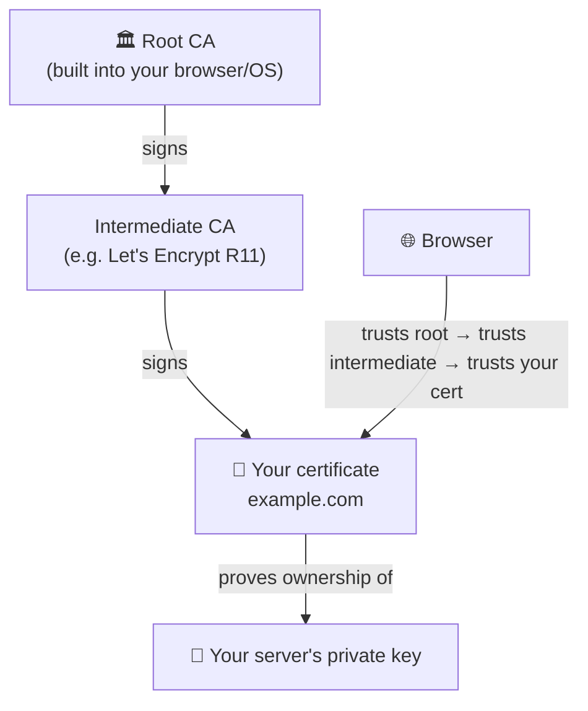
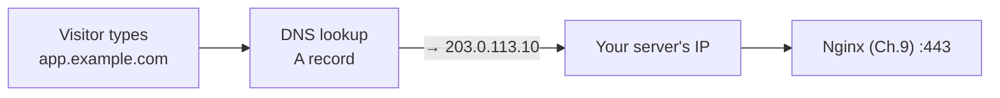

# Chapter 11 — HTTPS & TLS Certificates

> *Part III · Running Web Applications — Chapter 11 of 18*

Your application is now reliably served (Chapter 10) through a proper front door (Chapter 9) — but everything travels as **plaintext HTTP**. Anyone on the network path between a visitor and your server — a rogue Wi-Fi hotspot, an ISP, a compromised router — can *read* every request and response, *steal* passwords and cookies, and even *modify* pages in flight (injecting ads or malware). Modern production is **HTTPS-only**, and browsers now actively shame plaintext sites. This chapter turns on encryption. You'll learn how **TLS** and **certificates** actually work — the padlock, certificate authorities, the chain of trust — and then get a **free, auto-renewing certificate** from **Let's Encrypt** using **Certbot**, wired into the Nginx proxy you already built. By the end, your site is encrypted, trusted by every browser, and renewing itself with no further effort.

---

## Goal

By the end of this chapter you will:

1. Understand what **TLS/SSL** is and the difference between HTTP and HTTPS.
2. Understand what a **certificate** is, what a **Certificate Authority (CA)** does, and the **chain of trust** browsers rely on.
3. Understand how the **TLS handshake** establishes an encrypted connection, and why the Chapter 8 **clock** matters.
4. Understand **domains and DNS** enough to point a name at your server (a prerequisite for a real certificate).
5. Understand **Let's Encrypt**, the **ACME** protocol, and **Certbot** — and how automatic issuance/validation works.
6. Obtain and install a certificate for your site via Certbot + Nginx, with an automatic HTTP→HTTPS redirect.
7. Confirm **automatic renewal** so your certificate never silently expires.

---

## Background

### HTTP vs HTTPS, TLS vs SSL

Plain **HTTP** (Chapter 9) sends everything in the clear. **HTTPS** is simply *HTTP carried inside an encrypted tunnel*. That tunnel is provided by **TLS** — **T**ransport **L**ayer **S**ecurity.

> **TLS vs "SSL":** SSL (Secure Sockets Layer) was the original protocol; it's been obsolete and insecure for years. Its successor is **TLS**. People still say "SSL certificate" out of habit, but the protocol in use today is **TLS** (1.2/1.3). We'll say TLS.

TLS gives you three guarantees at once:

| Guarantee | What it means | Attack it stops |
|---|---|---|
| **Confidentiality** | Traffic is encrypted; eavesdroppers see gibberish. | Passive snooping (Wi-Fi sniffing, ISP logging). |
| **Integrity** | Tampering is detected; content can't be silently altered. | Injection/modification in transit (ad/malware injection). |
| **Authenticity** | You're really talking to the domain you think, not an impostor. | Man-in-the-middle / impersonation. |

That third one — *authenticity* — is what **certificates** provide.

### What is a certificate, and what is a Certificate Authority?

A **TLS certificate** is a digital document that binds a **domain name** (e.g. `example.com`) to a **public key** (recall public-key crypto from Chapter 5). It's essentially a signed statement: *"the holder of this public key is genuinely `example.com`."* Your server keeps the matching **private key** secret and uses it to prove ownership during the handshake.

But anyone can *generate* a certificate claiming to be `example.com` (a **self-signed** certificate). Why would a browser believe it? Because of a trusted third party: a **Certificate Authority (CA)** — an organization browsers and operating systems have decided to trust. The CA verifies that you actually control the domain, then **signs** your certificate with *its* key. Browsers ship with a built-in list of trusted CA keys, so a certificate signed by a known CA is automatically trusted.

### The chain of trust

Certificates form a **chain** up to a **root** the browser already trusts:



- The **root CA** is trusted implicitly (its key ships in the browser/OS).
- The root signs **intermediate** CAs (used day-to-day so the precious root key stays offline).
- The intermediate signs *your* **leaf** certificate.
- A browser validates the whole chain: your cert → intermediate → root. If every link checks out and leads to a trusted root, you get the padlock. If anything is broken, self-signed, expired, or for the wrong domain — a big scary warning.

### The TLS handshake (and why the clock matters)

When a browser connects over HTTPS, before any HTTP flows, a **handshake** happens:

1. Browser says hello, lists the TLS versions/ciphers it supports.
2. Server sends its **certificate** (and the intermediate chain).
3. Browser **validates** the certificate: Is it signed by a trusted CA? Is the domain a match? **Is it within its valid date range?** Not revoked?
4. They perform a **key exchange** to agree on a shared symmetric key (using the certificate's public key to bootstrap it securely).
5. From here, all HTTP traffic is encrypted with that shared key.

> ⏰ **This is why Chapter 8 mattered.** Step 3 checks the certificate's **validity dates**. If your server's clock is wrong — or a visitor's is — a perfectly good certificate can be judged "not yet valid" or "expired," and issuance itself can fail. A synchronized clock (NTP) is a silent prerequisite for TLS working at all.

### Domains and DNS — the prerequisite

Here's a hard truth: **a public CA will not issue a certificate for a bare IP address or a made-up name.** It issues certificates for **domain names** you can prove you control. So before this chapter's main event you need:

- **A registered domain name** (e.g. `example.com`) from a registrar (Namecheap, Cloudflare, Google Domains, etc.) — typically a small yearly fee.
- **A DNS record** pointing that domain at your server's IP. **DNS** (Domain Name System) is the internet's phone book: it translates names to IP addresses. You create an **`A` record** (name → IPv4 address) — e.g. `app.example.com → 203.0.113.10` — in your registrar's or DNS provider's dashboard. (An `AAAA` record does the same for IPv6.)



DNS changes take time to **propagate** (seconds to a few hours, governed by the record's **TTL**). You must set the `A` record and let it resolve **before** asking for a certificate, because the CA will verify domain control by contacting your server *at that name*.

> **No domain yet?** You can still learn the mechanics with a **self-signed** certificate (browsers will warn, but encryption works) or Let's Encrypt's **staging** environment. But for a real, browser-trusted site you need a domain pointing at the server. We'll assume you have one (`app.example.com` in examples) and note the self-signed path as an alternative.

### Let's Encrypt, ACME, and Certbot

Historically, certificates cost money and were issued through a manual, annual, error-prone process. **Let's Encrypt** changed that: a free, automated, nonprofit CA. It issues certificates through the **ACME** protocol (**A**utomated **C**ertificate **M**anagement **E**nvironment) — a standardized conversation where a program proves domain control and receives a certificate, all automatically.

**Certbot** is the most popular ACME **client** — a program that talks to Let's Encrypt on your behalf. With the Nginx plugin, Certbot will:

1. Prove you control the domain (the **HTTP-01 challenge**: Let's Encrypt gives Certbot a token; Certbot serves it at `http://your-domain/.well-known/acme-challenge/...` via Nginx on **port 80**; Let's Encrypt fetches it to confirm control).
2. Obtain the certificate.
3. **Edit your Nginx config** to install it and enable HTTPS.
4. Set up **automatic renewal** (Let's Encrypt certs last **90 days** by design — short, to limit damage from key compromise — and Certbot renews them automatically well before expiry).

> **Two important consequences:** (1) Port **80 must be open** (it is — Chapter 9's `Nginx Full`) for the HTTP-01 challenge. (2) The **90-day lifetime** is a feature, not a burden, *because* renewal is automated — you set it once and forget it.

---

## Why is this necessary?

- **Plaintext is indefensible in production.** Without TLS, credentials, session cookies, and personal data are readable and modifiable by anyone on the path. HTTPS is the baseline expectation, not a premium feature.
- **Browsers enforce it.** Chrome/Firefox mark HTTP pages "Not secure," block features (geolocation, service workers, HTTP/2) on non-HTTPS, and increasingly interstitial-warn users. An HTTP-only site looks broken and untrustworthy.
- **Authenticity stops impersonation.** The certificate proves visitors reached *your* server, not a man-in-the-middle. Encryption without authentication would be worthless — you could be encrypting to an attacker.
- **It's free and automatic now.** Let's Encrypt + Certbot removed every historical excuse (cost, complexity, manual renewal). There is no good reason to run plaintext.
- **It slots into what you built.** The reverse proxy (Ch. 9) is the natural place to terminate TLS; the open 443 (Ch. 9) and correct clock (Ch. 8) are already in place. This chapter is the capstone that makes the web service *trustworthy*.

---

## What would happen if we skipped this step?

- **Traffic would be wide open.** Passwords and cookies sent over HTTP can be captured on any shared or hostile network. Session hijacking becomes trivial.
- **Content could be tampered with.** Without integrity, intermediaries can inject scripts, ads, or malware into your pages.
- **Users would be warned away.** "Not secure" labels and blocked features erode trust and break modern web capabilities.
- **You couldn't use modern protocols/features.** HTTP/2, HTTP/3, and many browser APIs require HTTPS.
- **You'd fail basic compliance.** Handling logins, payments, or personal data over HTTP violates essentially every security standard and privacy regulation.

---

## Alternative approaches

### How to get a certificate

| Approach | Pros | Cons | Verdict |
|---|---|---|---|
| **Let's Encrypt via Certbot** | Free, automated issuance *and* renewal, browser-trusted, edits Nginx for you, huge adoption. | 90-day certs (auto-renewed, so fine); needs a domain + port 80. | ✅ **Recommended.** The modern default. |
| **Let's Encrypt via other ACME clients** (`acme.sh`, `lego`, Caddy's built-in) | Also free/automated; some are lighter or better for DNS-01/wildcards. | Less "batteries-included" for Nginx than Certbot. | ➕ Great alternatives; `acme.sh` is popular for DNS-01/wildcards. |
| **Commercial CA (paid) certificate** | Longer validity; some offer warranties/OV/EV validation. | Costs money; manual issuance/renewal unless automated; no security advantage for standard DV. | ➖ Only for specific org/EV needs. |
| **Self-signed certificate** | Free, no domain, instant; real encryption. | **Not trusted** — browsers show a warning; unsuitable for public users. | ➕ Fine for *internal/testing* only. |
| **Cloudflare (or CDN) in front** | Free TLS at the edge, DDoS protection, caching. | TLS terminates at Cloudflare, not your server (consider "Full (strict)" to also encrypt Cloudflare→origin). | ➕ Excellent complement; still put a cert on the origin. |
| **No TLS** | — | Insecure, browser-shamed, non-compliant. | ❌ Never in production. |

### Challenge type (how you prove domain control)

| Challenge | How it works | When |
|---|---|---|
| **HTTP-01** | Serve a token file over port 80 at the domain. | ✅ Default; simplest for a single server with a public A record. We use this. |
| **DNS-01** | Create a special DNS TXT record. | ➕ Needed for **wildcard** certs (`*.example.com`) or servers not reachable on port 80; requires DNS API access. |

**Our choice:** Certbot + Let's Encrypt with the **HTTP-01** challenge and the **Nginx plugin**, which automates issuance, Nginx configuration, and renewal.

---

## Commands

> Log in as **`deploy`** (Chapter 5). Use `sudo`. **Prerequisites before starting** (the chapter fails without them): (1) you own a **domain** and have created an **`A` record** pointing it (e.g. `app.example.com`) at your **server's IP**, and it has propagated; (2) port **80 and 443 are open** (Chapter 9's `ufw allow 'Nginx Full'`); (3) your **clock is synced** (Chapter 8); (4) Nginx is serving your app (Chapters 9–10).

### 1 — Verify DNS points at your server

```bash
dig +short app.example.com
```
- **What it does:** looks up the domain's `A` record and prints the IP it resolves to. (`dig` is a DNS query tool; if missing, `sudo apt install dnsutils`, Chapter 4. Alternatively `host app.example.com` or `getent hosts app.example.com`.)
- **Why we run it — critical:** Certbot's HTTP-01 challenge only works if the domain actually resolves to *this* server. Confirm this *before* asking for a certificate, or issuance fails confusingly.
- **Expected output:** your server's public IP (the one from Chapter 1). If it's blank or shows a different IP, DNS isn't ready — fix the `A` record and wait for propagation (re-check with `dig`).
- **Common mistakes:** requesting a cert before DNS propagates; typo in the record; pointing at the wrong IP.

### 2 — Set your real domain in the Nginx site config

Certbot detects which certificate to issue from the `server_name` in your Nginx config, so set it to the real domain first.

```bash
sudo nano /etc/nginx/sites-available/myapp
```
Change the `server_name` line from the catch-all to your domain:
```nginx
server {
    listen 80;
    listen [::]:80;
    server_name app.example.com;          # ← your real domain (was: _)

    location / {
        proxy_pass http://127.0.0.1:3000;
        proxy_set_header Host $host;
        proxy_set_header X-Real-IP $remote_addr;
        proxy_set_header X-Forwarded-For $proxy_add_x_forwarded_for;
        proxy_set_header X-Forwarded-Proto $scheme;
    }
}
```
- **Why:** `server_name app.example.com` tells Nginx (and thus Certbot) this block serves that domain. Certbot will read it to know what to request and where to add HTTPS.
- Test and reload (Chapter 9 ritual):
  ```bash
  sudo nginx -t && sudo systemctl reload nginx
  ```
- **Verify:** from your laptop, `http://app.example.com` now loads your app (proving DNS + Nginx + app all line up over HTTP). If this doesn't work, **stop and fix it** — Certbot needs this working.

### 3 — Install Certbot and the Nginx plugin

```bash
sudo apt update && sudo apt install certbot python3-certbot-nginx
```
- **What it does:** installs Certbot and its **Nginx plugin** (`python3-certbot-nginx`), which lets Certbot read and edit your Nginx config automatically.
- **Expected output:** apt install plan, then setup.
- **Verify:** `certbot --version` prints a version.
- **Note:** the Certbot project sometimes recommends the **snap** version for the newest features; the apt package is perfectly fine for a standard Ubuntu setup and integrates with auto-updates (Chapter 7).

### 4 — Obtain and install the certificate

```bash
sudo certbot --nginx -d app.example.com
```
- **What it does:** runs Certbot with the **Nginx plugin** (`--nginx`) for the domain (`-d`). Certbot will: prove domain control (HTTP-01 over port 80), obtain the certificate from Let's Encrypt, **edit your Nginx config to serve HTTPS on 443**, and offer to set up the HTTP→HTTPS redirect.
- **Add more domains** with repeated `-d`, e.g. `-d example.com -d www.example.com` (all must resolve to this server).
- **Expected interaction (first run):**
  - Prompts for an **email** (for expiry/renewal notices and account recovery) — enter a real one.
  - Asks you to **agree to the Terms of Service** — `Y`.
  - Asks whether to share your email with the EFF — your choice.
  - Performs the challenge and issues the cert.
  - Reports success:
    ```
    Successfully received certificate.
    Certificate is saved at: /etc/letsencrypt/live/app.example.com/fullchain.pem
    Key is saved at:         /etc/letsencrypt/live/app.example.com/privkey.pem
    This certificate expires on 2026-10-02.
    Deploying certificate ... Successfully deployed certificate for app.example.com
    Congratulations! You have successfully enabled HTTPS on https://app.example.com
    ```
- **The HTTP→HTTPS redirect:** recent Certbot versions automatically configure Nginx to redirect all `http://` requests to `https://` (older versions ask you to choose "redirect"). This ensures visitors always end up encrypted. Accept it.
- **What Certbot changed:** it edited `/etc/nginx/sites-available/myapp`, adding a `listen 443 ssl;` server block with the certificate paths and a redirect from port 80. Look with `sudo cat /etc/nginx/sites-available/myapp` — you'll see the new `ssl_certificate` / `ssl_certificate_key` lines pointing into `/etc/letsencrypt/live/...`.
- **Where the files live:** certificates and keys are under **`/etc/letsencrypt/live/app.example.com/`** — `fullchain.pem` (your cert + intermediates) and `privkey.pem` (the private key, tightly permissioned). **Never edit or delete these by hand;** Certbot manages them.
- **Common mistakes & recovery:**
  - *Challenge failed / timeout* → DNS not resolving to this server (re-check Step 1), or port 80 blocked (check `ufw status` **and** the cloud firewall, Chapter 6).
  - *"too many certificates already issued"* → Let's Encrypt **rate limits** (per domain per week). Use `--dry-run` (Step 6) or the staging server while experimenting so you don't burn your quota.
  - *Wrong `server_name`* → Certbot can't find the block; fix Step 2.

### 5 — Verify HTTPS works

From your **laptop's browser**, visit:
```
https://app.example.com
```
- **Expected:** your app loads with a **padlock** in the address bar, and `http://app.example.com` **redirects** to `https://`. 🎉 Click the padlock → the certificate is issued by "Let's Encrypt" (or "R11"/similar intermediate) and valid.

From the **server** or your laptop terminal:
```bash
curl -I https://app.example.com
```
- **Expected:** `HTTP/2 200` (or `HTTP/1.1 200 OK`) with no certificate errors. A plain `curl -I http://app.example.com` should show a `301`/`308` redirect to the HTTPS URL.
- **Deeper check (optional):**
  ```bash
  echo | openssl s_client -connect app.example.com:443 -servername app.example.com 2>/dev/null | openssl x509 -noout -dates -issuer
  ```
  prints the certificate's validity dates and issuer — proof of a real, dated, CA-signed cert.
- **External grade (optional):** run your domain through an SSL testing site (e.g. SSL Labs) for a full report; a fresh Certbot+Nginx setup typically scores an A.

### 6 — Confirm automatic renewal

This is the step that makes it truly "set and forget." Certbot installs a **systemd timer** (Chapter 7/10) that runs twice daily and renews any certificate within 30 days of expiry.

```bash
sudo certbot renew --dry-run
```
- **What it does:** simulates a renewal against Let's Encrypt's **staging** environment — exercising the whole renewal path **without** actually issuing or hitting rate limits. This proves renewal *will* work when the time comes.
- **Expected output:** `Congratulations, all simulations of the renewals succeeded` (or "The following certificates are not due for renewal yet" plus a successful simulation).
- **Confirm the timer is active:**
  ```bash
  systemctl list-timers | grep -i certbot
  systemctl status certbot.timer
  ```
  You should see `certbot.timer` scheduled (`active`), which triggers `certbot.service`. This is the same systemd-timer mechanism you met in Chapters 7 and 10.
- **Why this matters:** Let's Encrypt certs live 90 days. The timer renews them automatically ~30 days before expiry and reloads Nginx to pick up the new cert. If the dry-run passes and the timer is active, **you never have to think about renewal again** — but the email you gave Certbot will also warn you if renewal ever starts failing.
- **After renewal, does Nginx pick up the new cert?** Certbot's renewal includes a deploy hook that reloads Nginx automatically. You can verify the hook exists under `/etc/letsencrypt/renewal-hooks/deploy/` or trust the standard packaging, which handles it.

### 7 — (Optional) Harden and tidy the TLS config

Certbot's defaults are already solid. Two nice-to-haves:

- **HSTS** — add `add_header Strict-Transport-Security "max-age=31536000" always;` inside the `443` server block to tell browsers "always use HTTPS for this domain." (Do this only once you're confident HTTPS is permanent — it's sticky.) Test with `nginx -t` and `reload`.
- **Renewals email:** ensure the email you gave Certbot is monitored — it's your safety net if automated renewal ever breaks.

---

## Verification Checklist

You've completed this chapter when **all** of the following are true:

- [ ] `dig +short app.example.com` returns **your server's IP** (DNS is correct).
- [ ] Nginx `server_name` is set to your real domain and `http://app.example.com` loaded your app *before* running Certbot.
- [ ] `sudo certbot --nginx -d app.example.com` reported **success** and deployed the certificate.
- [ ] `https://app.example.com` loads with a **padlock**; `http://` **redirects** to `https://`.
- [ ] `curl -I https://app.example.com` returns `200` with no cert errors; the issuer is Let's Encrypt.
- [ ] `sudo certbot renew --dry-run` **succeeds**, and `certbot.timer` is **active**.
- [ ] You understand why the **clock (Ch. 8)** and **open port 80 (Ch. 9)** were prerequisites, and that certs live **90 days** but renew automatically.

---

## Troubleshooting

| Symptom | Why it happens | How to fix |
|---|---|---|
| Certbot challenge fails / `Timeout during connect` | The domain doesn't resolve to this server, or port 80 is blocked (host or cloud firewall). | `dig +short app.example.com` must show this server's IP; `sudo ufw status` shows `Nginx Full`; check the **provider/cloud firewall** allows 80/443 (Chapter 6). |
| `Could not find a VirtualHost / server block for domain` | `server_name` in Nginx doesn't match the `-d` domain. | Set `server_name app.example.com;`, `nginx -t && reload`, re-run Certbot. |
| `Too many certificates already issued` | Hit Let's Encrypt **rate limits** from repeated real requests. | Wait out the window; use `--dry-run` / staging while testing. Don't loop real issuance. |
| Browser: `NET::ERR_CERT_DATE_INVALID` or "not yet valid" | Server (or client) **clock is wrong** — the cert's date range is misjudged. | Fix time sync: `timedatectl` should show `synchronized: yes` (Chapter 8). |
| Browser: `ERR_CERT_AUTHORITY_INVALID` | A **self-signed** cert, or the intermediate chain isn't served. | Use a real Let's Encrypt cert (`fullchain.pem` includes intermediates); ensure Nginx points at `fullchain.pem`, not just `cert.pem`. |
| Padlock but "mixed content" warnings | The page loads some assets over `http://`. | Serve all assets via `https://` or protocol-relative/absolute HTTPS URLs; fix hardcoded `http://` links in the app. |
| HTTPS works but HTTP doesn't redirect | Redirect not configured. | Re-run `sudo certbot --nginx` and choose redirect, or add a `return 301 https://$host$request_uri;` in the port-80 block. |
| Renewal dry-run fails | Port 80 later closed, DNS changed, or an Nginx config error. | Ensure 80 stays open and DNS still points here; `sudo nginx -t`; read `sudo journalctl -u certbot`. |
| Certificate expired unexpectedly | The renewal timer was disabled or failing silently. | `systemctl status certbot.timer`; `sudo certbot renew --force-renewal`; re-check the timer; monitor the notification email. |

> **First stops for TLS problems:** `dig` (does the name point here?), `timedatectl` (is the clock right?), `sudo ufw status` + cloud firewall (is 80/443 open?), and `sudo nginx -t` / `sudo journalctl -u certbot`. Ninety percent of certificate failures are DNS, firewall, or clock — all things you already control from earlier chapters.

---

## Best Practices

- **HTTPS everywhere, HTTP redirects to HTTPS.** No plaintext in production. Let Certbot install the 80→443 redirect so users can't accidentally stay unencrypted.
- **Automate renewal and verify it.** The point of Let's Encrypt is hands-off renewal. Run `certbot renew --dry-run` after setup and confirm `certbot.timer` is active — then trust it, backed by the notification email.
- **Keep port 80 open (for the challenge) and the clock synced.** These are silent prerequisites; breaking either breaks issuance/renewal. (Chapters 8–9 already set them up.)
- **Terminate TLS at the proxy.** Let Nginx handle certificates; your app stays plain HTTP on localhost behind it. One place to manage encryption (Chapter 9's pattern).
- **Never touch `/etc/letsencrypt/` by hand.** Certbot owns those files (including the tightly-permissioned private key). Manage certs only through `certbot`.
- **Protect the private key.** It lives in `/etc/letsencrypt/live/.../privkey.pem` with restrictive permissions — don't copy it around or loosen them. If ever exposed, revoke and reissue.
- **Consider HSTS once stable.** `Strict-Transport-Security` forces browsers to use HTTPS, closing the initial-HTTP gap — but it's sticky, so enable it only when you're committed to HTTPS permanently.
- **Use `--dry-run`/staging while experimenting.** Avoid burning Let's Encrypt rate limits during setup and testing.
- **Renew the domain registration too.** A certificate is useless if the *domain* lapses. Keep the registration on auto-renew.

---

## Summary

### What you learned

- The difference between **HTTP and HTTPS**, that **TLS** (not legacy "SSL") provides the encrypted tunnel, and its three guarantees: **confidentiality, integrity, authenticity**.
- What a **TLS certificate** is (binds a domain to a public key), what a **Certificate Authority** does (verifies control and signs), and the **chain of trust** from your leaf cert up through intermediates to a **root** built into browsers.
- How the **TLS handshake** validates a certificate — including its **date range**, which is exactly why the **NTP-synced clock from Chapter 8** is a prerequisite.
- Why a real certificate needs a **domain** and a **DNS `A` record** pointing at your server, and how DNS propagation works.
- What **Let's Encrypt**, the **ACME** protocol, and **Certbot** are, and how the **HTTP-01 challenge** (over the port 80 you opened in Chapter 9) proves domain control.
- How to **verify DNS** (`dig`), set the real `server_name`, install **Certbot + the Nginx plugin**, **obtain and deploy** a certificate with `certbot --nginx` (auto-editing Nginx and adding the HTTP→HTTPS redirect), **verify** HTTPS (padlock, `curl -I`, `openssl`), and **confirm automatic renewal** (`certbot renew --dry-run`, `certbot.timer`) — given that Let's Encrypt certs live **90 days** but renew themselves.

### What you'll build next

**Chapter 12 — Databases & Data Persistence.** Your app is now served securely and reliably — but most real applications need to *remember* things: users, posts, orders, sessions. That means a **database**, and a database introduces a new class of concerns: where data lives, how to run the database as a hardened local service, how to create databases and users with least privilege, how your app connects to it *safely* (secrets, not passwords in code), and — critically — how to keep data intact. In Chapter 12 you'll choose and install a database (comparing relational vs non-relational, and PostgreSQL vs MySQL vs SQLite), bind it to localhost behind everything you've built, and wire your application to it — setting the stage for backups in Chapter 16.

> ✅ **Ready to continue?** Confirm and we'll proceed to Chapter 12. If Certbot failed, the padlock didn't appear, or the dry-run didn't succeed, tell me exactly what you ran and the output of `dig +short <domain>`, `sudo ufw status`, `timedatectl`, and `sudo journalctl -u certbot`, and we'll fix it before we add a database.
