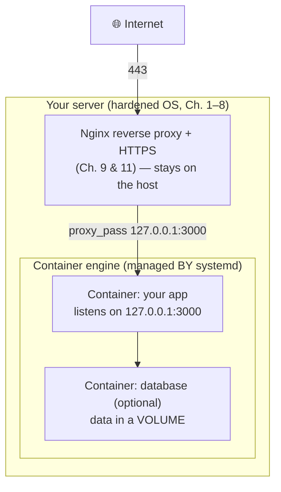

# Chapter 13 — Containers (Optional Path)

> *Part III · Running Web Applications — Chapter 13 of 18*

You now have a complete, secure, stateful web stack running **directly** on the server: a hardened OS, an Nginx reverse proxy, HTTPS, an always-on systemd-managed app, and a locked-down localhost database. That is a genuinely production-grade way to run software, and many excellent systems run exactly like this forever. This chapter steps back to examine a *different* way to package and run applications — **containers** — because they have reshaped how modern software is built, shipped, and deployed, and because Part IV's discussion of CI/CD assumes you understand them. This chapter is **deliberately optional**: you can skip it and lose nothing from the "install directly" path you've built. But understanding containers — even if you choose not to use them yet — will make you a far more capable engineer. We focus on *concepts and judgment* over an exhaustive Docker tutorial.

---

## Goal

By the end of this chapter you will:

1. Understand the problem containers solve: *"it works on my machine."*
2. Understand what a **container** actually is (and is **not** — it's not a virtual machine), and how the Linux kernel makes it possible.
3. Understand the core vocabulary: **image**, **container**, **registry**, **Dockerfile**, **volume**, **port mapping**.
4. Understand how containers compare to the **systemd-service** approach you already mastered — honestly, with trade-offs.
5. Install a container engine and run, inspect, and manage a container.
6. Understand how containers fit *behind your existing Nginx proxy*, and how data persistence and secrets work.
7. Know when containers are worth the added complexity — and when they aren't.

---

## Background

### The problem: "it works on my machine"

When you installed your app directly (Chapter 10), it depended on whatever was on the server: a specific Node/Python version, certain system libraries, particular environment variables. If your laptop has Node 20 but the server has Node 18, or a library version differs, the app can behave differently — or fail — in ways that are maddening to debug. Multiply that across many developers, many servers, and many apps, and you get **environment drift**: subtle inconsistencies between where code was written and where it runs.

**Containers** solve this by packaging an application *together with everything it needs to run* — its runtime, libraries, and dependencies — into one standardized, portable unit. That unit runs the same way on your laptop, a colleague's laptop, a CI runner, and the production server. "It works on my machine" becomes "it works in the container, everywhere."

### What is a container? (and what it is *not*)

A **container** is an **isolated process** (or group of processes) running on the host, with its own private view of the filesystem, network, and process list — but **sharing the host's kernel**. That last part is the key distinction:

| | **Virtual Machine (VM)** | **Container** |
|---|---|---|
| What's virtualized | Entire hardware + a full guest OS (its own kernel) | Just the process's *view* of the system; **shares the host kernel** |
| Size | Gigabytes (whole OS) | Megabytes (just the app + its deps) |
| Startup | Seconds to minutes (boot an OS) | Milliseconds to seconds (start a process) |
| Overhead | Heavy (full OS per VM) | Light (no guest OS) |
| Isolation | Very strong (hardware boundary) | Strong, but a *kernel* boundary (slightly weaker than a VM) |

> 🧠 **The mental model:** a VM is a whole separate computer simulated in software. A container is *just your app in a very well-fenced box on the same computer*, tricked into thinking it has the machine to itself. Because it doesn't drag along a whole operating system, it's tiny and starts almost instantly.

### How the kernel makes it possible (namespaces & cgroups)

Containers aren't magic — they're built from two long-standing Linux kernel features:

- **Namespaces** — isolate *what a process can see*. Separate namespaces exist for the filesystem mount points, process IDs, network interfaces, users, and hostname. A container gets its own set, so `ps` inside it shows only its own processes, its network looks private, and its root filesystem is its own — even though it's all the same kernel underneath.
- **Control groups (cgroups)** — limit *what a process can use*: CPU, memory, I/O. This is how you cap a container to, say, 512 MB of RAM so a runaway app can't starve the host.

A **container engine** (Docker, Podman, containerd) is the tooling that assembles these kernel features, plus an image format and a friendly CLI, into the "containers" experience. It's important to demystify: a container is a *fenced-off normal process*, not a tiny separate machine.

### The core vocabulary

These six terms are the whole mental model:

| Term | What it is | Analogy |
|---|---|---|
| **Image** | A read-only *template* containing the app + its dependencies + instructions. Immutable and shareable. | A *class* in programming, or a cookie cutter. |
| **Container** | A *running instance* of an image. You can start many from one image. | An *object* (instance), or a cookie. |
| **Dockerfile** | A text recipe describing how to *build* an image, step by step. | The recipe that produces the cookie cutter. |
| **Registry** | A server that stores and distributes images (e.g. Docker Hub, GitHub Container Registry). | An app store / package repo for images. |
| **Volume** | Persistent storage that lives *outside* the container's ephemeral filesystem, so data survives the container being destroyed. | An external hard drive you plug into any container. |
| **Port mapping** | Connecting a port on the host to a port inside the container. | Forwarding the building's door to a specific apartment. |

> ⚠️ **The most important container mindset: containers are *ephemeral*.** A container's own filesystem is throwaway — when you remove and recreate it (which you do constantly, e.g. to deploy a new version), anything written *inside* it is **gone**. This is a feature (fresh, reproducible instances) but it means **any data that must persist — your database files, user uploads — must live in a volume**, never inside the container. Forgetting this is how people lose data.

### How this relates to what you already built

You already run isolated, restart-on-crash, boot-started services — via **systemd** (Chapter 10). Containers are an *alternative packaging and isolation model*, not a replacement for the concepts you learned:



Notice: **the reverse proxy and HTTPS stay exactly where they are.** Containers change how the *app* (and optionally the DB) is packaged and run; the front door, firewall, and TLS you built are unchanged. And the container *engine itself* is started and supervised by **systemd** — so even the container world sits on top of the foundations you learned.

---

## Why is this necessary?

Honestly: for a single app on a single server, containers are **not strictly necessary** — that's why this chapter is optional. But understanding them matters because:

- **They're the lingua franca of modern deployment.** CI/CD pipelines (Chapter 15), cloud platforms, and orchestrators (Kubernetes) are overwhelmingly container-based. To read modern docs and collaborate, you need the vocabulary.
- **They eliminate environment drift.** The single biggest source of "works here, breaks there" bugs disappears when the runtime is packaged with the app.
- **They make deployments reproducible and atomic.** Deploying becomes "run this exact image," and rolling back becomes "run the previous image" — a theme we'll build on in Chapter 14.
- **They isolate dependencies cleanly.** Two apps needing conflicting library versions can coexist without fighting over the host's system packages.

Even if you decide to keep running directly on the host, knowing *why* teams reach for containers — and their real costs — is essential engineering judgment.

---

## What would happen if we skipped this step?

Concretely: **nothing breaks.** Your stack from Chapters 9–12 is complete and production-viable without containers. Skipping this chapter means:

- You continue deploying by installing/updating the app directly and managing it with systemd — a perfectly good model for a single server, and arguably *simpler* to reason about.
- You'd want to revisit containers before adopting Kubernetes, multi-service architectures, or certain CI/CD patterns — but you can learn them exactly when you need them.

What you *shouldn't* do is adopt containers **cargo-cult** — adding Docker because "everyone does" without understanding the trade-offs. That often *increases* complexity (another layer to secure, patch, debug, and monitor) with little benefit for a simple single-app server. This chapter exists so your choice is *informed*, in either direction.

---

## Alternative approaches

### Run directly (systemd) vs containerized

| Dimension | **Direct on host (systemd, Ch. 10)** | **Containerized** |
|---|---|---|
| Simplicity | ✅ Fewer layers; one less thing to learn/secure. | ➖ New concepts, another daemon and attack surface. |
| Environment consistency | ➖ Depends on host packages; drift possible. | ✅ Packaged runtime; identical everywhere. |
| Deploy/rollback | ➕ Manual-ish; needs discipline (Ch. 14). | ✅ "Run this image" / "run previous image"; atomic. |
| Dependency isolation | ➖ Apps share host libraries. | ✅ Each app carries its own. |
| Resource overhead | ✅ Minimal. | ➕ Small but nonzero. |
| Multi-service local dev | ➖ Manual setup of each service. | ✅ `docker compose up` spins up the whole stack. |
| Best for | A single app/server; maximum simplicity. | Many services, teams, CI/CD, reproducibility, portability. |

### Which container engine

| Engine | Pros | Cons | Verdict |
|---|---|---|---|
| **Docker** | The de-facto standard; huge ecosystem, docs, and tutorials; `docker compose` for multi-service; easiest to learn. | Runs a root daemon by default (a security consideration); commercial licensing for large orgs (Docker Desktop). | ✅ **Recommended** for learning — everything assumes it. |
| **Podman** | Daemonless; **rootless by default** (better security posture); Docker-compatible CLI (`alias docker=podman` often works); good on RHEL/Fedora and Ubuntu. | Slightly less ubiquitous tutorials; compose support is newer. | ✅ Excellent, especially security-minded; a great Docker alternative. |
| **containerd / nerdctl** | The lower-level runtime Docker/K8s use. | More minimal; less beginner-friendly UX. | ➖ Usually consumed via higher-level tools. |
| **LXC/LXD (system containers)** | Full-OS-like containers (more VM-ish). | Different use case (not app-per-container). | ➖ Different model; not our focus. |

**Our choice for learning:** **Docker**, because the entire ecosystem, Chapter 15's CI/CD, and virtually all documentation assume it. We'll note **Podman** as the more security-forward, rootless alternative you should know exists — its commands are nearly identical.

### How to orchestrate multiple containers

| Tool | When |
|---|---|
| **A single `docker run`** | One container; simplest. |
| **Docker Compose** | A few containers on one host (app + DB + cache) defined in one `compose.yaml`. ✅ The right tool for a single server. |
| **Kubernetes (K8s)** | Many containers across many servers, auto-scaling, self-healing at fleet scale. ➖ Powerful but heavy — overkill for one VPS; a whole discipline of its own. |

For a single server, **never reach for Kubernetes**. Docker Compose is the appropriate ceiling.

---

## Commands

> Log in as **`deploy`** (Chapter 5). Use `sudo`. This is a *concept-focused tour* — enough to run, inspect, and reason about containers, not an exhaustive Docker course. If you've decided to stay on the systemd path, you can read this section without running it.

### 1 — Install Docker Engine (from Docker's official repository)

Ubuntu's own repos carry an older `docker.io`; Docker's official repo gives the current engine plus the Compose plugin. This is the "add a properly-signed third-party repo" case we flagged in Chapter 4.

```bash
# Prerequisites and Docker's GPG key + repo (from Docker's official instructions)
sudo apt update && sudo apt install ca-certificates curl
sudo install -m 0755 -d /etc/apt/keyrings
sudo curl -fsSL https://download.docker.com/linux/ubuntu/gpg -o /etc/apt/keyrings/docker.asc
sudo chmod a+r /etc/apt/keyrings/docker.asc
echo "deb [arch=$(dpkg --print-architecture) signed-by=/etc/apt/keyrings/docker.asc] https://download.docker.com/linux/ubuntu $(. /etc/os-release && echo $VERSION_CODENAME) stable" | sudo tee /etc/apt/sources.list.d/docker.list > /dev/null
sudo apt update
sudo apt install docker-ce docker-ce-cli containerd.io docker-buildx-plugin docker-compose-plugin
```
- **What it does (in plain terms):** installs Docker's signing **key** into `/etc/apt/keyrings`, registers Docker's **repository** (signed by that key — Chapter 4's signature-trust model), then installs the engine (`docker-ce`), CLI, the containerd runtime, and the **Compose** plugin.
- **Why the official repo:** the current engine and the modern `docker compose` (v2, a plugin) versus an older packaged one. Because it's a *properly signed* repo, it also gets security updates (Chapters 4/7).
- **Verify:**
  ```bash
  sudo docker run hello-world
  ```
  Docker pulls a tiny test **image** from the registry and runs it as a **container**; it prints a "Hello from Docker!" message confirming the whole pipeline works. Also `docker --version` and `docker compose version`.
- **Docker starts as a systemd service** (`systemctl status docker`) — managed exactly like everything in Chapter 10. It's enabled on boot by default.

### 2 — (Security) Understand the `docker` group trade-off

By default `docker` commands need `sudo` (the daemon runs as root). You *can* add your user to the `docker` group to drop the `sudo`:

```bash
# Optional convenience — understand the risk first:
sudo usermod -aG docker deploy
```
- **What it does:** lets `deploy` run `docker` without `sudo` (log out/in to take effect — group membership at login, Chapter 3).
- **⚠️ The critical caveat:** the `docker` group is **root-equivalent**. Anyone in it can start a container that mounts the host's `/` and thereby gain full root. So adding a user to `docker` is effectively granting them root — treat it with the same seriousness. On a single-admin box it's a common convenience; on shared systems, prefer `sudo docker` or **Podman rootless**. This is a genuine security decision, not a mere convenience — decide consciously (Chapter 3's least-privilege lens).

### 3 — Run a real container: pull an image and map a port

Let's run a containerized web server to *see* the model, then connect it to your existing Nginx.

```bash
sudo docker run -d --name web-demo -p 127.0.0.1:8080:80 nginx:latest
```
- **What it does, flag by flag:**
  - `docker run` — create and start a container.
  - `-d` — **d**etached (runs in the background, like a service).
  - `--name web-demo` — a friendly name to refer to it.
  - `-p 127.0.0.1:8080:80` — **port mapping**: host `127.0.0.1:8080` → container's port `80`. Binding to `127.0.0.1` (not `0.0.0.0`) keeps it **localhost-only**, exactly the Chapter 6 principle — the container isn't exposed to the internet directly.
  - `nginx:latest` — the **image** to run (pulled from Docker Hub if not present locally).
- **Verify:**
  ```bash
  sudo docker ps                       # list running containers
  curl -s http://127.0.0.1:8080 | head # the containerized nginx responds
  ```
- **This is the same pattern as your app:** a service listening on a localhost port. Your *host* Nginx (Chapters 9/11) can `proxy_pass http://127.0.0.1:8080;` to it — the reverse proxy and HTTPS you built front the container unchanged. The container is just a new kind of backend.

### 4 — Inspect and manage containers (mirrors systemd verbs)

```bash
sudo docker ps                 # running containers (add -a for stopped ones too)
sudo docker logs web-demo      # the container's stdout/stderr (like journalctl -u)
sudo docker logs -f web-demo   # follow live (Ctrl+C to stop)
sudo docker exec -it web-demo bash   # open a shell INSIDE the container to poke around
sudo docker stop web-demo      # stop it
sudo docker start web-demo     # start it again
sudo docker restart web-demo   # restart
sudo docker rm -f web-demo     # remove it (─f stops first). Its internal filesystem is GONE.
```
- **The parallels to Chapter 10 are deliberate:** `docker logs` ≈ `journalctl -u`, `docker stop/start/restart` ≈ `systemctl stop/start/restart`. The concepts transfer.
- **`docker exec -it ... bash`** drops you *inside* the container — a great way to see that it has its own isolated filesystem and process list (run `ps aux` inside: you'll see only the container's processes — namespaces at work).
- **The lesson of `docker rm`:** removing a container destroys its writable layer. Anything not in a **volume** is lost. Internalize this.

### 5 — Persistence with volumes (where data must live)

To keep data across container recreation, mount a **volume**:

```bash
sudo docker volume create appdata
sudo docker run -d --name db-demo \
  -e POSTGRES_PASSWORD="$(openssl rand -base64 24)" \
  -v appdata:/var/lib/postgresql/data \
  -p 127.0.0.1:5432:5432 \
  postgres:16
```
- **What it does:** runs PostgreSQL in a container, with `-v appdata:/var/lib/postgresql/data` mounting the named **volume** `appdata` at the path where Postgres stores its files. Now the database files live in the volume, **outside** the container — so `docker rm db-demo` and re-running with the same volume **keeps your data**. Note the `-p 127.0.0.1:5432` again keeps it localhost-only (Chapter 12's golden rule, applied to containers).
- **Why this is essential:** it's the containerized expression of Chapter 12's persistence — the *data* is separated from the *process*. Without the volume, removing the container would delete the entire database. **Databases in containers without a volume are a data-loss trap.**
- **Verify:** `sudo docker volume ls` shows `appdata`; stop/rm/recreate the container with the same `-v` and the data persists.

### 6 — Defining a stack with Docker Compose (the single-server ceiling)

For app + database together, `docker compose` describes the whole stack in one file — far nicer than juggling `docker run` commands.

```bash
nano compose.yaml
```
```yaml
services:
  app:
    image: myapp:latest          # your built app image
    restart: unless-stopped       # self-healing, like systemd Restart=
    ports:
      - "127.0.0.1:3000:3000"     # localhost-only; host Nginx proxies to it
    environment:
      DATABASE_URL: "postgresql://appuser:SECRET@db:5432/myapp_db"
    depends_on: [db]

  db:
    image: postgres:16
    restart: unless-stopped
    environment:
      POSTGRES_DB: myapp_db
      POSTGRES_USER: appuser
      POSTGRES_PASSWORD: "SECRET"   # in practice: from an env file / secret, not inline
    volumes:
      - dbdata:/var/lib/postgresql/data   # persistence!

volumes:
  dbdata:
```
```bash
sudo docker compose up -d      # build/pull and start the whole stack in the background
sudo docker compose ps         # status of all services
sudo docker compose logs -f    # aggregated logs
sudo docker compose down       # stop & remove containers (volumes persist unless -v)
```
- **What it does:** defines two services (`app`, `db`) that share a private container network (the app reaches the DB by the hostname `db` — Compose provides internal DNS). `restart: unless-stopped` gives self-healing; `volumes` give persistence; `ports` keep the app on localhost behind your host Nginx.
- **Secrets note:** don't hard-code passwords inline as shown — in practice use an `.env` file (git-ignored) or Docker secrets. This is Chapter 12's "secrets not in code" rule, in Compose form.
- **The boundary to respect:** Compose is the right tool for a *single server's* handful of services. When you genuinely need multiple servers, auto-scaling, and self-healing across a fleet, that's Kubernetes territory — a separate, much larger discipline. Don't reach for it on one VPS.

### 7 — Keeping containers secure and tidy

```bash
sudo docker image ls           # local images (they accumulate)
sudo docker system df          # disk used by images/containers/volumes
sudo docker system prune       # remove unused containers/images/networks (asks first)
```
- **Security essentials for containers** (brief, since it's a big topic):
  - **Use trusted, specific image tags** (`postgres:16`, not random `:latest` from unknown authors) — images are code you're running; a malicious image is malware. Prefer official images.
  - **Keep base images updated** — a container ships its *own* libraries, so it doesn't benefit from the host's `apt` updates (Chapters 4/7). You must rebuild/repull to patch them. This is a real, often-forgotten cost of containers.
  - **Bind published ports to `127.0.0.1`** unless a port truly must be public — same as Chapter 6.
  - **Don't run app processes as root inside the container** where avoidable (use a `USER` directive in the Dockerfile) — least privilege (Chapter 3) applies inside containers too.
  - **Consider Podman rootless** for a stronger default security posture.

---

## Verification Checklist

You've completed this chapter when **all** of the following are true (or, if skipping the hands-on, you can *explain* each):

- [ ] You can explain how a **container** differs from a **VM** (shared kernel vs full guest OS) and what **namespaces/cgroups** do.
- [ ] You can define **image**, **container**, **Dockerfile**, **registry**, **volume**, and **port mapping**.
- [ ] You understand that containers are **ephemeral** and that persistent data **must** live in a **volume**.
- [ ] Docker is installed and `sudo docker run hello-world` succeeded (if you ran the hands-on).
- [ ] You ran a container with a **localhost-bound** port mapping and understand it sits **behind your existing Nginx proxy**, not replacing it.
- [ ] You understand the **`docker` group = root-equivalent** security trade-off.
- [ ] You can articulate **when containers are worth it** (many services, CI/CD, reproducibility, teams) and **when the direct systemd approach is simpler/better** (single app, single server).

---

## Troubleshooting

| Symptom | Why it happens | How to fix |
|---|---|---|
| `permission denied while trying to connect to the Docker daemon socket` | You're not root and not in the `docker` group. | Use `sudo docker ...`, or add your user to `docker` (understanding it's root-equivalent) and re-login. |
| `docker: Cannot connect to the Docker daemon` | The Docker service isn't running. | `sudo systemctl status docker`; `sudo systemctl start docker`; check `journalctl -u docker`. |
| Container starts then exits immediately | The main process crashed or finished (a container lives only as long as its main process). | `docker logs <name>` to see why; ensure the image's command is a long-running process. |
| Data disappeared after redeploying | Data was written *inside* the container, not in a **volume**. | Mount a volume for stateful paths (`-v name:/path`); never store persistent data in the container's own filesystem. |
| Port already in use / can't bind | Another process (or the host Nginx) already holds the host port. | Choose a different host port; `sudo ss -tulpn` to find the conflict. |
| Disk filling up | Old images, stopped containers, and dangling volumes accumulate. | `docker system df` to see usage; `docker system prune` (and `--volumes` cautiously) to clean. |
| Container's software is outdated/vulnerable | Containers don't get the host's `apt` security updates — they carry their own libraries. | Rebuild/repull from an updated base image regularly; watch base-image security advisories. |
| Can reach the app from the internet directly, bypassing Nginx/HTTPS | Published a port to `0.0.0.0` instead of `127.0.0.1`. | Bind published ports to `127.0.0.1` so only the host Nginx (with TLS) fronts them; keep the firewall minimal (Chapter 6). |

> **First stops for container problems:** `docker ps -a` (is it running or exited?), `docker logs <name>` (why did it stop?), and `systemctl status docker` (is the engine up?). These mirror the systemd/`journalctl` habits from Chapter 10.

---

## Best Practices

- **Adopt containers deliberately, not reflexively.** They shine for multiple services, teams, CI/CD, and reproducibility. For a single app on a single server, the direct systemd approach is simpler and entirely valid. Choose based on your actual needs.
- **Keep the reverse proxy and HTTPS on the host.** Let Nginx (Chapters 9/11) terminate TLS and `proxy_pass` to containers on localhost ports. Don't expose containers to the internet directly.
- **Persistent data lives in volumes — always.** Treat containers as disposable and stateless; databases and uploads go in named volumes (or, often better on a single server, a host-managed database as in Chapter 12).
- **Bind published ports to `127.0.0.1`.** The container privacy boundary is the same as Chapter 6's. Only the proxy is public.
- **Use trusted, pinned images and keep them patched.** Prefer official images and specific tags; rebuild/repull to get security fixes, since containers don't share the host's updates.
- **Treat `docker` group membership as granting root.** Decide consciously; prefer `sudo docker` or **Podman rootless** on anything shared or sensitive.
- **Don't run container processes as root; keep secrets out of images.** Least privilege (Chapter 3) and secrets-not-in-code (Chapter 12) apply *inside* containers too — use a non-root `USER` and inject secrets at runtime.
- **Docker Compose is the single-server ceiling.** It's perfect for app+DB+cache on one host. Resist Kubernetes until you genuinely operate a fleet.

---

## Summary

### What you learned

- The problem containers solve — **environment drift / "works on my machine"** — by packaging an app *with its dependencies* into a portable, standardized unit.
- What a **container** is (an **isolated process sharing the host kernel**) versus a **VM** (a full guest OS), and the kernel features that make it work: **namespaces** (isolate what you see) and **cgroups** (limit what you use).
- The core vocabulary — **image** (template), **container** (running instance), **Dockerfile** (build recipe), **registry** (image store), **volume** (persistent storage), **port mapping** — and the crucial mindset that containers are **ephemeral**, so **persistent data must live in volumes**.
- How containers relate to your existing stack: the **Nginx proxy and HTTPS stay on the host**, containers are just a new kind of localhost backend, and the container engine itself is **managed by systemd** — everything sits on the foundations you already built.
- Hands-on: installing **Docker** from its signed official repo, the **`docker` group = root-equivalent** trade-off, running/inspecting/managing containers (verbs that mirror `systemctl`/`journalctl`), **volumes** for persistence, and **Docker Compose** for a single-server multi-service stack — with **Podman** noted as the rootless alternative and **Kubernetes** as out-of-scope for one server.
- The **judgment**: when containers are worth their added complexity (many services, CI/CD, reproducibility, teams) and when the **direct systemd approach** is the simpler, better choice.

### What you'll build next

**Part IV begins — Chapter 14: Deployment Strategies & Lifecycle.** You can now run applications two ways — directly via systemd, or in containers. But we've been *placing* code on the server by hand. Real production needs a repeatable, safe **deployment process**: how does code get from your computer to the server *reliably*, how do you release a new version without downtime, and how do you **roll back** instantly when something's wrong? In Chapter 14 you'll learn the full deployment lifecycle and compare strategies — manual pulls, atomic symlink releases, blue-green, and rolling deploys — for both the systemd and container models, setting the stage for automating it all with CI/CD in Chapter 15.

> ✅ **Ready to continue?** Confirm and we'll begin Part IV with Chapter 14. If you ran the container hands-on and something misbehaved — the daemon, a port, a lost volume — tell me exactly what you ran and the output of `sudo docker ps -a`, `sudo docker logs <name>`, and `systemctl status docker`, and we'll sort it before we tackle deployment.
