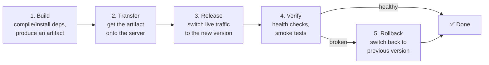

# Chapter 14 — Deployment Strategies & Lifecycle

> *Part IV · Deployment & Operations — Chapter 14 of 18*

Welcome to Part IV. You have a secure, hardened server (Part II) running a real, HTTPS-served, database-backed application (Part III). But there's a quiet embarrassment lurking in everything we've done so far: **we put the code on the server by hand.** We SSH'd in, created files, edited configs. That's fine for learning, but it's how outages happen in production — manual steps are unrepeatable, undocumented, and error-prone. This chapter is about doing it *properly*: how code travels from your computer to the server **reliably and repeatably**, how you release a new version **without downtime**, and — the skill that separates professionals from amateurs — how you **roll back instantly** when a deploy goes wrong. We'll cover the concepts and strategies here; automating them into a hands-off pipeline is Chapter 15.

---

## Goal

By the end of this chapter you will:

1. Understand what **deployment** really means and the full **deployment lifecycle** (build → transfer → release → verify → rollback).
2. Understand the ways code physically gets from your machine to the server, and why some are dangerous.
3. Understand and compare the major **deployment strategies**: in-place, atomic symlink releases, blue-green, rolling, and canary.
4. Understand **zero-downtime** deploys and why the reverse proxy (Chapter 9) makes them possible.
5. Understand **rollback** — the most important and most neglected part of deployment.
6. Perform a safe, repeatable **atomic release** deployment by hand (for both the systemd and container models) so you understand what a pipeline will later automate.
7. Understand **migrations, secrets, and health checks** as part of a real release.

---

## Background

### What is "deployment," really?

**Deployment** is the process of taking a new version of your application and making it the one that serves live traffic — safely, and ideally without your users noticing. It is *not* a single action. It's a **lifecycle** with distinct stages, and treating it as one careless step ("copy files, restart, hope") is exactly what causes broken production sites.



Each stage answers a question:

- **Build** — turn source code into a runnable *artifact* (installed dependencies, compiled assets, a container image). Ideally done *once*, not repeated on the server.
- **Transfer** — move that artifact to the server reliably.
- **Release** — make the new version the active one. This is the moment of truth.
- **Verify** — confirm the new version actually works before trusting it with all traffic.
- **Rollback** — if verify fails, return to the known-good previous version *fast*.

The whole art of deployment is making steps 3–5 **fast, safe, and reversible**.

### An "artifact" and the "build once, deploy anywhere" principle

An **artifact** is the concrete, deployable output of a build: your app with its dependencies resolved and assets compiled — a tarball, a directory, or a container image (Chapter 13). A core principle: **build the artifact once, then deploy that same artifact** to each environment (staging, production). Building separately in each place invites "it built differently on the server" bugs. In containers, the image *is* the artifact and this is automatic; for direct deploys, you achieve it by building consistently and transferring the result.

### How code gets to the server: the transfer options

| Method | What it is | Verdict |
|---|---|---|
| **`git pull` on the server** | The server clones your repo and pulls new commits. | ➕ Common and simple, but the server needs repo access, and it builds *on* the server (drift risk). Fine for small setups. |
| **`git` + build on server** | Pull source, then run the build on the server. | ➕ Simple; couples build to the server's toolchain. |
| **`rsync`/`scp` a built artifact** | Build locally/in CI, copy the *result* over SSH. | ✅ "Build once" friendly; no repo/toolchain needed on the server. |
| **Pull a container image** | Server pulls a pre-built image from a registry. | ✅ The cleanest "build once, run identical" model (Chapter 13). |
| **Edit files directly on the server** | What we've been doing manually. | ❌ **Never in production.** Unrepeatable, undocumented, drift-prone. |

All of these ride over the **SSH** foundation from Chapters 1 & 5 (or, for image pulls, HTTPS from a registry). The transport is solved; the *strategy* is what we design next.

### Deployment strategies compared

This is the heart of the chapter. How do you switch from the old version to the new one?

**1. In-place / recreate.** Stop the app, replace its files, start it again.
- *Pros:* simplest.
- *Cons:* **downtime** during the swap; **hard to roll back** (you overwrote the old version); a failed start = an outage.

**2. Atomic symlink releases.** Each release goes in its *own timestamped directory*; a `current` **symlink** points at the active one. Deploy = build the new dir, then **flip the symlink** (an atomic operation) and reload.
```
/srv/myapp/
├── releases/
│   ├── 2026-07-01-100000/
│   ├── 2026-07-03-140000/
│   └── 2026-07-04-090000/   ← newest
├── current -> releases/2026-07-04-090000   ← the flip
└── shared/    (persistent: uploads, .env, logs)
```
- *Pros:* the switch is **instant and atomic**; **rollback = re-point the symlink** at the previous release (seconds); old releases are kept for exactly that. Near-zero downtime with a reload.
- *Cons:* a little directory choreography (which tools like Capistrano/Deployer automate).
- ✅ **This is the classic, robust pattern for direct (non-container) deploys — we'll do it by hand.**

**3. Blue-green.** Run **two** complete environments: "blue" (live) and "green" (idle). Deploy to green, test it, then switch the proxy/load-balancer to send traffic to green. Blue becomes the instant rollback.
- *Pros:* **zero downtime**; test the new version on real infra before cutover; **instant rollback** (switch back to blue).
- *Cons:* needs ~double the resources; database schema changes need care (both versions may briefly expect different schemas).

**4. Rolling.** With multiple app instances, replace them **a few at a time**, so some always serve traffic.
- *Pros:* zero downtime; no full duplicate environment.
- *Cons:* needs multiple instances + a load balancer; both versions run simultaneously during the roll (compatibility matters). This is the default in orchestrators (Kubernetes).

**5. Canary.** A refinement of rolling: send a **small % of traffic** to the new version first, watch metrics, then ramp up.
- *Pros:* limits the blast radius of a bad release to a few users; data-driven confidence.
- *Cons:* needs traffic-splitting and good monitoring (Chapter 17).

| Strategy | Downtime | Rollback speed | Resource cost | Complexity | Good for |
|---|---|---|---|---|---|
| In-place | ⚠️ Some | 🐢 Slow/manual | Low | Low | Dev/hobby only |
| **Atomic symlink** | ✅ ~None | ⚡ Instant (re-link) | Low | Low–Med | ✅ Single-server direct deploys |
| Blue-green | ✅ None | ⚡ Instant (switch) | High (2×) | Medium | Critical apps; schema-careful |
| Rolling | ✅ None | 🐢 Medium | Medium | Med–High | Multi-instance / fleets |
| Canary | ✅ None | ⚡ Fast | Med–High | High | High-traffic, metrics-driven |

### Zero downtime and why the reverse proxy is the hero

**Zero-downtime deployment** means users never hit an error or a "down for maintenance" page during a release. The **reverse proxy** from Chapter 9 is what makes it achievable on a single server:

- The proxy is the **stable public endpoint** — it never goes down.
- Behind it, you can start the *new* app version on a new port/instance, confirm it's healthy, then **reload Nginx** to point at it — and reload is graceful (it finishes in-flight requests). The public never sees a gap.
- For the atomic-symlink model, flipping the symlink + `systemctl reload` (or a socket-based graceful restart) swaps versions with no dropped requests.

This is why we built the proxy *before* the app: it's not just for TLS and routing — it's the linchpin of safe releases.

### Rollback: the most important part (and the most skipped)

Here is the professional mindset: **every deploy will eventually fail, so design for the failure, not just the success.** The question is never "will a bad version ship?" — it's "when one does, how fast can I undo it?"

- **Keep the previous version ready.** Atomic releases keep old directories; blue-green keeps the old environment; containers keep the old image. Rollback should be *re-pointing at something that still exists*, not rebuilding.
- **Rollback must be faster and simpler than a deploy** — ideally one command or one symlink flip. Under the pressure of a live incident, complex rollback = extended outage.
- **Beware irreversible changes.** Database **migrations** (schema changes) are the classic rollback trap: you can re-point the code instantly, but a destructive migration (dropped column) can't be un-run. Design migrations to be **backward-compatible** (see below).

### Migrations, secrets, and health checks in a real release

Three things a real deploy must handle:

- **Database migrations.** Schema changes must run as part of the release, and should be **backward-compatible** so the old and new code can both tolerate the schema during the switch (e.g., *add* a nullable column now, backfill, and only *remove* the old one in a later release — never drop-and-recreate in one shot). This is what makes rollback safe.
- **Secrets & config.** Kept *out* of the artifact (Chapters 10 & 12): the `.env`/`EnvironmentFile` lives in `shared/` and is symlinked into each release, so credentials aren't baked into code or re-copied every deploy.
- **Health checks.** A tiny endpoint (e.g. `GET /health` returning `200`) the deploy script (or proxy) can poll to *verify* the new version is actually serving before trusting it. "It started" ≠ "it works" — health checks close that gap and drive the automatic rollback decision.

---

## Why is this necessary?

- **Manual deploys are outages waiting to happen.** Hand-editing files on the server is unrepeatable and undocumented; the next deploy (or the next person) does it slightly differently and something breaks. Repeatable process is reliability.
- **Downtime is visible and costly.** "In-place, stop-and-pray" deploys drop requests and show errors. Zero-downtime strategies keep the site up *during* releases — the production expectation.
- **You will ship bugs.** Even with tests, bad versions reach production. A fast, rehearsed **rollback** turns a potential multi-hour incident into a 30-second blip. This single capability is the biggest resilience win in operations.
- **It's the prerequisite for CI/CD.** Chapter 15 automates this exact lifecycle. You cannot automate a process you haven't first designed and understood by hand — that's why we do it manually here first.

---

## What would happen if we skipped this step?

- **Every release would be a gamble.** No consistent build, no verification, no way back — just "copy and restart and hope." The first bad deploy at a busy time becomes a prolonged, stressful outage.
- **Rollback would mean panic.** Without kept previous versions, "undo" means frantically rebuilding the old code from memory or git while the site is down.
- **Environment drift would compound.** Building on the server, editing in place, and skipping artifacts guarantees "works in dev, breaks in prod" surprises.
- **CI/CD would be impossible to trust.** Automating an undefined, unsafe process just makes the mistakes happen faster and more often.

---

## Alternative approaches

### Deployment strategy (recommendation by context)

| Your situation | Recommended strategy |
|---|---|
| Single server, direct (systemd) app | ✅ **Atomic symlink releases** — near-zero downtime, instant rollback, low cost. |
| Single server, containerized | ✅ **New image + swap behind proxy** (a blue-green-lite: start new container on a new port, verify, reload Nginx, keep old image for rollback). |
| Critical app, resources to spare | ➕ **Blue-green** — full parallel environment, safest cutover. |
| Multiple instances / fleet | ➕ **Rolling** (+ **canary** for high traffic) — usually via an orchestrator. |
| Hobby/dev only | ➖ In-place is *acceptable* but teaches bad habits; prefer atomic even here. |

### Tooling to orchestrate deploys

| Tool | Pros | Cons | Verdict |
|---|---|---|---|
| **A shell script + SSH/rsync** | No dependencies; full transparency; teaches the mechanics. | You maintain it; fewer guardrails. | ✅ **Great for learning and single servers** — we do this. |
| **Capistrano / Deployer / etc.** | Automate atomic releases, symlinks, rollback, keep-N-releases. | Framework/language-specific conventions. | ➕ Excellent once you outgrow a script. |
| **CI/CD pipeline (GitHub Actions, etc.)** | Fully automated on push; consistent builds; the goal. | Setup + secrets management. | ✅ **Chapter 15** — the destination. |
| **Ansible / config management** | Declarative, idempotent, multi-server. | Heavier; a learning curve. | ➕ Great as fleets grow. |
| **Kubernetes** | Built-in rolling/canary, self-healing at scale. | Large complexity; overkill for one server. | ➖ Only at real fleet scale. |

---

## Commands

> Log in as **`deploy`** (Chapter 5). We'll implement the **atomic symlink release** pattern by hand for the systemd app from Chapter 10, then show the **container** equivalent. This is deliberately manual so you understand precisely what Chapter 15's pipeline will automate. Use `sudo` where paths require it; we'll host releases under `/srv/myapp` owned by the deploy/app user.

### 1 — Set up the release directory structure

```bash
sudo mkdir -p /srv/myapp/releases /srv/myapp/shared
sudo chown -R deploy:deploy /srv/myapp
```
- **What it does:** creates `releases/` (each deploy gets a subdir here), `shared/` (persistent things that live *across* releases — the `.env`, uploads, logs), and gives ownership to `deploy` so you can deploy without `sudo` each time. (`/srv` is the conventional location for data served by the system — Chapter 2's filesystem knowledge.)
- **Verify:** `ls -la /srv/myapp` shows both dirs owned by `deploy`.

Put the persistent secret file in `shared/` (from Chapter 12's `/etc/myapp.env`, or create it here):
```bash
cp /etc/myapp.env /srv/myapp/shared/.env 2>/dev/null || nano /srv/myapp/shared/.env
chmod 640 /srv/myapp/shared/.env
```
- **Why `shared/`:** secrets and user-generated data must **survive** each release and **not** live inside the versioned code (Chapters 10 & 12). Each release will *symlink* to this one file.

### 2 — Create a new timestamped release

In a real flow you'd build locally/in CI and `rsync` the artifact. To keep it self-contained, we'll simulate a release from your app source. Generate a release name from the current time:

```bash
REL="/srv/myapp/releases/$(date +%Y%m%d-%H%M%S)"
mkdir -p "$REL"
```
- **What it does:** creates a unique, sortable release directory like `/srv/myapp/releases/20260704-093000`. The `$REL` variable holds its path for the next steps.

Transfer your built artifact into it. **From your laptop** (the "build once, transfer" model) you'd run something like:
```bash
# (run on your LOCAL machine, after building)
rsync -az --delete ./dist/ deploy@SERVER_IP:"$REL"/
```
- **What it does:** `rsync` efficiently copies your locally-built `./dist/` to the release dir over SSH. `-a` preserves attributes, `-z` compresses in transit, `--delete` makes the destination match exactly. **On the server**, for this walkthrough, simply copy your existing app in:
  ```bash
  cp -r /opt/myapp/* "$REL"/    # stand-in for "receive the built artifact"
  ```

Link the shared secret into the release so the app finds its config:
```bash
ln -sfn /srv/myapp/shared/.env "$REL"/.env
```
- **What it does:** `ln -sfn` creates/updates a symlink from the release's `.env` to the shared one (`-f` force, `-n` treat existing symlink dir correctly). The code stays version-controlled and secret-free; config comes from `shared/`.

### 3 — Run database migrations (backward-compatible) — if applicable

Before flipping traffic, apply any schema changes:
```bash
cd "$REL" && <your migration command>    # e.g. npm run migrate, alembic upgrade head, etc.
```
- **What it does:** runs your framework's migration tool against the database from Chapter 12 (it reads `DATABASE_URL` from the linked `.env`).
- **Critical discipline:** migrations should be **backward-compatible** (additive) so the *currently-live* old version keeps working during the switch and so a rollback doesn't hit a schema it can't handle (Background). Run migrations *before* the symlink flip for additive changes.
- **Verify:** the migration tool reports success; the app's tables reflect the change.

### 4 — The atomic flip: point `current` at the new release

```bash
ln -sfn "$REL" /srv/myapp/current
```
- **What it does — the heart of the pattern:** atomically repoints the `current` symlink to the new release. Because replacing a symlink is a single filesystem operation, there is **no in-between state** — requests see either the old release or the new one, never a half-copied directory.
- **Point systemd at `current`:** your unit's `WorkingDirectory`/`ExecStart` should reference `/srv/myapp/current` (edit the Chapter 10 unit once to use `/srv/myapp/current/...`, then `daemon-reload`). After that, every deploy is just a symlink flip + reload — the unit never changes again.
- **Verify:** `ls -l /srv/myapp/current` shows it pointing at the new timestamped dir.

### 5 — Reload the app and verify health

```bash
sudo systemctl restart myapp        # picks up the new 'current' target
```
- **What it does:** restarts the service so it runs the new release. (For true zero-downtime you'd start the new version on a *second* port and reload Nginx to it — see Step 7 — but a fast `restart` behind the proxy is near-instant for many apps.)

**Verify it's actually healthy before trusting it** (the Verify stage):
```bash
curl -fsS http://127.0.0.1:3000/health && echo "  <- healthy"
```
- **What it does:** hits the app's **health-check** endpoint. `-f` makes `curl` fail on a non-2xx status. If it prints your healthy response, the new release is serving. If your app lacks a `/health` route, hit its main URL and check for `200`.
- **This is the go/no-go signal:** healthy → done; unhealthy → roll back (Step 6). In Chapter 15 the pipeline automates exactly this check to decide whether to keep or revert.
- **Check logs too:** `sudo journalctl -u myapp -e` (Chapter 10) for startup errors.

### 6 — ⭐ Rollback: the flip in reverse

If verification fails, return to the previous release **immediately**:
```bash
# find the previous release (second-newest)
PREV=$(ls -1dt /srv/myapp/releases/*/ | sed -n '2p')
ln -sfn "${PREV%/}" /srv/myapp/current
sudo systemctl restart myapp
curl -fsS http://127.0.0.1:3000/health && echo "  <- rolled back, healthy"
```
- **What it does:** lists release dirs newest-first (`ls -dt`), picks the **2nd** (the previous good one), re-points `current` at it, and restarts. Seconds, not minutes.
- **Why this is the whole point:** because old releases still exist on disk, rollback is *re-pointing at something that's already there* — no rebuild, no git, no panic. **Rehearse this once when things are calm** so it's muscle memory during an incident.
- **Migration caveat (again):** if the bad release ran a *destructive* migration, code rollback alone won't fix the data — which is exactly why migrations must be backward-compatible. Rollback covers code instantly; data requires the additive-migration discipline.

### 7 — (Optional) True zero-downtime with the proxy

For deploys where even a brief restart matters:
1. Start the **new** release on a *different* localhost port (e.g. `:3001`) as a second service instance.
2. `curl` its `/health` on `:3001` to verify.
3. Edit Nginx `proxy_pass` to `:3001`, `sudo nginx -t && sudo systemctl reload nginx` (graceful — finishes in-flight requests).
4. Stop the old instance on `:3000`.
- **Result:** the public endpoint (the proxy) never went down; traffic moved from old to new between two healthy instances. This is the single-server flavor of **blue-green**, and it's why the reverse proxy was worth building first.

### 8 — Container deployment (the Chapter 13 model)

If you containerized (Chapter 13), the same lifecycle maps cleanly and rollback is even simpler:
```bash
# Build once (locally/CI), push to a registry, then on the server:
sudo docker pull myapp:1.4.0                      # transfer: pull the exact new artifact
sudo docker stop myapp && sudo docker rm myapp     # (or run new on a second port for zero-downtime)
sudo docker run -d --name myapp --restart unless-stopped \
  -p 127.0.0.1:3000:3000 --env-file /srv/myapp/shared/.env myapp:1.4.0
curl -fsS http://127.0.0.1:3000/health            # verify
# Rollback = run the previous TAG, which is still in the registry / local cache:
# sudo docker run ... myapp:1.3.0
```
- **Why containers make this clean:** the **image tag** *is* the immutable artifact and the rollback target. "Deploy 1.4.0 / roll back to 1.3.0" is unambiguous and reproducible — the "build once, deploy anywhere" principle in its purest form. Keep the reverse proxy and HTTPS on the host (Chapter 13) fronting whichever container is live.

### 9 — Housekeeping: prune old releases

```bash
ls -1dt /srv/myapp/releases/*/ | tail -n +6 | xargs -r rm -rf
```
- **What it does:** keeps the **5 newest** releases and removes older ones (`tail -n +6` = everything from the 6th onward). Keeping a few enables rollback across more than one version without letting disk fill up. (Adjust the number to taste.)
- **Verify:** `ls /srv/myapp/releases/` shows only the most recent few.

---

## Verification Checklist

You've completed this chapter when **all** of the following are true:

- [ ] You can name the five **lifecycle stages** (build, transfer, release, verify, rollback) and what each does.
- [ ] You can explain the **transfer options** and why editing files directly on the server is forbidden in production.
- [ ] You can compare **in-place, atomic-symlink, blue-green, rolling, and canary** and pick the right one for a single server.
- [ ] You set up `/srv/myapp/{releases,shared}` and understand why secrets/data live in **`shared/`**.
- [ ] You performed an **atomic release** (timestamped dir → link shared config → migrate → flip `current` → restart → **verify health**).
- [ ] You performed a **rollback** by re-pointing `current` at the previous release, and understand why old releases are kept.
- [ ] You understand how the **reverse proxy** enables **zero-downtime** cutover, and how the **container** model expresses the same lifecycle via image tags.
- [ ] You understand why **migrations must be backward-compatible** for rollback to be safe.

---

## Troubleshooting

| Symptom | Why it happens | How to fix |
|---|---|---|
| New release won't start after the flip | Bad artifact, missing dependency, or the unit points at the wrong path. | `journalctl -u myapp -e` for the error; **roll back immediately** (Step 6), then fix the release offline. Ensure the unit uses `/srv/myapp/current`. |
| App can't find its config/secrets after deploy | The `shared/.env` symlink wasn't created in the new release, or the app reads a different path. | `ln -sfn /srv/myapp/shared/.env "$REL"/.env`; confirm the app loads `.env`/`EnvironmentFile` (Chapters 10/12). |
| Health check passes but users still see errors | Health endpoint is too shallow (only checks the process, not the DB/dependencies). | Make `/health` verify real dependencies (DB connectivity, etc.) so "healthy" means genuinely serviceable. |
| Rollback didn't fix a broken feature | A **destructive migration** changed the data/schema; code rollback can't undo data changes. | Prevention: additive/backward-compatible migrations. Recovery: restore from backup (Chapter 16) — hence why backups matter. |
| Downtime during every deploy | Using in-place restart without the proxy cutover. | Use the atomic flip + graceful `reload`, or the two-port zero-downtime cutover (Step 7). |
| Disk filled up over time | Old releases/images never pruned. | Prune releases (Step 9); `docker system prune` for images (Chapter 13). |
| Symlink flip seems to have no effect | The service caches the path at start, or `current` wasn't actually repointed. | Confirm `ls -l /srv/myapp/current`; ensure the unit references `current`; `systemctl restart` (or reload) to pick it up. |
| Deploy works from my machine but not from CI later | Environment/build differences ("built differently"). | Enforce **build once**: produce one artifact/image and deploy *that* everywhere (Chapter 15). |

> **The rollback rehearsal rule:** practice your rollback **before** you need it, on a calm day. A rollback you've never tested is a rollback you don't actually have. The confidence to deploy comes entirely from the confidence to undo.

---

## Best Practices

- **Never deploy by hand-editing on the server.** Deployment must be a **repeatable process** — a script or pipeline — not ad-hoc SSH edits. Repeatability is reliability.
- **Build the artifact once; deploy that same artifact.** Eliminate "built differently in prod" bugs. Containers make this automatic; for direct deploys, build consistently and transfer the result.
- **Use atomic releases with kept history.** Timestamped release dirs + a `current` symlink give instant, atomic switches *and* instant rollback. Keep the last N releases.
- **Design for rollback first.** Assume every deploy can fail. Keep the previous version live-ready and make rollback a single, rehearsed command. This is the highest-leverage operational skill.
- **Keep secrets and data in `shared/`, out of the artifact.** Config/credentials (Chapters 10/12) and user data survive across releases and never live in versioned code.
- **Make migrations backward-compatible.** Additive changes (add nullable column → backfill → later remove) let old and new code coexist during the switch and keep rollback safe.
- **Verify with real health checks, not "it started."** A `/health` endpoint that checks dependencies is your go/no-go signal and the trigger for automatic rollback.
- **Let the reverse proxy carry zero-downtime.** Start-new → verify → graceful `reload` → stop-old. The stable proxy endpoint is what keeps users from ever seeing a gap.

---

## Summary

### What you learned

- Deployment is a **lifecycle** — **build → transfer → release → verify → rollback** — not a single careless step, and the art is making release/verify/rollback fast, safe, and reversible.
- The concept of a **build-once artifact** and the honest comparison of **transfer methods** (git-pull, rsync an artifact, pull a container image, and why direct on-server editing is forbidden).
- The major **strategies** — in-place, **atomic symlink releases**, blue-green, rolling, canary — with a trade-off table and clear guidance (atomic-symlink for single-server direct deploys; image-swap for containers; blue-green for critical apps).
- How the **reverse proxy** (Chapter 9) is the enabler of **zero-downtime** releases via start-new → verify → graceful reload → stop-old.
- Why **rollback** is the most important, most-skipped skill — keep the previous version ready, make undo a single rehearsed command — and why **backward-compatible migrations** are what keep rollback truly safe.
- A hands-on **atomic release and rollback** by hand (release dirs, `shared/` for secrets/data, symlink flip, health-check verify, symlink-reverse rollback, prune old releases), plus the **container** equivalent using image tags — the exact lifecycle Chapter 15 will automate.

### What you'll build next

**Chapter 15 — CI/CD Pipelines.** You've now designed and hand-performed a safe deployment. The final step is to make it **automatic**: push code, and a pipeline builds it, tests it, produces the artifact, ships it to the server, runs the release, verifies health, and can roll back — with no manual SSH at all. In Chapter 15 you'll learn what **CI (Continuous Integration)** and **CD (Continuous Delivery/Deployment)** are, build a pipeline (with GitHub Actions as the worked example), securely give it access to your server (deploy keys/secrets — reusing everything from Chapters 5, 10, and 12), and wire it to perform the very atomic-release-and-rollback flow you just practiced. This is where all four parts of the handbook converge into a professional, push-button deployment.

> ✅ **Ready to continue?** Confirm and we'll proceed to Chapter 15. If your atomic release, health check, or rollback didn't behave as described, tell me exactly what you ran and the output of `ls -l /srv/myapp/current`, `sudo journalctl -u myapp -e`, and your health-check `curl`, and we'll fix it before we automate the whole thing.
