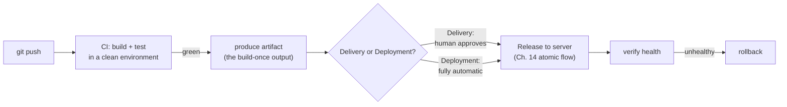
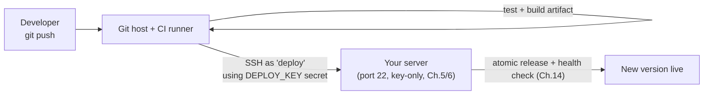

# Chapter 15 — CI/CD Pipelines

> *Part IV · Deployment & Operations — Chapter 15 of 18*

In Chapter 14 you designed and hand-performed a safe deployment: build an artifact, transfer it, flip an atomic release, verify its health, and roll back if it's broken. That was the *right* process — but you did it manually, and manual processes drift, get skipped under pressure, and vary between people. This chapter removes the human from the loop. You'll build a **pipeline** that, the moment you push code, automatically builds it, runs your tests, produces the artifact, ships it to the server, performs the release, and verifies it — with the ability to roll back. This is where the whole handbook converges: the SSH foundation (Ch. 5), the service model (Ch. 10), the secrets discipline (Ch. 12), and the deployment lifecycle (Ch. 14) all combine into a professional, push-button — eventually push-*nothing* — deployment.

---

## Goal

By the end of this chapter you will:

1. Understand what **CI (Continuous Integration)** and **CD (Continuous Delivery/Deployment)** actually mean, and the difference between them.
2. Understand the anatomy of a **pipeline**: triggers, jobs, steps, runners, and stages.
3. Understand *why* automating the pipeline is safer than deploying by hand.
4. Compare the major CI/CD platforms and know why we use **GitHub Actions** as the worked example.
5. Give a pipeline **secure, least-privilege access** to your server (a dedicated deploy key and secrets) — without weakening Chapters 5/6.
6. Build a working pipeline: **test → build → deploy** using the atomic-release flow from Chapter 14.
7. Understand pipeline **security**, secrets management, and safe rollout/rollback practices.

---

## Background

### CI and CD: two related but distinct ideas

The acronyms blur together; keep them separate:

- **CI — Continuous Integration.** Every time code is pushed, it is automatically **built and tested** in a clean environment. The goal: catch breakage *immediately*, and keep the main branch always in a working, mergeable state. CI answers *"does this code build and pass its tests?"*
- **CD — Continuous Delivery.** CI plus automatically producing a **deployable artifact** that is *ready* to release — but the final push to production is a **manual approval** (a human clicks "deploy"). CD answers *"is this always ready to ship on demand?"*
- **CD — Continuous Deployment.** The fully automatic version: every change that passes the pipeline is **deployed to production with no human step**. CD (deployment) answers *"does every green build go live automatically?"*



> 🧭 **Which should *you* start with?** Continuous **Delivery** — automate everything up to a **manual approval** for the production release. It gives you all the safety of automation while keeping a human finger on the trigger. Graduate to full continuous **deployment** later, once your tests, health checks, and rollback are battle-tested and you trust them.

### Anatomy of a pipeline

Whatever the platform, the vocabulary is nearly universal:

| Term | What it is |
|---|---|
| **Pipeline / workflow** | The whole automated process, defined as code in a file in your repo. |
| **Trigger / event** | What starts it — a push, a pull request, a tag, a schedule, a manual click. |
| **Job** | A unit of work that runs on one machine (e.g. "test", "build", "deploy"). Jobs can run in parallel or depend on each other. |
| **Step** | A single command or action within a job (e.g. "install deps", "run tests"). |
| **Runner** | The machine that executes a job — a cloud VM the platform provides, or a **self-hosted** runner you run yourself. |
| **Stage** | A logical grouping/ordering of jobs (test → build → deploy). |
| **Secret** | An encrypted value (SSH key, token, DB password) the pipeline can use but that never appears in logs or code. |

**Pipeline-as-code** is the key idea: the entire process lives in a version-controlled file (e.g. `.github/workflows/deploy.yml`) *next to your application code*. It's reviewed, diffed, and rolled back like any code — the opposite of clicking through a UI nobody remembers configuring.

### Why automation is *safer*, not just faster

Beginners think CI/CD is about speed. The bigger win is **consistency and safety**:

- **The process runs the same way every time** — no forgotten steps, no "I did it slightly differently today."
- **Tests always run** before deploy — you can't skip them under deadline pressure.
- **Builds happen in a clean environment** — no "works because of something left over on my laptop" (the artifact/drift problem from Chapter 14).
- **The deploy steps are the reviewed, rollback-capable ones** from Chapter 14, executed identically every time.
- **There's an audit trail** — every deploy is logged: who triggered it, what commit, whether it passed. Accountability by default.

Automation turns deployment from a nervous manual ritual into a boring, repeatable, observable event — and *boring* is exactly what you want in production.

### How the pipeline reaches your server (securely)

This is the part that intersects with everything you hardened. The pipeline (running on a runner somewhere) needs to get the artifact onto your server and run the release — which means it needs **SSH access**. Doing this *without* undermining Chapters 5–6 is the crux:

- **A dedicated deploy SSH key**, not your personal one. Generate a key pair used *only* by the pipeline, install its public key in the `deploy` user's `authorized_keys` (Chapter 5), and store the **private** key as an encrypted pipeline **secret**. If it's ever compromised, you revoke that one key — your personal access is untouched.
- **Least privilege for the deploy user.** The pipeline logs in as `deploy` and uses only the specific commands the release needs. Advanced setups restrict the key to a single command (`command="..."` in `authorized_keys`) or a tightly-scoped `sudoers` rule (Chapter 3) so a stolen key can't do anything but deploy.
- **Secrets stay secret.** The private key, server IP, and any tokens live in the platform's encrypted secret store — never in the repo, never printed in logs (Chapter 12's "secrets not in code," extended to the pipeline).
- **The firewall stays closed.** The pipeline connects over the SSH port you already allow (Chapter 6); you open nothing new. (If you restrict SSH by source IP, note that cloud runners have changing IPs — either allow the platform's ranges, use a self-hosted runner, or keep SSH open but key-only.)



### Push-based vs pull-based deployment

Two models for the "get it onto the server" step:

| Model | How | Pros | Cons |
|---|---|---|---|
| **Push** (pipeline → server) | The CI runner SSHes in and runs the release. | Simple, direct, common; easy to reason about. | The runner needs inbound SSH access + a key. |
| **Pull** (server → source) | The server (or an agent on it) watches for new artifacts/images and pulls them. | Server needs no inbound deploy access; scales well; GitOps-friendly. | More infrastructure (an agent/watcher). |

For a single server, **push-based over SSH** is the pragmatic, transparent choice — and it directly reuses the SSH and deployment skills you already have. We'll build that.

---

## Why is this necessary?

- **Manual deploys don't scale and don't stay safe.** The careful process from Chapter 14 is only reliable if it runs *identically every time* — which humans don't. Automation is what makes "safe deployment" a permanent property instead of a good intention.
- **Tests that run automatically are the ones that protect you.** Optional tests get skipped under pressure. A pipeline makes passing tests a *precondition* for deployment.
- **It removes the scariest variable: the human under stress.** At 2 a.m. during an incident, "run the rehearsed pipeline / click rollback" beats "remember the 12 manual steps correctly."
- **It's the industry baseline.** Professional teams ship via pipelines. Understanding CI/CD is essential to collaborating on and operating modern software — and it's the capstone that connects every earlier chapter.

---

## What would happen if we skipped this step?

- **Deployments would stay manual and fragile** — dependent on one person remembering the steps, and drifting over time.
- **Tests would be inconsistently run** — "I'll test it later" becomes "it broke in production."
- **No audit trail** — you couldn't easily answer "what commit is live? who deployed it? did it pass tests?"
- **Onboarding and bus-factor pain** — deployment knowledge trapped in one person's head; nobody else can safely ship.
- **Slower, riskier releases** — friction discourages small, frequent, low-risk deploys and pushes teams toward rare, scary, big-bang releases.

---

## Alternative approaches

### CI/CD platform

| Platform | Pros | Cons | Verdict |
|---|---|---|---|
| **GitHub Actions** | Built into GitHub; huge marketplace of prebuilt actions; generous free tier; YAML pipeline-as-code; easy secrets. | Tied to GitHub; heavy usage can cost. | ✅ **Recommended worked example** — ubiquitous and beginner-friendly. |
| **GitLab CI/CD** | Deeply integrated with GitLab; powerful; built-in registry. | Best if you're already on GitLab. | ✅ Excellent if you use GitLab. |
| **Jenkins** | Self-hosted, infinitely flexible, huge plugin ecosystem, no vendor lock-in. | You operate/patch/secure it yourself; steeper setup. | ➕ Powerful for large/self-hosted orgs; more overhead. |
| **CircleCI / Travis / Drone / Woodpecker** | Various strengths; some self-hostable and lightweight. | Another account/tool; varying ecosystems. | ➕ All viable; pick by your git host and needs. |
| **A cron + shell script on the server** | Dead simple; no external platform. | No clean-room build, weak audit trail, no PR integration; reinvents CI badly. | ➖ Better than nothing; not real CI/CD. |

**Why GitHub Actions:** it's the most widely used, lives right next to your code, needs no separate infrastructure, has a prebuilt action for nearly everything (including SSH deploys), and its concepts (workflows/jobs/steps/secrets) transfer directly to every other platform. Learn it and you can read any of them.

### Where the runner lives

| Runner | Pros | Cons | Verdict |
|---|---|---|---|
| **Platform-hosted (cloud)** | Zero maintenance; clean environment each run; free tier. | Changing IPs (matters if you IP-restrict SSH); external machine touches your deploy key. | ✅ **Recommended** to start. |
| **Self-hosted runner** | Runs on infra you control; stable IP; can be on a private network near the server. | You maintain/patch/secure it (it's a powerful, sensitive machine). | ➕ For stable IPs, private networks, or heavy/custom builds. |

### Deploy mechanism (revisited from Chapter 14)

- **SSH + rsync/script (push):** ✅ our choice — transparent, reuses your skills, atomic-release flow from Chapter 14.
- **Container registry pull:** ✅ great if containerized (Ch. 13) — CI builds & pushes an image; the server pulls the tag.
- **Deploy tool (Capistrano/Deployer) invoked by CI:** ➕ nice once you outgrow a script.

---

## Commands

> This chapter's "commands" are split between **your server** (set up secure access once) and your **repository** (the pipeline file). We assume your app is in a GitHub repo and the server runs the Chapter 14 atomic-release layout under `/srv/myapp`. Log in as **`deploy`** for the server steps.

### 1 — On the server: create a dedicated deploy SSH key

Generate a key pair used **only** by the pipeline (not your personal key):
```bash
ssh-keygen -t ed25519 -f ~/.ssh/deploy_ci -C "ci-deploy@myapp" -N ""
```
- **What it does:** creates `~/.ssh/deploy_ci` (private) and `~/.ssh/deploy_ci.pub` (public) — a fresh ed25519 pair (Chapter 5). `-f` sets the filename; `-C` a label; `-N ""` sets an **empty passphrase** (the pipeline can't type one interactively — this is the accepted trade-off for a *dedicated, revocable, least-privilege* key).
- **Why a separate key:** if the pipeline's key leaks, you revoke *only* it. Your personal key and access are never involved. This is least privilege (Chapter 3) applied to automation.

Authorize this key for the `deploy` user (append its **public** half to `authorized_keys`, Chapter 5):
```bash
cat ~/.ssh/deploy_ci.pub >> ~/.ssh/authorized_keys
chmod 600 ~/.ssh/authorized_keys
```
- **Verify:** the pipeline will use the *private* key to log in as `deploy`. Test from your laptop by copying `deploy_ci` locally and running `ssh -i deploy_ci deploy@SERVER_IP` — it should log in with no password.
- **(Hardening, optional but recommended):** restrict what this key may do by prefixing its line in `authorized_keys` with a forced command or options, e.g. `restrict,command="/srv/myapp/bin/deploy.sh" ssh-ed25519 AAAA...`. Then a stolen key can run *only* your deploy script, nothing else. Start simple, add this once the pipeline works.

Now print the **private** key so you can paste it into GitHub as a secret (next step), then remove it from the server if you generated it there:
```bash
cat ~/.ssh/deploy_ci
```
- Copy the entire output (including the `-----BEGIN/END-----` lines). **This is the sensitive value** — treat it carefully; it goes only into the encrypted secret store.

### 2 — In GitHub: store the secrets

In your repository on GitHub: **Settings → Secrets and variables → Actions → New repository secret.** Create:

| Secret name | Value |
|---|---|
| `SSH_PRIVATE_KEY` | the full contents of `deploy_ci` (the private key from Step 1) |
| `SERVER_HOST` | your server's IP or domain |
| `SERVER_USER` | `deploy` |
| `KNOWN_HOSTS` | output of `ssh-keyscan SERVER_IP` (pins the server's host key so the pipeline verifies it — Chapter 1) |

- **What these do:** the workflow reads them via `${{ secrets.NAME }}`. GitHub encrypts them at rest and **masks them in logs** — they never appear in plaintext output (Chapter 12's secrets discipline, enforced by the platform).
- **Get `KNOWN_HOSTS`** by running on your laptop or server: `ssh-keyscan -t ed25519 SERVER_IP`. Pinning it prevents man-in-the-middle attacks on the pipeline's SSH connection (the host-key idea from Chapter 1).
- **Never** commit any of these values to the repo. That's the entire point of the secret store.

### 3 — On the server: write the deploy script the pipeline will call

Keeping the release logic in a **script on the server** (rather than sprawled across the workflow YAML) is cleaner, reviewable, and pairs perfectly with the forced-command hardening above. This is the Chapter 14 atomic flow, scripted:

```bash
mkdir -p /srv/myapp/bin && nano /srv/myapp/bin/deploy.sh
```
```bash
#!/usr/bin/env bash
set -euo pipefail                      # fail fast: exit on error/unset var/pipe failure

APP_DIR=/srv/myapp
REL="$APP_DIR/releases/$(date +%Y%m%d-%H%M%S)"
ARTIFACT="${1:-/tmp/artifact.tar.gz}"  # the uploaded build

echo "==> Creating release $REL"
mkdir -p "$REL"
tar -xzf "$ARTIFACT" -C "$REL"         # unpack the build-once artifact
ln -sfn "$APP_DIR/shared/.env" "$REL/.env"   # link shared secrets (Ch.12/14)

echo "==> Running migrations (backward-compatible)"
# (cd "$REL" && npm run migrate)       # uncomment/adapt for your app

echo "==> Atomic flip"
ln -sfn "$REL" "$APP_DIR/current"      # the atomic switch (Ch.14)
sudo systemctl restart myapp           # needs a scoped sudoers rule (see note)

echo "==> Health check"
for i in {1..10}; do
  if curl -fsS http://127.0.0.1:3000/health >/dev/null; then
    echo "==> Healthy. Pruning old releases."
    ls -1dt "$APP_DIR"/releases/*/ | tail -n +6 | xargs -r rm -rf
    exit 0
  fi
  sleep 2
done

echo "!! Unhealthy — rolling back"
PREV=$(ls -1dt "$APP_DIR"/releases/*/ | sed -n '2p')
ln -sfn "${PREV%/}" "$APP_DIR/current"
sudo systemctl restart myapp
exit 1                                  # fail the pipeline so you're alerted
```
```bash
chmod +x /srv/myapp/bin/deploy.sh
```
- **What it does:** exactly the Chapter 14 lifecycle — unpack artifact → link secrets → migrate → **atomic symlink flip** → **health-check with retries** → prune on success, **auto-rollback on failure** → exit non-zero so the pipeline reports red. `set -euo pipefail` makes the script abort on the first error rather than blundering on.
- **The `sudo systemctl restart myapp` note:** so the passphrase-less deploy key can restart the service *without* full sudo, add a **scoped** sudoers rule (Chapter 3) via `sudo visudo -f /etc/sudoers.d/deploy`:
  ```
  deploy ALL=(root) NOPASSWD: /usr/bin/systemctl restart myapp, /usr/bin/systemctl reload myapp
  ```
  This grants password-less rights to *only those two exact commands* — least privilege, not blanket sudo.
- **Verify:** run it by hand once — `/srv/myapp/bin/deploy.sh /tmp/some-artifact.tar.gz` — and watch it release, health-check, and (if you break the app on purpose) roll back.

### 4 — In the repo: the CI half (test + build)

Create `.github/workflows/deploy.yml`. First, the **CI** jobs — run on every push:

```yaml
name: CI/CD

on:
  push:
    branches: [ main ]          # trigger on push to main

jobs:
  test:
    runs-on: ubuntu-latest      # a platform-hosted runner (clean environment)
    steps:
      - uses: actions/checkout@v4          # get the code
      - uses: actions/setup-node@v4        # (example: Node app)
        with: { node-version: '20' }
      - run: npm ci                        # install deps reproducibly
      - run: npm test                      # RUN THE TESTS — the gate

  build:
    needs: test                 # only build if tests passed
    runs-on: ubuntu-latest
    steps:
      - uses: actions/checkout@v4
      - uses: actions/setup-node@v4
        with: { node-version: '20' }
      - run: npm ci && npm run build       # produce the artifact (build once)
      - run: tar -czf artifact.tar.gz dist package.json package-lock.json
      - uses: actions/upload-artifact@v4   # hand the artifact to the deploy job
        with: { name: app-artifact, path: artifact.tar.gz }
```
- **Line-by-line intent:**
  - `on: push: branches: [main]` — the **trigger** (Background).
  - `jobs.test` — CI: checkout, set up the runtime, install deps **reproducibly** (`npm ci`), and **run tests**. This is the gate; a failure stops everything.
  - `needs: test` — the `build` job runs **only if** `test` passed (job dependency).
  - `build` — produces the **artifact** *once*, in a clean runner, and uploads it for the next job. This is the "build once, deploy that" principle (Chapter 14) made literal.

### 5 — In the repo: the CD half (deploy over SSH)

Append the **deploy** job to the same file:

```yaml
  deploy:
    needs: build                # only after a successful build
    runs-on: ubuntu-latest
    # environment: production    # (optional) add a manual-approval gate here for Continuous *Delivery*
    steps:
      - uses: actions/download-artifact@v4
        with: { name: app-artifact }

      - name: Configure SSH
        run: |
          mkdir -p ~/.ssh
          echo "${{ secrets.SSH_PRIVATE_KEY }}" > ~/.ssh/id_ed25519
          chmod 600 ~/.ssh/id_ed25519
          echo "${{ secrets.KNOWN_HOSTS }}" > ~/.ssh/known_hosts

      - name: Upload artifact to server
        run: scp -i ~/.ssh/id_ed25519 artifact.tar.gz ${{ secrets.SERVER_USER }}@${{ secrets.SERVER_HOST }}:/tmp/artifact.tar.gz

      - name: Run release
        run: ssh -i ~/.ssh/id_ed25519 ${{ secrets.SERVER_USER }}@${{ secrets.SERVER_HOST }} '/srv/myapp/bin/deploy.sh /tmp/artifact.tar.gz'
```
- **Line-by-line intent:**
  - `needs: build` — deploy only a successfully-built artifact.
  - `environment: production` (commented) — uncomment to require a **manual approval** before this job runs — turning the pipeline into Continuous **Delivery** (recommended to start). Configure required reviewers in the repo's Environments settings.
  - **Configure SSH** — writes the deploy **private key** and **known_hosts** from secrets into the runner, with `600` perms (Chapter 5). Because `known_hosts` is pinned, the SSH connection verifies the server's identity (Chapter 1).
  - **Upload** — `scp` the artifact to the server over the hardened SSH (Chapter 5/6). Nothing new is opened in the firewall.
  - **Run release** — SSH in and invoke the server-side `deploy.sh`, which performs the atomic release, health check, and auto-rollback (Step 3). If the script exits non-zero (unhealthy), the SSH command fails and **the pipeline goes red** — you're alerted, and the server already rolled itself back.
- **Commit and push** this file to `main`. GitHub runs the workflow automatically; watch it under the repo's **Actions** tab.

### 6 — Watch it run, and verify

- Push a commit to `main`. In **Actions**, watch `test → build → deploy` execute in order. Green checkmarks = success.
- **Verify the deploy landed:** on the server, `ls -l /srv/myapp/current` points at a fresh release; `curl -fsS http://127.0.0.1:3000/health` succeeds; `https://your-domain` serves the new version.
- **Verify the safety net:** intentionally push a change that fails a test → the pipeline stops at `test`, **never deploys**. Then (carefully) simulate a bad-but-passing build that fails the health check → watch `deploy.sh` **auto-roll-back** and the pipeline report failure. This proves the guardrails work *before* you rely on them.
- **Audit trail:** each run records the commit, author, result, and logs — your deployment history, for free.

### 7 — (Container variant) build and push an image instead

If you containerized (Chapter 13), the pipeline builds and pushes an **image**, and the server pulls a **tag** (Chapter 14's cleanest model):
```yaml
      - uses: docker/build-push-action@v6
        with:
          push: true
          tags: ghcr.io/${{ github.repository }}:${{ github.sha }}
```
Then the deploy step SSHes in and runs `docker pull ...:<sha> && <swap container> && health-check`, with rollback = redeploy the previous tag. The image tag *is* the immutable, reproducible artifact.

---

## Verification Checklist

You've completed this chapter when **all** of the following are true:

- [ ] You can explain **CI vs Continuous Delivery vs Continuous Deployment**, and why starting with **Delivery** (manual approval) is prudent.
- [ ] You can name pipeline parts: **trigger, job, step, runner, secret**, and what **pipeline-as-code** means.
- [ ] A **dedicated deploy key** (not your personal key) is authorized for `deploy`, and its private half is stored **only** as an encrypted secret.
- [ ] Secrets (`SSH_PRIVATE_KEY`, `SERVER_HOST`, `SERVER_USER`, `KNOWN_HOSTS`) are in the platform's store, **not** in the repo.
- [ ] The workflow runs **test → build → deploy** on push, and **tests gate the deploy** (a failing test blocks release).
- [ ] The server-side `deploy.sh` performs the **atomic release + health check + auto-rollback** from Chapter 14, using a **scoped sudoers** rule (not blanket sudo).
- [ ] A successful push results in a new `current` release and a healthy site; a failing test blocks deploy; an unhealthy deploy **rolls back**.
- [ ] Nothing new was opened in the **firewall**; the pipeline uses the existing key-only SSH.

---

## Troubleshooting

| Symptom | Why it happens | How to fix |
|---|---|---|
| Deploy job: `Permission denied (publickey)` | The deploy key isn't authorized, wrong key in the secret, or bad perms on the runner. | Confirm `deploy_ci.pub` is in the server's `authorized_keys`; ensure `SSH_PRIVATE_KEY` holds the full private key incl. header/footer; the workflow `chmod 600` the key. Test `ssh -i deploy_ci deploy@host` locally. |
| `Host key verification failed` in the pipeline | `KNOWN_HOSTS` missing/wrong. | Regenerate with `ssh-keyscan -t ed25519 SERVER_IP`; store as the `KNOWN_HOSTS` secret. |
| `sudo: a password is required` during release | The `systemctl restart` needs a password; no scoped sudoers rule. | Add the `NOPASSWD` rule for the exact `systemctl` commands via `visudo -f /etc/sudoers.d/deploy` (Step 3). |
| Tests pass locally but fail in CI | Environment differences — reliance on local state, uncommitted files, or non-reproducible installs. | Use `npm ci` (lockfile) not `npm install`; commit everything needed; don't depend on machine-specific state. This is CI *doing its job* — surfacing drift. |
| Secrets appear in logs | Echoing a secret directly, or a tool printing it. | Never `echo` secrets; GitHub masks known secret values but avoid constructing/printing them. Rotate any leaked secret immediately. |
| Deploy succeeds but site unchanged | `deploy.sh` didn't flip `current`, or the service didn't restart/point at `current`. | Check `ls -l /srv/myapp/current`; ensure the unit uses `/srv/myapp/current`; read the Action logs and `journalctl -u myapp`. |
| Pipeline deploys a broken version to prod | No health-check gate, or health check too shallow. | Ensure `deploy.sh` health-checks real dependencies and rolls back on failure; consider the manual-approval `environment` gate (Continuous Delivery). |
| Cloud runner IP blocked by SSH source restriction | You IP-restricted SSH (Ch.6) but runner IPs change. | Allow the platform's IP ranges, use a **self-hosted runner** with a stable IP, or keep SSH key-only without IP restriction. |

> **First stops for pipeline problems:** the platform's **run logs** (they show the exact failing step and command), then on the server `sudo journalctl -u myapp -e` and `ls -l /srv/myapp/current`. Most failures are the SSH key/known_hosts, the sudoers rule, or a genuinely failing test — all things you now control.

---

## Best Practices

- **Start with Continuous *Delivery* (manual approval), graduate to Deployment.** Automate everything up to the production release, keep a human gate until your tests, health checks, and rollback have earned full trust.
- **Pipeline-as-code, in the repo.** Version, review, and diff the workflow like application code. No undocumented UI clicking.
- **Dedicated, least-privilege deploy credentials.** A separate revocable deploy key (never your personal one), a scoped `sudoers` rule (never blanket sudo), ideally a forced `command=` in `authorized_keys`. A leaked pipeline secret should be able to do *only* deploy, and be revocable in isolation.
- **Secrets only in the encrypted store.** SSH keys, hosts, tokens live in the platform's secrets, masked in logs, never in the repo (Chapter 12). Rotate on any suspicion of leak.
- **Tests must gate deploys.** A red build never ships. This is the core value of CI — make it non-negotiable.
- **Reuse the reviewed deploy flow.** The pipeline runs the *same* atomic-release + health-check + rollback from Chapter 14 — don't invent a second, unreviewed deploy path in YAML.
- **Keep the server hardening intact.** The pipeline uses the existing key-only SSH (Ch.5) over the already-allowed port (Ch.6). Automation must not become an excuse to weaken security.
- **Make failure loud and rollback automatic.** Health-check with retries; auto-rollback on failure; exit non-zero so the pipeline goes red and you're notified (ties into Chapter 17 monitoring/alerting).

---

## Summary

### What you learned

- The distinction between **CI** (auto build + test on every push), **Continuous Delivery** (always shippable, human approves the release), and **Continuous Deployment** (every green build goes live automatically) — and why starting with **Delivery** is the prudent path.
- The universal **pipeline anatomy** — trigger, job, step, runner, stage, secret — and the **pipeline-as-code** principle of keeping the whole process in a version-controlled file beside your app.
- Why automation is **safer, not just faster**: identical runs, mandatory tests, clean-room builds, reviewed deploy steps, and a built-in audit trail.
- How a pipeline reaches your server **securely** — a **dedicated, revocable deploy key** authorized for `deploy`, secrets in the encrypted store with **`KNOWN_HOSTS` pinning**, a **scoped sudoers** rule, and **no new firewall openings** — reusing Chapters 5, 6, 3, and 12 rather than weakening them.
- Building a real **GitHub Actions** pipeline: `test → build (artifact) → deploy`, where tests gate the deploy and the server-side **`deploy.sh`** performs the Chapter 14 **atomic release + health check + auto-rollback**; plus the **container-image** variant using an immutable tag.
- How to **verify the guardrails** (a failing test blocks deploy; an unhealthy deploy rolls back) *before* trusting them, and the common failure modes (keys, known_hosts, sudoers, non-reproducible tests).

### What you'll build next

**Chapter 16 — Backups & Disaster Recovery.** You can now ship code safely and automatically — but shipping isn't the scariest failure mode. The scariest is **losing data**: a dropped database, a corrupted disk, a ransomware event, a fat-fingered `DROP TABLE`, or the whole VPS vanishing. Deployment rollback (Chapters 14–15) restores *code*; it cannot bring back *data* that's gone. In Chapter 16 you'll build a real backup strategy — what to back up (that database from Chapter 12 above all), the 3-2-1 rule, automated and *tested* restores, offsite/encrypted storage, and a disaster-recovery plan — so that when (not if) something goes catastrophically wrong, you can rebuild and recover. This is the safety net beneath everything you've built.

> ✅ **Ready to continue?** Confirm and we'll proceed to Chapter 16. If your pipeline failed at the SSH, secrets, or health-check step, tell me exactly which step went red and its log output (plus `ls -l /srv/myapp/current` and `sudo journalctl -u myapp -e` on the server), and we'll fix it before we build the backup safety net.
