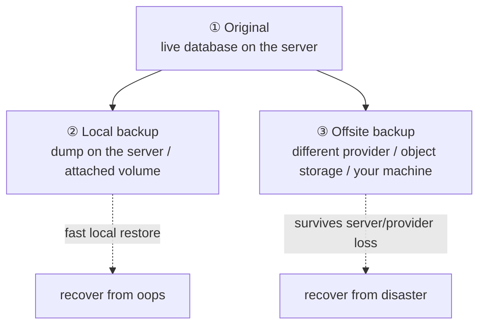

# Chapter 16 — Backups & Disaster Recovery

> *Part IV · Deployment & Operations — Chapter 16 of 18*

You can now deploy safely and automatically, and roll back a bad *release* in seconds (Chapters 14–15). But rollback restores **code** — it cannot bring back **data** that is gone. And data disappears in more ways than beginners expect: a fat-fingered `DROP TABLE`, a buggy migration, a corrupted disk, a ransomware event, a compromised account that deletes everything, a billing lapse that terminates your VPS, or simply the provider's hardware failing. When that happens, the only thing standing between you and total loss is a **backup you can actually restore from**. This chapter builds that safety net properly: not just "make copies," but the professional discipline of *what* to back up, *where*, *how often*, and — the part almost everyone gets wrong — *proving the restore works before you need it*.

---

## Goal

By the end of this chapter you will:

1. Understand what a backup *is* (and the critical difference between a backup, a snapshot, and redundancy like RAID).
2. Understand the **threat model**: the many independent ways data is lost, and why each needs covering.
3. Understand the **3-2-1 rule** and the properties of a *good* backup (offsite, encrypted, versioned, tested).
4. Understand **RPO** and **RTO** — how much data you can afford to lose and how fast you must recover.
5. Back up your **database** (Chapter 12) correctly with logical dumps, and your **application data/config**.
6. **Automate** backups on a schedule and ship them **offsite**, encrypted.
7. **Test a restore** end-to-end — the step that turns "we have backups" into "we can recover" — and write a **disaster-recovery runbook**.

---

## Background

### What a backup is — and what it is *not*

A **backup** is an independent, restorable copy of your data, kept *separately* from the original, so that if the original is lost or corrupted you can reconstruct it. That word *independent* is doing heavy lifting. Several things people mistake for backups are **not** backups:

| Thing | Why it's NOT a backup |
|---|---|
| **RAID / disk redundancy** | Protects against *one disk* failing. Does nothing against deletion, corruption, ransomware, or the whole server being lost — the bad data/command is faithfully mirrored to all disks instantly. |
| **A replica / standby database** | Protects against a server failing. But a `DROP TABLE` or corruption **replicates to the replica too**. Great for availability, not for recovery from *logical* damage. |
| **A provider snapshot alone** | Useful (see below), but it lives *at the same provider*, tied to your account. If the account is compromised or the provider has a catastrophe, it can vanish with the original. |
| **A copy on the same server/disk** | Gone with the server. An offsite copy is the whole point. |

> 🧠 **The core principle:** a backup must survive the destruction of the *original* **and** of the *thing that destroyed it*. If a single event (disk failure, account compromise, provider outage, ransomware) can take out both the data and its copy, that copy isn't protecting you.

### Snapshots vs backups (both have a place)

- A **snapshot** is a point-in-time image of a whole disk/VM, usually taken by your VPS provider. Fast to take, fast to restore the *entire machine*, great for "undo the last hour before I rebuilt the server." But it's coarse (whole-disk), provider-locked, and account-bound.
- A **backup** (in the sense we build here) is a *portable, offsite, application-level* copy — especially a **database dump** — that you can restore *anywhere*, even onto a brand-new server at a different provider.

Use **both**: provider snapshots for quick whole-machine rollback, and your own offsite backups for true disaster recovery and data-level restores. This chapter focuses on the backups you *own and control*, because those are the ones that save you when the provider itself is the problem.

### The threat model: how data actually dies

Design backups against the *full range* of failures, not just "disk broke":

- **Human error** — `DROP TABLE`, wrong `WHERE` on a `DELETE`, `rm -rf` the wrong path, a bad deploy that mangles data. (The most common cause by far.)
- **Software bugs** — a faulty migration or app bug corrupts records over days before anyone notices (which is why **versioned history**, not just "last night," matters).
- **Malicious action** — a compromised account or ransomware that encrypts/deletes data *and* any backups it can reach (which is why offsite + restricted-access backups matter).
- **Infrastructure failure** — disk corruption, the VPS being terminated (billing lapse, ToS issue), a provider-wide outage or data-center incident.
- **Loss of access** — you lose the provider account, or a region goes away.

Each of these defeats *some* protections and not others. The 3-2-1 rule exists precisely because no single copy or location survives all of them.

### The 3-2-1 rule

The industry baseline, worth memorizing:

> **3** copies of your data, on **2** different types of media/location, with **1** copy **offsite**.



- **3 copies:** the live data + at least two backups. One backup can be corrupt or mid-write; you want another.
- **2 locations/media:** not all eggs in one basket — e.g. on-server *and* in object storage.
- **1 offsite:** at minimum one copy **not** on the same server or even the same provider/account, so a single catastrophe can't take everything.

### Properties of a *good* backup

Making copies isn't enough. A backup you can rely on is:

| Property | Why |
|---|---|
| **Offsite** | Survives the loss of the server/provider (3-2-1). |
| **Automated** | Humans forget. A backup that depends on you remembering is a backup you don't have. |
| **Encrypted** | Backups contain your most sensitive data (the whole database!). At rest and in transit, they must be encrypted so a leaked backup isn't a breach. |
| **Versioned / retained** | Keep *history* (e.g. daily for 2 weeks, weekly for 3 months). Corruption often isn't noticed for days — "last night's backup" may already contain the damage. |
| **Access-restricted** | The backup destination should be write-only-ish from the server (ideally append-only / immutable), so a compromised server can't *delete* its own offsite history (ransomware defense). |
| **Monitored** | You must know if a backup *fails*. Silent failure = discovering you have no backups exactly when you need one. |
| **Tested** | ⭐ The one that matters most — see below. |

### RPO and RTO: quantifying "how bad can it be?"

Two terms that turn vague fear into design decisions:

- **RPO — Recovery Point Objective:** how much *data* can you afford to lose, measured in time? If you back up nightly, your RPO is ~24 hours — a disaster could lose up to a day of data. Need less? Back up more often (hourly, or continuous WAL archiving for databases).
- **RTO — Recovery Time Objective:** how *long* can you afford to be down while recovering? This drives how fast/rehearsed your restore must be, and whether you keep warm standbys or provider snapshots for speed.

Decide these *deliberately* for your app. A hobby blog might accept RPO=24h/RTO=few-hours. A store taking orders needs much tighter numbers. Your backup frequency, retention, and restore rehearsal all follow from RPO/RTO.

### The rule everyone breaks: an untested backup is not a backup

This is the single most important sentence in the chapter:

> **A backup you have never restored is not a backup — it is a hope.**

Backups fail silently in a dozen ways: the dump was empty, the cron job stopped months ago, the file is corrupt, the encryption key is lost, the restore command doesn't actually work, a dependency is missing. You discover *all* of these at the worst possible moment — during a real disaster — **unless you test restores regularly**. Testing the restore is not optional polish; it is the part that makes everything above *real*. We will test it in this chapter, and you should test it on a schedule forever after.

---

## Why is this necessary?

- **Data is the one thing you cannot rebuild.** Code is in git; the server can be re-provisioned in an hour with everything from Parts I–III; TLS re-issues (Chapter 11). But the *data* — users, orders, content — exists nowhere else. Lose it without a backup and it is gone permanently.
- **Rollback doesn't cover this.** Chapters 14–15 restore code versions; they are powerless against a dropped table or a wiped disk. Backups are the *only* protection for data-loss events.
- **The failure is a certainty, not a risk.** Over a long enough timeline, hardware fails, humans err, and attackers strike. Backups convert an *extinction-level* event into an *inconvenience*.
- **It's the foundation of confidence.** Knowing you can recover is what lets you deploy boldly, experiment, and sleep. It's the safety net beneath the entire handbook.

---

## What would happen if we skipped this step?

- **One bad moment ends everything.** A single `DROP TABLE`, ransomware event, or terminated VPS permanently destroys all user data — often fatal for a real project or business.
- **You'd have a false sense of safety from non-backups.** Trusting RAID, a replica, or a same-account snapshot means believing you're protected right up until the event those *don't* cover happens.
- **"We have backups" without tested restores.** The cruelest outcome: you did make copies, but during the disaster you discover they're empty/corrupt/unrestorable — all the effort, none of the protection.
- **No recovery plan under pressure.** Without a runbook, recovery becomes frantic improvisation during your worst day, extending downtime and risking further mistakes.

---

## Alternative approaches

### What/how to back up a database

| Approach | What it is | Pros | Cons | Verdict |
|---|---|---|---|---|
| **Logical dump (`pg_dump`/`mysqldump`)** | Export the DB to a portable SQL/archive file. | Portable across versions/hosts; simple; easy offsite; restore anywhere. | Point-in-time only (as of the dump); slower for huge DBs. | ✅ **Recommended** starting point — our approach. |
| **Physical/base backup + WAL archiving (PITR)** | Copy DB files + continuously archive the write-ahead log. | **Point-in-time recovery** (restore to any second); low RPO. | More complex to set up and restore. | ➕ Graduate to this when RPO must be tight. |
| **Provider snapshot** | Whole-disk image at the provider. | Fast whole-machine restore. | Coarse, provider/account-bound, not portable. | ➕ Complement, not a substitute. |
| **Copy the raw DB files while running** | `cp` the data dir of a live DB. | — | **Corrupt/inconsistent** — the DB is mid-write. | ❌ Never on a running DB. Use dumps or proper base backups. |

### Where to store backups (offsite target)

| Target | Pros | Cons | Verdict |
|---|---|---|---|
| **Object storage (S3/B2/Spaces/…)** | Cheap, durable, offsite, supports versioning & immutability/lifecycle rules. | Another account; egress/API to learn. | ✅ **Recommended** offsite target. |
| **A different provider / second server** | Independent failure domain. | You manage it. | ➕ Good, especially cross-provider. |
| **Your own machine / NAS (pull)** | Fully under your control; server needs no delete rights. | Must be reliably online; capacity. | ➕ Nice as an *additional* copy. |
| **Same server / same provider only** | Easy. | Fails the "offsite" test — dies with the server/account. | ❌ Not sufficient alone. |

### Tooling

| Tool | Pros | Cons | Verdict |
|---|---|---|---|
| **`pg_dump`/`mysqldump` + a script + cron/timer + `rclone`** | Transparent, no lock-in, teaches the mechanics; you control every step. | You maintain it. | ✅ **Great for learning & single servers** — we build this. |
| **restic / BorgBackup** | Deduplicated, **encrypted**, incremental, snapshot-style, prune/retention built in; excellent for files. | A tool to learn. | ✅ **Highly recommended** for file/system backups; pairs with DB dumps. |
| **Managed/provider backup service** | Hands-off, monitored. | Cost; provider-bound; verify it's truly offsite/portable. | ➕ Convenient; still keep an independent copy. |

**Our approach:** logical **`pg_dump`** for the database + **restic** (encrypted, versioned) for files/dumps, pushed to **object storage offsite**, scheduled with a **systemd timer** (Chapters 7/10), **monitored**, and — above all — **restore-tested**.

---

## Commands

> Log in as **`deploy`** (Chapter 5). Use `sudo` where noted. We'll (1) dump the database, (2) back up files, (3) encrypt + push offsite with restic, (4) automate on a timer, and (5) **test a full restore**. Principles are identical for MySQL/MariaDB (`mysqldump`) and any app data.

### 1 — Take a correct database dump (logical backup)

```bash
sudo -u postgres pg_dump -Fc myapp_db > /srv/backups/myapp_db-$(date +%Y%m%d-%H%M%S).dump
```
- **What it does:** `pg_dump` exports the `myapp_db` database (Chapter 12) to a single file. `-Fc` = the **custom compressed format** (smaller, and restorable selectively with `pg_restore`). We run it as the `postgres` OS user (Chapter 12's peer-auth model). The filename is timestamped for versioning.
- **Why a dump, not a file copy:** a dump is a **consistent** point-in-time export taken through the database engine — copying raw files of a *running* DB gives a corrupt, half-written result (Alternatives).
- **First, create the backup dir:** `sudo mkdir -p /srv/backups && sudo chown deploy:deploy /srv/backups`.
- **Expected:** a `.dump` file appears; `ls -lh /srv/backups` shows it with a non-trivial size (an empty/tiny file is a red flag — investigate).
- **Whole-cluster option:** `pg_dumpall` also captures roles/permissions across all databases — useful for full recovery. For MySQL: `mysqldump --single-transaction --routines --triggers myapp_db > ...` (`--single-transaction` gives a consistent snapshot without locking).
- **Common mistakes:** dumping as the wrong user (permission denied); forgetting `-Fc` and getting a plain SQL file (fine, but larger and less flexible); not checking the file is non-empty.

### 2 — Back up application data and critical config

Your database is the crown jewel, but a full recovery also needs *stateful* files and the config that isn't in git:

```bash
tar -czf /srv/backups/appdata-$(date +%Y%m%d-%H%M%S).tar.gz \
  /srv/myapp/shared \
  /etc/nginx/sites-available \
  /etc/myapp.env 2>/dev/null
```
- **What it does:** archives the **`shared/`** directory (uploads, `.env` — Chapters 12/14), your **Nginx site configs** (Chapter 9), and the app's env file. `-czf` = create, gzip, to file.
- **What NOT to bother backing up:** anything reproducible from git (your code) or re-installable (packages, the OS) — Parts I–III can rebuild those. Back up the **irreplaceable**: data, secrets, and hand-made config. (Though backing up `/etc` broadly is cheap insurance.)
- **Don't forget:** TLS certs auto-reissue (Chapter 11), but backing up `/etc/letsencrypt` saves a re-issue; the systemd unit files in `/etc/systemd/system` are worth capturing too.
- **Verify:** `tar -tzf <file> | head` lists the archived paths.

### 3 — Encrypt and push offsite with restic

Local dumps protect against "oops"; **offsite + encrypted** protects against disaster. **restic** does dedup, encryption, versioning, and retention in one tool.

Install and initialize a repository on object storage (example: an S3-compatible bucket):
```bash
sudo apt install restic
export RESTIC_REPOSITORY="s3:https://s3.example-region.amazonaws.com/my-backup-bucket"
export RESTIC_PASSWORD="A_STRONG_ENCRYPTION_PASSPHRASE"   # (in practice: from a protected file)
export AWS_ACCESS_KEY_ID="..."      # object-storage credentials
export AWS_SECRET_ACCESS_KEY="..."
restic init
```
- **What it does:** `restic init` creates an **encrypted** backup repository in your bucket. Everything restic stores is encrypted with `RESTIC_PASSWORD` **before** it leaves the server — so the storage provider (and anyone who steals the bucket) sees only ciphertext.
- **⚠️ Guard the encryption passphrase like the data itself:** lose `RESTIC_PASSWORD` and your backups are **unrecoverable** (that's the point of encryption). Store it somewhere safe and *separate* from the server (a password manager). This is a real operational responsibility.
- **Credentials handling:** put these env vars in a `600` root-owned file (e.g. `/etc/restic.env`, sourced by the backup script) — never in code or the repo (Chapter 12).

Back up the dumps + data offsite:
```bash
restic backup /srv/backups /srv/myapp/shared
```
- **What it does:** uploads a new **snapshot** (versioned, deduplicated, encrypted) containing your dumps and data. Only changed data is uploaded after the first run.
- **Verify:** `restic snapshots` lists snapshots with timestamps; `restic stats` shows repository size.

Apply a **retention policy** (versioned history, pruned):
```bash
restic forget --keep-daily 14 --keep-weekly 8 --keep-monthly 12 --prune
```
- **What it does:** keeps 14 daily, 8 weekly, 12 monthly snapshots and deletes the rest, reclaiming space. This gives you *history* (to recover from corruption noticed days later) without unbounded growth.

> 🔒 **Ransomware-resistance tip:** configure the bucket with **object-lock/immutability** or **append-only** credentials so the server can *add* backups but not *delete* them. Then even a fully compromised server can't wipe your offsite history. restic also supports an `--append-only` mode on the repo side.

### 4 — Automate: a backup script + systemd timer

Put it together in a script:
```bash
sudo nano /usr/local/bin/backup.sh
```
```bash
#!/usr/bin/env bash
set -euo pipefail
source /etc/restic.env                     # RESTIC_* and object-storage creds (chmod 600)
STAMP=$(date +%Y%m%d-%H%M%S)
DEST=/srv/backups

# 1) Consistent DB dump
sudo -u postgres pg_dump -Fc myapp_db > "$DEST/myapp_db-$STAMP.dump"
# 2) Ship encrypted, offsite
restic backup "$DEST" /srv/myapp/shared --tag automated
# 3) Retention
restic forget --keep-daily 14 --keep-weekly 8 --keep-monthly 12 --prune
# 4) Prune local dumps older than 3 days (offsite keeps the history)
find "$DEST" -name '*.dump' -mtime +3 -delete
echo "Backup $STAMP completed OK"
```
```bash
sudo chmod +x /usr/local/bin/backup.sh
```
- **What it does:** the full pipeline — dump → offsite encrypted upload → retention → local cleanup — with `set -euo pipefail` so any failure aborts loudly.

Create the timer (the systemd scheduling you met in Chapters 7 & 10):
```bash
sudo nano /etc/systemd/system/backup.service
```
```ini
[Unit]
Description=Application backup
[Service]
Type=oneshot
ExecStart=/usr/local/bin/backup.sh
```
```bash
sudo nano /etc/systemd/system/backup.timer
```
```ini
[Unit]
Description=Run backup daily
[Timer]
OnCalendar=*-*-* 02:30:00        # every day at 02:30 (server time — Chapter 8)
Persistent=true                  # if the server was off at 02:30, run at next boot
[Install]
WantedBy=timers.target
```
```bash
sudo systemctl daemon-reload
sudo systemctl enable --now backup.timer
```
- **What it does:** schedules the backup daily at 02:30. **`Persistent=true`** catches up a missed run (e.g. server was down). This sets your **RPO** to ~24h; tighten `OnCalendar` (e.g. `hourly`) for a smaller RPO.
- **Why a timer, not cron:** it integrates with the journal (`journalctl -u backup.service`), handles missed runs, and matches the systemd model you already use. (cron works too — `crontab -e` — if you prefer.)
- **Verify:** `systemctl list-timers | grep backup` shows the next run; run it once now with `sudo systemctl start backup.service` and check `journalctl -u backup.service -e` for `completed OK`.

### 5 — Monitor for *failure* (silent failure is the enemy)

```bash
systemctl status backup.service
sudo journalctl -u backup.service --since "yesterday"
```
- **What it does:** shows whether the last backup succeeded or failed. A backup system with no failure alerting will fail silently for months.
- **Make failures loud:** add a notification on failure — e.g. an `OnFailure=` unit that emails/pings you, or a **dead-man's-switch** (healthchecks.io-style: the script pings a URL on success; if the ping *stops*, you get alerted). We'll wire real alerting in Chapter 17; for now, at minimum, *check the timer's status regularly* and note that `set -euo pipefail` makes the unit report `failed` on any error.

### 6 — ⭐ TEST THE RESTORE (the step that makes it real)

**This is the most important command in the chapter.** Restore your backup somewhere safe and confirm the data is intact — *without* touching production.

Restore files from restic to a scratch directory:
```bash
restic restore latest --target /tmp/restore-test
ls -R /tmp/restore-test | head
```
- **What it does:** pulls the newest snapshot into `/tmp/restore-test`. Confirms restic, the passphrase, and the repo all actually work and the data is really there.

Restore the **database** into a throwaway database and verify contents:
```bash
sudo -u postgres createdb restore_test
sudo -u postgres pg_restore -d restore_test /tmp/restore-test/srv/backups/myapp_db-*.dump
sudo -u postgres psql -d restore_test -c "\dt"                        # tables present?
sudo -u postgres psql -d restore_test -c "SELECT count(*) FROM users;" # (example) real data?
sudo -u postgres dropdb restore_test                                  # clean up the test DB
```
- **What it does:** creates a **separate** database, restores the dump into it, and *checks that the tables and rows are actually there* — proving the dump is valid and restorable. Then drops the test DB. **Production is never touched.**
- **Why this is non-negotiable:** this exercise catches empty dumps, wrong formats, missing tables, a lost passphrase, or a broken command — *now*, calmly, instead of during a real disaster. **A backup is only proven by a successful restore.**
- **Do this on a schedule** (e.g. monthly), and *especially* after any change to the backup process, the database version, or the app's schema.
- **Common mistakes caught here:** dumping the wrong database; `-Fc` vs plain-SQL mismatch with `pg_restore` vs `psql`; the offsite copy silently empty; the encryption passphrase not actually saved anywhere.

### 7 — Write a disaster-recovery runbook

A backup without a *plan to use it* still means slow, error-prone recovery. Create a short, plain-language document (store it **off** the server — in your repo's wiki, a doc, a password manager note):

```
DISASTER RECOVERY RUNBOOK — myapp
Contacts: <you>, provider support link
Where backups live: restic repo s3://my-backup-bucket ; passphrase in <password manager entry>
Object-storage creds: <password manager entry>

TO REBUILD FROM SCRATCH (target RTO: 2 hours):
1. Provision a new Ubuntu 24.04 VPS.
2. Re-run hardening (Chapters 1-8): user, SSH keys, firewall, updates.
3. Install Nginx, PostgreSQL, app runtime (Chapters 9-12).
4. Install restic; set RESTIC_* env; `restic restore latest --target /`.
5. `createdb myapp_db`; `pg_restore -d myapp_db <dump>`.
6. Restore /srv/myapp/shared, Nginx configs, /etc/myapp.env.
7. Deploy latest code (Chapter 15 pipeline) or from last release.
8. Re-issue TLS (Chapter 11: `certbot --nginx`), point DNS at new IP.
9. Verify health; announce recovery.
```
- **Why write it down:** during a real disaster you will be stressed and possibly it'll be 3 a.m. A checklist you wrote calmly beats improvisation. It also captures your target **RTO** and where the *keys to the backups* live (a backup you can't decrypt is useless).
- **Verify:** the runbook references your actual paths, bucket, and — critically — *where the encryption passphrase and storage credentials are stored* (separate from the server).

---

## Verification Checklist

You've completed this chapter when **all** of the following are true:

- [ ] You can explain why **RAID/replica/same-account snapshot** are **not** backups, and state the **3-2-1 rule**.
- [ ] You can state your target **RPO** and **RTO** and how your backup frequency/retention follow from them.
- [ ] You take a **consistent DB dump** (`pg_dump -Fc`) — never a raw file copy of a running DB.
- [ ] You back up **irreplaceable data/secrets/config** (DB, `shared/`, env, key configs), not reproducible code/OS.
- [ ] Backups are pushed **offsite** and **encrypted** (e.g. restic to object storage), with a **retention policy** keeping history.
- [ ] Backups run **automatically** on a **systemd timer** with `Persistent=true`, and you can see success/failure in `journalctl`.
- [ ] You know **failure must be alerted** (silent failure is the enemy) — at minimum you check the timer regularly.
- [ ] ⭐ You **restored a backup end-to-end** into a throwaway DB and **verified real data**, without touching production.
- [ ] You have a written **disaster-recovery runbook** stored **off** the server, including where the encryption passphrase/credentials live.

---

## Troubleshooting

| Symptom | Why it happens | How to fix |
|---|---|---|
| Dump file is empty or tiny | Wrong DB name, permission error, or the DB is empty; error went unnoticed. | Run the dump manually and read stderr; confirm the DB name and that you run as `postgres`; check the file size in the script and fail if too small. |
| `pg_restore: error: ... unsupported version` / format mismatch | Restoring a `-Fc` custom-format dump with `psql`, or a plain-SQL dump with `pg_restore`. | `-Fc` dumps → `pg_restore`; plain-SQL dumps → `psql -f`. Match the tool to the format. |
| restic: `wrong password` / `repository not found` | Lost/incorrect `RESTIC_PASSWORD`, or wrong repo URL/creds. | **The passphrase is unrecoverable if truly lost** — this is why you store it safely off-server. Verify the repo URL and object-storage credentials. |
| Backups succeed but restore fails | The backup was never tested; a step was subtly broken all along. | This is exactly why Step 6 exists. Test restores regularly; fix the pipeline until a clean restore succeeds. |
| Timer isn't running / no backups appearing | Timer not enabled, or the service is failing silently. | `systemctl list-timers`; `systemctl status backup.timer`; `journalctl -u backup.service -e` for errors; `enable --now` the timer. |
| Disk filled up with local dumps | No local pruning. | The `find ... -mtime +3 -delete` step (Step 4); rely on offsite for history. Check `df -h`. |
| Offsite upload is very slow / expensive | Large full uploads each run. | restic dedups/incrementals after the first backup; ensure you're not re-initializing; compress DB dumps (`-Fc` does). |
| Compromised server deleted its own backups | Server had delete rights to the offsite repo (ransomware reached it). | Use **append-only/immutable** object storage or append-only restic access so the server can add but not destroy history. |
| Restored DB works but app doesn't | Missing `shared/`/secrets/config, or wrong app version. | Restore *all* components per the runbook (data **and** `shared/`/env/config); deploy matching code (Chapter 15). |

> **The golden backup rule, restated:** *test your restore.* Everything else is preparation; the restore is the proof. Put a recurring reminder to restore-test on your calendar and treat a failed test as a production incident.

---

## Best Practices

- **Follow 3-2-1.** Three copies, two locations/media, one offsite. No single event — deletion, corruption, ransomware, provider loss — should be able to take out both the data and every copy.
- **Back up the irreplaceable, skip the reproducible.** Database, user uploads, secrets, hand-made config — yes. Code (in git) and the OS/packages (re-installable) — no need. Know the difference; it keeps backups small and restores fast.
- **Always take *consistent* backups.** Logical dumps (`pg_dump`/`mysqldump --single-transaction`) or proper base backups — never `cp` a live database's files.
- **Encrypt backups and guard the key separately.** Backups hold your most sensitive data. Encrypt before they leave the server; store the passphrase somewhere safe and *not on the server*. A lost key = lost backups.
- **Automate, version, and retain.** Scheduled (systemd timer/cron), with daily/weekly/monthly retention so you can recover from damage discovered days later — not just last night.
- **Make backups tamper-resistant.** Append-only/immutable offsite storage so a compromised server can't erase its own history.
- **Monitor and alert on failure.** A silent backup failure is worse than none, because you *think* you're protected. Alert on failure (Chapter 17); check the timer status.
- **⭐ Test restores regularly — this is the whole point.** An untested backup is a hope. Restore into a scratch environment on a schedule and after any change to the DB/app/backup process. A backup is only real once you've restored from it.
- **Write and store a DR runbook off-server.** Calm, step-by-step recovery instructions — including where the keys/credentials live — beat 3 a.m. improvisation. Rehearse the full rebuild at least once.

---

## Summary

### What you learned

- What a **backup** truly is (an independent, restorable, *offsite* copy) and why **RAID, replicas, and same-account snapshots are not backups** — a single event can take out the data and those copies together.
- The **threat model** (human error, bugs, ransomware/compromise, infrastructure failure, lost access) and why the **3-2-1 rule** (3 copies, 2 locations, 1 offsite) exists to survive all of them.
- The properties of a **good backup** — offsite, automated, **encrypted**, versioned/retained, access-restricted, monitored, and above all **tested** — plus **RPO** (data you can lose) and **RTO** (time to recover) as the numbers that drive your design.
- How to take a **consistent database dump** (`pg_dump -Fc`, never raw file copies), back up **irreplaceable data/secrets/config** (not reproducible code/OS), and push it **encrypted + offsite** with **restic** using a retention policy — with the passphrase guarded separately and the option of **immutable** storage against ransomware.
- How to **automate** it with a backup script + **systemd timer** (`Persistent=true`), and why **failure must be alerted** rather than silent.
- ⭐ How to **test a restore end-to-end** into a throwaway database and verify real data without touching production — the step that converts "we have backups" into "we can recover" — and how to write a **disaster-recovery runbook** stored off-server.

### What you'll build next

**Chapter 17 — Monitoring, Logging & Observability.** You can now deploy safely and recover from disaster — but both still depend on *you noticing something is wrong*. Right now, if the app crashes at 3 a.m., the disk fills up, a backup fails silently, or traffic spikes, you find out only when a user complains. In Chapter 17 you'll build **eyes on the system**: understand metrics vs logs vs traces, learn to read and centralize the logs you've been checking ad-hoc (`journalctl`, Nginx, auth), collect system and application **metrics**, set up **alerting** so the server tells *you* when something breaks (including those backup failures), and assemble a simple dashboard. This is what turns a server you *operate reactively* into one you *observe proactively* — the difference between firefighting and engineering.

> ✅ **Ready to continue?** Confirm and we'll proceed to Chapter 17. If your dump, offsite upload, timer, or — most importantly — your **restore test** didn't work as described, tell me exactly what you ran and the output (especially the `pg_restore` and `restic restore` results and `journalctl -u backup.service`), and we'll fix it before we add monitoring. A backup you haven't successfully restored is the one thing we should not move past.
