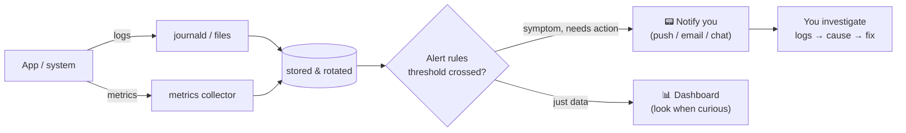

# Chapter 17 — Monitoring, Logging & Observability

> *Part IV · Deployment & Operations — Chapter 17 of 18*

You can now deploy safely (Ch. 14–15) and recover from disaster (Ch. 16). But every one of those safety nets shares a hidden dependency: **you have to know something is wrong.** Right now, if your app crashes at 3 a.m., the disk quietly fills to 100%, last night's backup failed silently, or traffic suddenly spikes, you find out the same way — a user complains, hours later, once the damage is done. That is *reactive* operations: firefighting. This chapter gives the server **eyes and a voice**. You'll learn to read and centralize the logs you've been checking ad-hoc, collect **metrics** about the system's health, and — most importantly — set up **alerting** so the server tells *you* the moment something breaks (including those silent backup failures from Chapter 16). This is the shift from operating a server to *observing* one: from firefighting to engineering.

---

## Goal

By the end of this chapter you will:

1. Understand **observability** and the three pillars: **metrics, logs, and traces** — what each is for.
2. Understand the difference between **monitoring** (known questions) and **observability** (asking new questions), and between **symptom** and **cause**.
3. Master the logging tools you already touched (`journalctl`, Nginx logs, `auth.log`) and understand **centralized logging** and **log rotation**.
4. Collect **system metrics** (CPU, memory, disk, network) and understand the key ones and their danger thresholds.
5. Understand **alerting** philosophy — alert on symptoms, avoid noise — and set up practical alerts, including for **backup failure** and **disk-full**.
6. Understand **health checks** and **uptime monitoring** from outside the server.
7. Know the range of tooling (from simple built-ins to Prometheus/Grafana/hosted) and choose appropriately.

---

## Background

### What is observability, and why three "pillars"?

**Observability** is the property of a system that lets you understand *what's happening inside it* from the *outside* — ideally well enough to answer questions you didn't know to ask in advance. It rests on three kinds of data, each answering a different question:

| Pillar | What it is | Question it answers | Example |
|---|---|---|---|
| **Metrics** | Numbers measured over time (time-series). Cheap to store, great for trends & alerts. | *"Is something wrong, and how much?"* | CPU at 95%, 800 req/s, disk 92% full, error rate 4%. |
| **Logs** | Timestamped event records (text). Detailed, great for *what exactly* happened. | *"What happened, precisely?"* | `ERROR: connection to database refused at 03:14:07`. |
| **Traces** | The path of a single request across components, with timing at each hop. | *"Where did this slow/failed request spend its time?"* | Request took 2s: 1.9s in the DB query. |

> 🧠 **How they work together:** a **metric** alert fires ("error rate spiked"). You open the **logs** to see *what* the errors are ("DB connection refused"). For a complex distributed slowdown, a **trace** shows *which hop* is slow. Metrics tell you *that* something's wrong and page you; logs tell you *what*; traces tell you *where*. For a single-server app, metrics + logs cover almost everything; traces matter most in multi-service architectures (they're introduced here for completeness).

### Monitoring vs observability; symptoms vs causes

- **Monitoring** = watching *predefined* things you already know matter (is the site up? is CPU high?). **Observability** = having enough data to investigate *novel* problems you didn't predict. Monitoring is a subset of, and enabled by, good observability. In practice you do both: monitor the known, keep enough logs/metrics to explore the unknown.
- **Symptom vs cause:** a *symptom* is what the user feels ("the site is slow / returning errors"); a *cause* is the underlying reason ("disk full → DB can't write"). **Alert on symptoms** (they map to user pain and are stable), then **diagnose causes** with logs/metrics. Alerting on every possible cause creates noise; alerting on symptoms tells you when it actually matters.

### Logs: what you already have, and how to centralize

You've been reading logs ad-hoc since Chapter 2. Let's name the sources on your server:

| Source | Where / how | Contains |
|---|---|---|
| **The systemd journal** | `journalctl` (Ch. 10) | Everything services write to stdout/stderr — your app, nginx, postgres, ssh, backups. The central hub on modern Ubuntu. |
| **Nginx logs** | `/var/log/nginx/{access,error}.log` (Ch. 9) | Every HTTP request + proxy/serving errors. |
| **Auth log** | `/var/log/auth.log` (Ch. 5/7) | Logins, sudo, SSH attempts — security events. |
| **Kernel/system** | `journalctl -k`, `/var/log/syslog` | Hardware, OOM-killer, disk errors. |

The **journal** already centralizes most of it on one machine. The next step up — **centralized logging** — ships logs off the server into one searchable place (so you can query across services, keep history beyond the local disk, and survive the server dying). That's essential with *many* servers; for one server, the local journal + rotation is often enough, and we'll note when to graduate.

**Log rotation** is the unglamorous but critical companion: logs grow forever and will *fill your disk* (a real, common outage cause) if not rotated. Ubuntu runs **`logrotate`** and the journal is size-capped — but you must ensure both are configured, especially for your app's logs.

### Metrics: the vital signs to watch

A handful of system metrics catch the majority of real problems. Learn these and their danger zones:

| Metric | What it means | Watch for | Why it bites |
|---|---|---|---|
| **CPU usage / load average** | How busy the processors are. | Sustained ~100%; load > number of cores. | Requests queue, latency climbs, timeouts. |
| **Memory (RAM)** | Working memory in use. | Near 100%, especially **swap** thrashing or the **OOM killer** firing. | Linux kills processes (maybe your app or DB!) when out of memory. |
| **Disk space** | Storage used per filesystem. | > ~85–90% on `/` or the DB/log volume. | **The classic silent killer** — DB can't write, logs can't append, deploys fail, everything breaks. |
| **Disk I/O** | Read/write throughput & wait. | High `iowait`; saturated disk. | The app *looks* fine but is starved waiting on disk. |
| **Network** | Traffic in/out, connections. | Unusual spikes, saturation. | Traffic surge, attack, or an exfiltration event. |
| **Application** | Request rate, **error rate**, **latency**, active connections. | Error rate up, p95/p99 latency up. | Directly what users feel — the most important signals. |

> 💡 **The RED and USE mental models.** For *services*, watch **R**ate, **E**rrors, **D**uration (RED) — the user-facing golden signals. For *resources*, watch **U**tilization, **S**aturation, **E**rrors (USE). You don't need fancy tools to start: `top`/`htop`, `df`, `free`, and reading Nginx status codes cover the basics.

### Alerting: the server's voice (and how not to hate it)

Metrics and logs are useless at 3 a.m. if no one's looking. **Alerting** watches your metrics/logs and *notifies you* when something crosses a threshold. Good alerting is an art:

- **Alert on symptoms that need human action, now.** "Site returning 5xx," "disk > 90%," "backup failed," "service down." Each should mean *"a human should look, soon."*
- **Avoid alert fatigue.** If every minor blip pages you, you'll start ignoring alerts — and miss the real one. Too many alerts is *worse* than too few. Tune thresholds; route noise to a dashboard, not your phone.
- **Actionable, not just informative.** Every alert should have an obvious response. If there's nothing to do, it shouldn't be an alert.
- **Escalation & channels:** critical → phone/push; warnings → email/chat; info → dashboard only. Match urgency to channel.



### Health checks and external uptime monitoring

Two forms of "is it alive?":

- **Internal health check** — the `/health` endpoint from Chapter 14: does the app + its dependencies (DB) respond? Used by deploys and local monitoring.
- **External uptime monitoring** — a service *outside* your server that periodically requests your site from the internet and alerts if it's unreachable. **This is essential**: if the whole server (or its network) dies, *on-server* monitoring dies with it and can't alert you. Only an external watcher catches "the entire thing is down." Free/cheap services (UptimeRobot, Healthchecks.io, Better Stack, etc.) or a tiny script on a *different* machine fill this role.

> 🔔 **Tie back to Chapter 16:** Healthchecks.io-style **dead-man's-switch** monitoring is the clean fix for silent backup failure — your backup script "pings" a URL on success; if the ping doesn't arrive on schedule, the external service alerts you. The absence of a signal becomes the alert.

---

## Why is this necessary?

- **Every safety net depends on noticing.** Deploys, rollbacks, and backups are worthless if failures go unseen. Monitoring is what *triggers* you to use them. Chapter 16's silent-backup-failure risk is literally solved here.
- **Reactive operations don't scale and hurt users.** "Wait for a complaint" means users hit the problem first, damage accrues, and you debug blind after the fact. Proactive alerting shrinks time-to-detection from hours to seconds.
- **Disk-full and OOM are common, silent, and catastrophic — and 100% preventable with a threshold alert.** These aren't exotic; they're the everyday outages a single alert would have prevented.
- **You can't fix what you can't see.** When something *does* break, logs and metrics are the difference between a five-minute diagnosis and hours of guessing. Observability is debugging power.
- **It completes the operational picture.** Parts I–III built and secured the system; Part IV operates it. Monitoring is the sense organ that makes safe operation possible — the capstone before the maintenance runbook.

---

## What would happen if we skipped this step?

- **Silent failures accumulate.** Backups fail, disks fill, memory leaks — all invisible until they cause a visible outage at the worst time.
- **Users become your monitoring.** You learn about problems from complaints (or lost customers), long after detection was possible.
- **Debugging is guesswork.** With no metrics history and unrotated/absent logs, you can't answer "when did this start?" or "what changed?" — incidents drag on.
- **Total outages go unnoticed longest.** Without *external* monitoring, "the whole server is down" produces zero alerts (the alerting lived on the dead server) until someone happens to notice.
- **Disk fills and takes everything down.** The single most common preventable server outage — and skipping monitoring guarantees you meet it eventually.

---

## Alternative approaches

### Metrics/monitoring stack

| Approach | Pros | Cons | Verdict |
|---|---|---|---|
| **Built-in tools** (`htop`, `df`, `free`, `journalctl`, `ss`) + a few cron/timer check scripts | Zero install, always available, teaches fundamentals; enough for one small server. | Manual; no history/graphs; you build alerting yourself. | ✅ **Start here** — know these regardless. |
| **Prometheus + Grafana + node_exporter** | The open-source standard: rich metrics, powerful alerting (Alertmanager), beautiful dashboards; scales to fleets. | Several components to run/secure; more to learn; resource use on a tiny VPS. | ✅ **Recommended** when you outgrow built-ins; industry-standard skill. |
| **Netdata** | One-line install, gorgeous real-time dashboard out of the box, low effort. | Per-node focus; less of a long-term query store by default. | ✅ Great, low-effort single-node monitoring. |
| **Hosted (Datadog, Grafana Cloud, Better Stack, New Relic…)** | No infra to run; monitoring survives your server dying; alerting/on-call built in. | Cost; agent + external account; data leaves your server. | ✅ Excellent, esp. because it's **off-server** (survives outages). |
| **ELK/Loki for logs** | Powerful centralized log search across servers/history. | Heavier; overkill for one server. | ➕ For multi-server or heavy log needs. |

### External uptime/alerting

| Option | Verdict |
|---|---|
| **Hosted uptime monitor** (UptimeRobot, Healthchecks.io, Better Stack) | ✅ **Essential and mostly free** — the off-server watcher that catches total outages and backup no-shows. |
| **A tiny script on a second machine** | ➕ DIY equivalent if you have another always-on box. |
| **On-server only** | ❌ Cannot alert when the server itself is down. |

**Our approach:** master the **built-in tools** and write a couple of **threshold/backup-check alerts** (which work with zero extra infrastructure), add an **external uptime + dead-man's-switch** monitor (off-server, free), and point you to **Prometheus+Grafana or Netdata / a hosted service** as the next step for graphs and richer alerting. Start simple; the concepts carry to any stack.

---

## Commands

> Log in as **`deploy`** (Ch. 5). Most inspection is read-only; use `sudo` for system logs and installing tools. We'll (1) read metrics live, (2) master the logs, (3) ensure rotation, (4) write practical threshold + backup alerts, and (5) set up external uptime/dead-man's-switch monitoring.

### 1 — Read system metrics live (the built-in vital signs)

```bash
htop        # interactive CPU/memory/process view (install: sudo apt install htop). 'q' to quit.
```
- **What it does:** a live, colored view of CPU per core, memory/swap, load average, and top processes. Your first look when "the server feels slow." (Plain `top` is always available if `htop` isn't.)

```bash
df -h                 # disk space per filesystem, human-readable
```
- **What it does:** shows usage per mount. **Watch the `Use%` on `/`** (and any DB/log volume). Anything > ~85% needs attention *before* it hits 100%. **This one command prevents the most common outage.**

```bash
free -h               # memory and swap usage
uptime                # load average (1/5/15 min) + how long up
ss -s                 # socket/connection summary (Ch. 6)
```
- **What they do:** `free -h` — RAM/swap (swap heavily used = memory pressure); `uptime` — load averages (compare to core count: load 4 on a 2-core box = overloaded); `ss -s` — connection counts.
- **Check for the OOM killer** (did Linux kill a process for memory?):
  ```bash
  journalctl -k | grep -i "out of memory"
  ```
  Any hits mean you ran out of RAM and the kernel killed something — a serious signal.

### 2 — Master the logs (centralized on this host via the journal)

```bash
journalctl -f                       # follow ALL system logs live (Ctrl+C to stop)
journalctl -u myapp -e              # your app, jump to newest (Ch. 10)
journalctl -u nginx -e              # nginx via the journal
journalctl -p err -b                # only ERROR+ priority, this boot
journalctl --since "1 hour ago"     # time-bounded
journalctl -u myapp --since "2026-07-04 03:00" --until "2026-07-04 04:00"  # a specific window
```
- **What they do:** the journal is your unified, timestamped log hub (Ch. 10). `-p err` filters by priority; `-b` limits to the current boot; `--since/--until` bound a time window — invaluable for "what happened around 03:14?".
- **The HTTP logs** (Ch. 9), for request-level detail:
  ```bash
  sudo tail -f /var/log/nginx/access.log            # live requests
  sudo grep ' 5[0-9][0-9] ' /var/log/nginx/access.log | tail   # recent 5xx errors
  ```
  - The grep finds `5xx` responses — server errors your users hit. A cluster of them is a symptom to chase in the app logs.
- **Security events** (Ch. 5/7): `sudo tail -f /var/log/auth.log` for logins/sudo/SSH.
- **Journal disk use / retention:** `journalctl --disk-usage`; cap it with `sudo journalctl --vacuum-time=30d` or set `SystemMaxUse=` in `/etc/systemd/journald.conf`.

### 3 — Ensure log rotation (so logs never fill the disk)

```bash
cat /etc/logrotate.conf ; ls /etc/logrotate.d/
```
- **What it does:** shows the global rotation policy and per-service rules (nginx, etc. drop files here). **`logrotate`** runs regularly and compresses/rotates/deletes old logs so they don't grow unbounded.
- **Verify nginx rotation exists:** `cat /etc/logrotate.d/nginx` — it should rotate `/var/log/nginx/*.log` (typically daily, keep ~14, compressed).
- **Test a rotation run (dry):** `sudo logrotate --debug /etc/logrotate.conf` shows what *would* happen without doing it.
- **Why it matters:** unrotated app logs are a classic slow disk-fill. If your app writes its own log files (rather than to the journal), add a rule in `/etc/logrotate.d/`. Prefer logging to **stdout/journald** (Ch. 10) so the journal handles it.

### 4 — Write practical alerts with zero extra infrastructure

You can get real alerting from a small script + a systemd timer (Ch. 7/10) + a notification method. First pick a **notification channel** — the simplest reliable one is an HTTP push service (e.g. **ntfy**, a free push-notification service) or email. Example with `curl` to a push endpoint:

```bash
sudo nano /usr/local/bin/healthcheck-alert.sh
```
```bash
#!/usr/bin/env bash
set -uo pipefail
NOTIFY() { curl -fsS -d "$1" https://ntfy.sh/my-private-topic-name >/dev/null || true; }

# --- Disk space: alert if / is over 90% ---
USE=$(df --output=pcent / | tail -1 | tr -dc '0-9')
if [ "$USE" -ge 90 ]; then NOTIFY "⚠️ Disk on / at ${USE}% on $(hostname)"; fi

# --- Critical services up? ---
for svc in myapp nginx postgresql; do
  systemctl is-active --quiet "$svc" || NOTIFY "🔴 Service $svc is DOWN on $(hostname)"
done

# --- App health endpoint (Ch. 14) ---
curl -fsS http://127.0.0.1:3000/health >/dev/null || NOTIFY "🔴 App health check FAILED on $(hostname)"

# --- Recent 5xx surge (last 200 nginx lines) ---
ERRS=$(tail -200 /var/log/nginx/access.log 2>/dev/null | grep -c ' 5[0-9][0-9] ')
if [ "${ERRS:-0}" -ge 20 ]; then NOTIFY "⚠️ ${ERRS} recent 5xx responses on $(hostname)"; fi
```
```bash
sudo chmod +x /usr/local/bin/healthcheck-alert.sh
```
- **What it does:** checks the highest-value **symptoms** — disk near full, critical services down, app health failing, a 5xx surge — and **pushes a notification only when something is actually wrong** (no news = no noise). Replace the notify function with email/Slack/etc. as you prefer.
- **Schedule it every few minutes** with a timer:
  ```bash
  # /etc/systemd/system/healthcheck-alert.timer  →  OnCalendar=*:0/5  (every 5 min)
  # + a matching .service running the script (same pattern as Ch. 16's backup.timer)
  sudo systemctl enable --now healthcheck-alert.timer
  ```
- **Add the backup-failure alert (closes the Chapter 16 gap):** make the backup a monitored unit — add `OnFailure=notify-failure@%n.service` to `backup.service`, or (cleaner) use a **dead-man's-switch**: have `backup.sh` end with `curl -fsS https://hc-ping.com/<uuid>` so a *successful* run pings Healthchecks.io; if the ping doesn't arrive on schedule, **it** alerts you. The absence of success becomes the alert — exactly the silent-failure fix promised in Chapter 16.
- **Verify:** trigger a test — stop a non-critical service or lower a threshold — and confirm you receive the notification. **An alerting system you haven't seen fire is untrusted** (same spirit as testing restores).

### 5 — External uptime monitoring (off-server — catches total outages)

Set up an **external** watcher so you're alerted even when the whole server/network is down:

- Create a free monitor on a hosted service (UptimeRobot / Better Stack / Healthchecks.io) that requests `https://your-domain/health` every 1–5 minutes and alerts (email/SMS/push) on failure.
- **Why external is non-negotiable:** if the server dies, the on-server script in Step 4 dies with it and can't tell you. Only an off-server probe catches "everything is down." This is the single most important alert you'll configure.
- **Verify:** stop nginx briefly (during a maintenance window!) and confirm the external monitor detects the outage and notifies you, then restart.

### 6 — (Next step) A real metrics stack when you outgrow built-ins

When you want graphs, history, and richer alert rules, install one of:
- **Netdata** — `curl` one-line install → instant real-time dashboard of hundreds of metrics with sane default alerts. Lowest effort for one server.
- **Prometheus + node_exporter + Grafana** — the standard: `node_exporter` exposes system metrics, Prometheus scrapes/stores them, Grafana graphs them, Alertmanager routes alerts. More setup, but the skill and flexibility scale to any fleet.
- **A hosted service** — install an agent; dashboards/alerting live off-server (survives your server dying) at a cost.
- **Keep monitoring endpoints private:** bind exporters/dashboards to `127.0.0.1` and reach them via SSH tunnel, or protect them behind the Nginx proxy with auth + TLS — never expose an unauthenticated metrics/dashboard port to the internet (Ch. 6 principle).

---

## Verification Checklist

You've completed this chapter when **all** of the following are true:

- [ ] You can explain the three pillars (**metrics, logs, traces**) and the **symptom-vs-cause** / **alert-on-symptoms** principle.
- [ ] You can read live vitals: `htop`, **`df -h`** (disk), `free -h`, `uptime`, and check for the **OOM killer**.
- [ ] You can query the **journal** by unit, priority, and time window, and read Nginx **5xx**/`auth.log`.
- [ ] **Log rotation** is in place (logrotate + journal cap) so logs can't fill the disk.
- [ ] You have a **threshold alert script** (disk/service/health/5xx) on a **timer** that notifies you, and you've **seen it fire** in a test.
- [ ] **Backup failure now alerts you** (OnFailure or dead-man's-switch) — closing the Chapter 16 silent-failure gap.
- [ ] An **external, off-server uptime monitor** watches `/health` and alerts on total outage (and you tested it).
- [ ] You know your next-step stack (Netdata / Prometheus+Grafana / hosted) and to keep dashboards/exporters **private**.

---

## Troubleshooting

| Symptom | Why it happens | How to fix |
|---|---|---|
| Server "suddenly" broke everything at once | Very often **disk full** (`/` at 100%) — DB/logs/deploys all fail together. | `df -h`; find the hog: `sudo du -xhd1 / | sort -h | tail`; clear old logs/journal (`journalctl --vacuum-time=7d`), prune releases/images (Ch. 13/14), fix rotation. Add the disk alert (Step 4). |
| A process (app/DB) keeps getting killed | **OOM killer** — out of memory. | `journalctl -k | grep -i "out of memory"`; reduce memory use, add swap, or resize the VPS; alert on high memory. |
| Alerts never fire / I don't trust them | Never tested; wrong threshold; broken notify channel. | Force a test (lower a threshold, stop a test service); confirm the notification actually arrives; treat an untested alert as no alert. |
| Drowning in alerts, starting to ignore them | Alert fatigue — alerting on causes/noise, thresholds too tight. | Alert only on **actionable symptoms**; route non-urgent to a dashboard; widen thresholds/add duration ("high for 5 min"). |
| Total outage but no alert | Monitoring lived only on the (dead) server. | Add **external** uptime monitoring (Step 5) — the only thing that catches a whole-server failure. |
| Logs are huge / disk filling from logs | Rotation missing or app logs unbounded. | Ensure `logrotate.d` rules exist; cap the journal; prefer logging to stdout/journald (Ch. 10). |
| Metrics dashboard/exporter reachable from the internet | Bound to `0.0.0.0` and/or firewall opened. | Bind to `127.0.0.1`, use an SSH tunnel or proxy-with-auth; don't open the port (Ch. 6). |
| Can't tell *when* a problem started | No metric history; only live views. | Install a metrics store (Netdata/Prometheus) so you have trends, not just snapshots. |

> **First moves in any incident:** `df -h` (disk full?), `journalctl -u <svc> -e` and `journalctl -k` (errors/OOM?), `htop`/`free -h` (resource pressure?), Nginx 5xx (user-facing errors?). Ninety percent of single-server incidents are disk, memory, a crashed service, or an app error — all visible in seconds with these.

---

## Best Practices

- **Alert on symptoms that need action, now.** Site down, disk >90%, service down, backup failed, error/latency spike. Each alert must be actionable — if there's nothing to do, make it a dashboard, not a page.
- **Guard against alert fatigue.** Fewer, high-signal alerts beat many noisy ones; you must *trust* your alerts enough to act. Tune thresholds and add "sustained for N minutes."
- **Always monitor from *outside* too.** On-server monitoring can't report its own server's death. An external uptime probe is the one alert you can't skip.
- **Watch disk relentlessly.** Disk-full is the #1 preventable single-server outage. A `df` threshold alert is the highest-value alert you'll set up. Pair with log rotation and journal caps.
- **Centralize on the journal; rotate everything.** Log services to stdout/journald so it's unified and captured; ensure logrotate + journal limits so logs never fill the disk.
- **Close the backup loop (Ch. 16).** A backup with no failure alert is a silent risk. Use `OnFailure=` or a dead-man's-switch so a *missing* success pages you.
- **Keep observability endpoints private.** Metrics exporters and dashboards bind to localhost / sit behind authenticated TLS — never an open internet port (Ch. 6).
- **Test that alerts fire.** Like restores (Ch. 16), an alert you've never seen trigger is unproven. Exercise each critical alert once.
- **Start simple, grow deliberately.** Built-ins + a few scripts + external uptime get you most of the value today; add Netdata/Prometheus/Grafana or a hosted stack when you need history and richer rules.

---

## Summary

### What you learned

- **Observability** and its three pillars — **metrics** (is something wrong, how much?), **logs** (what exactly happened?), **traces** (where did a request spend time?) — and how they combine: metrics alert, logs diagnose, traces localize.
- The distinction between **monitoring** (known questions) and **observability** (new questions), and the discipline of **alerting on symptoms** (user pain) while **diagnosing causes** with logs/metrics.
- Your log sources — the **journal** (`journalctl`, the central hub), **Nginx** access/error, **`auth.log`**, kernel — how to query them by unit/priority/time, and the importance of **log rotation** and **journal caps** so logs never fill the disk.
- The **vital-sign metrics** (CPU/load, memory/OOM, **disk space** as the silent killer, I/O, network, and app **rate/errors/latency**) with the **RED**/**USE** mental models and their danger thresholds.
- **Alerting philosophy** (actionable symptoms, avoid fatigue, match urgency to channel) and a practical, zero-infrastructure **threshold alert script + timer** covering disk, service health, `/health`, and 5xx — plus **closing Chapter 16's silent-backup gap** with `OnFailure`/dead-man's-switch.
- Why **external, off-server uptime monitoring** is essential (it's the only thing that catches a total outage), how **health checks** fit, and the next-step stacks (**Netdata**, **Prometheus+Grafana**, hosted) with the rule to keep dashboards/exporters **private**.

### What you'll build next

**Chapter 18 — Ongoing Maintenance & Runbooks.** You've now built, secured, deployed, backed up, and instrumented a complete production server — the system is *whole*. The final chapter is about keeping it healthy over *years*: the routine cadence of maintenance (patching reviews, certificate and backup verification, log and disk checks, security audits), how to write and use **runbooks** so operational knowledge lives in documents rather than your memory, how to handle **incidents** calmly and learn from them, and how to plan for the server's lifecycle (upgrades, capacity, eventual OS release upgrades). It ties every part of the handbook into a sustainable operating rhythm — turning "I built a server" into "I *operate* infrastructure." It's the graduation chapter.

> ✅ **Ready to finish?** Confirm and we'll proceed to Chapter 18, the final chapter. If any metric command, log query, alert, or the external monitor didn't work as described, tell me exactly what you ran and the output (especially your alert test and `df -h`), and we'll fix it before we write the maintenance runbooks that tie everything together.
