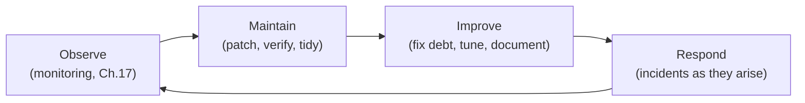

# Chapter 18 — Ongoing Maintenance & Runbooks

> *Part IV · Deployment & Operations — Chapter 18 of 18 · The graduation chapter*

You have done something significant. Across seventeen chapters you took a bare, defenseless VPS and turned it into a hardened, HTTPS-served, database-backed, automatically-deployed, backed-up, and monitored production system — and, more importantly, you understand *why* every piece is there. This final chapter is about the part nobody puts in tutorials because it never ends: **keeping it healthy over months and years.** A production server is not a thing you *build*; it is a thing you *operate*. Software rots, certificates expire, disks fill, dependencies gain vulnerabilities, and knowledge fades from memory. This chapter gives you the *rhythm* of maintenance, the discipline of **runbooks** so operational knowledge lives in documents instead of your head, a calm method for handling **incidents**, and a plan for the server's whole **lifecycle**. It turns "I built a server" into "I operate infrastructure."

---

## Goal

By the end of this chapter you will:

1. Understand why **maintenance is continuous** and what "operating" a system means beyond building it.
2. Have a concrete **maintenance cadence** — daily/weekly/monthly/quarterly/annual tasks — for everything you built.
3. Understand what **runbooks** are, why they matter, and how to write and use them.
4. Have a calm, repeatable **incident-response** process, and understand **blameless post-mortems**.
5. Understand **capacity planning** and the server **lifecycle** (patching, OS release upgrades, eventual rebuild/migration).
6. Understand **technical debt** and **documentation** as ongoing operational responsibilities.
7. Leave with a consolidated **operator's checklist** that ties all four parts of the handbook together.

---

## Background

### "Build" vs "operate": the mindset shift

Everything before this chapter had a *done* state: SSH hardened, firewall up, app deployed, backups running. Operation has no done state. It is a **continuous loop**:



The system you built is a *living* thing in a *changing* environment: new vulnerabilities are published weekly, certificates expire on a 90-day clock (Ch. 11), data grows until disks fill (Ch. 17), your own code accumulates dependencies that age. Maintenance is the work of keeping a moving system healthy against a moving world. The professional skill is not heroics during outages — it's the *boring routine* that prevents most of them.

### Why maintenance decays without a *system*

Left to memory and good intentions, maintenance always slips: it's invisible when it's working, so it loses to whatever's urgent. The fix is to make it **scheduled, checklisted, and partly automated** — the same philosophy you already applied to updates (Ch. 7), backups (Ch. 16), and alerts (Ch. 17). What can be automated (security patches, backups, cert renewal, threshold alerts) already is; what *can't* be fully automated (reviewing that automation actually works, capacity trends, security audits, restore tests) becomes a **recurring calendar task with a checklist**. A task on a calendar happens; a task in your head doesn't.

### What is a runbook?

A **runbook** is a written, step-by-step procedure for a specific operational task or situation — a checklist you (or a teammate, or future-you at 3 a.m.) follow to get a known-good outcome without thinking it through under pressure. You already wrote one: the **disaster-recovery runbook** in Chapter 16. Runbooks exist for both *routine* tasks ("deploy a hotfix," "rotate a leaked credential," "add a new site") and *incidents* ("site is returning 5xx," "disk is full," "we've been compromised").

Good runbooks are:

| Property | Why |
|---|---|
| **Specific & literal** | Actual commands and paths, not "restart the service" — so they work under stress and for someone less familiar. |
| **Stored off the server & in version control** | Available when the server is *down* (that's often when you need them); diffable and reviewable. |
| **Kept current** | A wrong runbook is worse than none. Update it whenever the system changes; treat it like code. |
| **Tested** | Rehearsed at least once (like restores and alerts) so you know it actually works. |

> 🧠 **Why runbooks matter more than they seem:** they move critical knowledge *out of one person's head* and into a shared, durable place. That's what lets a team operate safely, lets you take a vacation, and lets you act correctly during an incident when your judgment is degraded by stress. "It's all in my head" is a single point of failure — the human equivalent of no backups.

### Incident response: staying calm and systematic

An **incident** is any unplanned disruption — an outage, a security breach, data corruption, degraded performance. The natural response is panic and flailing; the professional response is a *process*:

1. **Detect & acknowledge** — monitoring (Ch. 17) alerts you; you acknowledge you're on it (so others aren't duplicating effort).
2. **Assess severity & communicate** — how bad, who's affected? Tell stakeholders/users honestly (a status note beats silence).
3. **Mitigate first, diagnose second** — *stop the bleeding* before finding root cause. Roll back the deploy (Ch. 14/15), restore from backup (Ch. 16), free the disk, restart the service. **Restoring service is the priority; the investigation can follow.**
4. **Diagnose** — with service restored, use logs/metrics (Ch. 17) to find the *cause*.
5. **Resolve & verify** — fix the cause; confirm via health checks and monitoring that it's truly better.
6. **Post-mortem & learn** — afterwards, write up what happened and improve so it can't recur silently.

> ⚕️ **Mitigate before you diagnose.** Beginners try to *understand* the problem while the site is down; professionals *restore service* first (rollback/restore/restart), then investigate calmly with the pressure off. Your rollback (Ch. 15) and backups (Ch. 16) exist precisely to make fast mitigation possible.

### Blameless post-mortems

After a significant incident, write a short **post-mortem**: what happened, the timeline, the impact, the *root cause*, and — crucially — the **action items** to prevent recurrence. Make it **blameless**: focus on the *system and process* that allowed the failure, not on punishing a person. Why? Because blame makes people hide mistakes, which destroys the learning that prevents the *next* outage. "The deploy had no health check, so a bad version served errors for 20 minutes" leads to a fix (add health-check gating); "Bob broke it" leads to nothing but a nervous Bob. The goal is a system that fails less, not a scapegoat.

### Capacity planning and the server lifecycle

Maintenance isn't only defense; it's also looking *ahead*:

- **Capacity planning** — using your metrics history (Ch. 17) to see trends: disk filling 2%/week, memory creeping up, traffic growing. Act *before* you hit the wall (resize the VPS, add storage, optimize) rather than during an outage. "The disk will be full in ~6 weeks" is an engineering decision; "the disk is full" is an incident.
- **The lifecycle of a server:**
  - **Patch continuously** (Ch. 4/7) — routine, mostly automated.
  - **Review & apply feature/non-security updates** deliberately (Ch. 4) — on a cadence, watching for breakage.
  - **OS release upgrades** — your Ubuntu 24.04 LTS has a support horizon (standard security support for years, then it ends). Well before end-of-life you must plan a **release upgrade** (24.04 → the next LTS) or, often cleaner, **rebuild fresh** on a new server and migrate (your automation + backups + runbooks make this a *repeatable* exercise, not a terror).
  - **Rebuild/migration** — the ultimate proof that you *operate* rather than *own* a server: because everything is codified (hardening steps, deploy pipeline, backups, runbooks), you can stand up an identical, better server elsewhere on demand. A server you can rebuild is a server you truly control.

### Technical debt and documentation as maintenance

Two quieter ongoing responsibilities:

- **Technical debt** — the shortcuts and "I'll fix it later"s accumulate: a manual step never automated, a `TODO` in a config, an over-permissive rule "just to test." Untended, debt compounds into fragility. Budget *some* maintenance time to pay it down — automate the manual step, tighten the temporary rule, remove the dead config.
- **Documentation** — the architecture, the decisions ("why we chose X"), the runbooks, the recovery plan. Documentation is not a one-time deliverable; it's a living artifact that must track reality. Out-of-date docs mislead exactly when trusted. Update docs as part of every significant change — including this handbook's own notes about *your* specific server.

---

## Why is this necessary?

- **Systems decay; entropy is the default.** Without active maintenance, a perfectly-built server drifts toward insecurity and failure: unpatched CVEs, expired certs, full disks, stale backups. Maintenance is the force that opposes decay.
- **The cheapest incident is the one that never happens.** Routine patching, disk checks, cert/backup verification, and restore tests prevent the majority of outages for a fraction of the cost (and stress) of responding to them.
- **Knowledge in your head is a liability.** Runbooks and documentation turn fragile personal memory into durable, shareable process — enabling teams, vacations, and correct action under pressure.
- **Calm process beats panic.** A rehearsed incident-response method and blameless learning turn crises into manageable events and continuous improvement, instead of chaos and repeated mistakes.
- **It's what "production-ready" ultimately means.** A system isn't production-ready because it works today — it's production-ready because it will *keep* working, and because you can recover, upgrade, and rebuild it. This chapter is that final ingredient.

---

## What would happen if we skipped this step?

- **Slow, invisible rot ending in a bad day.** Everything runs fine for weeks, then a forgotten cert expires, a full disk takes the DB down, or an unpatched vulnerability is exploited — and you're firefighting a preventable disaster.
- **Automation you *assume* works but never verify** — backups that have silently failed, alerts that never fire, a renewal timer that broke months ago. The safety nets exist on paper only.
- **Chaotic, error-prone incidents.** Without a process, outages become panicked improvisation; without post-mortems, the *same* outage recurs.
- **A server no one can safely touch.** Undocumented, unmaintained, knowledge trapped in one head — the classic "legacy server" everyone is afraid to reboot. Fragile, unrebuildable, a standing risk.
- **A dead-end at OS end-of-life.** Ignore the lifecycle and you're eventually stranded on an unsupported OS with no plan to move — the worst kind of forced, unplanned migration.

---

## Alternative approaches

### How to track and run recurring maintenance

| Approach | Pros | Cons | Verdict |
|---|---|---|---|
| **Calendar reminders + a written checklist** | Trivial, free, reliable; forces the human tasks to actually happen. | Manual discipline. | ✅ **Start here** — most single-server operators need nothing more. |
| **A ticketing/issue system** (GitHub Issues, etc.) | Trackable, assignable, historical; good for teams. | Slight overhead. | ✅ Great as you collaborate; runbooks-as-issues works well. |
| **Config management** (Ansible/Puppet) | Codifies the *desired state*; re-applies it; makes rebuilds trivial. | Learning curve; heavier for one box. | ➕ Excellent as you scale; the natural next step. |
| **Fully automate everything** | Least ongoing effort. | You still must *verify* automation works — automation you don't check is just faith. | ➕ Automate all you can, but keep a human *verification* cadence. |
| **Nothing (ad-hoc)** | No setup. | Guaranteed decay. | ❌ The "legacy server" path. |

### Where runbooks/docs live

| Option | Verdict |
|---|---|
| **Version-controlled repo / wiki (off the server)** | ✅ **Recommended** — available when the server's down, diffable, reviewable. |
| **A doc/notes tool** | ✅ Fine if reliably accessible off-server. |
| **On the server only** | ❌ Useless during the outages you need it for. |
| **In your head** | ❌ Single point of failure. |

---

## Commands

> This chapter is more *discipline* than commands — but here are the concrete periodic checks (mostly read-only) that make up a maintenance cadence, drawing every tool from earlier chapters. Run as **`deploy`** with `sudo` where noted. Better still: fold these into a short script and/or calendar reminders.

### 1 — The routine health sweep (weekly, ~5 minutes)

```bash
# Disk — the #1 preventable outage (Ch. 17)
df -h
# Memory / load
free -h && uptime
# Are the critical services healthy? (Ch. 10)
systemctl is-active myapp nginx postgresql fail2ban
# Any failed systemd units anywhere?
systemctl --failed
# Recent errors across the system (Ch. 17)
sudo journalctl -p err --since "7 days ago" | tail -n 40
```
- **What it does:** a fast pass over the vital signs — disk, memory, service health, failed units, and recent errors. **`systemctl --failed`** is especially valuable: it surfaces *any* unit (a timer, the backup job, an exporter) that has silently failed. Skim `journalctl -p err` for patterns.
- **Verify:** disk comfortably under ~85%, all services `active`, `systemctl --failed` shows **0 loaded units failed**, no alarming error clusters.

### 2 — Verify the automation actually worked (weekly/monthly)

Automation you don't check is faith, not engineering. Confirm each safety net:

```bash
# Security auto-updates ran (Ch. 7)
sudo journalctl -u unattended-upgrades --since "7 days ago" | tail
cat /var/log/unattended-upgrades/unattended-upgrades.log | tail
# Is a reboot pending from kernel patches? (Ch. 4)
ls /var/run/reboot-required 2>/dev/null && echo "REBOOT NEEDED" || echo "no reboot needed"
# Backups succeeded recently (Ch. 16)
systemctl status backup.timer
sudo journalctl -u backup.service --since "3 days ago" | tail
# Certificate renewal is healthy and not near expiry (Ch. 11)
sudo certbot certificates
# Fail2ban is working / who's been banned (Ch. 7)
sudo fail2ban-client status sshd
```
- **What it does:** proves the things that are *supposed* to run automatically actually did — auto-updates applied, no forgotten reboot, **backups completed**, **certs renewing with comfortable time left**, Fail2ban active. Each line closes a "silent failure" gap.
- **`sudo certbot certificates`** shows expiry dates — confirm they're renewing (well over ~30 days out) rather than quietly failing.
- **Verify:** each automated system shows recent success; if any shows failure or staleness, that's this week's task.

### 3 — Deeper monthly tasks

```bash
# Review pending (esp. non-security) updates deliberately (Ch. 4)
sudo apt update && apt list --upgradable
# Apply feature updates on your schedule, watching for breakage:
sudo apt upgrade            # (then verify the app health afterward)
# Clean up accumulated cruft (Ch. 4/13/14)
sudo apt autoremove --purge
sudo journalctl --vacuum-time=30d          # cap journal history
docker system prune 2>/dev/null || true     # if using containers (Ch. 13)
ls -1dt /srv/myapp/releases/*/ | tail -n +6 | xargs -r rm -rf   # prune old releases (Ch. 14)
```
- **What it does:** the deliberate, watch-for-breakage work that *isn't* auto-applied: reviewing/applying non-security updates, and reclaiming disk from journals, packages, images, and old releases (disk hygiene = outage prevention).
- **⭐ Monthly, also do the two things that are only real once tested (Ch. 16 & 17):**
  - **Restore-test a backup** into a throwaway DB (Ch. 16, Step 6) — *a backup you haven't restored is a hope.*
  - **Fire a test alert** (lower a threshold / stop a test service) to confirm notifications still arrive (Ch. 17) — *an alert you haven't seen fire is untrusted.*

### 4 — Quarterly / annual tasks

- **Security audit (quarterly):** re-review the essentials from Part II —
  ```bash
  sudo ufw status verbose          # firewall still minimal? (Ch. 6)
  sudo ss -tulpn                   # anything NEW listening publicly? (Ch. 6/12)
  sudo grep -E "PermitRootLogin|PasswordAuthentication" /etc/ssh/sshd_config /etc/ssh/sshd_config.d/*  # SSH still locked down (Ch. 5)
  getent group sudo                # who has admin? still correct? (Ch. 3)
  sudo lastlog | grep -v "Never"   # recent logins — anything unexpected?
  ```
  - Look for **drift**: a port opened "temporarily" and never closed, an extra sudo user, a loosened SSH setting, an unexpected login. Drift is how a hardened server slowly becomes soft.
- **Rehearse disaster recovery (annually):** actually follow your Chapter 16 runbook to build a fresh server from backups on a spare VPS. This is the ultimate test — it validates backups, runbook accuracy, and your ability to rebuild.
- **Review the lifecycle (annually):** check your Ubuntu release's **end-of-support date**; if it's within ~a year, *plan* the release upgrade or rebuild-and-migrate. Review capacity trends (Ch. 17) and right-size the server.
- **Rotate credentials (periodically):** deploy keys (Ch. 15), DB passwords (Ch. 12), API tokens — especially after any staff change or suspected exposure.

### 5 — Write your runbooks (do this now, once)

Create a `runbooks/` directory in a repo/wiki **off the server**. Start with the incidents and tasks you're most likely to hit. Each is a literal checklist. Skeletons to fill with *your* actual commands:

```
runbooks/
├── disaster-recovery.md      ← from Ch. 16 (rebuild from backups)
├── deploy-and-rollback.md    ← Ch. 14/15: how to deploy; how to roll back NOW
├── disk-full.md              ← df; find hog (du -xhd1 /); vacuum journal; prune releases/images
├── service-down.md           ← systemctl status/restart; journalctl -u; check deps
├── cert-renewal-failed.md    ← certbot renew --dry-run; check port 80 + DNS + clock (Ch. 11/8)
├── suspected-compromise.md   ← isolate, rotate keys/passwords, review auth.log, restore clean
├── rotate-leaked-secret.md   ← Ch. 12/15: revoke, regenerate, update EnvironmentFile/secrets, restart
└── add-new-site.md           ← Ch. 9/11: nginx server block, ufw, certbot
```
- **What to do:** write each as the *exact steps you'd take*, with real commands and paths from your server. Keep them short and literal. **A runbook written calmly today is a lifeline during a crisis later.**
- **Example — `disk-full.md`:**
  ```
  1. df -h                                   # confirm which filesystem is full
  2. sudo du -xhd1 / | sort -h | tail        # find the biggest consumers
  3. sudo journalctl --vacuum-time=7d        # reclaim journal space
  4. ls -1dt /srv/myapp/releases/*/ | tail -n +4 | xargs -r rm -rf   # prune old releases
  5. docker system prune -f                  # if containers in use
  6. Re-check df -h; if still full, resize the volume / add storage.
  7. Post-incident: why did it fill? add/adjust the disk alert (Ch.17).
  ```
- **Verify:** each runbook has been read (ideally rehearsed) by whoever might need it, is stored off-server, and matches the current system.

### 6 — Consolidate into a maintenance schedule

Turn the above into a single, visible schedule (a calendar with recurring events, or a checklist in your repo):

| Cadence | Tasks |
|---|---|
| **Automated (continuous)** | Security patches (Ch. 7), backups (Ch. 16), cert renewal (Ch. 11), threshold + uptime alerts (Ch. 17). |
| **Weekly** | Health sweep (Step 1); verify automation ran (Step 2); glance at monitoring. |
| **Monthly** | Review/apply feature updates; disk/log cleanup; **restore-test a backup**; **fire a test alert**; reboot if patches pending. |
| **Quarterly** | Security/drift audit; credential review; capacity-trend review. |
| **Annually** | Full DR rehearsal from backups; OS lifecycle/release-upgrade planning; runbook + documentation review. |

- **Why write it down:** an explicit schedule is the difference between maintenance happening and maintenance being intended. Put it where you'll see it; treat the recurring items as commitments.

---

## Verification Checklist

You've completed this chapter — and the handbook — when **all** of the following are true:

- [ ] You understand the **build → operate** shift and that maintenance is a continuous loop, not a finished task.
- [ ] You have a written **maintenance cadence** (automated / weekly / monthly / quarterly / annual) stored somewhere you'll actually see it.
- [ ] You can run the **weekly health sweep** and **verify each automated safety net** (updates, backups, certs, Fail2ban) actually ran.
- [ ] You **restore-test backups** and **fire test alerts** on a schedule — proving the safety nets, not assuming them.
- [ ] You have **runbooks** (disaster recovery, deploy/rollback, disk-full, service-down, compromise, secret rotation) stored **off the server** in version control.
- [ ] You have an **incident-response process** in mind: detect → assess → **mitigate first** → diagnose → resolve → **blameless post-mortem**.
- [ ] You know your OS's **end-of-support horizon** and that you can **rebuild** the server from code + backups + runbooks.
- [ ] You do a periodic **security/drift audit** and **credential rotation**.

---

## Troubleshooting

*(This chapter's "troubleshooting" is meta — the failure modes of maintenance itself.)*

| Symptom | Why it happens | How to fix |
|---|---|---|
| Maintenance keeps slipping | It's invisible when working; loses to urgent work. | Make it **scheduled + checklisted** (calendar/tickets); automate what you can; treat recurring items as commitments, not intentions. |
| "We have backups/alerts" but they'd failed silently | Never *verified* — automation assumed, not checked. | Add the weekly "verify automation ran" sweep (Step 2); monthly restore-test and alert-test. Verification *is* the maintenance. |
| Panic and mistakes during incidents | No process; improvising under stress. | Follow the incident steps: **mitigate first** (rollback/restore/restart), then diagnose. Use runbooks. Rehearse. |
| The same outage keeps recurring | No post-mortem / no action items followed through. | Write a **blameless post-mortem** with concrete prevention items and actually do them. |
| A hardened server slowly became insecure | Config drift — temporary changes never reverted. | Quarterly security/drift audit (Step 4); consider config management to enforce desired state. |
| Knowledge trapped in one person | No runbooks/docs; "it's all in my head." | Write runbooks off-server (Step 5); document architecture and decisions; keep them current. |
| Stranded near OS end-of-life with no plan | Lifecycle ignored. | Track the support date; plan release upgrade or rebuild-and-migrate *well* ahead; your automation/backups/runbooks make rebuild feasible. |
| Disk/log/release cruft causes outages | Cleanup never scheduled. | Monthly hygiene (Step 3); disk alert (Ch. 17); rotation (Ch. 17). |

> **The meta-lesson:** the failure mode of maintenance is *neglect*, and its cure is *routine*. Nothing here is hard; the discipline is doing it consistently. A calendar and a set of checklists are more valuable than any clever command.

---

## Best Practices

- **Operate on a cadence; automate what you can, verify what you automate.** Security patches, backups, cert renewal, and alerts run themselves — but a human must *periodically confirm they actually worked*. Automation you never check is faith.
- **Watch disk relentlessly and keep things tidy.** Disk-full remains the top preventable outage. Alert on it (Ch. 17), rotate logs, cap the journal, prune releases/images monthly.
- **Test the safety nets, don't trust them.** Monthly restore-tests (Ch. 16) and alert-tests (Ch. 17); an annual full DR rehearsal. A backup/alert/runbook you've never exercised is unproven.
- **Write runbooks and keep them off-server and current.** Move knowledge out of your head into literal, version-controlled checklists. Update them like code; a stale runbook misleads when trusted.
- **In incidents, mitigate before you diagnose.** Restore service first (rollback/restore/restart), investigate second. Your rollback and backups exist to make fast mitigation possible.
- **Run blameless post-mortems.** Fix the *system and process*, not the person. Blame hides mistakes and prevents learning; blamelessness compounds reliability.
- **Plan the lifecycle ahead.** Track OS end-of-support; plan upgrades/migrations early. Codify everything so you can **rebuild** the server on demand — the truest sign you operate rather than merely own it.
- **Pay down technical debt and keep docs alive.** Budget time to automate the manual step, tighten the temporary rule, remove dead config, and update documentation with every significant change.

---

## Summary

### What you learned

- The mindset shift from **building** (has a *done* state) to **operating** (a continuous *observe → maintain → improve → respond* loop against a changing world), and why maintenance decays without being **scheduled, checklisted, and partly automated**.
- A concrete **maintenance cadence** — continuous automation (patches/backups/certs/alerts), a **weekly health sweep**, **monthly** update-review + cleanup + **restore-test** + **alert-test**, **quarterly** security/drift audits + credential rotation, and **annual** DR rehearsal + lifecycle planning.
- What **runbooks** are and how to write them — specific, literal, off-server, version-controlled, current, tested — turning fragile personal memory into durable shared process (starting from the DR runbook of Ch. 16).
- A calm **incident-response** process — detect → assess → **mitigate first** → diagnose → resolve → learn — and **blameless post-mortems** that fix systems, not people.
- **Capacity planning** from metric trends and the server **lifecycle** — continuous patching, deliberate feature updates, OS **release upgrades** before end-of-life, and the ability to **rebuild/migrate** because everything is codified.
- **Technical debt** and **documentation** as ongoing responsibilities, and a consolidated **operator's schedule** that ties every chapter's tooling into a sustainable rhythm.

### What you've built — the whole journey

You started at Chapter 1 unable to even reach a bare server. You now have — and *understand* — a complete production system:

- **Part I — Foundations:** you can reach (SSH), navigate (shell/filesystem), and administer (users/sudo/permissions) the server.
- **Part II — Hardening:** it's patched, key-only, firewalled, intrusion-protected, self-updating, and correctly identified/timed.
- **Part III — Running apps:** a reverse proxy fronts an always-on, self-healing systemd service, served over auto-renewing HTTPS, backed by a locked-down database — with containers as an optional path.
- **Part IV — Operations:** you deploy safely with instant rollback, automate it with CI/CD, back up with tested restores, observe with metrics/logs/alerts, and now *maintain* it all on a durable cadence with runbooks.

More important than the artifact is the *understanding*: you know **why** every layer exists, how they depend on each other, and how to operate, debug, secure, recover, and rebuild the whole thing. That is the difference between having a server and being an engineer who operates infrastructure.

> 🎓 **Congratulations — you've completed The Production Server Handbook.** This was never really about one server; it was about the durable mental models — least privilege, defense in depth, the reverse-proxy pattern, build-once/deploy-safely, backups-you-can-restore, observe-then-act, and codify-everything — that transfer to *any* system, any cloud, any scale. Keep the maintenance cadence, keep the runbooks current, keep testing your safety nets, and keep asking "why" of every command you run. The server will keep serving; you'll keep growing.
>
> **Where to go next:** deepen any thread that excites you — a real metrics stack (Prometheus/Grafana), config management (Ansible) so your whole setup is code, containers/orchestration at scale, a second server + load balancing, a CDN, secrets management (Vault), or advanced database operations (replication, PITR). You now have the foundation to learn any of them *with understanding* rather than by copying commands. Go build.
